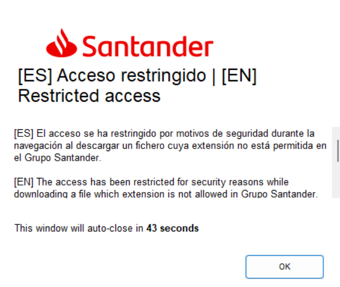
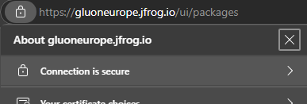
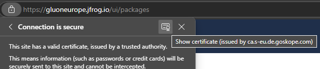
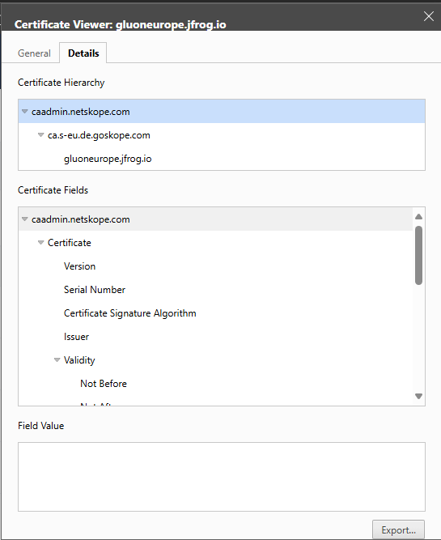

# Troubleshooting

Here we will cover some issues found during the setup and use of JFrog as an artifactory repository from our local environments.

## NetSkope security block

As part of the bank security protocol, NetSkope blocks all artifacts downloads. We have included our JFrog instances to allow the download
in the local developers computers but sometimes this configuration can be changed and NetSkope will block them again.

The block can happen for all packages or for certain types of package such as `.jar` or `.zip` but when this happens on a terminal using the technologies clients the error is hard to understand.

The bet way to check if the problem is with NetSkope is to try and download a package from the JFrog website manually and see if a blocked notification pops up in our system. This notification looks like:

In this case, open an incident or talk to your manager so they can open it to request for the review of the NetSkope configuration.

## JFrog certificate errors

Inc ase one of the clients is giving an error regarding the certificates, you need to download the certificate from jfrog:

Step 1: Open the website and open the security menu on the top left of the navigator.

Step 2: Click on the secure connection tab and on the certificates button.

Step 3: Download the three certificates shown on the image using the export button.

Step 4: Follow the technologies steps given in [Install Now](../../../../../setup-your-environment/index.md) to install the JFrog certificates the same way it explains for the Nexus certificates.
