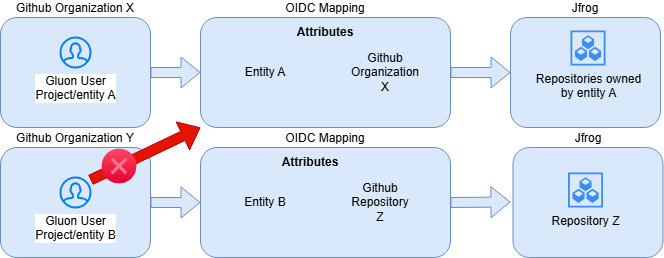

# Introduction to OIDC in JFrog Artifactory

OpenID Connect (OIDC) in JFrog provides a secure and efficient way to authenticate workflows, such as GitHub Actions, with JFrog Artifactory. By leveraging OIDC,
you can eliminate the need for managing long-lived credentials, ensuring a more secure and automated integration between your CI/CD pipelines and JFrog.

## Why Use OIDC in JFrog?

OIDC simplifies authentication by allowing workflows to dynamically request short-lived tokens that are securely exchanged for access to JFrog resources.
This approach enhances security by reducing the risk of credential exposure and ensures that only authorized workflows can interact with JFrog repositories.

## Key Benefits

- **Enhanced Security**: Eliminates the need for storing long-lived credentials in workflows.
- **Dynamic Access**: Generates short-lived tokens that are scoped to specific actions, ensuring minimal access.
- **Streamlined Integration**: Simplifies the process of connecting GitHub Actions workflows with JFrog Artifactory.

## GitHub Actions OIDC Workflow Implementation

This guide explains how to implement OIDC authentication in your GitHub Actions workflow to securely interact with JFrog Artifactory.

### GitHub Workflow Configuration

To standardize JFrog CLI usage across different workflows, follow these steps. The JFrog CLI is pre-installed in ephemeral runners, making it straightforward to set up and use for any case.

#### 1. Set Required Permissions in the Workflow File

Add the following permissions block to your GitHub Actions job YAML file to allow the workflow to request an `ID_TOKEN`:

```yaml
permissions:
  id-token: write
  contents: read
```

#### 2. Get ID Token from GitHub

Use the following step to request an ID_TOKEN from GitHub and store it in the environment variable:

Environment Variables Used:

- **JFROG_AUDIENCE:** The audience service comes from JFrog, we can set it as a secret or variable, or specify directly using "sts.jfrog.com"
- **ACTIONS_ID_TOKEN_REQUEST_TOKEN:** Environment variable in Github Actions. Can be directly used; it comes set by default and generated on the fly.
- **ACTIONS_ID_TOKEN_REQUEST_URL:** Also this comes set by default. We can use it directly.

As a template:

```yaml

- name: Get ID_TOKEN
  env:
    JFROG_AUDIENCE: ${{ secrets.JFROG_AUDIENCE }}
  run: |
    ID_TOKEN=$(curl -sLS -H "User-Agent: actions/oidc-client" -H "Authorization: Bearer $ACTIONS_ID_TOKEN_REQUEST_TOKEN" \
    "${ACTIONS_ID_TOKEN_REQUEST_URL}&audience=${{ env.JFROG_AUDIENCE }}" | jq .value | tr -d '"')
    echo "::add-mask::$ID_TOKEN"
    echo "ID_TOKEN=${ID_TOKEN}" >> $GITHUB_ENV

```

As a practical example:

```yaml

- name: Get ID_TOKEN
  env:
    JFROG_AUDIENCE: "sts.jfrog.com"
  run: |
    ID_TOKEN=$(curl -sLS -H "User-Agent: actions/oidc-client" -H "Authorization: Bearer $ACTIONS_ID_TOKEN_REQUEST_TOKEN" \
    "${ACTIONS_ID_TOKEN_REQUEST_URL}&audience=${{ env.JFROG_AUDIENCE }}" | jq .value | tr -d '"')
    echo "::add-mask::$ID_TOKEN"
    echo "ID_TOKEN=${ID_TOKEN}" >> $GITHUB_ENV

```

#### 3. Exchange ID Token for Access Token

Below is an example step to exchange the ID_TOKEN for an access_token in JFrog:

Environment Variables Used:

- **ID_TOKEN:** The token obtained from the previous step.
- **JFROG_PLATFORM_URL:** URL to your JFrog instance `(i.e.: https://gluoneurope.jfrog.io)`.
- **PROVIDER_NAME:** The OIDC provider name configured in JFrog, should be handled as a GitHub secret and it comes set by default, generated automatically.

```yaml

- name: Exchange token with access
  id: exchange-token
  env:
    ID_TOKEN: ${{ env.ID_TOKEN }}
    JFROG_PLATFORM_URL: https://<YOUR_JFROG_INSTANCE>.jfrog.io
    PROVIDER_NAME: ${{ secrets.PROVIDER_NAME }}
  run: |
    response=$(curl -XPOST -H "Content-Type: application/json" "${{ env.JFROG_PLATFORM_URL }}/access/api/v1/oidc/token" \
      -d "{\"grant_type\": \"urn:ietf:params:oauth:grant-type:token-exchange\", \
      \"subject_token_type\":\"urn:ietf:params:oauth:token-type:id_token\", \
      \"subject_token\": \"${{ env.ID_TOKEN }}\", \
      \"provider_name\": \"${{ env.PROVIDER_NAME }}\"}")

    ACCESS_TOKEN=$(echo $response | jq -r .access_token)
    echo "::add-mask::$ACCESS_TOKEN"
    echo "ACCESS_TOKEN=${ACCESS_TOKEN}" >> $GITHUB_ENV

```

A practical example, should look like this:

```yaml

- name: Exchange token with access
  id: exchange-token
  env:
    ID_TOKEN: ${{ env.ID_TOKEN }}
    JFROG_PLATFORM_URL: https://gluoneurope.jfrog.io
    PROVIDER_NAME: ${{ secrets.PROVIDER_NAME }}
  run: |
    response=$(curl -XPOST -H "Content-Type: application/json" "${{ env.JFROG_PLATFORM_URL }}/access/api/v1/oidc/token" \
      -d "{\"grant_type\": \"urn:ietf:params:oauth:grant-type:token-exchange\", \
      \"subject_token_type\":\"urn:ietf:params:oauth:token-type:id_token\", \
      \"subject_token\": \"${{ env.ID_TOKEN }}\", \
      \"provider_name\": \"${{ env.PROVIDER_NAME }}\"}")

    ACCESS_TOKEN=$(echo $response | jq -r .access_token)
    echo "::add-mask::$ACCESS_TOKEN"
    echo "ACCESS_TOKEN=${ACCESS_TOKEN}" >> $GITHUB_ENV

```

#### 4. Configure JFrog CLI Using the Access Token

Use the following step to configure the JFrog CLI with the access_token previously obtained:

```yaml

- name: Config jfrog-cli
  env:
    JFROG_PLATFORM_URL: https://<YOUR_JFROG_INSTANCE>.jfrog.io
    ACCESS_TOKEN: ${{ env.ACCESS_TOKEN }}
  run: |
    jf config add setup-jfrog-cli-server --url $JFROG_PLATFORM_URL --interactive=false --overwrite=true --access-token $ACCESS_TOKEN

```

Below find a practical example; the code should look like this:

```yaml

- name: Config jfrog-cli
  env:
    JFROG_PLATFORM_URL: https://gluoneurope.jfrog.io
    ACCESS_TOKEN: ${{ env.ACCESS_TOKEN }}
  run: |
    jf config add setup-jfrog-cli-server --url $JFROG_PLATFORM_URL --interactive=false --overwrite=true --access-token $ACCESS_TOKEN

```

#### 5. Example JFrog CLI Usage

Once the JFrog CLI is configured, you can perform various operations in JFrog. For instance:

Uploading an artifact:

```yaml

- name: Push artifact
  run: |
    ARTIFACT_REPOSITORY=<YOUR_ARTIFACTORY_PROJECT_REPOSITORY>
    ARTIFACT_FILE_NAME=example-1.0.0.zip

    jf rt upload "$ARTIFACT_FILE_NAME" "${ARTIFACT_REPOSITORY}/${ARTIFACT_FILE_NAME}"

```

As a practical example:

```yaml

- name: Push artifact
  run: |
    ARTIFACT_REPOSITORY=sgt-npm-example
    ARTIFACT_FILE_NAME=example-1.0.0.zip

    jf rt upload "$ARTIFACT_FILE_NAME" "${ARTIFACT_REPOSITORY}/${ARTIFACT_FILE_NAME}"

```

By following these steps, you can securely authenticate your GitHub Actions workflows with JFrog Artifactory using OIDC, eliminating the need for long-lived credentials and enhancing security.

### OIDC mappings

An OIDC (OpenID Connect) mapping in JFrog is a configuration that links an external identity provider (such as GitHub Actions) to specific roles and permissions within JFrog Artifactory.
This mapping allows workflows or users authenticated via OIDC to dynamically obtain short-lived access tokens with predefined scopes, enabling secure and automated interactions with JFrog repositories.

OIDC mappings ensure that only authorized workflows or users can perform specific actions, such as uploading or downloading artifacts, based on the roles assigned in the mapping.

In Gluon, entities or projects are mapped to specific repositories or entire organizations in GitHub, depending on the requirements.



To request a custom mapping, submit a Gluon request [Here](https://gluon.gs.corp/community/docs/latest/getting-started/support/)
