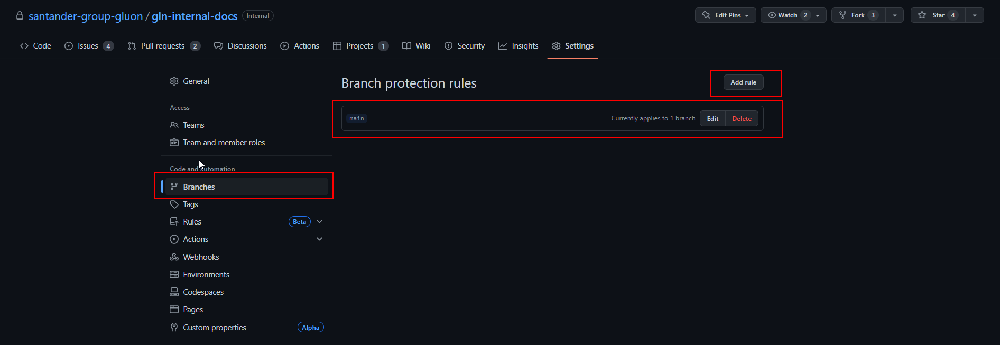
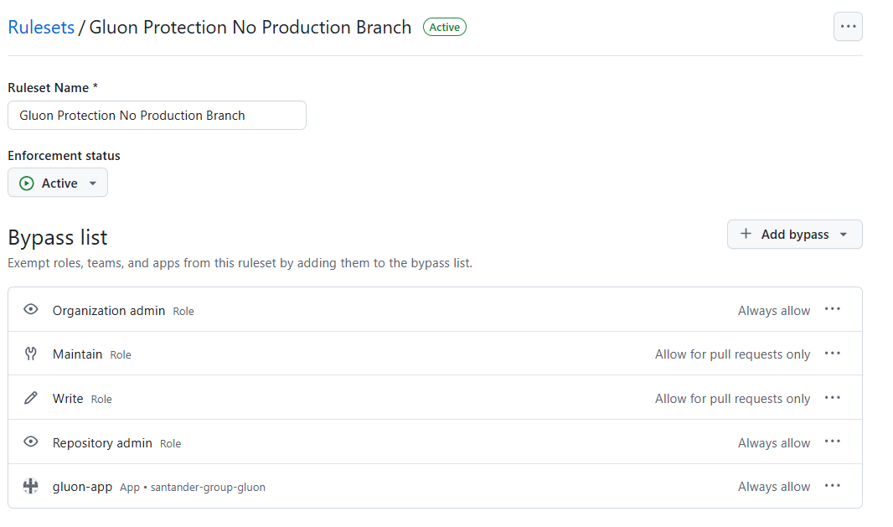
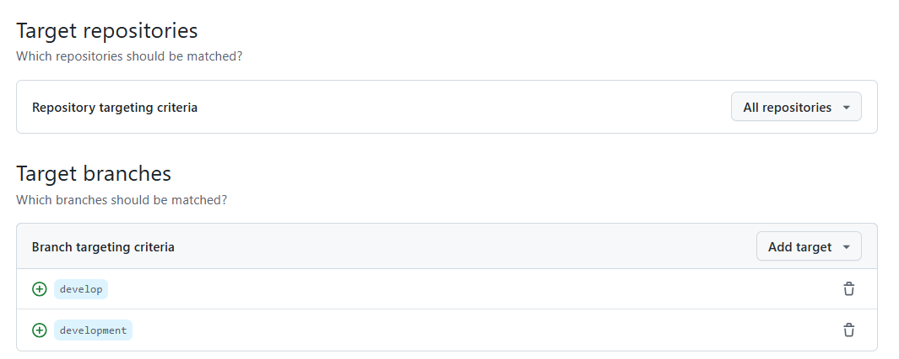
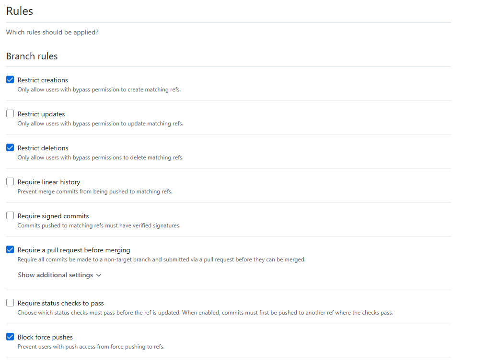
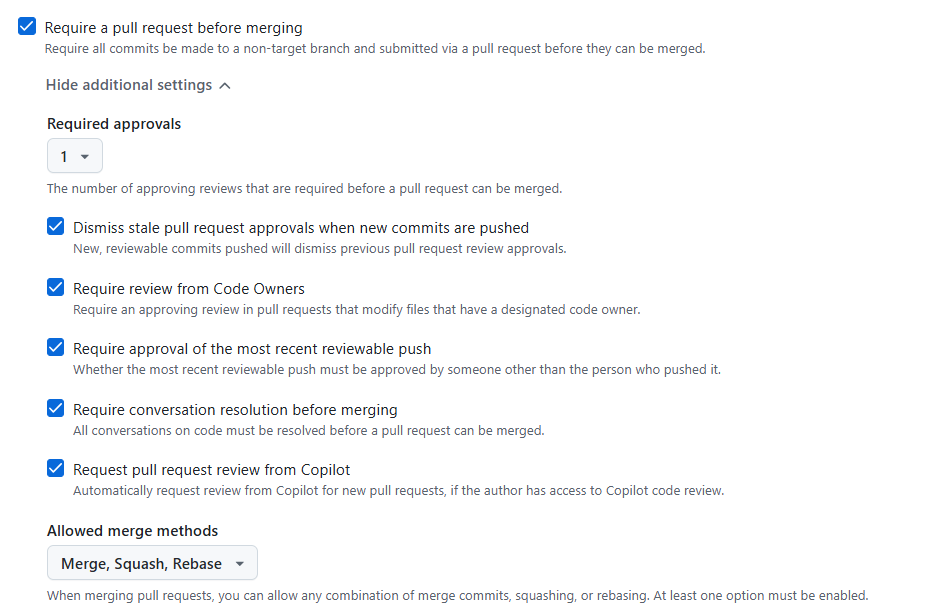

# Gluon Protection No Production Branch

Developers and technical leads on application teams are allowed to self-approve pull requests (using a bypass) targeting the develop and development branches. These branches are only used to generate snapshots and cannot be used to deploy code to Production.

As a best practice, code reviews should still be performed on these pull requests. The bypass should only be used in exceptional cases, when no reviewers are available and there is an urgent need to test something in a development environment.

It remains mandatory for any pull request targeting the `main`, `master`,
`release*`, or `fix*` branches (i.e. branches from which closed versions
of a component can be created and which may be deployed to Production)
to receive at least one approval before being merged.

## Gluon Protection No Production Branch Features

The "Gluon Protection No Production Branch" ruleset is designed to enhance the security and integrity of non-production branches across repositories. Its main features include:

__Branch Permissions:__
Enables precise control over who can read and write to specific branches, restricting unauthorized changes.

__Mandatory Pull Requests:__
All modifications must be submitted through pull requests, ensuring that every change is reviewed before being merged.

__Required Reviews:__
Pull requests must receive a minimum number of approvals from designated reviewers before merging, guaranteeing peer validation and maintaining code quality.

__Status Checks:__
Pull requests must successfully pass all required automated status checks (such as tests or CI pipelines) before they can be merged, ensuring only validated changes are integrated.

__Protection Against Direct Pushes:__
Direct pushes or merges to protected branches are not permitted. All changes must go through the pull request and review process.

__Consistent Application:__
These rules are applied uniformly across non-production branches, ensuring consistent governance and reducing the risk of accidental or unauthorized changes.

In summary, the "Gluon Protection No Production Branch" ruleset enforces strict review, testing, and permission requirements for non-production branches, helping teams collaborate safely and maintain a high standard of code quality and security.

## Gluon Protection No Production Branch Rules

The __Gluon protection no production branches__ will be based on the GitHub feature rulesets.
The rulesets will be created at Organization level, and will be applied
to all Gluon repositories.

!!! info "Permission Roles"

    People with admin permissions or a custom role with the "edit
    repository rules" permission to a repository can manage branch
    protection rules.

### Gluon No Production Branch Configuration

General Information about No Production Branch Protection in Gluon

- __Enforcement Status__: Active

- __ByPass List__: Include organization admin, maintain, write,  gluon-app and repository admin

- __Targets__:
    - _Target repositories:_ All repositories
    - _Target branches:_ `develop`, `development`

__No Production Branch Rules__: Branch protection for non-production branches determines which actions are allowed

GitHub will prevent direct merging of changes into the protected branch if
the last reviewable push has not been approved by another reviewer. This
encourages a collaborative and responsible approach to code review by
involving multiple team members in the approval process.

  - Improvement in code quality by requiring the participation of at least
  another reviewer.
  - Fosters collaborative review processes by requiring approval from someone
  other than the author, promoting collaboration and knowledge sharing within
  the team.
  - Mitigation of risks and omissions: By having another person review and
  approve the changes, the risk of overlooking errors or introducing risks
  that can occur when a person reviews their own code is reduced.
  - Facilitates compliance with regulatory and regulatory requirements.

    - _Restrict creations_:
          Only allow users with bypass permission to create matching refs.

    - _Restrict deletions_:
      Only allow users with bypass permissions to delete matching refs.

    - _Block force pushes_:
      Prevent users with push access from force pushing to refs.

    - _Restrict a pull request before merging_:
      Require all commits be made to a non-target branch and submitted via a pull request before they can be merged.

         - _Dismiss stale pull request approvals when new commits are pushed_:
         New, reviewable commits pushed will dismiss previous pull request review approvals.

         - _Require review from Code Owners_:
         Require an approving review in pull requests that modify files that have a designated code owner.

         - _Require approval of the most recent reviewable push_:
         Whether the most recent reviewable push must be approved by someone other than the person who pushed it.

         - _Require conversation resolution before merging_:
         All conversations on code must be resolved before a pull request can be merged.

         - _Request pull request review from Copilot_:
         Automatically request review from Copilot for new pull requests, if the author has access to Copilot code review.

