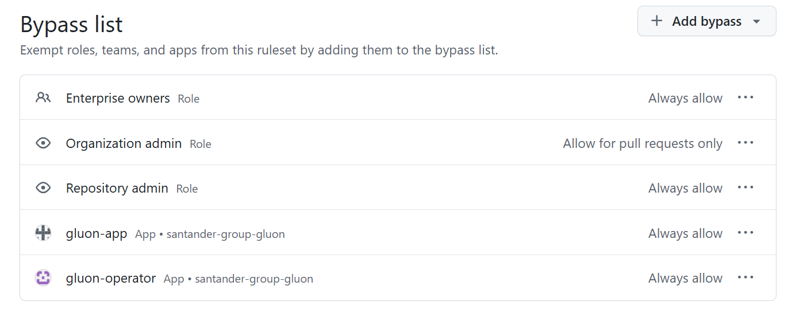
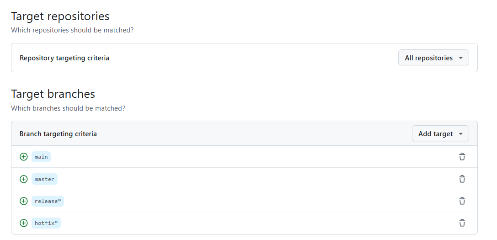

# Gluon Branch Protection

## GitHub Branch Protection Features

GitHub allows you to configure write and read permissions for specific branches
in a repository. This allows you to control who can make changes and who can only
read the code.

One of the key features of branch protection in GitHub is the ability to require
pull requests to review and approve changes before merging them into a protected
branch. Pull requests allow contributors to submit their changes, allowing for
reviews, comments, and discussions before the changes are merged.

GitHub allows you to configure required reviews for pull requests. This means
that before a pull request can be merged, it must have a minimum number of
approvals from designated reviewers. This ensures that changes are reviewed and
validated by the team before they are integrated.

GitHub allows you to configure required status checks for pull requests. This
means that before a pull request can be merged, it must pass a series of
automated tests. This ensures that changes are tested and validated by the
system before they are integrated.

These rules can include setting up review requirements, required approvals,
protection against direct merges into protected branches, and permission
restrictions. These rules are applied consistently across the repository,
ensuring consistent management of branch protection.

## Gluon Branch Protection Rules

The __Gluon protection branches__ will be based on the GitHub feature rulesets.
The rulesets will be created at Organization level, and will be applied
to all Gluon repositories.

!!! info "Permission Roles"

    People with admin permissions or a custom role with the "edit
    repository rules" permission to a repository can manage branch
    protection rules.

### Gluon Branch Configuration

General Information for branch protection in Gluon:

- __Enforcement Status__: Active

- __ByPass List__: Include Enterprise owners, organization admin, gluon-app, repository admin and gluon-ooperator

- __Targets__:
    - _Target repositories:_ All repositories
    - _Target branches:_ `master`, `main`, `release*`, `hotfix*`

__Branch Rules__: Branch protection determines which actions are allowed

GitHub will prevent direct merging of changes into the protected branch if
the last reviewable push has not been approved by another reviewer. This
encourages a collaborative and responsible approach to code review by
involving multiple team members in the approval process.

  - Improvement in code quality by requiring the participation of at least
  another reviewer.
  - Fosters collaborative review processes by requiring approval from someone
  other than the author, promoting collaboration and knowledge sharing within
  the team.
  - Mitigation of risks and omissions: By having another person review and
  approve the changes, the risk of overlooking errors or introducing risks
  that can occur when a person reviews their own code is reduced.
  - Facilitates compliance with regulatory and regulatory requirements.

    - _Restrict creations_:
          Only allow users with bypass permission to create matching refs.

    - _Restrict deletions_:
      Only allow users with bypass permissions to delete matching refs.

    - _Block force pushes_:
      Prevent users with push access from force pushing to refs.

    - _Restrict a pull request before merging_:
      Require all commits be made to a non-target branch and submitted via a pull request before they can be merged.

         - _Dismiss stale pull request approvals when new commits are pushed_:
         New, reviewable commits pushed will dismiss previous pull request review approvals.

         - _Require review from Code Owners_:
         Require an approving review in pull requests that modify files that have a designated code owner.

         - _Require approval of the most recent reviewable push_:
         Whether the most recent reviewable push must be approved by someone other than the person who pushed it.

         - _Require conversation resolution before merging_:
         All conversations on code must be resolved before a pull request can be merged.

         - _Request pull request review from Copilot_:
         Automatically request review from Copilot for new pull requests, if the author has access to Copilot code review.

