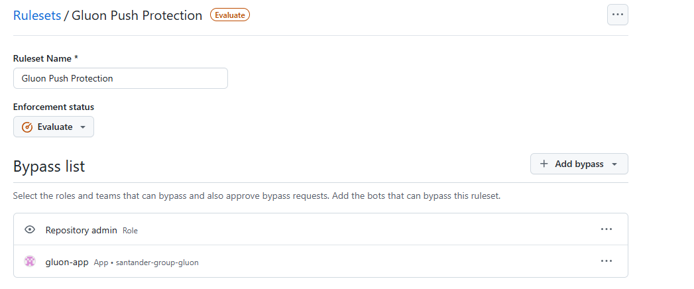
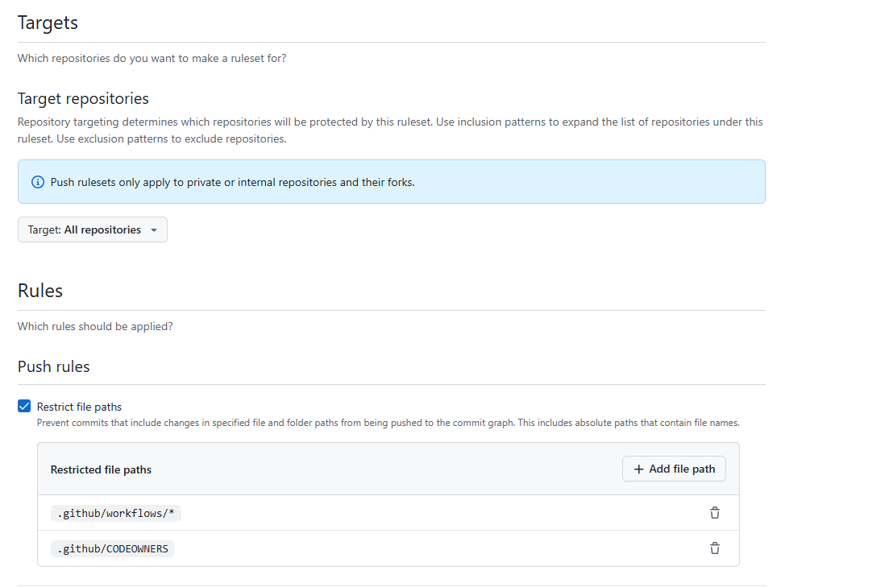

# Gluon Push Protection

## Introduction

With push rulesets, you can block pushes to a private or internal repository and that repository's entire fork network based on file extensions, file path lengths, file and folder paths, and file sizes.

Push rules do not require any branch targeting because they apply to every push to the repository.

Push rulesets allow you to:

__Restrict file paths__: Prevent commits that include changes in specified file paths from being pushed.

__Restrict file path length__: Prevent commits that include file paths that exceed a specified character limit from being pushed.

__Restrict file extensions__: Prevent commits that include files with specified file extensions from being pushed.

__Restrict file size__: Prevent commits that exceed a specified file size limit from being pushed.

## Gluon Push Protection ruleset

__Ruleset Name__: Gluon Default Push Protection

- [X] __Enforcement Status__: Evaluate
- [X] __ByPass List__: Allowed. Restrict who can dismiss pull request
  reviews.

  The GitHub Application __gluon-app__ and __repository admin__ will be allowed
  the ability to bypass branch protection rules.

- [X] __Target repositories__: All repositories

- [X] __Restrict file paths__
  - Restricted file paths:
    - `.github/workflows/*`
    - `.github/CODEOWNERS`

