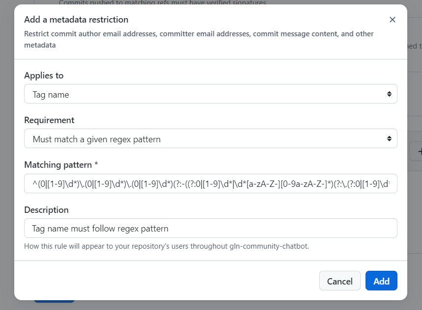

## Gluon Tag Configuration

Tags requires a new ruleset

__Ruleset Name__: `Gluon Tag Protection`

- [X] __Enforcement Status__: Evaluate
- [X] __ByPass List__: Allowed. Exempt roles, teams, or apps from this ruleset.
The GitHub Application __gluon-app__ will be allowed the ability to bypass tag protection rules.

- [X] __Targets__

    - [X] __Target Repositories__: The branch protection will applied to the all repositories
    in any Gluon compliance Organization.
        - _All repositories_: Prevent renaming of target repositories: Must be checked, target repositories can only be renamed by those with bypass permission.

    - [X] __Target Tags__: Tags targeting determines which tags will be protected by this ruleset.

        - Include all Tags

- [X] __Tag rules__: Tag protection determines which actions are allowed

    - [X] Restrict creations.
    - [X] Restrict updates.
    - [X] Restrict deletions.
    - [X] Require linear history.
    - [X] Block force pushes.

- [X] __Restrictions__: Metadata restrictions are additional rules to control how metadata must be formatted.
    - __Applies to__: Tag Name
    - __Requirement__: Must match a given regex pattern
    - __Matching pattern__: `^(0|[1-9]\d*)\.(0|[1-9]\d*)\.(0|[1-9]\d*)(?:-((?:0|[1-9]\d*|\d*[a-zA-Z-][0-9a-zA-Z-]*)(?:\.(?:0|[1-9]\d*|\d*[a-zA-Z-][0-9a-zA-Z-]*))*))?(?:\+([0-9a-zA-Z-]+(?:\.[0-9a-zA-Z-]+)*))?$`
    - __Description__: Tag name must follow semantic versioning format.
    
