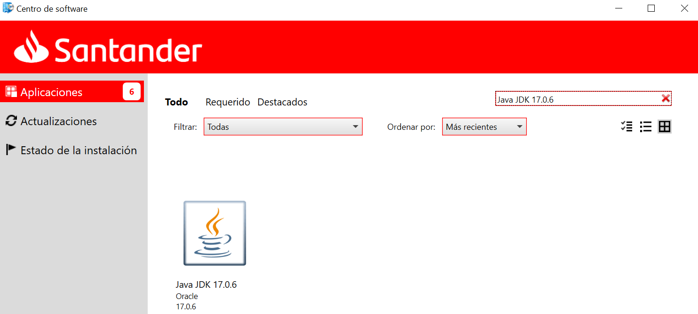
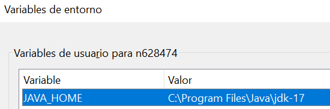
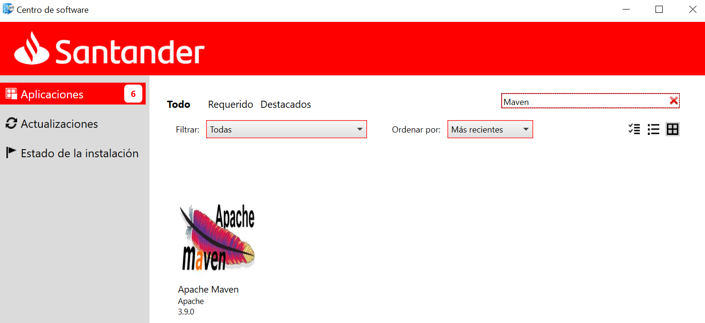
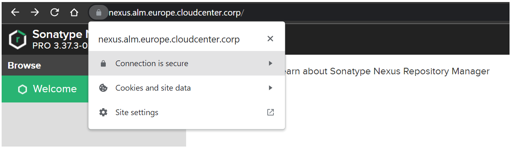
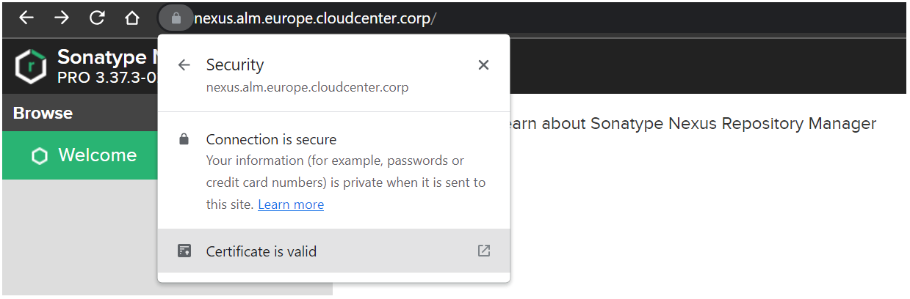
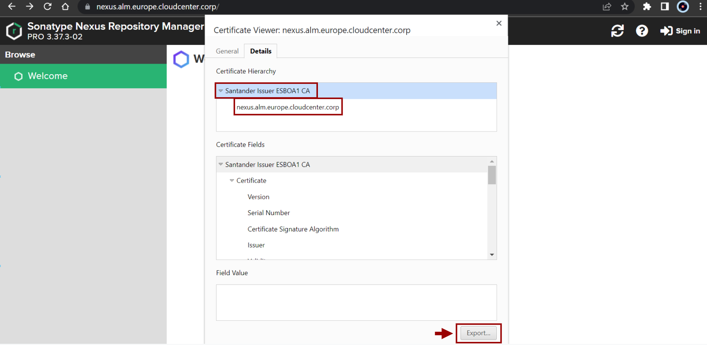

# Java-Maven

The intention of this section is to configure everything needed to run Java-Maven based projects.

<!-- </br> -->

## Installing JDK

Java Development Kit (JDK) is a software that provides development tools for the creation of Java programs.

- **Step 1.** Access the "Install Now" portal and search for the latest version of Java JDK.



???+ Warning

    The versions of the installed packages may vary. This documentation is tested for the specified versions. There should be no problem for later versions.

- **Step 2.** Install the package.

- **Step 3.** Once installed, the **account environment variables** associated with the JDK need to be configured with the path to where the JDK is installed. The variables to be added/modified are:

    - JAVA_HOME
    - Path

      For example, the variable "JAVA_HOME" should be declared like this:

      

???+ Remember

    The value of the variable will vary depending on where you have the package installed.

- **Step 4.** Finally, check if everything is installed and configured correctly. Open a new terminal or command prompt and run the following command:

``` bash

$ java --version

# Response example

java 17.0.6 2023-01-17 LTS
Java(TM) SE Runtime Environment (build 17.0.6+9-LTS-190)
Java HotSpot(TM) 64-Bit Server VM (build 17.0.6+9-LTS-190, mixed mode, sharing)

```

???+ Tip

    If '*java --version*' command shows a different version, it does not mean your version has not be installed. Multiple jdk versions can be found under C:\Program Files\Java, C:\Program Files\Common Files\, or C:\Java  folders.

    Environment variable "Path" shows the preference order of available jdks (read from left to right). Updating this variable might require Admin access level.

<br>

---

## Installing Maven

Maven is a software tool for managing and building Java projects.

- **Step 1.** Access the "Install Now" portal and search for the latest version of Maven.



???+ Tip

    Make sure you choose the right Maven version, aligned with your project needs.

- **Step 2.** Once Maven is installed, you must ensure that the right version is available. Using your terminal or command prompt:

``` bash

$ mvn --version

# Response example

Apache Maven 3.9.0 (9b58d2bad23a66be161c4664ef21ce219c2c8584)
Maven home: C:\Program Files (x86)\apache-maven-3.9.0
Java version: 17.0.6, vendor: Oracle Corporation, runtime: C:\Program Files\Java\jdk-17
Default locale: es_ES, platform encoding: Cp1252
OS name: "windows 10", version: "10.0", arch: "amd64", family: "windows"

```

<br>

---

## Configuring "settings.xml" file

The **settings.xml** file contains elements used to define values which configure Maven execution.

For more information visit [Settings Reference](https://maven.apache.org/settings.html).

By default the "settings.xml" file is located in the path:

- C:\Users/{nxxxxxx}/.m2/settings.xml.

To access Nexus repositories containing archetypes and Maven-based dependencies, it is necessary to have the "settings.xml" file properly configured.

Is to define the Nexus repository we want to access. This is the official Nexus repository for all employees: [Nexus Europe](https://nexus.alm.europe.cloudcenter.corp/).

???+ info

    In principle, the proxy definition in the "settings.xml" is not necessary.

</br>

Copy this example of "settings.xml" the maven config file:

``` xml

<?xml version="1.0" encoding="UTF-8"?>
<settings xmlns="http://maven.apache.org/SETTINGS/1.0.0"
          xmlns:xsi="http://www.w3.org/2001/XMLSchema-instance"
          xsi:schemaLocation="http://maven.apache.org/SETTINGS/1.0.0 http://maven.apache.org/xsd/settings-1.0.0.xsd">
  <profiles>
    <profile>
      <id>nexus</id>
      <repositories>
        <repository>
            <id>nexus</id>
            <url>https://nexus.alm.europe.cloudcenter.corp/repository/maven-public</url>
            <releases>
                <enabled>true</enabled>
                <updatePolicy>always</updatePolicy>
            </releases>
            <snapshots>
                <enabled>true</enabled>
                <updatePolicy>always</updatePolicy>
            </snapshots>
        </repository>
      </repositories>
      <pluginRepositories>
        <pluginRepository>
            <id>nexus</id>
            <url>https://nexus.alm.europe.cloudcenter.corp/repository/maven-public</url>
            <releases>
                <enabled>true</enabled>
                <updatePolicy>always</updatePolicy>
            </releases>
            <snapshots>
                <enabled>true</enabled>
                <updatePolicy>always</updatePolicy>
            </snapshots>
        </pluginRepository>
      </pluginRepositories>
    </profile>
  </profiles>
  <activeProfiles>
    <!-- Make the profile active all the time -->
    <activeProfile>nexus</activeProfile>
  </activeProfiles>
</settings>

```

<br>

---

## Nexus Certificates

The user will need to install Nexus access certificates. Without these certificates it will not be possible to download the necessary packages and dependencies to make the component work.

The user can install the certificates by following one of two options:

### OPT1: Request Admin Installation

Users do not have permissions to install on specific paths where Java is installed by default.
This is why it is necessary to open a [ITSM Support ticket](https://santander.service-now.com/nav_to.do?uri=%2Fcom.glideapp.servicecatalog_cat_item_view.do%3Fv%3D1%26sysparm_id%3Ded6f7132dbf5a700ec3fa5305b9619be%26sysparm_link_parent%3D592504fc1b1945505ae05532604bcbf6%26sysparm_catalog%3De0d08b13c3330100c8b837659bba8fb4%26sysparm_catalog_view%3Dcatalogs_service_catalog%26sysparm_view%3Dtext_search)
so that an administrator can install the necessary certificates.

### OPT2: User-maunally Installation

This is a non-standard solution that can be used temporally.

#### Export Certificates

To do so, first you have to have access to [Nexus](https://nexus.alm.europe.cloudcenter.corp/). Once in Nexus, go to "**View site information**",
then to "**Connection is secure**" (*Show connection details*), and then select "**Certificate is valid**" (*Show certificate*) option, as shown in the following images:





Once in the certificate view, go to the details section where the certificate hierarchy is located:

- **Santander Issuer ESBOA1 CA**
- **nexus.alm.europe.cloudcenter.corp**

The next step is to export both certificates in **.crt** format.



#### Import Certificates

Once the certificates have been exported, they must be imported using the standard keytool into the file "cacerts", located in the path "*java/jdk/lib/security*".

???+ warning

    It is important to have the installed Java JDK located in a folder where the **user has permissions to install certificates**.

1. Run the standard keytool to import the certificate, from **JAVA_HOME\jdk\lib\security**.<br>

    ``` { .bash .copy }
    keytool -importcert -alias nexus-alm -file [certificate path] -keystore cacerts
    ```

2. When prompted **Enter keystore password:**, enter "**changeit**".<br>
  By default keystores have a password of "*changeit*"

3. When prompted **Trust this certificate? [no]:**, enter "**yes**".<br>
  This imports the certificate into the keystore and display the message: "**Certificate was added to keystore**".

???+ info

    The alias used for the import of the certificate must be unique. The label must be changed if it already exists.

### Check Certificates Installation

To check whether the certificates have been installed correctly, just run the following command replacing the path of the user's cacerts file:

``` { .bash .copy }
keytool -v -list -keystore [.../java/jdk/lib/security/cacerts path] | grep "nexus"
```

When prompted **Enter keystore password:**, enter "**changeit**".
The **CN** field displays the information necessary to know if the desired certificate is installed or not.

``` bash
Enter keystore password:  changeit
Alias name: nexus-alm
Owner: EMAILADDRESS=dl_ccc_alm_ops@gruposantander.com, CN=nexus.alm.europe.cloudcenter.corp, OU=SGT, O=GRUPO SANTANDER, L=Las Rozas, ST=Madrid, C=ES
  DNSName: nexus.alm.europe.cloudcenter.corp
```

If the **CN** field contains the name of the above mentioned certificates, it means that the certificates have been installed correctly.

---

## Troubleshooting

If you have any problems installing any of the above packages from **Install Now** please open ITSM support ticket at the following path: [**END-USER CATALOGUE - EUT Requests - End User Software - User Applications Request**](https://santander.service-now.com/nav_to.do?uri=%2Fcom.glideapp.servicecatalog_cat_item_view.do%3Fv%3D1%26sysparm_id%3Ded6f7132dbf5a700ec3fa5305b9619be%26sysparm_link_parent%3D592504fc1b1945505ae05532604bcbf6%26sysparm_catalog%3De0d08b13c3330100c8b837659bba8fb4%26sysparm_catalog_view%3Dcatalogs_service_catalog%26sysparm_view%3Dtext_search).

It is necessary to indicate the action you want to resolve: **Install**, **Uninstall** or **Update**, and add a text explaining the **detail** of the request.

<br>
