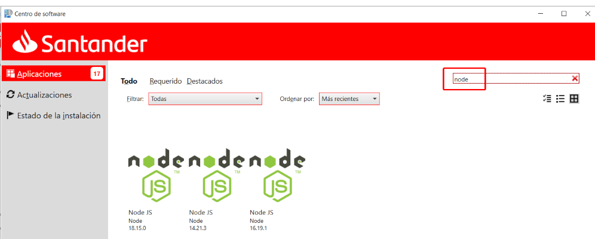
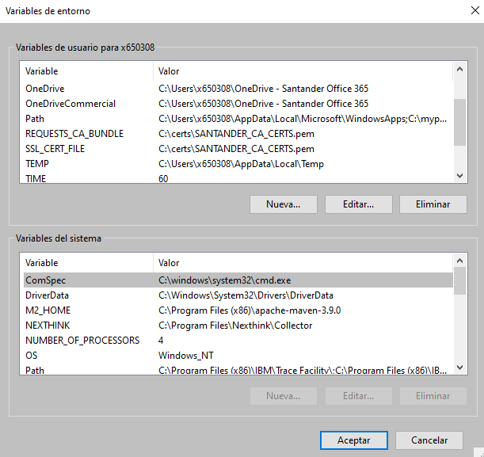
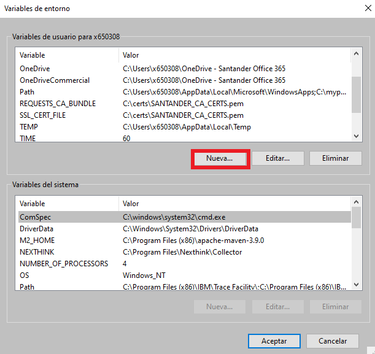
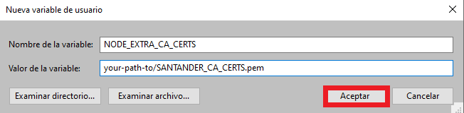

# Javascript-Node

## Javascript and NodeJS framework<a id="javascript-node"></a>

Node.js is a run-time environment which includes everything you need to execute a program written in JavaScript. It's used for running scripts on the server to render content before it is delivered to a web browser.

NPM stands for ***"Node Package Manager"***, which is an application and repository for developing and sharing JavaScript code.

<!--tutorial-start-->
## Checking if there's a previous version installed

In order to check if any version has been installed into the PC, opening a command prompt:

NodeJS version:

```bash
$node -v
```

An example of the expected output is:

```bash
v16.20.2
```

???+ Tip

    We currently support NodeJS version 16 and above. Make sure you choose the right NodeJS and NPM version.

## Installing NPM

In order to setup NPM, it is required to install NodeJS package from Santander Application Cataloge.



??? warning "PATH environment values"

    Remember to add the Node installation to your PATH environment variable!

## Configure npm registry and strict-ssl

Open a command prompt and run the commands below:

Setting the repository, enables downloading packages from Santander Nexus repository.

```bash
npm config set registry http://nexus.alm.europe.cloudcenter.corp/repository/npm-public/
```

In order to avoid certificate issues when downloading  packages.

```bash
npm config set strict-ssl false
```

## Santander Certificates

You will need an issued Santander certificate, you can download it zipped from [here](https://nexus.alm.europe.cloudcenter.corp/repository/almmc-san-darwin-sources-raw-releases/nodejs/certs/1.0.0/SANTANDER_CA_CERTS.zip).
Extract the contents of the zipped file in an accessible directory. The location of this file will be referred ass 'your-path-to/SANTANDER_CA_CERTS.pem'.

Next, you should set an environment variable with its location. To do so, go to Windows -> Search for "environment variables" -> Select "Edit environment variables of this account".
Once you follow this steps, the following window will show:



Select "New":



Fill up the form with the environment variable name 'NODE_EXTRA_CA_CERTS' and the path to the downloaded file, 'your-path-to/SANTANDER_CA_CERTS.pem', and select "Accept":



Your certificate is now set up as permanent environment variable.

<!--tutorial-end-->
