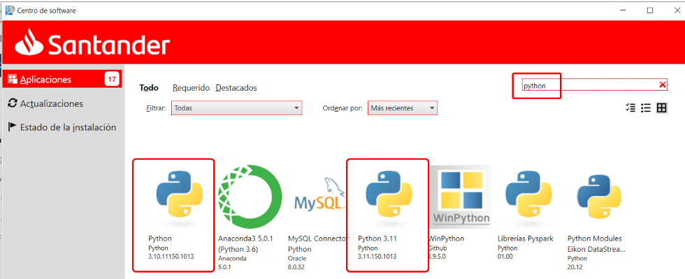
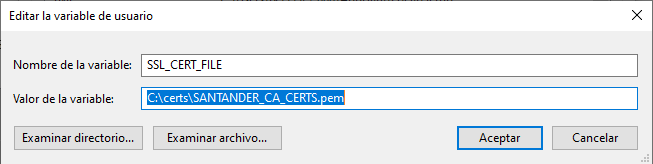
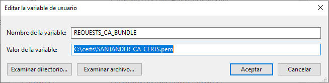

# Python

Python is a high-level, interpreted, and general-purpose programming language. Python's design philosophy emphasizes code readability with its notable use of significant whitespace.
Its language constructs and object-oriented approach aim to help programmers write clear, logical code for small and large-scale projects.

The intention of this document is to guide you through the installation and configuration of Python, Pip and Pipenv, which are essential for developing Python applications.

## About Pipenv <a id="pipenv"></a>

Pipenv is a tool that aims to bring the best of all packaging worlds (bundled dependencies, virtual environments, and requirements management) to the Python world.
It automatically creates and manages a virtual environment for your projects, as well as adds/removes packages from your Pipfile as you install/uninstall packages.
It also generates the ever-important Pipfile.lock, which is used to produce deterministic builds.

More information about Pipenv can be found [here](https://pipenv.pypa.io/en/latest/).

???+ Tip

    Pipenv is a dependency manager for Python projects. If you are familiar with Node.js, it is similar to npm.
    It is used in Darwin projects to manage dependencies and virtual environments.

## About Python and PIP <a id="python"></a>

<!--Start Install Python-->

Python interpreter and running environment is provided into Python SDK, available into Santander Application Cataloge.

PIP is a package manager for Python packages (or modules). It is provided by default into Python V3.4+.

## Checking if there's a previous version

In order to check if any version has been installed into the PC, opening a command prompt:

Python version:

```bash
$python -V
# Ensure -V is written with upper case letters
# py -V is identical command, as py is an accepted short name

# Example of output
Python 3.11.0
```

PIP version:

```bash
$pip -V
# Ensure -V is written with upper case letters

# Example of output
pip 23.0.1 from C:\Program Files\Python311\Lib\site-packages\pip (python 3.11)
```

???+ Tip

    Make sure you choose the right Python and PIP version, aligned with your project needs.

## Installing Python

In order to setup Python, it is required to install Python package installer from Santander Application Cataloge.



???+ Tip

    The recommended version for Darwin Python projects are `3.9, 3.10 or 3.11`.

??? warning "PATH environment values"

    Remember to add the python installation to your PATH environment variable!

## Configure pip registry and trusted-host

Open a command prompt and run the commands below:

```bash
pip config --user set global.index https://nexus.alm.europe.cloudcenter.corp/repository/pypi-public/simple
pip config --user set global.index-url https://nexus.alm.europe.cloudcenter.corp/repository/pypi-public/simple
pip config --user set global.trusted-host nexus.alm.europe.cloudcenter.corp
```

<!--End Install Python-->

<br>

## Santander Certificates

You will need an issued Santander certificate, you can download it zipped from [here](https://nexus.alm.europe.cloudcenter.corp/repository/almmc-san-darwin-sources-raw-releases/nodejs/certs/1.0.0/SANTANDER_CA_CERTS.zip).
Extract the contents of the zipped file in an accessible directory. The location of this file will be referred ass `your-path-to/SANTANDER_CA_CERTS.pem`.

Next, you should set an environment variable with its location. To do so, go to Windows -> Search for "environment variables" -> Select "Edit environment variables of this account".
Once you follow this steps, the following window will show:


Select "New":


Fill up the form with the environment variable name `SSL_CERT_FILE` and the path to the downloaded file, `your-path-to/SANTANDER_CA_CERTS.pem`, and select "Accept":



Fill up the form with the environment variable name `REQUESTS_CA_BUNDLE` and the path to the downloaded file, `your-path-to/SANTANDER_CA_CERTS.pem`, and select "Accept":



Your certificate is now set up as permanent environment variable.

## Installing Pipenv

In order to install Pipenv, open a command prompt and run the command below:

```bash
pip install pipenv==2023.12.1
```
