# Gluon Jira integration with GitHub.com Org repositories

Gluon makes available Jira integration with GitHub.com Organizations using the free "GitHub for jira" app.
???+ info
    The main goal for this integration is to keep traceability between Jira Gluon Projects issues and related GitHub.com repositories for smooth development workflow by tracking branches, Pull Requests (PRs), commits and reduce manual issues updates.

    Just reference the issue key in the GitHub commit, and everyone with permissions in the Jira project can view the GitHub data in the linked issue.
    
    This integration is configured in all Santander Jira product sites that use a Gluon Github.com Org by default.
    ??? note "Please contact Gluon support in case the integration does not work as expected."
        Create a [Gluon Support](../../../../../getting-started/support/index.md#create-a-new-incident-inc)
        
        Information Required:

        - Jira Project URL
        - Gluon Github.com Organization Name 
        - Repository Name

## Jira - GitHub.com integration usage tips

The way to activate the integration is through references to Jira Issue in Gluon GitHub.com repository branch as detailed in the following sections.

### Commits to Jira issues

- Navigate to the JIRA project and create a new issue or use an existing issue:  
  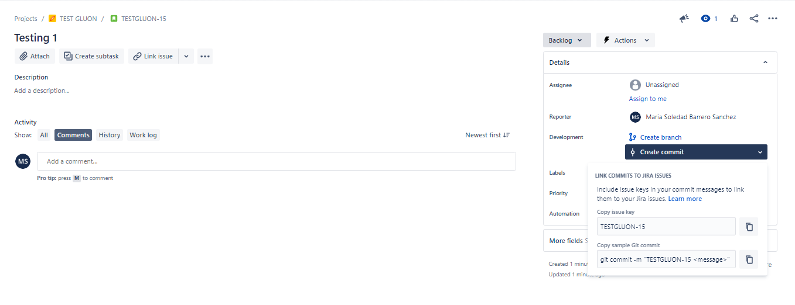

- On the issue details section, you can see what the git command should be execute on GitHub.
- Go the GitHub repository and commit a change using the syntax shown in the previous section.
  - Example in  GitHub web:  
    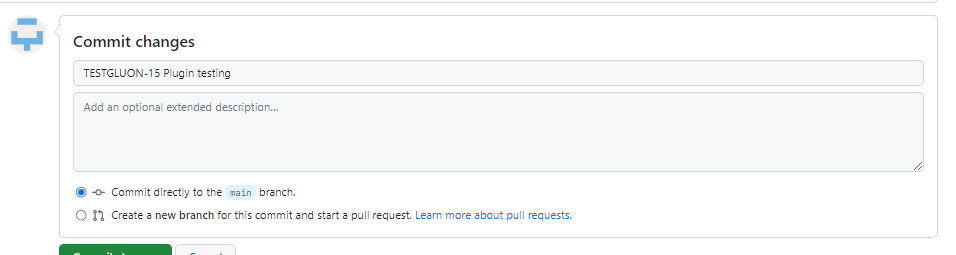  

  - Example in Command Line:  
???+ example
    git commit -m `"<JIRA issuey key> <message>`"  
- Check it in Jira: Go back to the Jira issue and click on the commit link to check that the commit message is displayed.  
  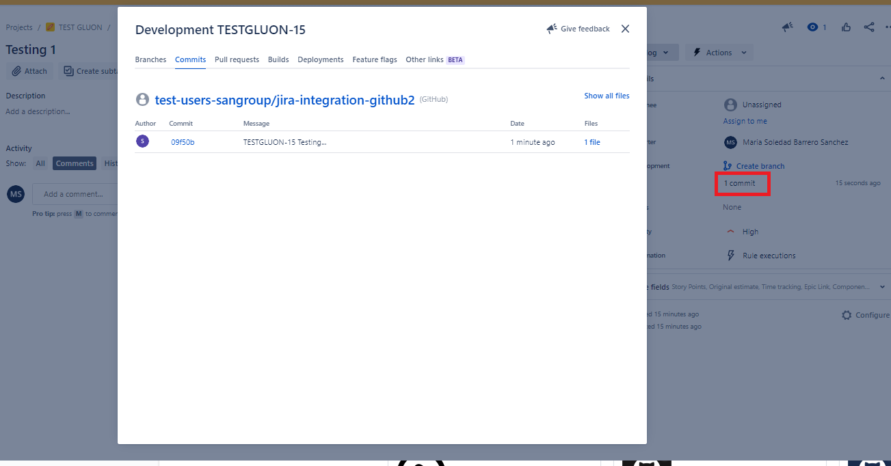

### Associate PR and GitHub Actions to issue

- The pull request have to include the issue key in the title. When push the branch, the PR will be displayed along with other development information in the Jira issue.  
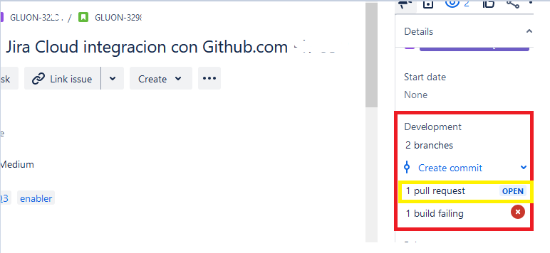

- If you use GitHub Actions, your workflows and deployments will be linked if a commit associated with the deploy contains the issue key in its commit message.

### Smart Commits

???+ info
    When you manage your project's repositories in GitHub, you can process your Jira issues using special commands, called Smart Commits, in your commit messages.

    The current available special commands allow to automatically perform actions in Jira issue as add comments, transition to a new status or log time.
    It is possible to include one or several special commands in the same commit message.

Navigate  to a Jira issue and get the issue key.  
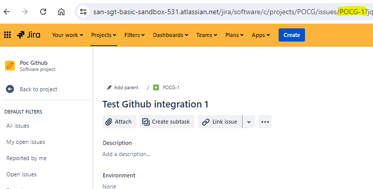

Navigate to GitHub.com and access to the Gluon repository.

#### From GitHub.com Interface

##### Example 1: Add comment to Jira issue

  - Go to GitHub.com repository in the Organization and commit a file to a branch, in commit message as followed.  
    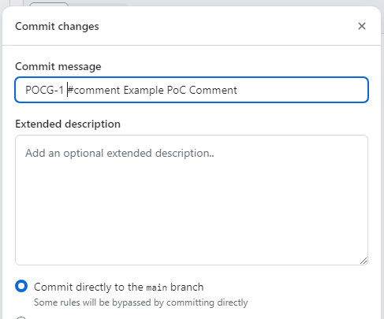
    - Check it in Jira:
    - Go back to Jira Issue and check comments tab.  
      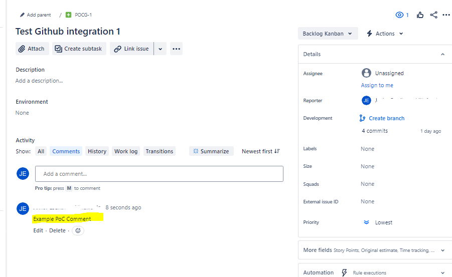

##### Example 2: Transition issue to a new status

  - In this case it is necessary to know the issue workflow and it is necessary to know the name transition between the current issue status and destination status.
  - In this example case the issue with key "POCG-2" have the current situation:
    - Issue current status "Developing".
    - Issue future Status desired: "Developed".
    - Transition Name "Developed".  
      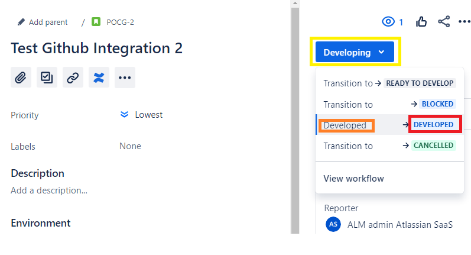
      - Navigate to GitHub.com repository in the Organization and commit a file to a branch, in commit message as followed:  
        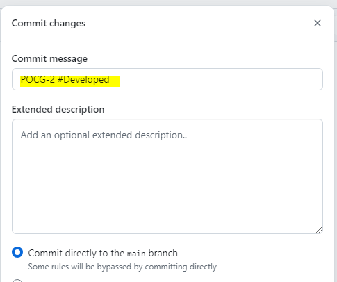
        - Check it in Jira: Come back to Jira issue and check the transition is done.  
          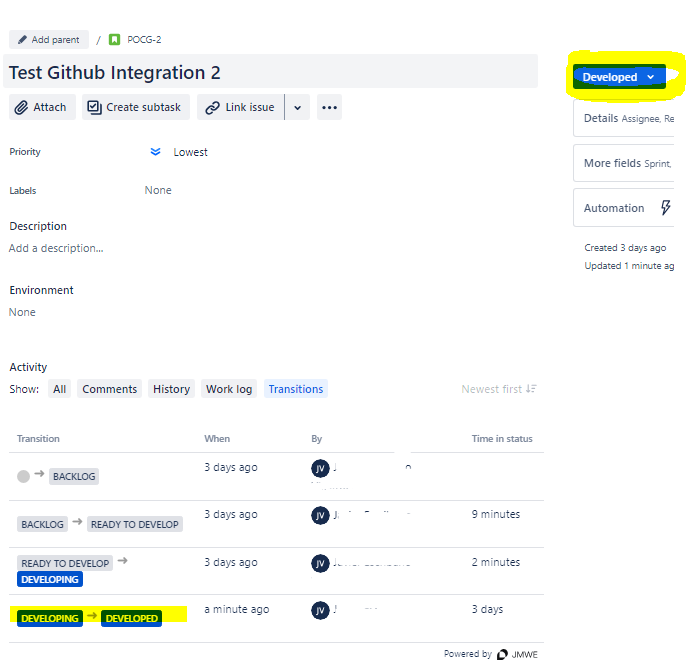
???+ info
    In case more than one "transition name" with same partial name and the transition have spaces in the name, in the commit command replace spaces with "-".
    Example:
    Transition Name: "Ready from backlog"
    git command smart commit : git commit -m `<ISSUE-KEY`> #Ready-from-backlog
???+ danger "Consideration wf transitions ALL Type"
    This command is not valid  in case  the transition name is "ALL" and there are more than one type of this transition added to the same issue workflow
    Example workflow not usable with smart commits transition action:  
    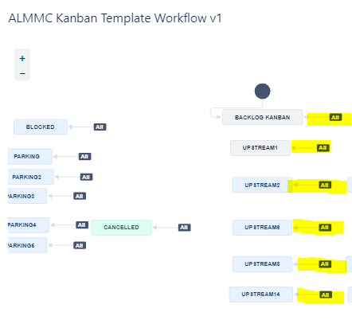

##### Example 3: Add worklog time to issue

  - Go to github.com repository in the Organization and commit a file to a branch. In Commit Message.  
    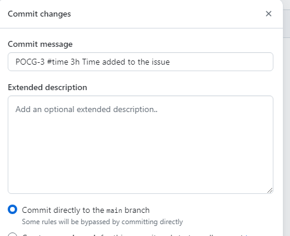
  - Check it in Jira: Check issue "Work log" tab.  
    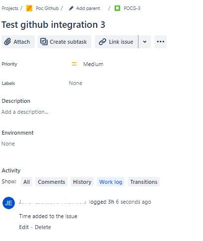

#### From command line

???+ note "Generic git command"
        git commit -m `<JIRA issuey key`> #operation `<message`>

???+ example "Example comment issue with key POCG"
        git commit -m POCG-1 Test Commit #comment Text for comments

???+ example "Example transition issue with key POCG-2 to the Developer destination wf state and transition name is 'Developed' too"
        git commit -m POCG-2 #Developed

???+ example "Example add work log (time) to issue, Add 1 hour and a comment for worklog"
        git commit -m POCG-2 #time 1h Added time to issue

 

???+ info "Atlassian References and more info "

    - [Link GitHub development information to Jira issues](https://support.atlassian.com/jira-cloud-administration/docs/use-the-github-for-jira-app/) 

    - [Smart commits commands & syntaxis](https://support.atlassian.com/bitbucket-cloud/docs/use-smart-commits/)

??? success "Santander Gluon GLOBAL CISO CERTIFICATION"
    The "GitHub for Jira" app used in the integration documentation and information is available in Vendor Marketplace: [https://marketplace.atlassian.com/apps/1219592/github-for-jira?tab=overview&hosting=cloud](https://marketplace.atlassian.com/apps/1219592/github-for-jira?tab=overview&hosting=cloud)
    Santander Gluon GLOBAL CISO certified this app usage in Atlassian Santander Org
