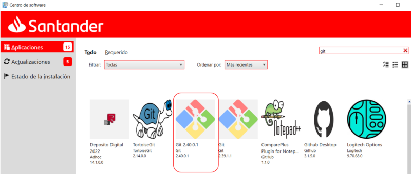
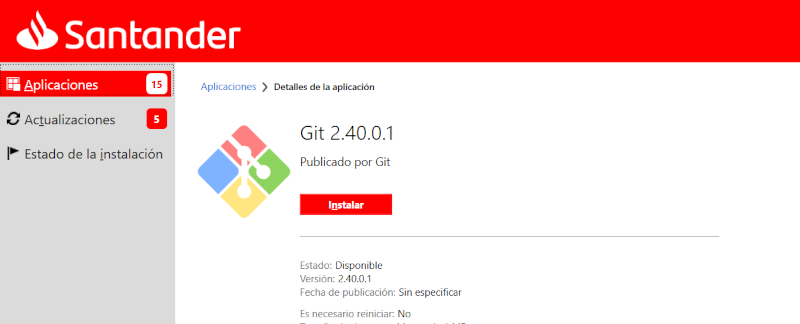

## Install Git

At Santander, windows-based PCs use **Git for Windows**. Client installer is downloaded using Santander Application Catalogue, searching for "Git".

<iframe src="https://santandernet.sharepoint.com/sites/gluonacademycommunity/_layouts/15/embed.aspx?UniqueId=7a279e99-245e-417c-b408-0aa3b0c81f0e&embed=%7B%22ust%22%3Atrue%2C%22hv%22%3A%22CopyEmbedCode%22%7D&referrer=StreamWebApp&referrerScenario=EmbedDialog.Create"
 width="640" height="360" frameborder="0" scrolling="no" allowfullscreen title="Install git.mp4"  loading="lazy"></iframe>

Select latest version available (At the time of writing latest version available was v2.40.0.1).



Access the detail page and proceed to install



Finally, on your shell, verify that it was correctly installed:

```bash

git --version

```

???+ Info

    **Git for windows** comes with three additional functionalities:

    - **Git bash:** Bash emulator to run git from command line.

    - **GitK:** Graphical repository browser, that can be invoked from the command line.

    - **Git GUI:** Git Client, with a graphical user interface.

    More details at [Git for windows project site](https://gitforwindows.org/) 

## Git Configuration

It is important to configure your Git username and Corporate email address, since every Git commit will use this information to identify you as the author.

### Add your Git username

On your shell, type the following command to add your username:

```bash

git config --global user.name "YOUR_USERNAME"

```

To set your Corporate email address, type the following command:

```bash

git config --global user.email "your_email_address@gruposantander.com"

```

???+ Info

    - **Username** is your Santander User identification number.
    - **Corporate email address** is your Santander email address (as employee or consultant).

You can finally verify that git has been correctly configured:

```bash

git config --global user.name

git config --global user.email

```

In order to check your full information

```bash

git config --global --list

```
