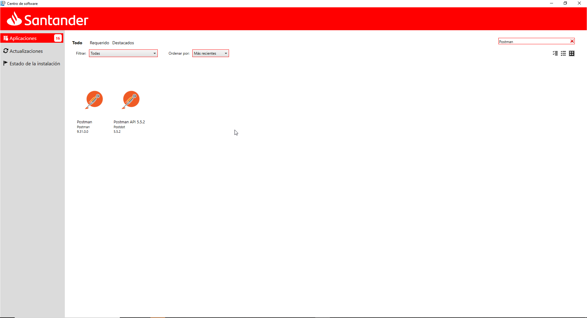
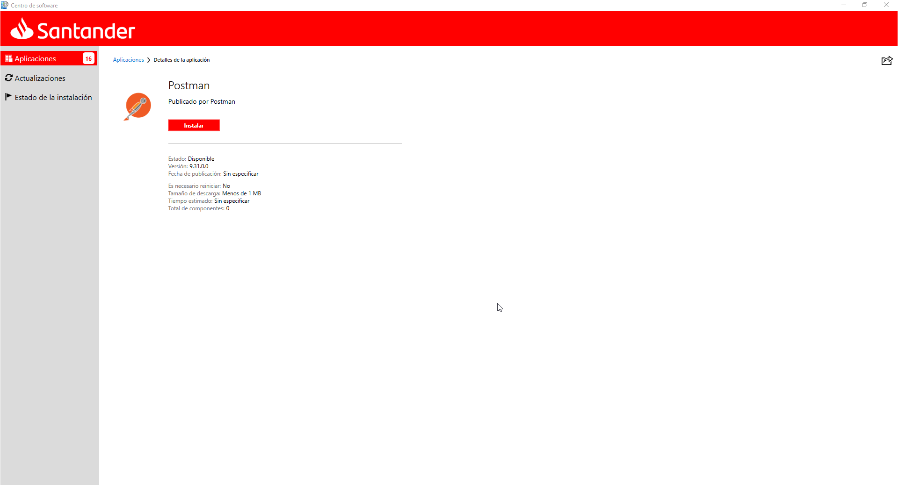
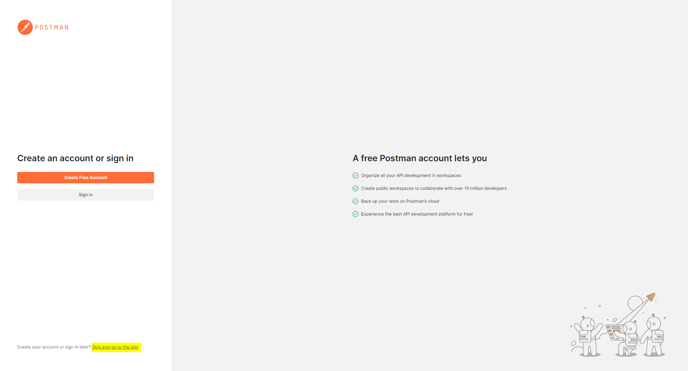

## Install Postman

At Santander, windows-based PCs use **Postman**. Client installer is downloaded using Santander Application Catalogue, searching for "Postman".

Select Postman (not Postman API) and latest version available (At the time of writing latest version available was v9.31.0.0).

Access the detail page and proceed to install

The first time Postman is opened it will ask to create an account, this is not necessary by pressing the **Skip and go to the app** button.

Everything is now ready to start working with Postman.
