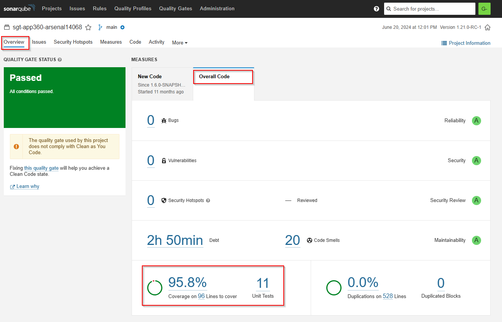
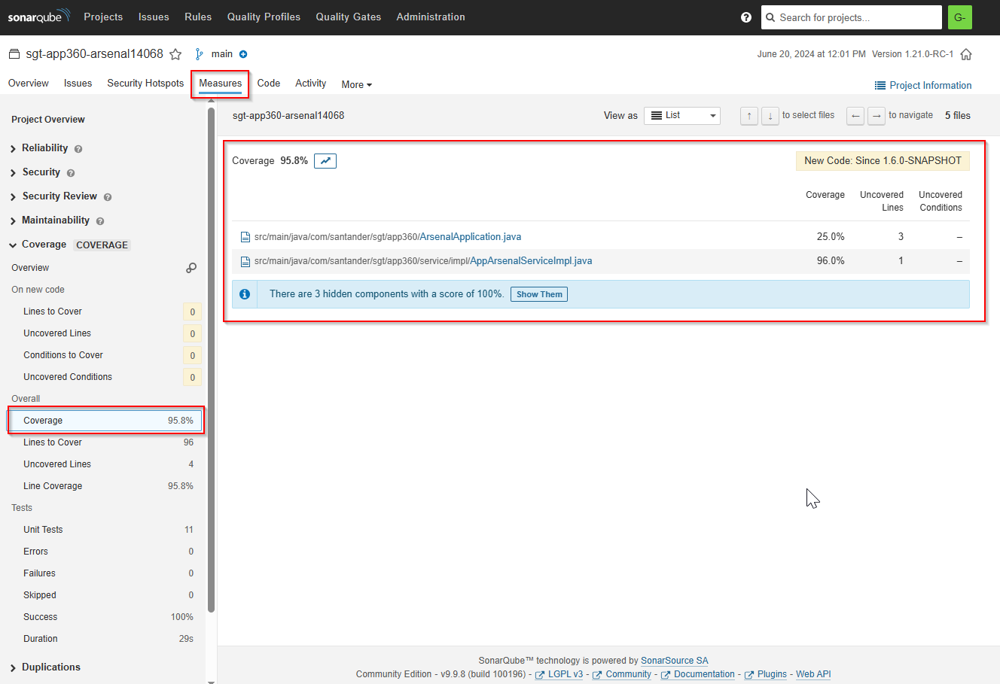

In the world of software development, ensuring code quality is a fundamental task. One of the key mechanisms to achieve this is unit testing, which allows us to verify that individual functions of the code behave as expected.
However, writing unit tests is not enough if we do not measure how much of the code is actually covered by them. This is where **code coverage** comes into play.
This article explores what unit test coverage is, why it is important and how we can measure it in Java using **JaCoCo**, a Maven plugin widely used for this purpose.

### What is Code Coverage?

Code coverage is a metric that indicates what percentage of the source code is executed by unit tests.

### Why is it important to measure code coverage?

Coverage is a metric that allows development teams to:

- Identify untested code: Detect parts of the code that are never executed by unit tests.
- Ensure quality and reliability: The higher the coverage, the lower the probability of undetected bugs.
- Avoid regressions: With good coverage, any changes to the code will be properly evaluated.
- Comply with development standards: Many companies require a minimum percentage of coverage in their projects.

## JaCoCo

**JaCoCo** (JAva COde COverage) is a popular tool for measuring code coverage in Java projects. It easily integrates with Maven, Gradle and other build and test execution tools.

:note: **Note**: For more information [here](https://github.com/jacoco/jacoco)

### Configuring JaCoCo in a Maven Project

To integrate JaCoCo into a Maven project, we must add the following plugin in the pom.xml file:

```xml

<build>
    <plugins>
        <plugin>
            <groupId>org.jacoco</groupId>
            <artifactId>jacoco-maven-plugin</artifactId>
            <version>0.8.12</version>(1)
            <executions>
                <execution>
                    <id>prepare-agent</id>
                    <goals>
                        <goal>prepare-agent</goal>
                    </goals>
                </execution>
                <execution>
                    <id>report</id>
                    <phase>verify</phase>
                    <goals>
                        <goal>report</goal>
                    </goals>
                </execution>
            </executions>
        </plugin>
    </plugins>
</build>
```

1. :man_raising_hand: Currently this is the latest version of the Plugin. We recommend you to download the latest - [here](https://github.com/jacoco/jacoco/releases)

### Running the tests with JaCoCo

Once the plugin is configured, we can run the tests and generate the coverage report with the following command:

```bash

mvn clean test
```

To generate the coverage report, we execute:

```bash

mvn jacoco:report
```

This will generate a report in the default folder `target/jacoco.exec`, check it to see the correct operation.

:warning: **Warning**: It is very important not to change either the file name or the file location.
Although it is possible to do it by configuring the plugin in the pom.xml, do not do it because the Sonar agent takes this file to calculate the coverage in Sonar and display it _in pretty_.

:warning: **Warning**: Another consideration is that the maven allows to overload configurations, please check the final pom.xml to see if you have any parent that modifies this plugin and does not end up generating correctly.
To check this run this command and check the final pom.xml that you are using

```bash

mvn help:effective-pom
```

## Conclusion

Measuring unit test coverage is critical to ensure code quality in Java projects. JaCoCo is a powerful tool and easy to integrate with Maven, allowing to obtain detailed code coverage reports.
However, it is important to remember that high coverage does not guarantee the absence of bugs, but that the code has been executed during testing.
The combination of well-designed tests and a high code coverage does not guarantee that the code has been executed during testing.

JaCoCo plugin and its integration with **SonarQube**

Although the metrics on the coverage of the unit tests of our code are visualized in **SonarQube**, the data comes from the analysis performed by JaCoCo.
That is, when we run a build and the JaCoCo plugin is activated within a CI/CD pipeline, a file with this information is generated (as we mentioned earlier), and SonarQube uses this file to clearly present the data.
Therefore, the correct configuration of this plugin is crucial for effectively measuring coverage.



