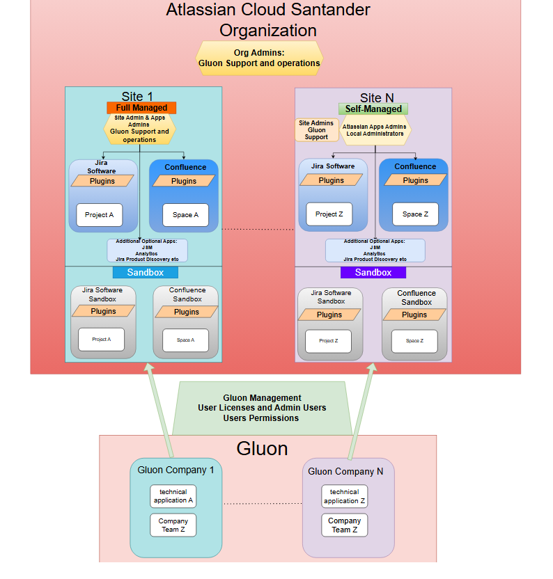
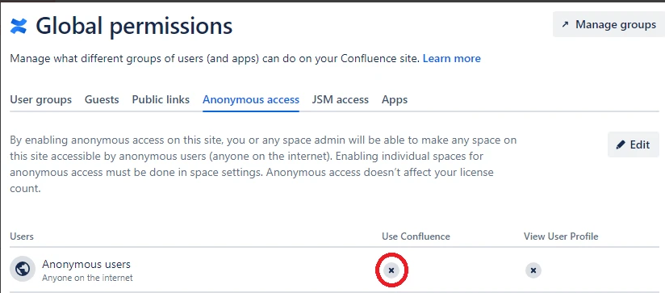
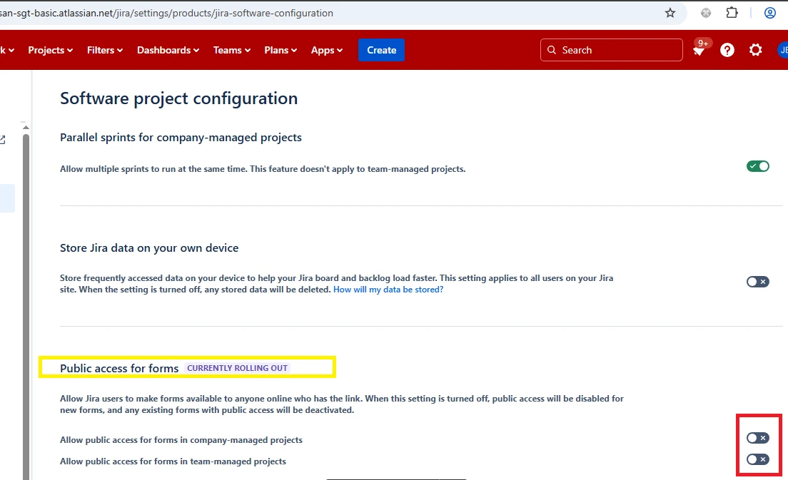
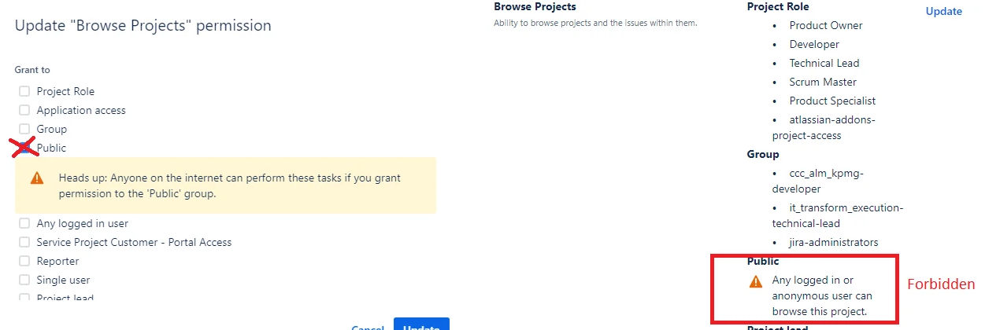
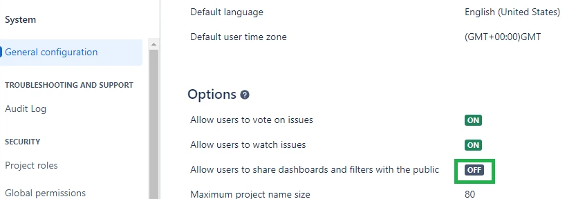

## Introduction

Atlassian Saas (Cloud) Santander Organization contains multiple instances (called sites).

- Each site contains Atlassian apps (Jira and Confluence mainly)
- In the normal procedure each site is connected with a Gluon company for managing user access (licenses) and permissions.
- Each Atlassian app could have installed Atlassian marketplace apps (plugins)  **Note:** All the required plugins (free or paid) needs the CISOs Authorization and to be installed by Gluon Operations team. It will be detailed later.

??? info "Atlassian Cloud Santander Management diagram model"
    

## Santander Atlassian Sites management models

 There are 2 models to manage each site and their Atlassian apps (products):

**Full-Managed Site**: Fully managed by the **Gluon Support & Operations Team** 
**Self-Managed Site**: The local entity have a local Atlassian tools Administrators team with fully administration over the products but not the site settings.  
In this model the **Gluon Support & Operations Team** manage only certains operations, the most common are: 

1. **Install/Uninstall marketplace apps (plugins) and Atlassian apps (products)** in the site. The entity needs to get the CISOs Authorizations before request the installation.
2. **Review user problem cases in Products Access** 
3. **Manage Groups Access Configurations**.
4. **Create sandboxes**
5. **Copy data from Production apps to sandbox.**
  
???+ info "Defined User Management Model in Corporate Santander Atlassian Cloud Organization"
    Santander Atlassian Cloud have set the Atlassian "Original user management" with  3 administration levels in Atlassian  
    - Org Admin 
    - Site Admin 
    - App Admin 

In Self-Managed sites , the local administrators are granted with **App Admin** permissions.
[More detailed information from Atlassian](https://support.atlassian.com/user-management/docs/what-are-the-different-types-of-admin-roles/#Original-user-management-content)

## App Admin permissions

Local Self-Managed sites Admins have the Atlassian app admin permissions. (Jira and Confluence are the main Atlassian apps)

With the admin app permissions, the local admins have the possibility to administer Atlassian apps configuration and the installed "Atlassian marketplace apps" (plugins) settings.

???+ tip
     **Reminder: Atlassian local Admins are not authorized to install/uninstall plugins in any corporate Atlassian Cloud site. To install it is necessary to follow the procedure in**
    [Step 3 in this other article](./atlassian-new-site-procedure.md) 
The App Admin permissions is granted in the site apps through Gluon company Teams (Connected with AzureAD/EntraID Groups).
??? info "Company teams for Local Atlassian Products Admins"
    **Entity**: 
    When the entity request the new site creation needs at least to indicate 2 users that will be Company Teams owners in the Atlassian Products Admin groups. 
    Once the company teams for admins are created, the team owners could manage the company team members through Gluon Portal . [How to manage Gluon company teams](https://gluon.gs.corp/community/docs/latest/getting-started/company-management/company-teams-management/) 
    **Gluon Support Team**: 
    - Responsible to create the Jira/Confluence company teams in the indicated Gluon company associated to the Atlassian site. 
    Example of company teams names per app: 
    - **CONFLUENCE Admins Company Team** 
        Key: CADM 
        Name: [SITE NAME] CONFLUENCE ADMINS 
    - **JIRA Admins Company Team** 
        Key: JADM 
        Name : [SITE NAME] JIRA ADMINS 
    - Configure the above Admin Groups  in the  "Administration access" for each Atlassian site.

## Site Admin permissions

In the normal Gluon - Atlassian Cloud user management mode,**site admin privileges are not granted to Self-Managed sites local Admins**

### Exceptions for local self-managed site administrators receiving temporary site admin permissions

??? note "Steps to request site admin privileges as exception"

    The site admin  privileges could be granted in Production or Sandbox Self-Managed sites to some local admin user under some justified circumstances and needs to be authorizated by the Gluon Platform managers. 
    **Exceptional cases for granting elevated temporary site admin privilege to local admins**

    1. Doing some authorized specific excepcional configuration in the site that requires site admin privileges.
    2. Migration from on-premise to Cloud

    **Way to request temporary site admin** 
    To request temporary site admin permission it is needed to send a email to [dl_gluon_platform_support@gruposantander.com](mailto:dl_gluon_platform_support@gruposantander.com).
    Information needed:

    - Justification to have site admin permissions.
    - the admin users who be granted with site admin privilege.
    - time slot to keep site admin permissions.

    In case to be authorized to get the Site Admin permissions, the local admin users authorized will need to have into account this considerations:
    ???+ note "Site-Admins temporal grants considerations"
        1. **No allowed to install any App (Plugins) by the entity (FREE apps neither).**
            a. All the plugins (Free or paid)  needs to be installed by Global Gluon Support Team .
            The correct way to request is through [Gluon Request ITSM Ticket](https://gluon.gs.corp/community/docs/latest/getting-started/support/#atlassian-plugin-app)
            It is mandatory before to request installation to get the CISOs authorizations and reference them as indicated in the documentation.
        2. **No new Atlassian Products installation by local entity**
            a. It is not allowed to install any other Atlassian product that purchased. All this kind of new Atlassian products installations need to be requested to Global Gluon Support Team with CISOs authorization.
        3. **No user invitation through Atlassian UI to give user licences to site Products**
            a.All the user licences (Product access) have to be granted through Gluon and related AzureAD Groups configured in the site Configuration.
            b.No allowed to grant user licenses to product with default Atlassian product access local groups.
        4. **Migrations from on-premise to Cloud** 
            a. Review to avoid any Public elements allowed in Corporate Cloud  
                i. It is not allowed public access any element in Cloud  Jira ( Public User filters and dashboards, public projects ) and Confluence ( Public Spaces)
        ??? info "More Considerations post migration"
            - Once finished migration and removed  the local admins site-admin grant,the local admins will not be able to manage site settings including the Atlassian local groups membership.
            - The access and permissions groups will need to be managed through Gluon.
            - The entity have to [create the technical applications](https://gluon.gs.corp/community/docs/latest/application/application-management/application-onboard/) and in the creation select the existing migrated Jira projects. 
            - The entity would need to execute a post migration task to change the migrated local groups and replace them with AzureAD Groups coming from Gluon in confluence 
            - In other entities that purchased an Atlassian partner for doing their migration they did group migration after the Jira and Confluence migration.

## General Considerations for Self-Managed Admins

Some considerations for local Self-Managed Admins in corporate Atlassian Cloud:

### Users Access integration

The login in Atlassian SaaS is using  email address in users "mail" attribute in AzureAD Corporate Santander  

### No allowed any public elements

As CISO Requirement it is not allowed to have any Atlassian SaaS element shared with Public and accessible without Corporate SSO Login.

#### Confluence

- **No Anonymous Access** must be allowed in Atlassian Cloud as some Confluence Spaces are set in Server. (Even it is possible grant a Confluence Global permission for anonymous access in Cloud but it exposes the content to public internet )
- All the users that needs **access have to be in the in the Azure licenses groups** configured in the Atlassian destination site in order to access to Jira Projects and Confluence Spaces.
- Check that the "Anonymous users" configuration is disabled in Admin Area - Global Permissions:

#### Jira

- Gluon global support have active a control to find public elements in Jira and Confluence in all sites. 
In case the control detect any, Gluon support will proceed to change the visibility from "Public" to "My Organization" to the public elements.
Local Atlassian Focal point will be notified.
- **No allowed Public Forms.** 
The following configuration option have to be disabled in Jira Settings - Products  in Jira.URL:   **SITE_URL**/jira/settings/products/jira-software-configuration

- **Permissions schemes** 
No "Public" permissions is allowed to add in any permission, specially in "Browse Projects" and "Administer Projects" Permissions in any permissions scheme of Jira

- **Jira Public sharing not allowed** 
In Admin Area - System- General Configuration , check the option "Allow users to share dashboards and filters with the public" have to be set as OFF

- Manual Public filter detection: 
  Login in a incognito browser without Atlassian login and browse to the Jira url: 
    - **SITE_URL**/jira/filters
- Public dashboard detection: Login in a incognito browser without Atlassian login and browse to the Jira url:
    - **SITE_URL**/jira/dashboards

## Atlassian Cloud product releases tracking

As Atlassian Cloud is a SaaS service, the vendor is releasing periodically new releases with changes/new features rolled out to products in all sites.

In some cases the user UI experience and product functionality is changed with more impact for users.

**Atlassian products releases are currently applied to site products in a continuous way by default.**
???+ note
    In case the local Site Admins and Atlassian focal point want to change the way they receive updates in their local site Atlassian Apps based on [Atlassian release track options](https://support.atlassian.com/organization-administration/docs/what-are-release-tracks/):
    It is possible request by an Atlassian focal point through a [Gluon Support](https://gluon.gs.corp/community/docs/latest/getting-started/support/)

Self-Managed local admins have to consider to be aware of the new changes in the Atlassian Cloud products in order to :

1.Planify and manage the needed actions in the local site Product related to possible configuration changes based on Atlassian indications. 
2.When Atlassian roll out changes in some configuration element, local admins need to check if their site is  affected in their custom configuration ( Project Schemes (Workflows, Screens, Custom Fields, Permissions etc), automatism, installed apps etc)
3.Site Users communications related to Changes in products UI or functionality.
???+ info "Example:"
    Atlassian changed Parent-Link and Epic-Link custom fields with a new field called "Parent" in 2023.
    The local Atlassian Self-Managed admins had to consider to inform the site users in this Self-Managed site. 
We highly recommend to Self-Managed sites Local Admins they review periodically/subscribe to the following Atlassian pages with the changes in the Atlassian Cloud Platform: 

| Product     | Atlassian Changes                       | URL
| ----------- | --------------------------------------- | ------------------------------------
| `ALL`       | `Atlassian Cloud Changes Blog`          | [https://confluence.atlassian.com/cloud/blog#](https://confluence.atlassian.com/cloud/blog#)
| `ALL`       | `Atlassian Cloud Roadmap`               | [https://www.atlassian.com/roadmap/cloud](    https://www.atlassian.com/roadmap/cloud)
| `ALL`       | `Atlassian Cloud Navigation`            | [https://support.atlassian.com/navigation/resources/](https://support.atlassian.com/navigation/resources/)
| `JIRA`       | `Jira Software Cloud New changes coming`| [https://support.atlassian.com/jira-software-cloud/docs/learn-about-changes-coming-to-your-jira-cloud-experience/](https://support.atlassian.com/jira-software-cloud/docs/learn-about-changes-coming-to-your-jira-cloud-experience/)
| `JIRA`       | `Jira Software Articles`               | [https://community.atlassian.com/t5/Jira-Software-articles/bg-p/jira-software-articles](https://community.atlassian.com/t5/Jira-Software-articles/bg-p/jira-software-articles)
| `JIRA`       | `Jira Software App Developer Changes (Rest API)`| [https://developer.atlassian.com/cloud/jira/software/changelog/](https://developer.atlassian.com/cloud/jira/software/changelog/)
| `CONFLUENCE`       | `Confluence New Features`         | [Confluence New Features Link](https://www.atlassian.com/software/confluence/features/whats-new)
| `CONFLUENCE`       | `Confluence Cloud Articles`       | [https://community.atlassian.com/t5/Confluence-Cloud-articles/bg-p/confluence-cloud-articles](https://community.atlassian.com/t5/Confluence-Cloud-articles/bg-p/confluence-cloud-articles)
| `CONFLUENCE`       | `Confluence Cloud Developer Changes (Rest API)`       | [https://developer.atlassian.com/cloud/confluence/changelog/](https://developer.atlassian.com/cloud/confluence/changelog/)

## Atlassian Platform Status and Support

As this is a SaaS Service, the vendor Atlassian have a [Atlassian Status Page](https://status.atlassian.com/) to check general status of the Atlassian SaaS apps (products).
Local Self Managed admins and any user could check this status. 
In case of any product problem detected as Local Admin, please check it first before.
Subscribe there in each product is recommended for getting notifications.

### Atlassian Specific Support through Gluon

In case a local problem detected with some Atlassian app (Jira, Confluence) that is not in alerted in Atlassian Status page, local admins could request support directly to [Atlassian Support](https://support.atlassian.com/contact/#/).

All the available Gluon support requests catalogue related Atlassian are available in the [Gluon Request Catalogue](https://gluon.gs.corp/community/docs/latest/getting-started/support/#create-a-new-request-req) 
In case the entity can't find an existing request in the catalogue related their need, then have to create a general [Gluon Support ITSM](https://gluon.gs.corp/community/docs/latest/getting-started/support/#create-a-new-support-inc).
