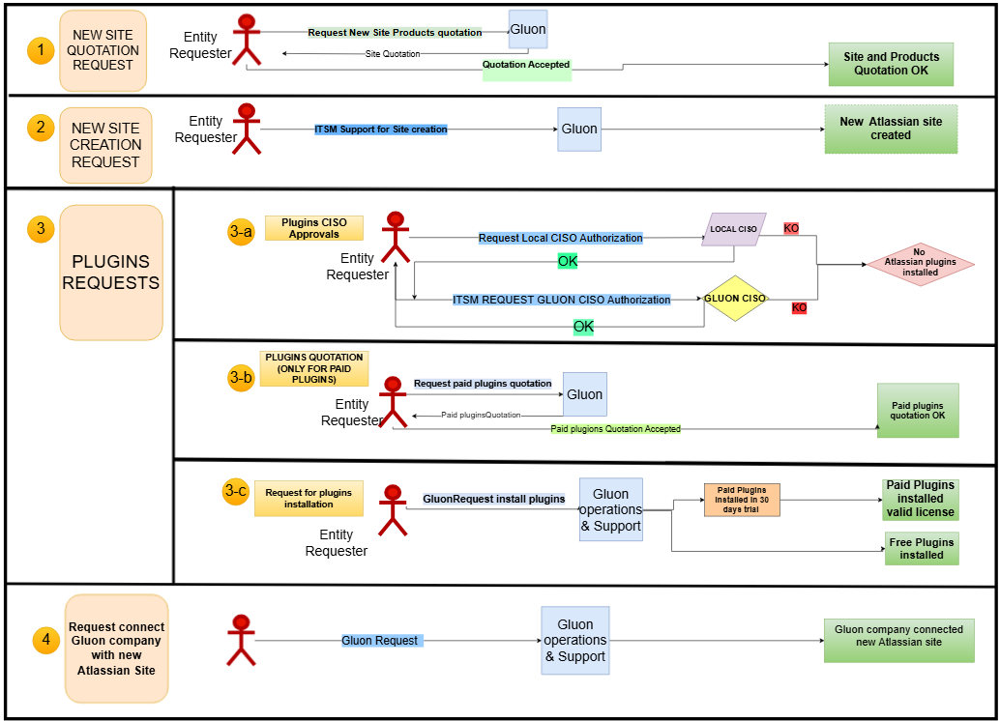

## Introduction

- There is a procedure for requesting a new corporate Atlassian Cloud site (instance), primarily featuring Jira and Confluence. (Steps 1 & 2 ) 
- There is also  a specific procedure for new Atlassian Marketplace apps (plugins) installation requests.(Step 3)  
- Once the new Atlassian site is created, the entity have to request the connection between the existing Gluon Company to the new Atlassian site.(Step 4)   

The entire procedure is outlined below:

1. **Request for new Atlassian site quotation and purchase approval**
    1. Initiate contact with Gluon to begin the purchasing process for Atlassian products and plugins..
        1. ??? info "Gluon contact for quotation"
            [joseig.lopez@gruposantander.com](mailto:joseig.lopez@gruposantander.com)
        2. Fill out the required information in the following excel document to create a new site with products (primarily Jira and Confluence) and send it to the Gluon contacts listed above.
            1. [Template_Basic Data_Operations.xlsx](assets/files/Template_Basic Data_Operations.xlsx){:download="Template_Basic Data_Operations"}
2. **Request for new Atlassian site (instance) creation.**
    1. Requirement: quotation approved in above step 1.
    2. Create a new [Gluon Support Ticket](https://gluon.gs.corp/community/docs/latest/getting-started/support/#create-a-new-support-inc). 
    The entity need to **attach the filled excel in step 1** with the new site details as name, licenses number, Admin users. Detail in ITSM description the **Gluon Organization name and url** etc.
3. **Plugins requests**
    1. **Request CISOs for plugins Authorization**
        1. Only if the entity needs to install plugins (Atlassian Marketplace Apps) in the Atlassian apps (Jira, Confluence) the entity have to previously get the CISOs Authorizations. The steps to follow by the entity are the following:
            1. Contact with the entity **local CISO**.
            2. Contact with **Gluon CISO**
                1. Create a ITSM Request in this Service Now path: [TECHNICAL CATALOG → Cybersecurity → CyberCTO → CISO CTO](https://santander.service-now.com/now/nav/ui/classic/params/target/com.glideapp.servicecatalog_cat_item_view.do%3Fv%3D1%26sysparm_id%3Dced5f3341b1571505ae05532604bcbd0%26sysparm_processing_hint%3Dsetfield%3Arequest.parent%253d%26sysparm_link_parent%3Dadb7c70fdb2eac54cb2d929cd396191b%26sysparm_catalog%3D719aafd0db031f448c6c7cde3b9619f8%26sysparm_catalog_view%3Dcatalog_Technical_Catalog)
                    1. Attach the local CISO authorization.
                    2. Atlassian marketplaces apps (Plugins) names and their **Atlassian Marketplaces Urls** for each one.
    2. **Contact Gluon for paid plugins quotation**
        1. Only for paid plugins. Same Gluon contacts as previous Step 1.
    3. **Request for plugins installation**
        1. **Prerequisite**:  The step 3.a ITSM Request is closed with Gluon CISO authorization
        2. Create a [Gluon Request](https://gluon.gs.corp/community/docs/latest/getting-started/support/#create-a-new-request-req) → **Select in field “Technical App”:  [Atlassian Plugin App](https://gluon.gs.corp/community/docs/latest/getting-started/support/#atlassian-plugin-app)**
            1. **Gluon Request required information:**
                1. ITSM CISO Request number created in step 3.a
                2. Atlassian marketplaces apps (Plugins) names and their **Atlassian Marketplaces Urls** for each one.
                3. Atlassian Site url where install Plugins.
4. **Connect the new site with an existing Gluon company.**
    1. This is the case when the entity already had a Gluon company created and configured with a different Atlassian site. To change the Gluon company Atlassian site to the new one, follow the below steps:
        1. Create a [Gluon Request](https://gluon.gs.corp/community/docs/latest/getting-started/support/#create-a-new-request-req) → Select "Technical App" as  [Portal - Migration Atlassian site](https://gluon.gs.corp/community/docs/latest/getting-started/support/#portal-migration-atlassian-site).
          Prerequisites and needed information:
            1. Gluon Company name and url
            2. Existing Jira Project Template for Gluon: Project Name, URL and key 
                - ???+ note "Prerequisite Jira project template"
                    In case not having the Jira template yet, check the [following documentation](./atlassian-jira-project-template-gluon.md)
            3. Specify in case you need a migration of any Jira project of Confluence space from source Atlassian site to new site .
            ???+ info "Case No needed migration from previous site"
                If migration is not required for any Jira project and Confluence space, please indicate this in the ticket description.
                All Gluon technical applications or company teams, along with any Jira or Spaces created in the source, will be reset in Gluon. 
                This way the entity will be able to create all Jira projects and Confluence spaces regarding each Gluon technical application or company team as new in the new Atlassian site.

            ???+ info "Case needed Review Jira projects migration"
                Jira Cloud to Cloud migration is a complex process. Gluon Support and the relevant entity will need to assess whether it is feasible to proceed with the new site estination site administrators.
                Take into account that all the Jira configuration in source site will be copied to destination new site.
