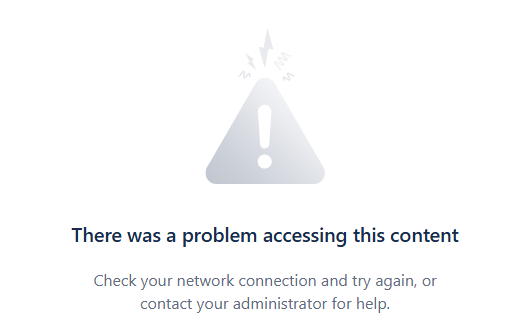

## Introduction

As Atlassian Cloud is a SaaS service, it has to follow all the security Santander CISO requirements

### Atlassian Login with Santander Corporate SSO

In order to login to any Atlassian Cloud App (Jira, Confluence etc) in the corporate instance (or in any Atlassian external instances):<br>
 Users have to complete Atlassian login with corporate Santander SSO.<br>
???+ note
    - It applies to the users whose corporate email domain is verified and their Atlassian account is claimed by the corporate instance.

???+ info "Requirements for SSO login"
    - **User email address domain have to be Santander corporate** and verified in Atlassian corporate and the atlassian user account claimed too.
    - **User must to be member of a Corporate AzureAD Group** related to the Atlassian Cloud integration.<br>
        - This requirement is typically met by being a member of a technical application or company team in any Gluon Company<br>
    - Users have to be **connected to a corporate VPN authorized** to complete SSO<br>

#### How to verify an unverified Email domain

If there is a new corporate email domain that has not been verified by Atlassian Santander, it must be verified in order for users to have proper SSO access to the corporate Atlassian instance.

!!! note
There is a scheduled process that automatically removes licenses from any corporate site (Jira and Confluence) for user accounts with unverified email domains in Atlassian Cloud Santander.
These users cannot activate corporate SSO and are therefore accessing Atlassian Cloud without proper corporate authentication controls.

##### How to proceed to verify a new email domain in Atlassian Corporate Organization

**Prerequisites**:
 You must contact your manager and request the entity team (Network or CISO) that manages your email domain to add the following TXT record to the public DNS of the domain:

```txt
atlassian-domain-verification=TFnmCsLwUj4y/ta3Let8OTUy/LAA0o444LEq1oIvcfzM1/BSJ5jdeeKEkTIkTy/x
```

**Atlassian Domain Verification Request**:
 Once the previous step is completed, you or your manager must create a [Gluon INC Support](https://gluon.gs.corp/community/docs/latest/getting-started/support/#create-a-new-support-inc).
In the request description, specify that you need to verify the domain, claim the user accounts, and activate Atlassian Cloud SSO login.

### Security controls in corporate Atlassian apps sites

#### Atlassian IP allow list

  Only authorized IPs could access to corporate Atlassian sites apps (products) like Jira, Confluence etc.<br>
  Even in case the users have a license in the corporate Atlassian apps, the IP from which the user is accessing to Atlassian Cloud has to be in the Atlassian Authorized IPs.
  Otherwise, the user will receive the following blocking message in the web browser:

???+ info
    In case a user have the above blocking message:<br>
    1. The user needs to check if correctly connected to any corporate VPN.<br>
    2. In case connected to VPN and the problem persists, the user needs to identify their public IP and contact with their manager.<br>
    3. The manager have to request for authorizate the user Public IP or IP range to Local CISO and Gluon CISO<br>
    4. With both CISOs authorizations , the user or manager have to create this type of [Gluon Request](https://gluon.gs.corp/community/docs/latest/getting-started/support/#atlassian-ip-whitelist).<br>
    - 4.1 Reference in the request the prior authorizations from the CISOs and the IP or IPs that need to be added to the corporate Santander Atlassian IP Allow List.<br>
    - 4.2 If the IPs belong to an external product, specify the name of the product and the site where the product needs access.

#### No public content in Atlassian cloud

There are controls to avoid that any content in Jira, Confluence or any other atlassian instance will be set as public.
All content have to be accessed with an corporate Atlassian user account logged with corporate Atlassian Cloud corporate SSO.

#### Prevent create new Atlassian Apps (products) to corporate users

As security control it is not allowed to corporate users using Atlassian accounts with corporate email addresses to create new Atlassian apps ( Jira, Confluence and Trello) outside the corporate Atlassian Cloud santander instance.
Trello is not considered a corporate tool.

This policy applies to both free and paid Atlassian Cloud plans.

This action is part of Santander’s global security requirements for all authorized SaaS tools.

The goal is to prevent corporate users from creating Atlassian products outside the corporate environment, which could bypass important security controls.

#### Atlassian user API Token expiration

[Check the information about token expiration.](./atlassian-api-token-user.md)
