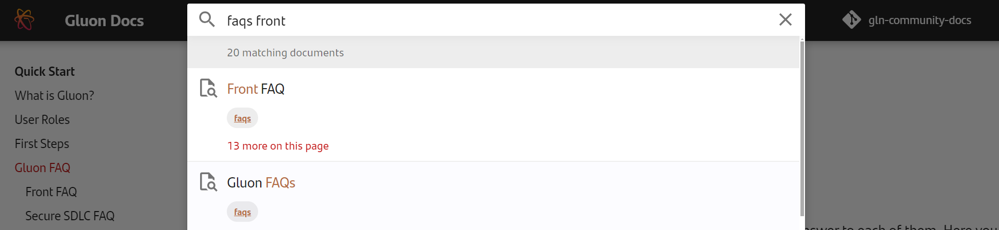
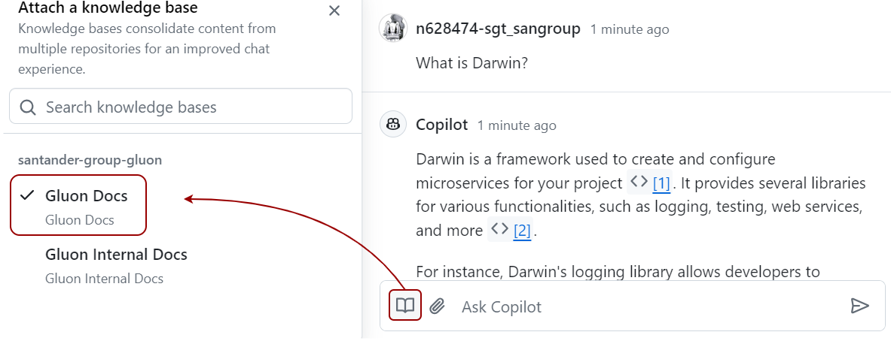
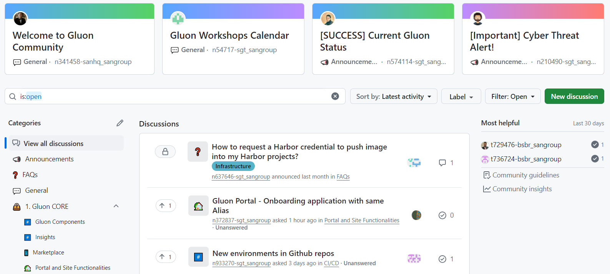

The intention of this section is to collect the most frequently asked questions and provide an answer to each of them.

[Front FAQ](front-faq/index.md) | [Secure SDLC FAQ](ssdlc-faq/index.md)

## 1. Using the search

Use the search box. Type *faqs* and some descriptive words.

{:style="width:70%"}

## 2. Ask Copilot

Using Copilot and attaching the Gluon Docs knowledge base, you can ask questions about Gluon, and it will provide you with the most relevant information.

{:style="width:60%"}

## 3. Ask Gluon Community

[Gluon Community Forum](https://github.com/orgs/santander-group-gluon/discussions){:target="_blank"} is a place where Gluon users and experts share knowledge and resolve questions.

{:style="width:85%"}

## 4. Open a Ticket

If the issue remains, access [Gluon support service](../index.md), and follow the steps to **open an incident or request ticket**.

 
