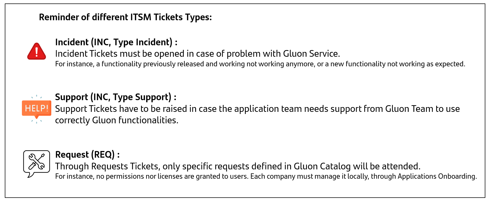
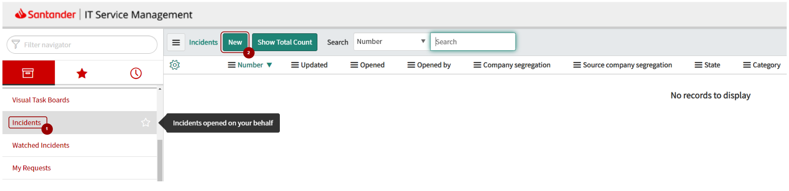
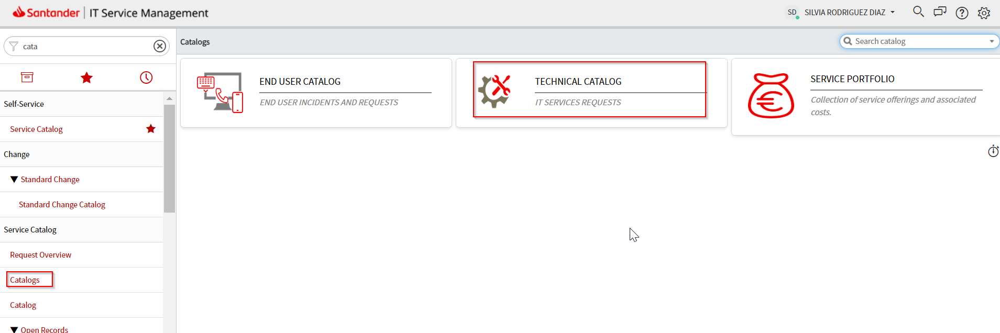
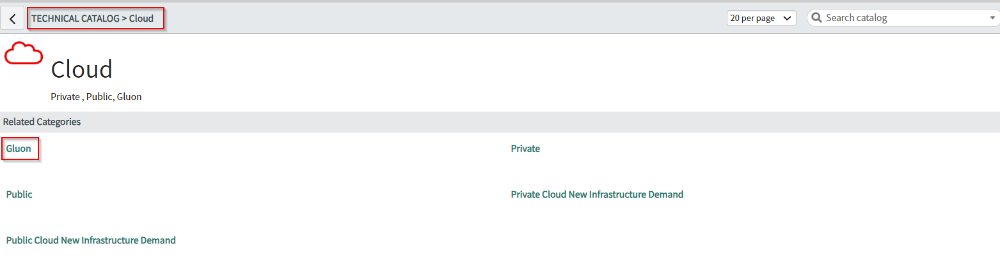
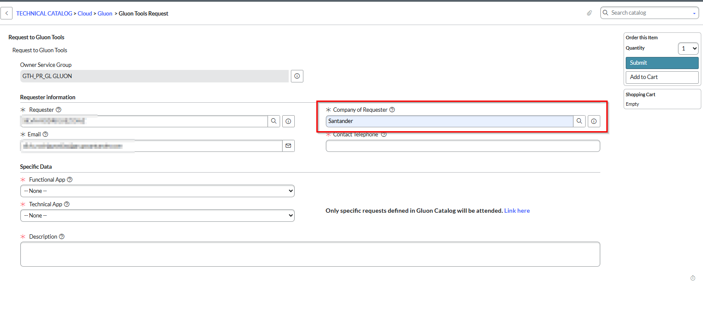
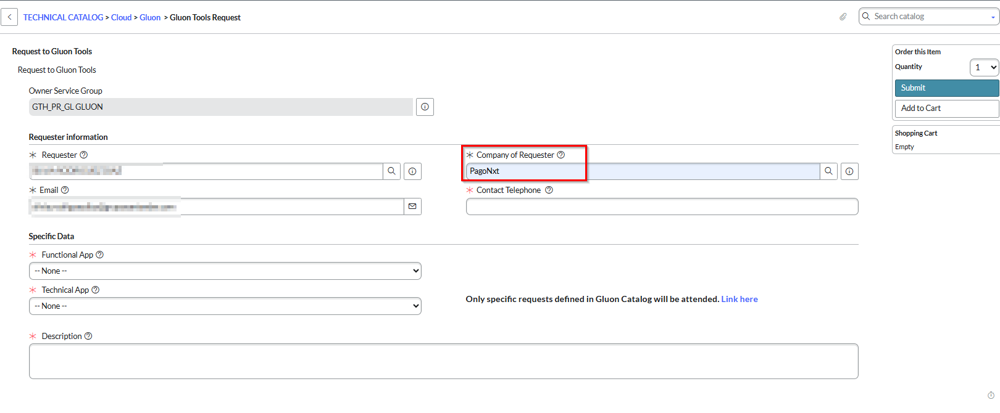

If you have reviewed the documentation and still have a problem with Gluon, in this section you will find help on how to open a **Support Ticket**!

## Types of Support Tickets

There are two types of tickets that can be opened in the official Banco Santander [ITSM Service Now](https://santander.service-now.com) for the Gluon product:

- **Incidents (INC)**: These are tickets that are opened when an incident is found in the Gluon product. These tickets are used to report problems or errors that can occur in the continuous integration cycle.

- **Support (INC)**: These are tickets that are opened when a user need a support in the Gluon product. These tickets are used to help in solving problems, answering questions, or ensuring the proper functioning of the system.

- **Requests (REQ)**: These tickets are used to request actions such as creating a new organization in GitHub, migrating a Confluence instance, or installing a plugin in Jira, among others.

- #### Incidents (INC)

    ---

    [Create a new Incident (INC)](#create-a-new-incident-inc)

- #### Support (INC)

    ---

    [Create a new Support (INC)](#create-a-new-support-inc)

- #### Requests (REQ)

    ---

    [Create a new Request (REQ)](#create-a-new-request-req)

    [Types of requests per Technical Application supported](#types-of-requests-per-technical-application-supported)

---

 

## Create a new Incident (INC)

Into [ITSM Service Now](https://santander.service-now.com) portal, select the option **Incident** from the left menu and then select **New** to open the [Incident Form](https://santander.service-now.com/nav_to.do?uri=%2Fincident.do%3Fsys_id%3D-1%26sys_is_list%3Dtrue%26sys_target%3Dincident%26sysparm_checked_items%3D%26sysparm_fixed_query%3D%26sysparm_group_sort%3D%26sysparm_list_css%3D%26sysparm_query%3Dopened_byDYNAMIC90d1921e5f510100a9ad2572f2b477fe%5EORcaller_idDYNAMIC90d1921e5f510100a9ad2572f2b477fe%5Eactive%3Dtrue%26sysparm_referring_url%3Dincident_list.do%3Fsysparm_query%3Dopened_byDYNAMIC90d1921e5f510100a9ad2572f2b477fe%5EORcaller_idDYNAMIC90d1921e5f510100a9ad2572f2b477fe%5Eactive%3Dtrue%5EEQ%26sysparm_target%3D%26sysparm_view%3D).

??? info "See Navigation Details"

    **1. Select *Incident*** inside the left menu. From Incident options, **select *New***.
    
    <figure markdown>
      
      <figcaption></figcaption>
    </figure>

    ---

    **2. Fill in the mandatory fields** in the incident form.

??? info "SLA for Incidents"

    |**Classification**|**Description**|**Target response time**|**Estimated resolution time (b)**|**Deviation (%) (c)(d)**|
    |:---|:---|:---|:---|:---|
    |**P1 Blocking**|Significant or full loss of service affecting all users and/or application, with no mitigation procedure.|30 min.|4 hours.|2%|
    |**P2 Critical**|Significant or full loss of service affecting all users and/or a significant number of applications, but for which a temporary workaround is available.|1 hour.|24 hours.|2%|
    |**P3 Limited**|Service interruption that affects a rediced group of users and/or a limited nombre of application with limited impact.|1 hour.|48 hours.|5%|
    |**P4 Minor**|Minor service interrumption that does not affect the business. Minor interrumtions that affect one user and/or application.|24 hours.|40 hours.|10%|
    |**P5 User incident**|Service disruption that affects one user and/or and process of Gluon of minor importance.|24 hours.|80 hours.|10%|
    
    - (a) The Customer first fills out a ticket (route and fields to categorize indicent below) using the priorities defined in the table above. Gluon team provides the appropriate support and assessment, and it may be reclassified correctly if necessary.
    The SLAs above only affect Incident type tickets corresponding to the Production environment. Support tickets and Request tickets are not affected.
    - (b) Incident P1, P2, P3 the resolution time will be measured in elapsed hours; Incidents P4 and P5 the resolution will be converted to business hours. These periods do not include:
        * Periods of incidents in non-Gluon teams.
        * Information or solution blocked due to causes beyond the resolving party.
        * Periods of issues in state "pending information from the register".

Once the new incident has been opened, it is necessary to fill in the associated form with the mandatory fields shown in the following table.

|**Field**|**Value**|
|:---|:---|
|`Type`|Incident|
|`Category`|Applications|
|`Subcategory`|Business Applications|
|`Environment`|Production|
|`Application`|Gluon Platform|
|`Assignment group`|GTH_PR_GL GLUON GTH_PR_GL_GLN_GRAVITY (Only Gravity)|

???+ warning

    Ensure all fields are filled out to avoid delays in resolution. Missing information may result in additional follow-ups.
    Please fill out the following template to provide the necessary information for resolving the incident:

    - Summary:  
      [Provide a brief description of the problem being reported.]

    - Recurrence:  
      [Is the issue transient (occurring once), intermittent (occurring irregularly), or permanent (occurring all the time)?]

    - Blocking:  
      [Is it blocking the user? Is it blocking the application? Is it blocking the business?]

    - Last Time It Worked:  
      [Provide the date and time of the last successful operation when the service worked without issues.]

    - Problem:  
      [Describe the problem causing the incident, including any known issues, bugs, or workarounds.]

    - Steps to Reproduce:  
      [Provide a detailed description of the steps taken to reproduce the incident, including specific actions, data used, and any other relevant details.]

    - Evidence:  
      [Attach any screenshots, logs, or other evidence that can help diagnose the incident. Include error messages or other relevant information.]
    
    **Starting June 1st, any issue submitted without using the template will be rejected.**

???+ warning

    **If the category is not available**, a technical application user has to be created for “**GLUON PLATFORM**” application in APM into the application entity. The entity APM administrator needs to be contacted for that.

### On Call Service

Our on-call service operates outside regular business hours to address urgent incidents. You can reach the service via phone or email, providing an incident number for assistance, as follow:

  - Phone: **(+34) 942 98 81 74 / (+34) 942 98 81 75**
  - Email: **<ccsbau@gruposantander.com>**

The Gluon team manages this service, ensuring the on-duty member responds promptly.  
This service focuses on resolving incidents and alerts impacting the service, excluding requests or interventions.  
 

---

 

## Create a new Support (INC)

Into [ITSM Service Now](https://santander.service-now.com) portal, select the option **Incident** from the left menu and then select **New** to open the [Incident Form](https://santander.service-now.com/now/nav/ui/classic/params/target/incident.do%3Fsys_id%3D-1%26sys_is_list%3Dtrue%26sys_target%3Dincident%26sysparm_checked_items%3D%26sysparm_fixed_query%3D%26sysparm_group_sort%3D%26sysparm_list_css%3D%26sysparm_query%3Dopened_byDYNAMIC90d1921e5f510100a9ad2572f2b477fe%5EORcaller_idDYNAMIC90d1921e5f510100a9ad2572f2b477fe%5Eactive%3Dtrue%26sysparm_referring_url%3Dincident_list.do%3Fsysparm_query%3Dopened_byDYNAMIC90d1921e5f510100a9ad2572f2b477fe%5EORcaller_idDYNAMIC90d1921e5f510100a9ad2572f2b477fe%5Eactive%3Dtrue%5EEQ%26sysparm_target%3D%26sysparm_view%3D).

??? info "See Navigation Details"

    **1. Select *Incident*** inside the left menu. From Incident options, **select *New***.
    
    <figure markdown>
      
      <figcaption></figcaption>
    </figure>

    ---

    **2. Fill in the mandatory fields** in the incident form.

Once the new support is been opened, it is necessary to fill in the associated form with the mandatory fields shown in the following table.

|**Field**|**Value**|
|:---|:---|
|`Type`|Support|
|`Category`|Applications|
|`Subcategory`|Business Applications|
|`Environment`|Production|
|`Application`|Gluon Platform|
|`Assignment group`|GTH_PR_GL GLUON|

???+ warning

    Support requests are recommended to be raised through Github Discussions. This allows for community engagement and faster resolution.
    Provide as much detail as possible to ensure your request is understood and addressed efficiently.
    Please fill out the following template to provide the necessary information for resolving the support request:

    - Summary:  
      [Provide a brief description of the support request.]

    - Details:  
      [Describe the issue or question in detail. Include any relevant context or background information.]

    - Expected Outcome:  
      [What are you trying to achieve or resolve with this request?]

    - Priority:  
      [Indicate the urgency of the request: Low, Medium, High, or Critical.]

    - Evidence:  
      [Attach any screenshots, logs, or other supporting materials that can help clarify the request.]
    
    **Starting June 1st, any issue submitted without using the template will be rejected.**

???+ warning

    **If the category is not available**, a technical application user has to be created for “**GLUON PLATFORM**” application in APM into the application entity. The entity APM administrator needs to be contacted for that.
---

## Create a new Request (REQ)

???+ warning

    Open a request only for those cases that are listed in the [Supported Technical Applications](#types-of-requests-per-technical-application-supported) listed below. **Any request not listed in the request catalog will be canceled.**

In order to open a request, access to the Technical Catalog of ITSM, as follows:

[TECHNICAL CATALOG → Cloud → Gluon → Gluon Tools Request](https://santander.service-now.com/com.glideapp.servicecatalog_cat_item_view.do?v=1&sysparm_id=3b26f0ed1b8f61945ae05532604bcba6&sysparm_processing_hint=setfield:request.parent%3d&sysparm_link_parent=257db34f1bf2a510e4909753b24bcb38&sysparm_catalog=719aafd0db031f448c6c7cde3b9619f8&sysparm_catalog_view=catalog_technical_catalog)

??? info "See Navigation Details"

    **1. Select *Catalog*** inside the left menu. From Catalog options, **select *TECHNICAL CATALOG***.
    
    <figure markdown>
      
      <figcaption></figcaption>
    </figure>

    ---

    **2. Click on *Cloud*** link inside *Technical Catalog* menu.

    <figure markdown>
      
      <figcaption></figcaption>
    </figure>

    ---

    **3. Click on  *Gluon  Tools Request*** inside *Cloud* menu. 

    <figure markdown>
      
      <figcaption></figcaption>
    </figure>

??? info "SLA for Requests"

    |**Classification**|**Description**|**Target response time**|**Estimated resolution time (b)**|**Deviation (%) (c)(d)**|
    |:---|:---|:---|:---|:---|
    |**Request**|Ation needed for the use of Gluon platform based on a catalog of predefined actions, not associated with incident.|24 hours.|80 hours.|10%|
    
    This service of resolution of requests to Entities will be provided during business days (8x5), from 09:00 to 17:00 (Madrid time). Resolution time will be measured in business hours.

Once the new request has been opened, it is necessary to fill in the associated form with the mandatory fields shown in the following table.

Only specific requests defined in Gluon Catalog will be attended.

|**Field**|**Value**|
|:---|:---|
|`Email`| Santander Group corporate email|
|`Company`| Company of user|
|`Functional App`| Gluon Request|
|`Technical App`| Select the request|
|`Description`| Description|

 

### Types of requests per Technical Application supported

The request is selected from the ***Technical App*** drop-down list of the request form.
Only specific requests defined in Gluon Catalog will be attended.

#### Atlassian - Change the space/project of an application

Type of requests for Atlassian - Change the space/project of an application

|Request Type |Action |Information Required |
| ----------- | ------------------------------------ |------------------------------------ |
|Change the space/project of an application |To change the Confluence space or Jira project for an application in Gluon |It is necessary to attach the OK from the Application Owner |

#### Atlassian - Data Copy Sandbox

Type of requests for Atlassian - Data Copy Sandbox

|Request Type |Action |Information Required |
| ----------- | ------------------------------------ |------------------------------------ |
|Data Copy Sandbox |To copy data from source Production Atlassian App to destination Sandbox environment. IMPORTANT: There is unavailability of the destination sandbox environment during the data copy process.  Allowed requesters:  Atlassian site administrators / Gluon company owners.| Information Required: URL App site product (Jira url / Confluence url). Copy with attachments (Yes/No). Desired start time for the copy or time interval during which the copy can be performed.|

#### Atlassian - IP Whitelist

Type of requests for Atlassian - IP Whitelist

|Request Type |Action |Information Required |
| ----------- | ------------------------------------ |------------------------------------ |
|IP Whitelist |To add a brand-new IP / Range in Atlassian IP Whitelist |It is necessary to attach the LOCAL CISO and GLUON CISO Authorization.  Requester  had to open a ticket to GLUON CISO in  [TECHNICAL CATALOG →  Cybersecurity →  CyberCTO →  CISO CTO](https://santander.service-now.com/now/nav/ui/classic/params/target/com.glideapp.servicecatalog_cat_item_view.do%3Fv%3D1%26sysparm_id%3Dced5f3341b1571505ae05532604bcbd0%26sysparm_processing_hint%3Dsetfield%3Arequest.parent%253d%26sysparm_link_parent%3Dadb7c70fdb2eac54cb2d929cd396191b%26sysparm_catalog%3D719aafd0db031f448c6c7cde3b9619f8%26sysparm_catalog_view%3Dcatalog_Technical_Catalog) |

#### Atlassian - Plugin App

Type of requests for Atlassian - Plugin App

|Request Type |Action |Information Required |
| ----------- | ------------------------------------ |------------------------------------ |
|Plugin App |To install plugin in Jira or Confluence SaaS. It is necessary to attach the LOCAL CISO and GLUON CISO Authorization for the App. Who can to request Atlassian Product App (plugin-in): Self-Managed Atlassian Sites: Atlassian Focal Point or Capacity to manage costs in the local entity. Full managed Atlassian sites: sanes: any user that have ok from methodology team in a ticket in: Soporte JIRA Board. |It is necessary to attach the LOCAL CISO and GLUON CISO Authorization.  Requester  had to open a ticket to GLUON CISO in  [TECHNICAL CATALOG →  Cybersecurity →  CyberCTO →  CISO CTO](https://santander.service-now.com/now/nav/ui/classic/params/target/com.glideapp.servicecatalog_cat_item_view.do%3Fv%3D1%26sysparm_id%3Dced5f3341b1571505ae05532604bcbd0%26sysparm_processing_hint%3Dsetfield%3Arequest.parent%253d%26sysparm_link_parent%3Dadb7c70fdb2eac54cb2d929cd396191b%26sysparm_catalog%3D719aafd0db031f448c6c7cde3b9619f8%26sysparm_catalog_view%3Dcatalog_Technical_Catalog)  |

#### GitHub - GitHub App / Allow Actions

Type of requests for GitHub - GitHub App / Allow Actions

|Request Type |Action |Information Required |
| ----------- | ------------------------------------ |------------------------------------ |
|GitHub App / Allow Actions|To manage a GitHub App in a GLUON Organization or to include an allow Actions. |GLUON CISO Authorization. Requester  had to open a ticket to GLUON CISO in  [TECHNICAL CATALOG →  Cybersecurity →  CyberCTO →  CISO CTO](https://santander.service-now.com/now/nav/ui/classic/params/target/com.glideapp.servicecatalog_cat_item_view.do%3Fv%3D1%26sysparm_id%3Dced5f3341b1571505ae05532604bcbd0%26sysparm_processing_hint%3Dsetfield%3Arequest.parent%253d%26sysparm_link_parent%3Dadb7c70fdb2eac54cb2d929cd396191b%26sysparm_catalog%3D719aafd0db031f448c6c7cde3b9619f8%26sysparm_catalog_view%3Dcatalog_Technical_Catalog). Name GitHub App / Actions to include. Organization where it will be created (both). Webhook (GitHub App). Permissions (GitHub App). Organizations where it will be installed (GitHub App). Justification (both). Owner (is responsible for use, maintenance and certificates) |

#### GitHub - IP Whitelist

Type of requests for GitHub - IP Whitelist

|Request Type |Action |Information Required |
| ----------- | ------------------------------------ |------------------------------------ |
|IP Whitelist|To add a IP / Range in the IpAllowList of the Github.com Enterprise account.|It is necessary to attach the LOCAL CISO and GLUON CISO Authorization.  Requester  had to open a ticket to GLUON CISO in  [TECHNICAL CATALOG →  Cybersecurity →  CyberCTO →  CISO CTO](https://santander.service-now.com/now/nav/ui/classic/params/target/com.glideapp.servicecatalog_cat_item_view.do%3Fv%3D1%26sysparm_id%3Dced5f3341b1571505ae05532604bcbd0%26sysparm_processing_hint%3Dsetfield%3Arequest.parent%253d%26sysparm_link_parent%3Dadb7c70fdb2eac54cb2d929cd396191b%26sysparm_catalog%3D719aafd0db031f448c6c7cde3b9619f8%26sysparm_catalog_view%3Dcatalog_Technical_Catalog)  |

#### GitHub - Local Configuration

Type of requests for GitHub - Local Configuration

|Request Type |Action |Information Required |
| ----------- | ------------------------------------ |------------------------------------ |
|Local Configuration | To change the local configuration in a GitHub.com organization | Organization and configuration to change |

#### GitHub - Runner - New Technology

Type of requests for GitHub - Runner - New Technology

|Request Type |Action |Information Required |
| ----------- | ------------------------------------ |------------------------------------ |
|Runner - New Technology | To evaluate and add a new technology in Gluon runners | Organization and technology |

#### JFrog - Config Repository

Type of requests for JFrog - Config Repository  
[Introduction - Gluon Docs](https://gluon.gs.corp/community/docs/latest/getting-started/company-management/technical-requirements/jfrog/introduction/#repositories)

|Request Type |Action |Information Required |
| ----------- | ------------------------------------ |------------------------------------ |
|Config Repository |To create, update or delete a repository inside a project/entity in jfrog or to configure cleanups policies |Entity name, Technology and Type (release/rc/snapshot) for repositories. Select conditions for cleanup policies, delete by age, number of artifacts to retain |

#### JFrog - Contributor Group creation/modification

Type of requests for JFrog - Contributor Group creation/modification  
[Onboarding Entities - Gluon Docs](https://gluon.gs.corp/community/docs/latest/getting-started/company-management/technical-requirements/jfrog/onboard/#using-other-integrations-outside-github)

|Request Type |Action |Information Required |
| ----------- | ------------------------------------ |------------------------------------ |
|Contributor Group creation/modification |To create a group for applications no GitHub (for example Cloudbees) It will contain service users with contributor role. To add service user to Contributor Groups |Entity name, Company Owner OK |

#### JFrog - Onboarding

Type of requests for JFrog - Onboarding  
[Onboarding Entities - Gluon Docs](https://gluon.gs.corp/community/docs/latest/getting-started/company-management/technical-requirements/jfrog/onboard/)

|Request Type |Action |Information Required |
| ----------- | ------------------------------------ |------------------------------------ |
|Onboarding |To create, update or delete custom roles | Azure Group to bind and role to become |

#### JFrog - Uploading Third-Party Artifact

Type of requests for JFrog - Uploading Third-Party Artifact  
[Uploading Third-Party Artifacts to JFrog](https://gluon.dev.corp/internal/docs/latest/platform/security/third_party/)

|Request Type |Action |Information Required |
| ----------- | ------------------------------------ |------------------------------------ |
|Uploading Third-Party Artifact | To upload third-party artifact to Jfrog | Risk assessment documentation from the third-party provider, local CISO approval (Mandatory), Gluon CISO approval ([TECHNICAL CATALOG →  Cybersecurity →  CyberCTO →  CISO CTO](https://santander.service-now.com/now/nav/ui/classic/params/target/com.glideapp.servicecatalog_cat_item_view.do%3Fv%3D1%26sysparm_id%3Dced5f3341b1571505ae05532604bcbd0%26sysparm_processing_hint%3Dsetfield%3Arequest.parent%253d%26sysparm_link_parent%3Dadb7c70fdb2eac54cb2d929cd396191b%26sysparm_catalog%3D719aafd0db031f448c6c7cde3b9619f8%26sysparm_catalog_view%3Dcatalog_Technical_Catalog)), valid business justification for the artifact upload |

#### Nexus - Config Repository

Type of requests for Nexus - Config Repository

|Request Type |Action |Information Required |
| ----------- | ------------------------------------ |------------------------------------ |
|Config Repository|To config repository, example: to create a new hosted repository to store common technology  artifacts or to create a proxy that points to a new artifact repository.||

#### Nexus - Artifact Upload

Type of requests for Nexus - Artifact Upload

|Request Type |Action |Information Required |
| ----------- | ------------------------------------ |------------------------------------ |
|Artifact Upload|To Artifact Upload to Nexus.|Artifact and coordinates (groupId, artifactId and version)|

#### Portal - Audit Information

Type of requests for Portal - Audit Information

|Request Type |Action |Information Required |
| ----------- | ------------------------------------ |------------------------------------ |
|Audit Information|To request audit information from Gluon main operations.|The request must be submitted by the Company Owner or the Gluon Champion. The request should clearly state the reasons why the information is needed.|

#### Portal - Authorize local Template

Type of requests for Portal - Authorize local Template

|Request Type |Action |Information Required |
| ----------- | ------------------------------------ |------------------------------------ |
|Authorize local Template|To authorize a local template in a different company|Ok from Origin Company Owner and Destination Company Owner|

#### Portal - Change visibility Local/Global Template

Type of requests for Portal - Change visibility Local/Global Template

|Request Type |Action |Information Required |
| ----------- | ------------------------------------ |------------------------------------ |
|Change visibility Local/Global Template|To modify the visibility of a template (local/global)|Template, visibility and OK from the template owner|

#### Portal - Cluster Onboarding

Type of requests for Portal - Cluster Onboarding

|Request Type |Action |Information Required |
| ----------- | ------------------------------------ |------------------------------------ |
|Cluster Onboarding|To add new clusters and harbors and the relationship between them in GLUON||

#### Portal - Management Company Owner

Type of requests for Portal - Management Company Owner

|Request Type |Action |Information Required |
| ----------- | ------------------------------------ |------------------------------------ |
|Management Company Owner|To add, delete or update a Company Owner|It is necessary the OK of a person with the role Company Owner|

#### Portal - Migration Atlassian site

Type of requests for Portal - Migration Atlassian site

|Request Type |Action |Information Required |
| ----------- | ------------------------------------ |------------------------------------ |
|Migration Atlassian site| Request to change a Gluon company configuration to connect it  from predefined Atlassian site to a different new Atlassian Site Jira and Confluence products|Gluon company name and url to change Atlassian site configuration.   **Jira**: Atlassian new site Jira url, new Jira project Template key and url (Assure you have configured all Gluon needed Roles and assigned to project Template permissions scheme). Indicate if  you need some Jira project Migration. Need to specify the project name and Gluon application/ company team connected. Needed to review deeply with new Jira local Admins as Jira migration is a complex process that will copy all the source Jira project config to destination new Jira.   **Confluence**: Atlassian new site Confluence url. Specify if you need to migrate to the new Confluence some Confluence spaces in the source Confluence and the Gluon company technical app or company team associated|

#### Portal - New Company

Type of requests for Portal - New Company

|Request Type |Action |Information Required |
| ----------- | ------------------------------------ |------------------------------------ |
|New Company|To create a new Company in Gluon|It is necessary the OK of Gluon Champion, name of company in ITSM, organization in GitHub.com, Atlassian instance, Atlassian template, Jira team, Confluence team, cost center, copilot team, owners in Gluon. |

#### Portal - User Migration

Type of requests for Portal - User Migration

|Request Type |Action |Information Required |
| ----------- | ------------------------------------ |------------------------------------ |
|User Migration|To migration user in Gluon | uid and email |

#### Testing - Cluster Onboarding

Type of requests for Testing - Cluster Onboarding

|Request Type |Action |Information Required |
| ----------- | ------------------------------------ |------------------------------------ |
|Cluster Onboarding|To register or update any cluster on which the test infrastructure will be deployed||

#### Testing - Namespace Onboarding

Type of requests for Testing - Namespace Onboarding

|Request Type |Action |Information Required |
| ----------- | ------------------------------------ |------------------------------------ |
|Namespace Onboarding|This type of request consists of registering or associating a gluon application with the namespaces of the clusters in which the test infrastructure can be created||

### Requests exclusive Santander

These requests is exclusive Santander and in the field Company of Requester the value has to be Santander

#### Atlassian - Project Management

Type of requests for Project Management, this request is exclusive Santander and Methodology team

|Request Type |Action |Information Required |
| ----------- | ------------------------------------ |------------------------------------ |
|Project Management |New Jira Project or Confluence Space |Indicate the Jira Project name and key or Space Confluence name and key |

#### Atlassian - Licensing Management

Type of requests for Licensing Management, this request is exclusive Santander

|Request Type |Action |Information Required |
| ----------- | ------------------------------------ |------------------------------------ |
|Licensing Management |New user license in sanes Jira or Confluence |User id and user mail |

#### Atlassian - Permissions Management

Type of requests for Project Management, this request is exclusive Santander

|Request Type |Action |Information Required |
| ----------- | ------------------------------------ |------------------------------------ |
|Permissions Management |To grant user access to a Jira Project and/or Confluence Space in sanes instance |User id, user mail, Jira Project and/or Confluence Space |

#### Atlassian - PAPs

Type of requests for PAPs (Pases a Producción), this request is exclusive Santander and Methodology team

|Request Type |Action |Information Required |
| ----------- | ------------------------------------ |------------------------------------ |
|PAP |To apply configuration changes in production.  |Associated documentation with the detailed changes to apply in sanes Jira or Confluence configuration  |

### Request exclusive PagoNxt

This request is exclusive PagoNxt and in the field Company of Requester the value has to be PagoNxt

#### Atlassian - Account unclaim

Type of requests for Project Management, this request is exclusive PagoNxt

|Request Type |Action |Information Required |
| ----------- | ------------------------------------ |------------------------------------ |
|Account unclaim |Atlassian unclaim accounts |File excel or with extension csv with user id and user mail with users that unclaim account in Atlassian |
