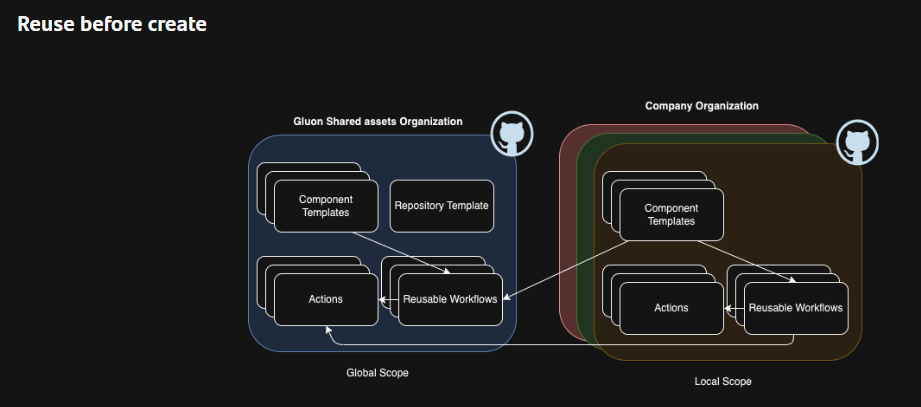
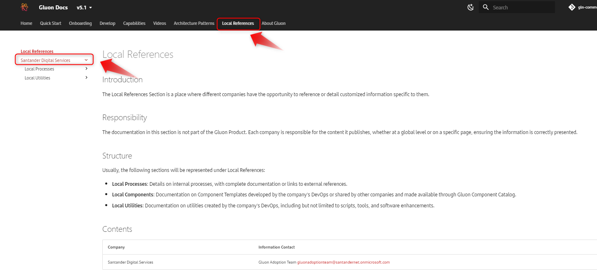
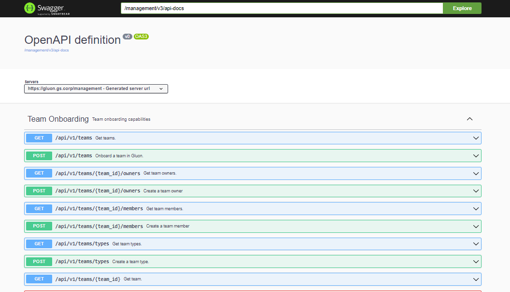
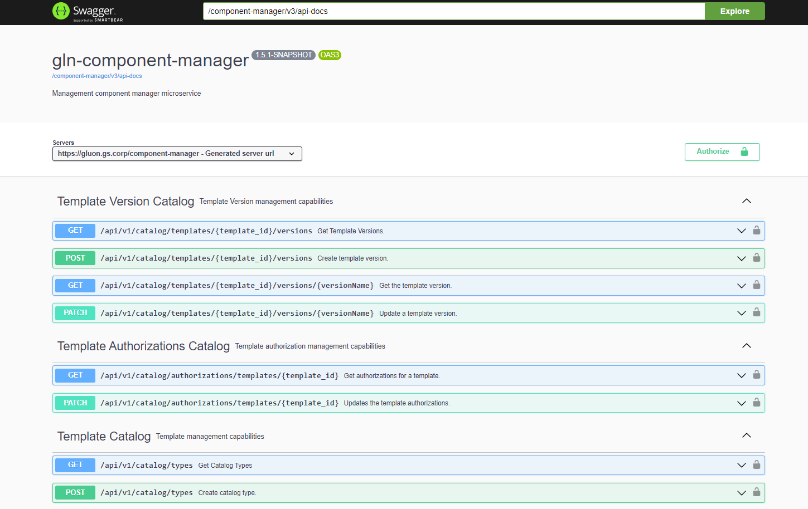
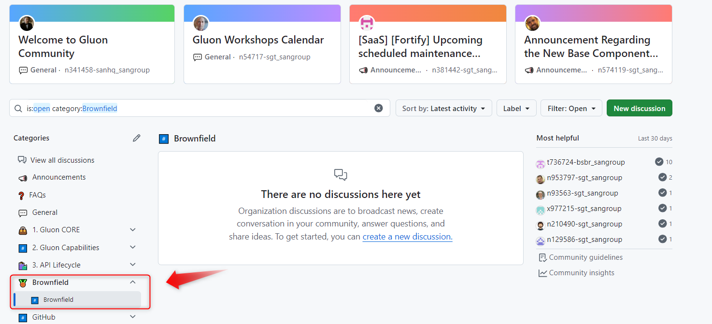
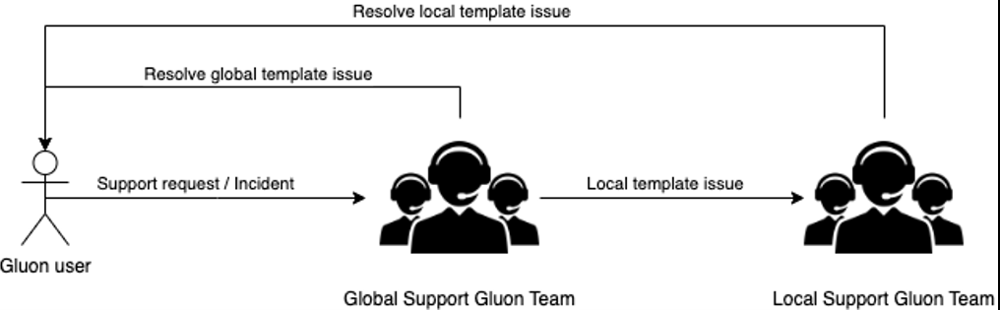
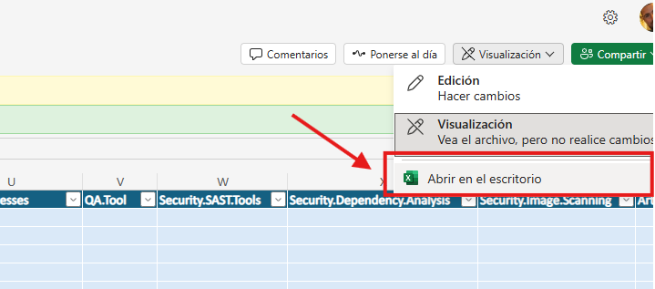

# Migrate Your Brownfield to Gluon

## Purpose

Welcome to the Gluon Brownfield documentation! This guide provides useful links and documentation to help you migrate your brownfield projects to Gluon.

Below, you will find resources on various topics, including integrating tools, best practices, and support models.

## Base Component Template

The Base Component Template (BCT) is the foundation that allows entities within Gluon to create their own templates.
This milestone enables each entity to autonomously build its own template catalog, facilitating the migration of all local software into the Gluon ecosystem.

### What Can This Component Do for You?

- **Create and Offer Templates**: Allows you to create your own templates and offer them to your users in the Gluon catalog.
- **Use Custom Workflows and Actions**: Enables you to use your own workflows and actions. You can create your own workflow and actions component template (Gluon will provide these templates in upcoming releases).
- **Automatic Onboarding**: Automatically onboard the component into quality and security tools.
- **Cataloging in APM**: Automatically catalog the components in APM linked to the technical application.

### Documentation Link

For more detailed information, please refer to the documentation: [Base Component Template Documentation](../../contribute/base-component-template/index.md)

## Runner Documentation

To operate on GitHub.com with your local component catalog, you will need to use either the ephemeral runner catalog provided by Gluon or build and configure your own ephemeral runners if the provided ones do not meet your needs.

### Useful Links

- **Ephemeral Runner Architecture in Gluon**: Learn about the architecture of ephemeral runners within Gluon: [Ephemeral Runner Architecture](../../getting-started/company-management/technical-requirements/ephemeral-runners/index.md)
- **Build and Configure Your Own Ephemeral Runners**: Find information on the development process required to make your ephemeral runners available within Gluon: [Build and Configure Ephemeral Runners](../../getting-started/company-management/technical-requirements/ephemeral-runners/adoption-process/index.md)
- **Gluon Ephemeral Runner Catalog**: View information about the tools and versions installed in the Gluon runner catalog to decide if they meet your local template needs: [Gluon Runner Catalog](../../getting-started/company-management/technical-requirements/ephemeral-runners/flavours.md)

## Gluon Workflow and Actions Catalog

To operate with your local templates, they need to be integrated with GitHub.com. We provide a catalog of actions and workflows that you can use for your future components.

- **Gluon Reusable Workflows**: [Gluon Reusable Workflows](https://github.com/orgs/santander-group-shared-assets/repositories?q=topic%3Aworkflow)
- **Gluon Reusable Actions**: [Gluon Reusable Actions](https://github.com/orgs/santander-group-shared-assets/repositories?q=topic%3Aaction)

## Documenting in Gluon Docs

The Base Component Template allows you to link documentation from the portal to your local components. You will have a section within Gluon Docs where you can generate documentation for both your local processes and utilities.

For more information on the contribution process to Gluon Docs, please refer to: [Gluon Docs Contribution Process](../../contribute/cop/gluon-docs/contribution-process/contributor-journey.md)

## Consuming Gluon APIs for Automation

If you are an experienced developer and want to automate your internal onboarding processes, here is the Swagger documentation for the Gluon APIs.

To work with the Gluon APIs, you need to be logged into the Gluon Portal.

### Management Swagger API Documentation

With this API, you will have methods that allow you to operate with functions related to company level, applications, teams, etc.

Access the following URL:

[Management Swagger API Documentation](https://gluon.gs.corp/management/swagger-ui/index.html)

### Component Manager Swagger API Documentation

In this section, you will find all the methods related to the management of templates and components within Gluon.

Access the same URL:

[Management Swagger API Documentation](https://gluon.gs.corp/management/swagger-ui/index.html)

However, in this case, append the following to the URL in your browser: `/component-manager/v3/api-docs`

## Create a Repository Directly on GitHub

A ruleset is being defined in the GitHub organizations of Gluon to allow the **creation of repositories directly from the interface**, without needing to be registered within Gluon.

The goal is to facilitate **agile and efficient** testing of various developments required for the adoption of our brownfield projects in Gluon, such as actions or workflows.

However, to ensure that Gluon can identify these repositories, they must have the prefix **"test-".**

## Brownfield Community

Within the current forum we have in Gluon for functional queries, we have opened a new category to share questions, experiences, best practices, or any points related to brownfield adoption within Gluon.
In this section you will also find the list of contacts for each entity.

Here is the link: [Brownfield Community Forum](https://github.com/orgs/santander-group-gluon/discussions/categories/brownfield)

## Brownfield Support Model

For any problem related with Gluon, final users must raise a ticket to Gluon Support Team. See [Support Section](../../getting-started/support/index.md)

In case the problem is related with a Local Template or asset, the ticket will be redirected to the correct entity support team.

And in case the problem is actually related with a global asset, support teams will sync to have the problem solved.

## Brownfield Local Templates

> :warning: **Important**: If you want to edit the file to complete the cataloging information for your local template, **you need to open the Excel file locally**.
> This is because the file requires running a Visual Basic script that concatenates multiple elements from each list in the cataloging into a single field.

> :warning: **Check the list of Local Templates**. Don’t create new ones for existing technologies without checking first with the other entities if any of the already existing templates could be of your interest.

Here is the link: [List of Local Templates](https://santandernet.sharepoint.com/:x:/s/gluoncommunity103/EV_-8NGAXpxHhI39sqkWfO4BKw5djeJpLNejD8CSnmpsRg?e=Mtpygq)

## Consume Global & Local Templates (New)

Here is a report, updated monthly, that provides the consumption details by entity for each of the global and local templates available in Gluon.

Here is the link: [Consume Global & Local Templates](https://santandernet.sharepoint.com/:x:/s/gluoncommunity103/EZzol-6_Dv1Nihzf1ZAFWNAByK8Dk03Qzmxf9Jw3QxyAfQ?e=QkTCgp)

 
