# **Gluon Requirements System**

## **Overview**

The **Gluon Requirements System** is a collaborative platform for collecting, evaluating, and tracking business and technical requirements across all Gluon entities.
It enables transparent, structured feedback directly within GitHub issues, automates status and prioritization, and provides daily reporting and interactive dashboards for all stakeholders.

## **Key Features**

- Structured, entity-based feedback on requirements (GitHub issues)
- Automated scoring, status, and prioritization
- Interactive web dashboard with real-time analytics
- Gamification and participation tracking

## **Technical Architecture**

- **Repository:** All requirements are included as issues in the [Gluon Requirements Repository](https://github.com/santander-group-gluon/gln-adoption-entities/issues).
- **GitHub Project:** All requirements are managed within the [Gluon Requirements Project](https://github.com/orgs/santander-group-gluon/projects/97/views/1).
- **Requirement Issue Template:** Entities use a markdown template to submit their requirements to Gluon.
- **Feedback Issue Template:** Entities use a markdown template to provide structured feedback as comments.
- **Automation Scripts:** Automation scripts calculate scores and generate reports daily at 5:00 AM CET (Central European Time).
- **Web Dashboard:** An interactive dashboard is published via GitHub Pages for real-time analytics and navigation.

## **How to Open a New Requirement**

If you need to propose a new requirement for Gluon, you must open a new issue so it can go through the complete demand management process.

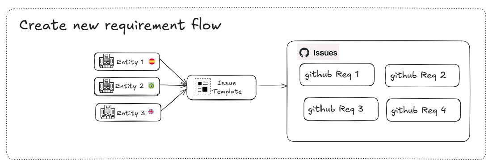

### Step 1: Access the Repository

- Go to: [Gluon Requirements Issues](https://github.com/santander-group-gluon/gln-adoption-entities/issues)
- Log in with your GitHub account.

### Step 2: Open a New Issue in the Repository

- Click on "New Issue" and select the "Requirement Issue" template.

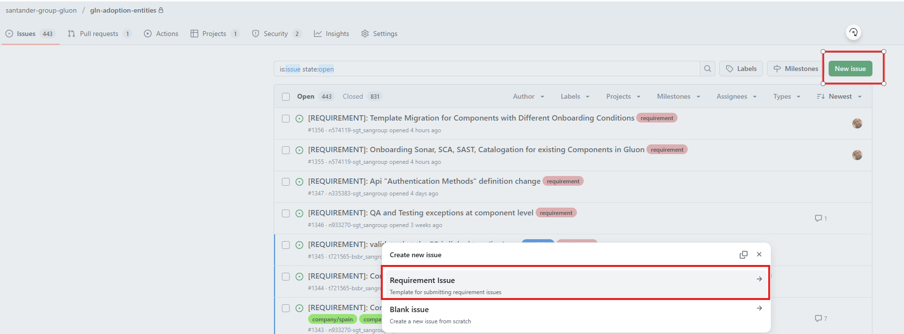

### Step 3: Complete Mandatory Information

- Fill in all fields marked as mandatory in the issue template.

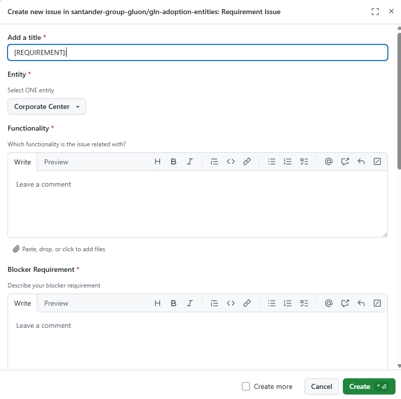

## **Web Dashboard User Guide**

The Gluon Requirements Web Dashboard provides a comprehensive and interactive view of all requirements,
feedback, and participation across entities. This guide will help you navigate and make the most of the dashboard
features. For each section, you can later add screenshots or visual evidence as needed.

### **Features**

- Summary statistics, entity ranking, and a requirements table with filters and sorting
- Status icons (🟢, 🔴, ⚠️, ⭐) always visible
- Click any requirement for full feedback details
- CSV export and quick navigation

### **1. Accessing the Dashboard**

- Open the dashboard at: [Gluon Requirements Feedback](https://santander-group-gluon.github.io/gln-adoption-entities/)
- The dashboard is accessible from any modern browser and does not require authentication.

<!-- [Add screenshot: Dashboard Home] -->

### **2. Navigation Menu & Summary Section**

- The top navigation bar allows you to quickly jump to key sections: Summary, Entities, Requirements, Pending Feedback, and Legend.
- Displays the total number of requirements and total feedback received.

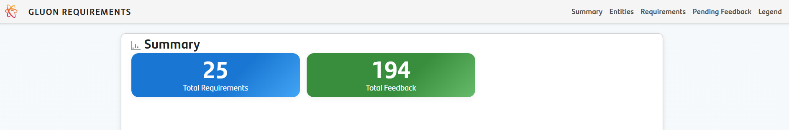

### **3. Entities Ranking**

- Shows a ranking of all entities based on their feedback participation.
- Medals (🥇, 🥈, 🥉) are awarded to the top three entities.
- A table lists all entities and their feedback count.
- A bar chart visualizes participation distribution.

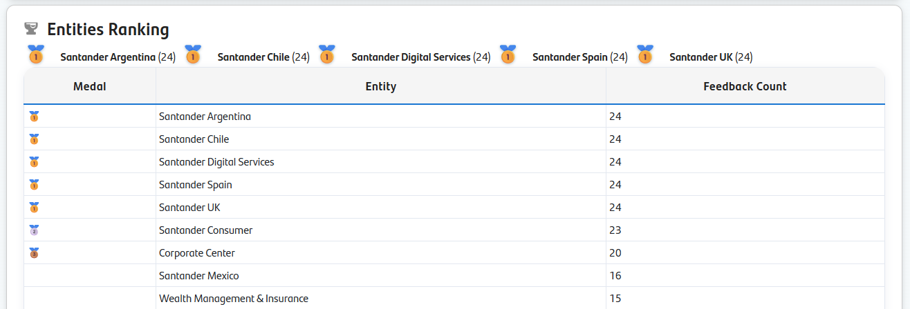

### **4. Requirements Table**

- Lists all requirements with key information: GitHub ID, Title, Status, Column, Total Feedback, Positive Feedback, Score, and quick links to GitHub and feedback details.
- Status icons indicate requirement state (Accepted, Not Accepted, Needs Attention, Consistent Feedback).
- You can filter requirements by Entity, Status, Column, or GitHub ID.
- Click on any column header to sort the table.
- Use the "Export CSV" button to download the filtered requirements as a CSV file.
- Click the "people" icon to view detailed feedback for a requirement in a modal window.

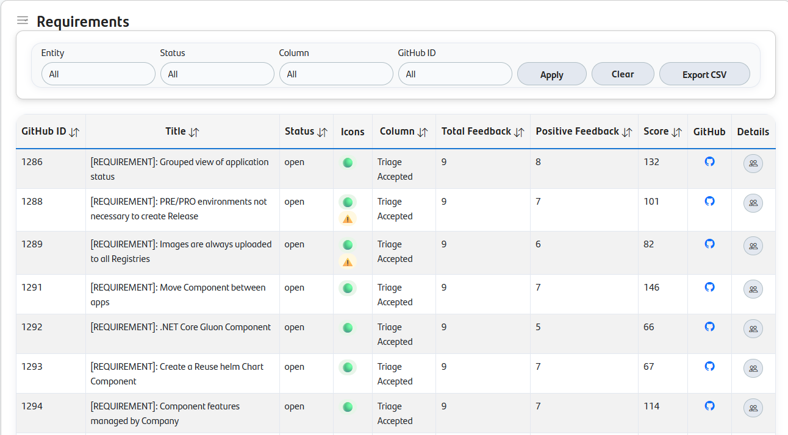

### **5. Pending Feedback**

- Shows which entities have not yet provided feedback for each requirement.
- The table lists entities and the corresponding pending issues (with direct links).
- Use this section to identify gaps in participation and follow up as needed.
- The "Copy Template" button allows you to copy the feedback template for easy use.

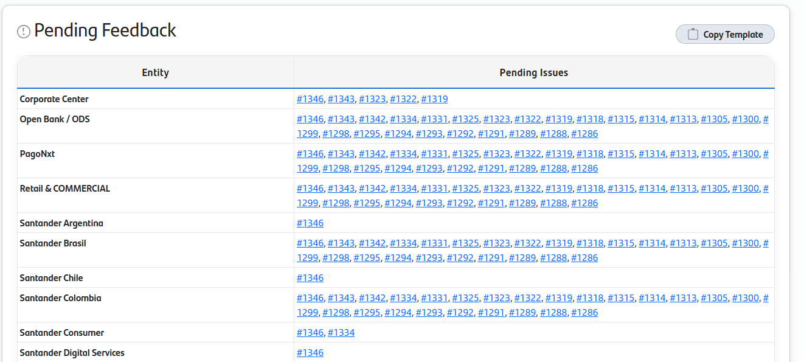

### **6. Legend & Useful Links**

- Explains the meaning of all icons, medals, and status indicators used throughout the dashboard.
- Provides quick access to the Markdown report, JSON data, GitHub Project, and Requirements Issues.

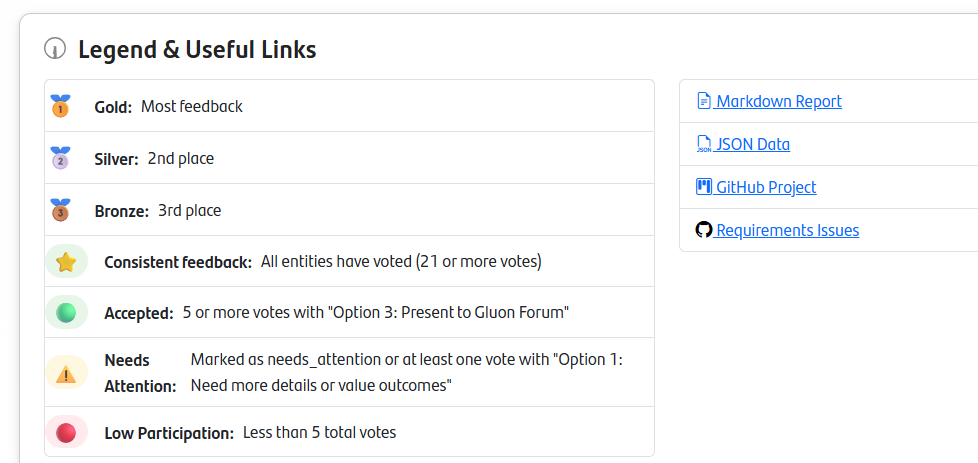

## **Requirements Feedback Process**

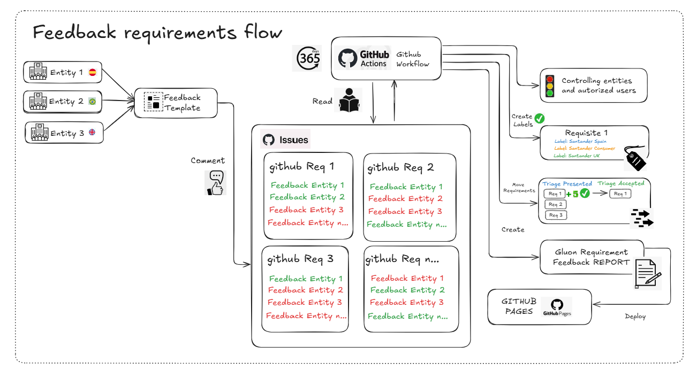

### **Introduction**

A daily automated process ensures that the feedback workflow remains up to date. As illustrated above, this process performs the following high-level actions:

1. Verifies that feedback on each requirement is submitted by an authorized user from a valid entity. If these conditions are not met, the comment is edited to notify the user and explain why their feedback was removed.
2. If an entity provides positive feedback, a label for that entity is added to the requirement. If a requirement has a label for an entity whose latest feedback is not positive, the label is removed.
3. Requirements with more than 5 positive votes are automatically moved from "Triage Presented" to "Triage Accepted".
4. The process updates all information displayed in the demand management dashboard.

### **Pre-Requisites**

Only users included in the authorized list are permitted to provide feedback on requirements. If a user is not authorized, their feedback will be automatically removed by daily processing scripts.

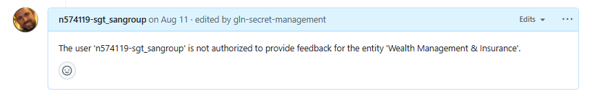

By default, the Gluon Champions for each entity have been added as authorized users. If you need to add new users, please contact your Gluon Champion, who will coordinate with the Adoption team to request their inclusion.

You can view the current list of authorized users here: [entity-config.json](https://github.com/santander-group-gluon/gln-adoption-entities/blob/main/entity-config.json)

### **Step 1: Access the Web Dashboard**

- Go to the web dashboard and navigate to the "Pending Feedback" section.
- Locate your entity to view the list of requirements awaiting feedback, and click each link to submit your response.

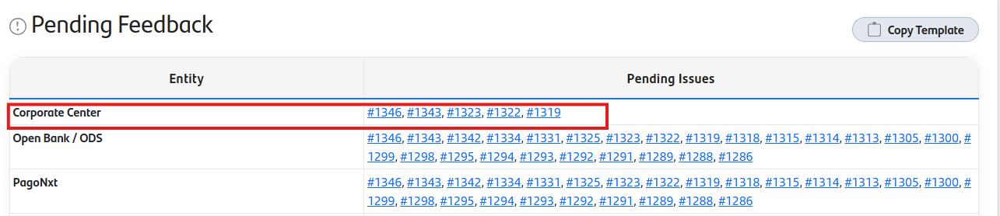

### **Step 2: Copy the Comment Template**

- Use the "Copy Template" button in this section to copy the feedback template to your clipboard.

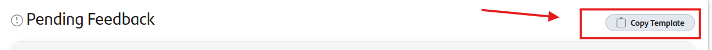

### **Step 3: Add Feedback**

- Go to the relevant GitHub issue, scroll to the bottom and click the comment box.
- Paste the feedback template.

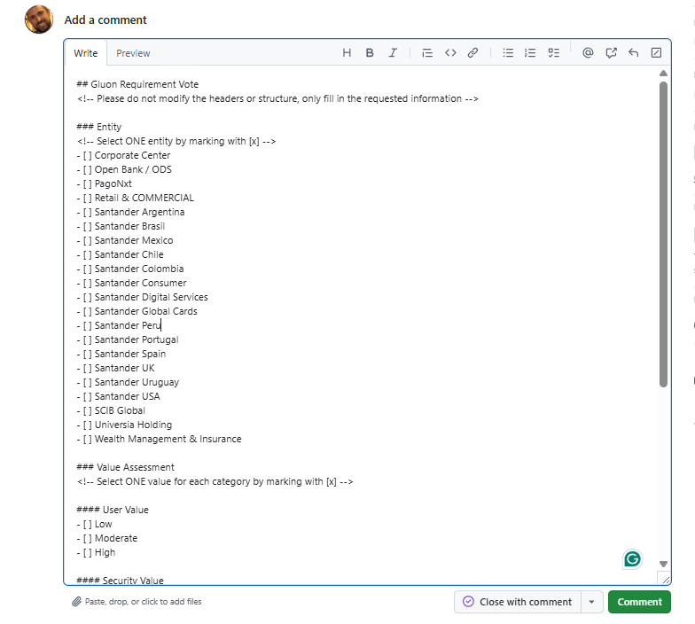

- Click **Comment** to submit your feedback.
- Once the comment has been submitted, you can easily provide your feedback:
    - Mark your entity and one value per category by clicking on each option.
    - Select one decision option.
    - Add comments if needed (edit your comment to include additional details).
  
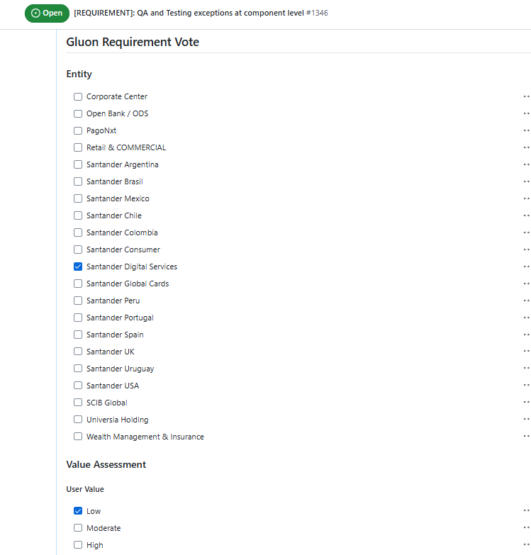
  
```markdown
**Note:**

- You can edit your comment to update your vote at any time. Only the latest feedback per entity is considered.
- Only your most recent feedback per requirement counts.
- Your feedback will be included in the next daily report.
```

## **Feedback Template**

Below is the template you should use to provide feedback on each requirement. This is the template copied to your clipboard when you click the "Copy Template" button.

```markdown
## Gluon Requirement Vote
<!-- Please do not modify the headers or structure, only fill in the requested information -->

### Entity
<!-- Select ONE entity by marking with [x] -->
- [ ] Corporate Center
- [ ] Open Bank / ODS
- [ ] PagoNxt
- [ ] Retail & COMMERCIAL
- [ ] Santander Argentina
- [ ] Santander Brasil
- [ ] Santander Mexico
- [ ] Santander Chile
- [ ] Santander Colombia
- [ ] Santander Consumer
- [ ] Santander Digital Services
- [ ] Santander Global Cards
- [ ] Santander Peru
- [ ] Santander Portugal
- [ ] Santander Spain
- [ ] Santander UK
- [ ] Santander Uruguay
- [ ] Santander USA
- [ ] SCIB Global
- [ ] Universia Holding
- [ ] Wealth Management & Insurance

### Value Assessment
<!-- Select ONE value for each category by marking with [x] -->
#### User Value
- [ ] Low
- [ ] Moderate
- [ ] High
#### Security Value
- [ ] Low
- [ ] Moderate
- [ ] High
#### Adoption Value
- [ ] Low
- [ ] Moderate
- [ ] High
### Decision
<!-- Select ONE option by marking with [x] -->
- [ ] Option 1: Need more details or value outcomes
- [ ] Option 2: No Business Value / Not needed
- [ ] Option 3: Present to Gluon Forum
### Additional Comments
<!-- Optional: Add any additional comments or justification -->
```

## **Scoring & Weight Calculation**

Each requirement receives a **weight score** based on the value assessments from entities that selected **Option 3: Present to Gluon Forum**.

| Value Assessment | Low | Moderate | High |
|------------------|-----|----------|------|
| User Value       | 1   | 5        | 10   |
| Security Value   | 1   | 5        | 10   |
| Adoption Value   | 1   | 5        | 10   |

- The total weight is the sum of all points from all entities that provided positive feedback (Option 3).
- Only the latest feedback per entity is considered.

## **Automated Actions & Status Icons**

### **Automated Actions**

- **Needs Attention:** If any entity selects Option 1, the requirement is labeled `need_attention`.
- **Accepted:** If 5 or more entities select Option 3, the requirement is marked as accepted and moved to "Triage Accepted".
- **Sorting:** Requirements in "Triage Presented" and "Triage Accepted" are sorted by weight.

### **Status Icons**

| Icon | Meaning |
|------|---------|
| 🟢   | Accepted: 5 or more Option 3 votes |
| 🔴   | Not Accepted: Less than 5 Option 3 votes |
| ⚠️   | Needs Attention: At least one Option 1 vote |
| ⭐   | Consistent Feedback: All entities have voted (21+) |

## **FAQ & Troubleshooting**

**Q: Why doesn't my feedback appear in the report?**

- Only your latest feedback per requirement is counted.
- Ensure you mark options with `[x]` correctly.

**Q: When are reports and the dashboard updated?**

- Every day at 5:00 AM automatically.
