# Darwin Real Time KStream Journey

## Introduction

The purpose of this documentation is to provide a **step-by-step guide** on how to orchestrate the integration of KStream built with the **Darwin** framework within the GLUON platform, and with Maven as the basis for building your project.

This guide will allow you to understand how to build and deploy our KStream through a CI/CD process.

All deployments will be done in a Kubernetes cluster from an immutable image that we will previously upload to a registry (Harbor/JFROG/ECR).

## Setup your local environment

Before starting with the creation of the components in Gluon, maybe you need to configure your local environment. In the next links you can find the steps to configure your environment and build your KStream in your local machine.

- [Install your JDK](https://gluon.gs.corp/community/docs/latest/getting-started/setup-your-environment/technologies/java-maven/#installing-jdk)
- [Install Maven](https://gluon.gs.corp/community/docs/latest/getting-started/setup-your-environment/technologies/java-maven/#installing-maven)
- [Configuring settings.xml](https://gluon.gs.corp/community/docs/latest/getting-started/setup-your-environment/technologies/java-maven/#configuring-settingsxml-file)
- [Nexus Certificates](https://gluon.gs.corp/community/docs/latest/getting-started/setup-your-environment/technologies/java-maven/#nexus-certificates)

## Create Component

### Gluon Portal

First, you have to [**onboard your application.**](https://gluon.gs.corp/community/docs/latest/application/application-management/) Once you have your application created, you can start creating your component.

To create a component, follow the steps described in [**Component Management**](https://gluon.gs.corp/community/docs/latest/application/component-management/create-component/), searching for the component to be created.

You have to select the type of component you want to create, in this case you are going to create a **Kafka Streams Application**

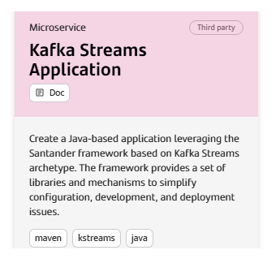

Remember

To follow the naming convention visit [Repository Naming Convention](https://gluon.gs.corp/community/docs/latest/application/component-management/create-component/#repository-naming-convention).

The user can customize the type of application that they want to create. For this example, we have created a Darwin Realtime KStream with the following characteristics:

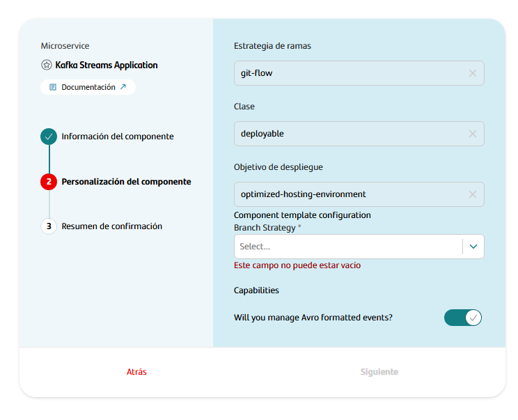

Darwin RealTime KStream Template Parameters:

| **Input** | **Required** | **Default value** | **Description** |
|-----------|--------------|-------------------|-----------------|
| **Branch Strategy** | true | git-flow | Git branching model that involves the use of feature branches and multiple primary branches. |
| **Class** | true | deployable | Indicates the type of component being created, which is a component that should be deployed in a PaaS. |
| **Deployment target** | true | optimized-hosting-environment | Indicate target hosting-environment that should be deployed in a PaaS. |
| **Will you manage Avro formatted events?** | true | true | Indicates that you want to incorporate the component with avro formatted events. |

Once the component is created, we can see under the application that there is a new repository created with the name of the component, Sonar project and Fortify project.

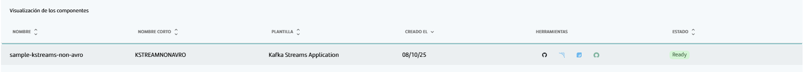

We have the following links in:

| Item | Link | Role Permission |
|------|------|-----------------|
| GitHub Repository | Link to the repository created in GitHub | Developer (RW) /Technical Lead (Maintain) [All roles explained](https://docs.github.com/es/organizations/managing-user-access-to-your-organizations-repositories/managing-repository-roles/repository-roles-for-an-organization) |
| Sonar Project | Link to the Sonar project created | All Users (Read) |
| Fortify Project | Link to the Fortify project created | All Users (Read) |

### Darwin RealTime KStream Template

#### Git Flow

##### Branches

When you create the component from the Gluon Portal, the component is created with the default values of the template from the scaffolding workflow.

- Create an empty **main** branch
- Create a **develop** branch with a "Hello World" and with the structure of files and folders to configure and run your KStream Application.

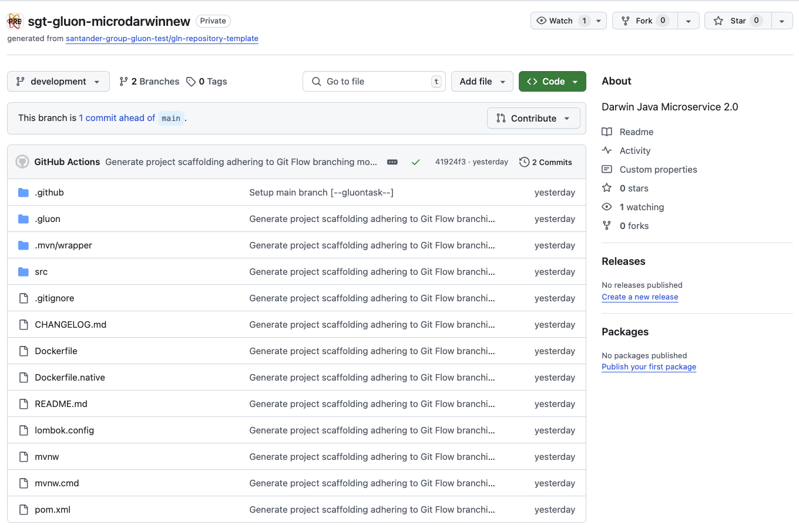

#### Trunk Based Development

##### Branches

When you create the component from the Gluon Portal, the component is created with the default values of the template from the scaffolding workflow.

- Create a **main** branch with a example and with the structure of files and folders to configure and deploy your KStreams Application.

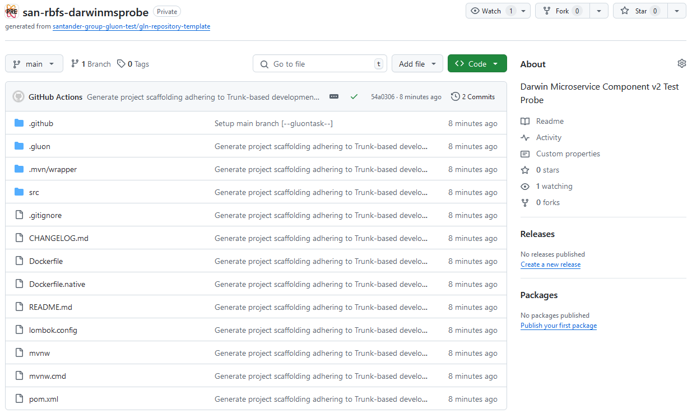

#### Structure

The generated Darwin RealTime KStreams has a structure similar to the following, only narrowing down the content changes in the src and test folders based on your selection in previous steps.

```text
📂.github
┣ 📂workflows
┃ ┣ 📜cd.yml
┃ ┣ 📜ci-tbd.yml
┃ ┣ 📜darwin-code-analysis.yml
┃ ┣ 📜quality.yml
┃ ┣ 📜release-tbd.yml
┃ ┣ 📜security.yml
┃ ┣ 📜update-component-workflow.yml
┃ ┗ 📜version-validation.yml
┗ 📜CODEOWNERS
📂.gluon
┣ 📂cd
┃ ┣ 📂cert
┃ ┃ ┣ 📜cd.yml
┃ ┃ ┗ 📜values-cert.yml
┃ ┣ 📂pre
┃ ┃ ┣ 📜cd.yml
┃ ┃ ┗ 📜values-pre.yml
┃ ┣ 📂pro
┃ ┃ ┣ 📜cd.yml
┃ ┃ ┗ 📜values-pro.yml
┃ ┗ 📜values.yaml
┗ 📂ci
┃ ┗ 📜properties.env
📂src
 ┣ 📂main
 | ┣ 📂java
 | | ┗ (*) Application java files
 | ┗ 📂resources
 | | ┗ (*) Application resources
 ┗ 📂test
 | ┣ 📂java
 | | ┗ (*) Application test java files
 | ┗ 📂resources
 | | ┗ (*) Application test resources
📜CHANGELOG.md
📜Dockerfile
📜lombok.config
📜pom.xml
📜README.md
```

For more information on the structure and functionality of Darwin RealTime KStream, please refer to the [Darwin Real Time KStream Archetype](https://techplatform.corp.bsch/latest/realtime-archetype/home/) documentation provided by the framework.

## Local Running

Cloning your repository

### Cloning your repository

Once we have the device properly configured, the first step is to clone the project locally.

To do so, visit [**How to clone de project**](https://gluon.gs.corp/community/docs/latest/application/component-management/create-component/#cloning-a-repository).

Run your Kstream

### Running the KStream

It is necessary to add a couple of lines to test the **basic functionality** of this Kstream (without a security token).

[Kafka Streams Java Projects - Technical Platform Documentation](https://techplatform.corp.bsch/latest/realtime-archetype/home/current/features/kstreams/kstreams-applications/#kstreams-avro-in-5-minutes)

[Remote Execution of an Application generated with Darwin Real Time Archetype - Technical Platform Documentation](https://techplatform.corp.bsch/latest/realtime-archetype/home/current/features/applications/execution/remote-execution/)

## Infrastructure

You have to request the following infrastructure resources.

### Registry

- Project: You need a project in the registry (**Harbor** , **JFrog** or **ECR**) to upload your image.
- Credentials: **user/password** with privileges to upload images to the project.

### Kubernetes

- Namespace: You need a **namespace** in the **Kubernetes cluster** to deploy your KStream (and other kubernetes components) in the CERT, PRE and PRO environments. You can create your namespace in Gluon following [this guide](https://gluon.gs.corp/community/docs/latest/components/configuration/kubernetes/namespace_harbor/)
- Credentials: **Service Account** with the credentials to deploy in the namespace.

### How to configure your deployment environment

The company used to create the components must have been provided the
[Gluon Open Application Model](https://gluon.gs.corp/community/docs/latest/application/ci-cd/cd/cd-rm/).
The deployment model uses the `oam-application-definition.yaml` file to manage infrastructure and registries
in a standardized way across different platforms.

### OAM Configuration

To deploy a Darwin Realtime KStream, the parameters of the target infrastructure must be configured in the
**Gluon Application Model** component of the technical application,
[**configuring the data**](https://gluon.gs.corp/community/docs/latest/components/software/backend/snippets/oam-configuration/)
necessary depending on the type of Kubernetes Cluster used.

### Configure environments

By default, the component is created with the folders cert, pre, and pro, which cover the most common use case.
Each of these folders corresponds to an environment in which you want to deploy the Darwin Realtime KStream.
If, for example, you want to deploy in two production environments called pre-pro and back-pro,
the folder structure that should be created in the cd folder is dev, pre, pre-pro, and back-pro,
each with the `cd.yml` file where the infrastructure to be deployed must be configured.

For it to work correctly, the name of the folder must exactly match the name of the "name" property
(in the example shown below, it would be the cert value) of the oam-application-definition.yml file
of the Gluon Application Model component.

So, to define a deployment environments, it is necessary to describe the `name` and `type` fields:

- `name`: The name of the environment. Each Application could give a different name to the environments. It must be unique in the oam file.
- `type`: The type of the environment. The values allowed are `certification`, `preproduction`, and `production`.

Below is an example of the configuration of a certification environment, called cert, where one infrastructure
have been configured to deploy for Amazon Elastic-Kubernetes Service Cluster. Many properties have been omitted
for this example, but for it to work correctly, the rest of the mandatory data must be configured.

#### oam-application-definition.yml

```yaml
environments:
  - name: cert
    type: certification
    infrastructures:
      - id: CI00000000001
        properties:
          type: KUBERNETES
          apiServer: https://12345asdfg67890hjkl.sk1.eu-west-1.eks.amazonaws.com
          namespace: gluon-back-java
          credentialUserId: AWS_ACCESS_KEY_ID
          credentialPassId: AWS_SECRET_ACCESS_KEY_ID
          provider: eks
          cloud: aws
          account: 123456789012
          role: AccountAutomationNonPro
          region: eu-west-1
          clusterName: sgtd1aireksgluondeksd111
          artifact-store: CI000000000002
          (...)

      - id: CI000000000002
        type: ARTIFACT-STORE
        properties:
          type: ecr
          registry: 12345asdfg67890hjkl.dkr.ecr.eu-west-1.amazonaws.com
          project-path: project-anme
          usernameId: AWS_ACCESS_KEY_ID
          passwordId: AWS_SECRET_ACCESS_KEY_ID
          role: AccountAutomationNonPro
          snapshots: true
          (...)
```

Cluster Authentication

There are three ways to authenticate against a Cluster:

- **credentialsId**: Use property credentialsId setting the name of the github secret storing the token. **This is the recommended method**.
- **credentialUserId** / **credentialPassId**: Use properties credentialsUserId/credentialsPassId placing there github secret names with username and password to use to authenticate with server.
- **Using Hashicorp Vault**: The system will automatically search in the Hashicorp Vault for the deployment secret

The next step is to configure the `cd.yml` file, where you can set up the infrastructures where the Darwin Realtime KStream will be deployed for that environment. For each one, the following properties must be configured:

| **Property** | **Description** | **Example** |
|--------------|-----------------|-------------|
| ci_id | Identifier of the infrastructure in the oam-application-definition.yml file | CI00000000097 |
| configurationFiles | Path to the Helm configuration file in that environment | .gluon/cd/cert/values-cert.yml |

Following the previous example from the oam-application-definition.yml file, the content of the `cd.yml` file to deploy on Amazon Elastic-Kubernetes Service (EKS) and the container images on Amazon Elastic Container Registry (ECR) would be as follows:

#### cd.yml

```yaml
- ci_id: CI00000000001
  configurationFiles:
  - .gluon/cd/cert/values-cert.yaml
```

> !IMPORTANT - Considerations:
>
> - The workflow will deploy on all infrastructures that are included in the cd.yml file of the environment in which it is going to be executed.
> - The infrastructures included in the cd.yml file must be registered in the environment in the oam-application-definition.yml file.
> - These values indicate where the KStream will be deployed. They do not depend on **GLUON**. They are specific to the application to be deployed.

For getting to know how to configure the `Gluon Open Application Model` repository associated with the company where the component is generated, the following documentation is available:

- [How to configure the Gluon Open Application Model (OAM)](https://gluon.gs.corp/community/docs/latest/application/ci-cd/cd/cd-rm/gluon-application-model-oam/oam-config-and-params/gluon-application-model-oam-config/)
- [All the parameters available by type of infrastructure component](https://gluon.gs.corp/community/docs/latest/application/ci-cd/cd/cd-rm/gluon-application-model-oam/oam-config-and-params/gluon-application-model-oam-params/)
- [Kubernetes deployment examples for OAM Configuration](https://gluon.gs.corp/community/docs/latest/components/software/backend/snippets/oam-configuration/)

## Component Configuration

### Branches

#### Git Flow

In this case, Gluon works with two branches that will need to be incorporated into our project:

- The main branch (main by default or master in old projects)
- The integration branch (development/develop by default)

We need to have the integration branch to merge the feature branches and create the Pull Request to the main branch.

#### Trunk Based Development

Here, Gluon works with only one branch that will need to be incorporated into our project:

- The main branch (main by default or master in old projects)

With trunk-based development, we will merge feature branches with Pull Requests directly into the main branch.

### Configuration Files

- **properties.env**: Properties with the CI configuration
- **Dockerfile**: Configuration to build the image
- **Continuous Deployment files**: Configuration with the infrastructure identifiers and values of deployment. There is a file by environment (cert, pre, pro).
- **Helm Configuration files**: Configuration with the values to deploy the image.

#### Properties

The location of the properties.env is:

```text
📂.gluon
┗ 📂ci
  ┗ 📜properties.env
```

[Darwin Example](https://gluon.gs.corp/community/docs/latest/components/software/backend/java/darwin/darwin-maven-kubernetes-rm/#__tabbed_1_1)

```properties
# Sonar parameters
SONAR_PROJECT_KEY="real-sonar-project-key"

# Fortify parameters
FORTIFY_PROJECT="real-fortify-project-key"

JAVA_VERSION="adoptopenjdk-17.0.7+7"

ARTIFACT_NATIVE_COMPILATION=false
```

For getting more information about this file, please refer to [Continuous Integration file documentation](https://gluon.gs.corp/community/docs/latest/application/ci-cd/cd/cd-rm/cd-workflow/ci-envs-configuration/).

The **properties.env** file contains the configuration for the CI/CD pipeline. It is generated automatically. The parameters that are configured by default are:

| **Variable** | **Required** | **Description** | **Example value** |
|--------------|--------------|-----------------|-------------------|
| **SONAR_PROJECT_KEY** | true | Project key in Sonar | sgt-gluonad-probemicroframework |
| **FORTIFY_PROJECT** | true | Project name in Fortify | sgt-gluonad-probemicroframework |
| **JAVA_VERSION** | true | Java version to use | adoptopenjdk-17.0.8+7 |
| **ARTIFACT_NATIVE_COMPILATION** | false | Artifact native compilation | false |

Naming convention

The project name in **Sonar** and **Fortify** must be the same as the component repository name.
To avoid possible errors, the **properties.env** file is generated with the necessary values for the variables
**SONAR_PROJECT_KEY** and **FORTIFY_PROJECT**.

Example values:

SONAR_PROJECT_KEY="sgt-gluonad-probemicroframework"

FORTIFY_PROJECT="sgt-gluonad-probemicroframework"

All the properties

```properties
# Sonar parameters
SONAR_ID="SONAR_GLUON_COMMUNITY"
SONAR_PROJECT_KEY="sgt-app360-example1"

# Java version(optional)
JAVA_VERSION="adoptopenjdk-17.0.7+7"

# Fortify parameters
FORTIFY_PROJECT="Test_ALM_NextGen_jdk8"

# Sonatype parameters(optional)
SONATYPE_JAVA_VERSION="adoptopenjdk-17.0.7+7"

# Deploy(optional)
IMAGE_DEPLOY_TYPE='helm'

```

Below are the properties that the user must or can set up in the `envs/properties.env` file within their GitHub project. These properties are necessary for the execution of some jobs.

`Maven properties`

| Property | Required | Description | default | Example |
|----------|----------|-------------|---------|---------|
| MAVEN_VERSION | false | Maven version used | 3.8.1 | '3.8.1' |
| MAVEN_BUILD_GOAL | false | Maven goal used | clean verify | 'clean verify' |

`Sonar properties`

| Property | Required | Description | default | Example |
|----------|----------|-------------|---------|---------|
| SONAR_ID | false | Sonar instance name | 'SONAR_GLUON_COMMUNITY' | 'SONAR_GLUON_COMMUNITY' |
| SONAR_PROJECT_KEY | true | Project key that's created in the sonar instance | - | "sgt-app360-example1" |
| SONAR_REPORT_PATH | false | Location where the scanner writes the report-task.txt | depends on thecnology | 'target/site' |
| SONAR_TIMEOUT | false | Timeout for the workflow execution | 15 | 15 |
| SONAR_MEMORY_PROPERTIES | false | Memory properties | - | '-Xmx256m' |
| SONAR_PROPERTIES | false | Sonar properties for Sonar analysis | '-Dsonar.coverage.jacoco.xmlReportPaths=target/jacoco.xml' |  |

`Fortify properties`

| Property | Required | Description | default | Example |
|----------|----------|-------------|---------|---------|
| FORTIFY_PROJECT | true | Project name created on Fortify SSC | - | 'project1' |
| FORTIFY_TIMEOUT | false | Timeout for the workflow execution | 15 | 20 |

`Container properties`

(only for immutable workflows)

| Property | Required | Description | default | Example |
|----------|----------|-------------|---------|---------|
| CONTAINER_BUILD_ARGUMENTS | false | Arguments to apply to the 'build' command | - | '--build-arg IMAGE_TARGET_VERSION=${TAG_VERSION}' |
| DOCKER_BUILD_ARGUMENTS | false | Arguments to apply to the 'build' command (deprecated) | - | '--build-arg IMAGE_TARGET_VERSION=${TAG_VERSION}' |

`Deployment properties`

| Property | Required | Description | default | Example |
|----------|----------|-------------|---------|---------|
| DEPLOYMENT_YAML | false | File name of the file with the deployment configuration | deployment.yaml | 'deployment.yaml' |
| CERT_DEPLOYMENT | false | Environment name to be deployed in Certification | cert | 'cert' |
| PRE_DEPLOYMENT | false | Environment name to be deployed in Preproduction | pre | 'pre' |
| PRO_DEPLOYMENT | false | Environment name to be deployed in Production | pro | 'pro' |
| IMAGE_DEPLOY_TYPE | false | Deployment type for immutable workflows. See the types supported by the action ['gln-alm-deployment-manager-action'](https://github.com/santander-group-shared-assets/gln-alm-deployment-manager-action) | 'helm' |  |

`Others properties`

| Property | Required | Description | default | Example |
|----------|----------|-------------|---------|---------|
| JAVA_VERSION | false | Java version used | adoptopenjdk-8.0.292+10 | 'adoptopenjdk-17.0.7+7' |

Example:

[properties.env](https://gluon.gs.corp/community/docs/latest/components/software/backend/java/darwin/darwin-maven-kubernetes-rm/#__tabbed_2_1)

##### Activate native compilation

If you want to create a KStream that can be compiled as a native image with GraalVM, you must set the
`ARTIFACT_NATIVE_COMPILATION` parameter to `true` and select the GraalVM version in the `JAVA_VERSION` parameter
`oracle-graalvm-21.0.1`. Also, it is necessary that the KStream has been created with native compilation option active.

Using GraalVM Java 21

We are using GraalVM Java 21.0.1 to compile the KStream as a native image but our pipeline does not support java 21, so you have to keep `<java.version>` property in `pom.xml` with value `17`

#### Dockerfile

This file allows us to build the image with the KStream in the *Build* stage of the CI/CD pipeline. It is created automatically.

Registry Configuration

These values indicate where the image of the KStream will be deployed. They do not depend on GLUON. They are specific to the application to be deployed.

#### Continuous Deployment files

In that set of files, we are going to define the necessary infrastructure references so that the helm chart can
deploy the configmap correctly in the configured environment. The Continuous Deployment file (`cd.yml`) must contain
the target deployment configuration that we want to use for deploying the component. For each environment
(cert, pre, pro), we have a folder with the `cd.yml` file, and there, we can define several infrastructures to
deploy in as many regions as we need. Remember that `cd.yml` files are empty, and the developer is responsible for
filling them with the necessary deployment information.

```text
📂.gluon
┣ 📂cd
┃ ┣ 📂cert
┃ ┃ ┣ 📜cd.yml
┃ ┣ 📂pre
┃ ┃ ┣ 📜cd.yml
┃ ┣ 📂pro
┃ ┃ ┗ 📜cd.yml
```

For that purpose, it will only be necessary to add the `ci_id` identifiers defined by environment type in the
`oam-application-definition.yml` file inside **Gluon Open Application Model repository** associated with the company
of the component. Keep in mind that `ci_id` **must be the same as we have in OAM the config file**.
The `configuration_files` key allows setting the `values` chart files that they are necessary to be able to deploy
in the infrastructures to which they refer.

| **Property** | **Description** | **Example** |
|--------------|-----------------|-------------|
| ci_id | Identifier of the infrastructure in the oam-application-definition.yml file | CI00000000097 |
| configurationFiles | Path to the Helm configuration file in that environment | .gluon/cd/cert/values-cert.yml |

The following template shows an example of the structure that the `cd.yml` file should have:

```yaml
# Kubernetes cluster in AWS
- ci_id: CI00000000001
  configuration_files:
    - .gluon/cd/values.yml
    - .gluon/cd/{environment}/values-{environment}.yml
# Kubernetes cluster in Azure
- ci_id: CI00000000002
  configuration_files:
    - .gluon/cd/values.yml
    - .gluon/cd/{environment}/values-{environment}.yml
```

[See the full list of examples of how to set up your deployment infrastructure here](https://gluon.gs.corp/community/docs/latest/components/software/backend/snippets/oam-configuration/)

For getting more information about how-to-configure the deployment environment files, please refer to the [Continuous Deployment file documentation](https://gluon.gs.corp/community/docs/latest/application/ci-cd/cd/cd-rm/cd-workflow/cd-envs-configuration/).

For getting to know how to configure the `Gluon Open Application Model` repository, the following documentation is available [here](https://gluon.gs.corp/community/docs/latest/application/ci-cd/cd/cd-rm/gluon-application-model-oam/oam-config-and-params/gluon-application-model-oam-config/)

Blue & Green deployment

This functionality is currently only available if deployed on infrastructure in Spain.

More information about [blue & green deployment](https://gluon.gs.corp/community/docs/latest/components/software/backend/commons/blue-green-development/)

#### Helm Configuration

You must have the next files in the `.gluon/cd` folder of your project with the following structure:

```text
📂.gluon
┣ 📂cd
┃ ┣ 📂cert
┃ ┃ ┗ 📜values-cert.yml
┃ ┣ 📂pre
┃ ┃ ┗ 📜values-pre.yml
┃ ┣ 📂pro
┃ ┃ ┗ 📜values-pro.yml
┗ ┗ 📜values.yaml
```

Description of the files:

- **values.yaml**: Helm values file with the default values to deploy the KStream .
- **values-cert.yaml**: Helm values file with the values to deploy the KStream in the CERT environment.
- **values-pre.yaml**: Helm values file with the values to deploy the KStream in the PRE environment.
- **values-pro.yaml**: Helm values file with the values to deploy the KStream in the PRO environment.

Examples of values.yaml files:

```yaml
# Default values for kstreams-helm.
# This is a YAML-formatted file.
# Declare variables to be passed into your templates.
nameOverride: ${APPLICATION_NAME}-ks-java
fullnameOverride: ${APPLICATION_NAME}-ks-java

##
# Field to specify the major version of the KStreams archetype to be deployed with the chart.
# If not added its default value will be majorVersion: 2

## Archetype major version
kstreamsArchetype:
  majorVersion: 4

##
# Cluster FQDN
##
clusterFqdn: ""

##
# Labels and Annotations
##
# Add labels to deployment/statefulset
labels: {}
# Add annotations to deployment/statefulset
annotations: {}
# Add labels to deployment/statefulset pods
podLabels: {}
# Add annotations to deployment/statefulset pods
podAnnotations: {}

##
# Number of Replicas
##
replicaCount: 1

##
# Image to deploy
##
image:
    ## @param image.registry micro image registry
  repository: ${PROJECT}/${APPLICATION_NAME}
  ## @param image.repository micro image name
  # With ${REGISTRY} placeholder this will be replaced by the registry value of
  # cluster properties block for each region
  registry: ${REGISTRY}
  ## @param image.tag micro image tag
  ## Use ${TAG_VERSION} for the value will use the same version of pom.xml.
  tag: ${TAG_VERSION}
  pullPolicy: IfNotPresent

##
# Pod affinity/anti-affinity
##
affinity: {}

securityContext: {}
  # capabilities:
  #   drop:
  #   - ALL
  # readOnlyRootFilesystem: true
  # runAsNonRoot: true
  # runAsUser: 1000

podSecurityContext: {}
  # fsGroup: 2000

##
# Pod resources
##
resources:
  limits:
    memory: 2G
    cpu: 1000m
  requests:
    memory: 1G
    cpu: 200m

##
# Pod port
##
podPort: 8080

##
# Pod probes
##
readinessProbe:
  initialDelaySeconds: 60
  periodSeconds: 10
  failureThreshold: 3
  timeoutSeconds: 2
  httpGet:
    path: /actuator/info
    port: http
    scheme: HTTP

livenessProbe:
  initialDelaySeconds: 120
  periodSeconds: 10
  failureThreshold: 3
  timeoutSeconds: 2
  httpGet:
    path: /actuator/info
    port: http
    scheme: HTTP

##
# Pod parameters configuration
##
parameters:
  env: cert
  darwin_region: ""
  config_additional_location: ""
  config_profile: cert
  root_log: INFO


#########################
# Environment variables #
#########################
## @param extraEnvVars Extra environment variables to be set on Node container
## For example:
##  - name: BEARER_AUTH
##    value: "true"
##  - name: DARWIN_CM_KEY
##    valueFrom:
##      configMapKeyRef:
##        name: "cm4"
##        key: LOGGING_ROOT_LEVEL
##        optional: false
##  - name: DARWIN_SECRET_KEY
##    valueFrom:
##      secretKeyRef:
##        name: "backend-app"
##        key: "application-password"
##        optional: false
##
extraEnvVars:
  - name: TZ
    value: "Europe/Madrid"
  - name: Encoding
    value: "UTF-8"
  - name: GarbageCollector
    value: "+UseG1GC"
  - name: MaxRAMPercentage
    value: "65.0"

##
# ConfigMap/Secrets volume mount configuration
##
#volumes:
# - name: configmap-name
#   mountPath: /mnt
#   items:
#     - key: configmap-key
#       fileName: new-file.yaml
#     - key: krb5.conf
#       fileName: krb5.conf
# - name: security-map
#   mountPath: /mnt/security
#   secret: true
#   items:
#     - key: apl_horus_dev.keytab
#       fileName: apl_horus_dev.keytab

##
# ConfigMap/Secrets available as Environment Variables configuration
##
#volumesAsEnvVars:
#  - name: secret-name
#    secret: true
#  - name: confimap-name

##
# StateStore configuration
# enabled: true (Chart deploy generates an StatefulSet deployment)
# storageClassName: platinum | gold | ...
##
stateStore:
  enabled: false
  size: 1Gi
  storageClassName: default
  mountPath: /tmp/kafka-streams

##
# Service discovery configuration
##
service:
  # Annotations to add to the service
  annotations: {}
  type: ClusterIP
  port: 8080

##
# Ingress configuration
##
ingress:
  enabled: false
#   className: ""
  annotations: {}
    # kubernetes.io/ingress.class: nginx
    # kubernetes.io/tls-acme: "true"
  hosts: []
    #- host: autogenerated.host
    #  paths:
    #    - path: /
    #      pathType: ImplementationSpecific
  tls: []
  #  - secretName: chart-example-tls
  #    hosts:
  #      - chart-example.local

##
# Autoscaling configuration
##
autoscaling:
  enabled: false
  # Annotations to add to the horizontal pod autoscaler
  annotations: {}
  minReplicas: 1
  maxReplicas: 3
  targetCPUUtilizationPercentage: 80
  targetMemoryUtilizationPercentage: 80
```

All Helm Configuration parameters

| **Parameter** | **Description** |
|---------------|-----------------|
| image.repository | Name of the project and image that we are going to deploy to Kubernetes with HELM |
| image.registry | Registry from where we are going to retrieve the image for our deployment |

Examples of values-dev.yaml

```yaml
# Here is an example file of how to give deployment values for a specific environment

##
# Image to deploy
##
image:
  ## @param image.pullPolicy santander micro image pull policy
  ## Specify a imagePullPolicy
  ## ref: https://kubernetes.io/docs/user-guide/images/#pre-pulling-images
  ## Default value is 'IfNotPresent', but if you want to always pull the image set it to 'Always'
  ## This could the key of cert environment because we want to deploy different images with the same tag SNAPSHOT
  pullPolicy: Always

##
# Pod resources
##
resources:
  limits:
    memory: 2G
    cpu: 1000m
  requests:
    memory: 1G
    cpu: 200m

##
# Pod parameters configuration
##
parameters:
  env: cert
  darwin_region: bo01
  config_additional_location: /mnt/config/app
  config_profile: cert
  root_log: INFO

##
# ConfigMap/Secrets volume mount configuration
##
#volumes:
#  - name: cm-${APPLICATION_NAME}-ks-java
#    secret: false
#    mountPath: /mnt/config/app
#    items:
#      - key: application-dev.yml
#        fileName: application-dev.yml
#  - name: cm-krb5-conf
#    secret: false
#    mountPath: /mnt/config/krb
#    items:
#      - key: krb5.conf
#        fileName: krb5.conf
#  - name: secret-apl-<ACRONYM>-dev-keytab
#    secret: true
#    mountPath: /mnt/security
#    items:
#      - key: apl-<ACRONYM>-dev-keytab
#        fileName: apl-<ACRONYM>-dev.keytab

##
# ConfigMap/Secrets available as Environment Variables configuration
##
#volumesAsEnvVars:
#  - name: secret-${APPLICATION_NAME}-ks-java
#    secret: true
```

### Secrets Configuration

There are three types of secrets in [GitHub](http://Github.com):

- **Organization secrets**: Secrets that can be used by all repositories in the organization.
- **Repository secrets**: Secrets that can be used only by the repository.
- **Environment secrets**: Secrets that can be used only by the repository and the environment.

Setup GitHub Secrets

Secrets are set up, managed and deployed with [the vault](https://gluon.gs.corp/community/docs/latest/application/security/security-enablers/hashicorp-vault/journeys/developer/).

#### Deploy Secrets

Those credentials are referenced in the `Gluon Open Application Model repository` and defined at **environment secrets level**, so we have to create the secrets in each environment (CERT, PRE and PRO).

##### Deployment Infrastructure

For accessing to the **OC** Kubernetes Cluster, it is necessary to create authentication secrets for this key:

- credentialsId

For accessing to the **EKS** and **AKS** Kubernetes Cluster, or to the **APIGEE** and **IBM** API Managers, it is necessary to create authentication secrets for these keys:

- credentialUserId
- credentialPassId

##### Registries Infrastructure

For accessing to the **Harbor**, **Artifactory**, **ECR**, and **ACR** Artifacts Stores, it is necessary to create authentication secrets for these keys:

- usernameId
- passwordId

For getting more information about the authentication keys, please refer to [Parameters available by type of infrastructure component](https://gluon.gs.corp/community/docs/latest/application/ci-cd/cd/cd-rm/gluon-application-model-oam/oam-config-and-params/gluon-application-model-oam-params/)

## Build and Deploy your application

### Git Flow

Now we are going to describe the steps that a user has to perform in order to make a complete cycle, from the construction process (CI) to the deployment through the DEV, PRE and PRO environments (CD)

The cycle explained below is based on **GitFlow**

#### Quality Gates

We want our KStreams to have the maximum quality in Gluon prior to deployments to production environments, so it will be necessary to have the OK in:

- **Sonar**: Code Quality and test coverage
- **Fortify**: Analysis of the vulnerabilities of our source code
- **Sonatype**: Analysis of the vulnerabilities of our dependencies.
- **Gluon Testing**: Functional tests (Execution of Functional Test with Gluon Testing framework after that the deployment PRE was successful)

Quality Gates

Without these QG resolved we will only be able to deploy to development environments, being subject to these validations the pre/production environments.

#### Pull Request from Feature to Develop

We will start working on the "Feature" branches of our GitHub repository, and we will be integrating our changes into the integration branch (develop or development)

When we create the **Pull Request** event from our **"Feature" branch to the integration branch** (develop or development), the quality.yml (Sonar) and security.yml (Fortify & Sonatype) workflows will be executed automatically.

Next, we detail which steps are executed in each of these two workflows:

##### Quality gate workflow

- **Setup environment variables**: Load the properties defined in properties.env file and in the configuration project.
- **Maven build & Sonar scan**: Executes the default commands of MAVEN_BUILD_GOAL: clean verify


Maven quality gate workflow code

```yaml
name: Quality
on:
  pull_request:
    branches:
      - development
      - develop
      - main
      - master

jobs:
  call-reusable-workflow:
  name: Quality
  uses: santander-group-shared-assets/gln-workflows/.github/workflows/maven-quality.yml@v1
  secrets: inherit
```

##### Security workflow

- **Setup environment variables**:Load the properties defined in properties.env file and in the configuration project.
- **Get the current version from pom**: Read the pom.xml to get the version of the component.
- **SSDLC Onboarding Check**: Check if the component already exists in Fortify SSC.
- **SAST**: Executes the reusable Fortify SAST workflow to perform a SAST scan with Fortify and validate the quality gates.
- **SCA**:Executes the reusable The Sonatype SCA workflow to perform a Sonatype SCA scan and analyze third party components from a repository.
- **Send information to Elasticsearch**:Send data to elasticsearch related with Fortify analysis.
- **Send information to Elasticsearch**:Send data to elasticsearch related with Sonatype analysis.

Maven security workflow code

```yaml
name: Security
on:
  pull_request:
    branches:
      - development
      - develop
      - main
      - master

jobs:
  call-reusable-workflow:
    name: Security
    uses: santander-group-shared-assets/gln-workflows/.github/workflows/maven-security-image.yml@v1
    secrets: inherit
```


#### Push to Develop

When approving the Pull Request of the previous step on the integration branch (development/develop) we will generate a push event on this branch and therefore the ci-gfw.yml workflow will be executed automatically.

Next, we detail which steps are executed in this workflow:

##### Integration workflow

- **Setup environment variables**:Load the properties defined in properties.env file and in the configuration project.
- **Resolve version**: Resolve the version of the component.
- **Check if maven uses native build**: Check if it is necessary to configure a native compilation.
- **Maven build and Sonar scan**: Executes the default commands of MAVEN_BUILD_GOAL: clean verify
- **Fortify SAST** Executes the reusable Fortify SAST workflow to perform a SAST scan with Fortify and validate the quality gates.
- **Sonatype SCA**:Executes the reusable The Sonatype SCA workflow to perform a Sonatype SCA scan and analyze third party components from a repository.
- **Send information to Elasticsearch**: Send data to elasticsearch related with SAST and SCA analysis.
- **Container build and push**:
  - It takes the feature or development branch as image version, and sets the environment variable TAG_VERSION with this value.
  - Then execute the command mvn clean package -Dmaven.test.skip=true to build the application artifact.
  - It builds the docker image based on Dockerfile located in the project and makes a push to one or several image registries associated with the Kubernetes infrastructures configured in the environment `cd.yaml` file.
  - It executes a [sysdig scan](https://gluon.gs.corp/community/docs/latest/application/ci-cd/sysdig/).
  - Finally, scan the image vulnerabilities and send the data related to the image build to elasticsearch.
- **Send data to elasticsearch** related with the image registries where the image has been published.
- **Deploying a development**: This job call to workflow maven-cd-image.yaml for deploy our KStream to cert environment

Maven CI Image workflow code

```yaml
name: Integration
  on:
    push:
      branches:
        - development
        - develop
        - feature/*
        - fix/*

jobs:
  call-reusable-workflow:
    name: Integration
    uses: santander-group-shared-assets/gln-workflows/.github/workflows/maven-ci-gfw.yml@v1
    with:
      technology: 'Java_Maven'
      secrets: inherit
```

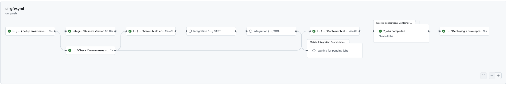

If everything works correctly, we will have our image uploaded to the registry, and we will have the information in Sonar and Fortify.

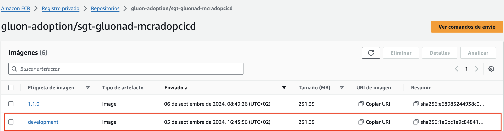

##### Deploy workflow

To learn how the common deployment workflow works, applicable to all technologies, you can refer to the [Common CD Workflow](https://gluon.gs.corp/community/docs/latest/application/ci-cd/cd/cd-rm/cd-workflow/) section of the documentation.

If everything works correctly, we will have our image deployed in the CERT environment.


#### Pull Request from the development branch to the main branch

When we are ready to promote our KStream to the PRE/PRO environments, we will create a Pull Request from the integration branch (develop or development) to the main branch.

This event will launch the **version-validation.yml workflow**, **quality.yml workflow** (Sonar) and **security.yml workflows** (Fortify & Sonatype).

#### Push to the main branch

When we approve the PR of the previous step on the main branch, we will generate a push event on this branch, and therefore the release-gfw.yml workflow will be executed automatically.

##### Release workflow

- **Setup environment variables**: Load the properties defined in properties.env file and in the configuration project. The configuration project is obtained according to the secrets defined here.
- **Preparing release version**: Update version pom in the branch (main or master) with the Release version. Get last commit in the branch.
- **Check if maven uses native build**: Check if it is necessary to configure a native compilation.
- **SAST** Executes the reusable Fortify SAST workflow to perform a SAST scan with Fortify and validate the quality gates.
- **SCA**: Executes the reusable The Sonatype SCA workflow to perform a Sonatype SCA scan and analyze third party components from a repository.
- **Maven build & Sonar scan**: Executes the default commands of MAVEN_BUILD_GOAL: clean verify. If you want to overwrite the maven command you can configure in properties.env
- **Send information to Elasticsearch**:Send data to elasticsearch related with Fortify analysis.
- **Send information to Elasticsearch**:Send data to elasticsearch related with Sonatype analysis.
- **Generate tag and release**: Create the release tag and generate the GitHub Release.
- **Container build and push**:
  - It takes the version from the resolve version job to generate the release identifier as the image version, and sets the environment variable TAG_VERSION with this value.
  - After that, it generates the application and the distribution of the configuration, to continue,
  - It builds the docker image based on Dockerfile located in the project and make a push to one or several image registries associated with the Kubernetes infrastructures configured in the environment `cd.yaml` file.
  - The container images are pushed with the calculated release version tag.
  - It executes a [sysdig scan](https://gluon.gs.corp/community/docs/latest/application/ci-cd/sysdig/).
  - Finally, scan the image vulnerabilities and send the data related to the image build to elasticsearch.
- **Send data to elasticsearch** related to the image.

Release workflow code

```yaml
name: Release
on:
  push:
    branches:
      - main
      - master
jobs:
  call-reusable-workflow:
    name: Release
    uses: santander-group-shared-assets/gln-workflows/.github/workflows/maven-release-gfw.yml@v1
    with:
      technology: 'Java_Maven'
    secrets: inherit
```


At the end of the workflow, we can see a GitHub Release has been created using the GitHub Tag generated with the Release workflow.

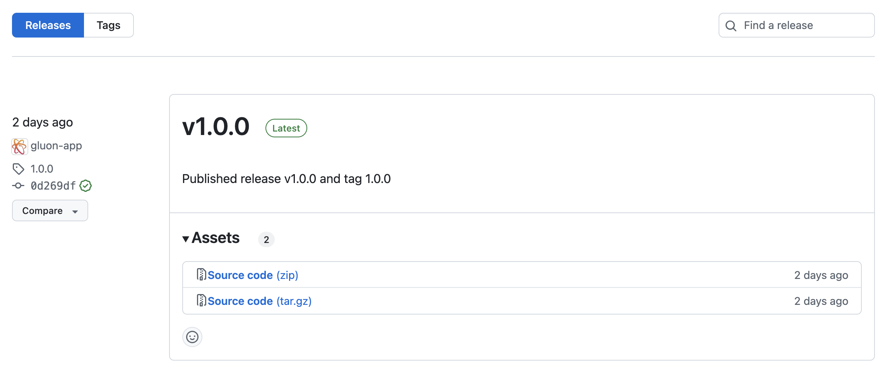

And a new container image has been pushed to the container registry using the same name as the tag of the version:

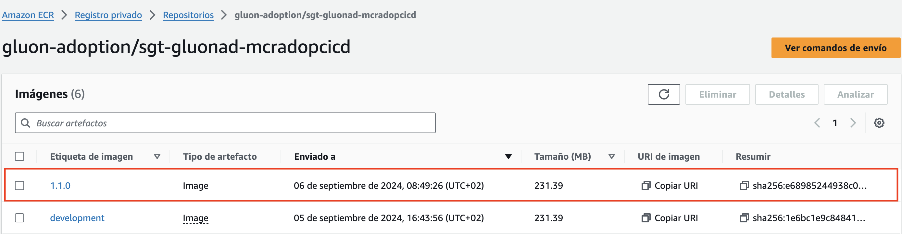

##### PRE and PRO Deployment

The **Deploy Workflow** can be called manually to deploy the KStream in the PRE and PRO environments.

To learn how the common deployment workflow works, applicable to all technologies, you can refer to the [Common CD Workflow](https://gluon.gs.corp/community/docs/latest/application/ci-cd/cd/cd-rm/cd-workflow/) section of the documentation.

#### Retry a deploy

##### Retry a deployment execution

If the **"Container build and push"** job runs successfully and publishes the Release version, you can rerun the deployment workflow.

### Deploy using the Gluon Release Management

Gluon Release Management is a Gluon portal integration process that aims to automate the creation of releases and tasks in Servicenow ITSM, as well as the orchestration of deployment in Github through the portal itself.

For getting to know how to deploy using this tool, please refer to the [Release Management](https://gluon.gs.corp/community/docs/latest/application/release-management/zero-touch/) documentation.

### Trunk Based Development

Now we are going to describe the steps that a user has to perform in order to make a complete cycle, from the construction process (CI) to the deployment through the DEV, PRE and PRO environments (CD)

The cycle explained below is based on **Trunk Based Development**.

#### Quality Gates

We want our KStreams to have the maximum quality in Gluon prior to deployments to production environments, so it will be necessary to have the OK in:

- **Sonar**: Code Quality and test coverage
- **Fortify**: Analysis of the vulnerabilities of our source code
- **Sonatype**: Analysis of the vulnerabilities of our dependencies.
- **Gluon Testing**: Functional tests (Execution of Functional Test with Gluon Testing frameworks after the deployment PRE is successful)

Quality Gates

Without these QG resolved we will only be able to deploy to development environments, being subject to
these validations the pre/production environments.

#### Pull Request from Feature to Main

We will start working on the "Feature" branches of our GitHub repository, and we will be integrating our changes into the main branch.

When we create the **Pull Request** event from our **"Feature" branch to the main branch, the quality.yml (Sonar),
security.yml (Fortify & Sonatype), version-validation.yml (Version Release validation) and archunit.yml
(Darwin Code Analysis Plugin) workflows will be executed automatically.

Next, we detail which steps are executed in each of these two workflows:

##### Quality gate workflow

- **Setup environment variables**: Load the properties defined in properties.env file and in the configuration project.
- **Maven build & Sonar scan**: Executes the default commands of MAVEN_BUILD_GOAL: clean verify


Maven quality gate workflow code

```yaml
name: Quality
on:
  pull_request:
    branches:
      - development
      - develop
      - main
      - master

jobs:
  call-reusable-workflow:
  name: Quality
  uses: santander-group-shared-assets/gln-workflows/.github/workflows/maven-quality.yml@v1
  secrets: inherit
```

##### Security workflow

- **Setup environment variables**:Load the properties defined in properties.env file and in the configuration project.
- **Get the current version from pom**: Read the pom.xml to get the version of the component.
- **SSDLC Onboarding Check**: Check if the component already exists in Fortify SSC.
- **SAST**: Executes the reusable Fortify SAST workflow to perform a SAST scan with Fortify and validate the quality gates.
- **SCA**:Executes the reusable The Sonatype SCA workflow to perform a Sonatype SCA scan and analyze third party components from a repository.
- **Send information to Elasticsearch**:Send data to elasticsearch related with Fortify analysis.
- **Send information to Elasticsearch**:Send data to elasticsearch related with Sonatype analysis.
- **Container build and push**:
  - It takes the feature branch as image version, and sets the environment variable TAG_VERSION with this value.
  - Then execute the command mvn clean package -Dmaven.test.skip=true to build the application artifact.
  - It builds the docker image based on Dockerfile located in the project and makes a push to one or several image registries associated with the Kubernetes infrastructures configured in the environment `cd.yaml` file.
  - It executes a [sysdig scan](https://gluon.gs.corp/community/docs/latest/application/ci-cd/sysdig/).
  - Finally, scan the image vulnerabilities and send the data related to the image build to elasticsearch.

Maven security workflow code

```yaml
name: Security
on:
  pull_request:
    branches:
      - development
      - develop
      - main
      - master

jobs:
  call-reusable-workflow:
    name: Security
    uses: santander-group-shared-assets/gln-workflows/.github/workflows/maven-security-image.yml@v1
    secrets: inherit
```

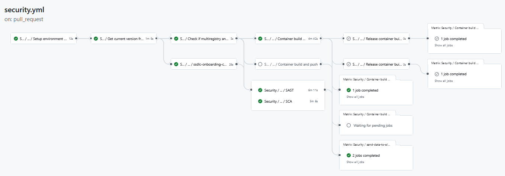

#### Push to Main

When approving the Pull Request of the previous step on the main branch we will generate a push event on this branch and therefore the ci-tbd.yml workflow will be executed automatically.

Next, we detail which steps are executed in this workflow:

##### Integration workflow

- **Setup environment variables**:Load the properties defined in properties.env file and in the configuration project.
- **Resolve version**: Resolve the version of the component.
- **Check if maven uses native build**: Check if it is necessary to configure a native compilation.
- **Maven build and Sonar scan**: Executes the default commands of MAVEN_BUILD_GOAL: clean verify
- **Container build and push**:
  - It takes the feature or development branch as image version, and sets the environment variable TAG_VERSION with this value.
  - Then execute the command mvn clean package -Dmaven.test.skip=true to build the application artifact.
  - It builds the docker image based on Dockerfile located in the project and makes a push to one or several image registries associated with the Kubernetes infrastructures configured in the environment `cd.yaml` file.
  - It executes a [sysdig scan](https://gluon.gs.corp/community/docs/latest/application/ci-cd/sysdig/).
  - Finally, scan the image vulnerabilities and send the data related to the image build to elasticsearch.
- **Send data to elasticsearch** related with the image registries where the image has been published.
- **Create tag and Pre release** Create a tag with the version of the component and generate a pre-release in GitHub.
- **Deploying a development**: This job call to workflow maven-cd-image.yaml for deploy our KStream to cert environment

Maven CI Image workflow code

```yaml
name: Integration
  on:
    push:
      branches:
        - main
        - master

jobs:
  call-reusable-workflow:
    name: Integration
    uses: santander-group-shared-assets/gln-workflows/.github/workflows/maven-ci-tbd.yml@v1
    with:
      technology: 'Java_Maven'
      secrets: inherit
```

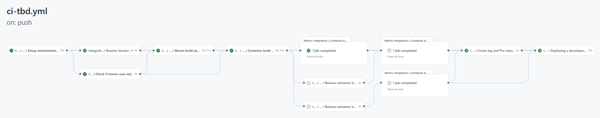

If everything works correctly, we will have our image uploaded to the registry, and we will have the information in Sonar and Fortify.


##### Deploy workflow

To learn how the common deployment workflow works, applicable to all technologies, you can refer to the
[Common CD Workflow](https://gluon.gs.corp/community/docs/latest/application/ci-cd/cd/cd-rm/cd-workflow/) section of the documentation.

If everything works correctly, we will have our image deployed in the CERT environment.


#### Release

When we want to publish a final version, we will do it from the GitHub releases page. First, we select the
previously created version (pre-release or draft version) and then, uncheck the "Set as pre-release" option and
click "Publish release". The release-tbd.yml workflow will run automatically.

##### Release workflow

- **Setup environment variables**: Load the properties defined in properties.env file and in the configuration project. The configuration project is obtained according to the secrets defined here.
- **Getting pre-release id**: Get pre-release version, update version pom in the branch (main or master) with the Release version. Get last commit in the branch.
- **Check if maven uses native build**: Check if it is necessary to configure a native compilation.
- **Maven build & Sonar scan**: Executes the default commands of MAVEN_BUILD_GOAL: clean verify. If you want to overwrite the maven command you can configure in properties.env.
- **SSDLC Onboarding Check**: Check if the component already exists in Fortify SSC.
- **SAST** Executes the reusable Fortify SAST workflow to perform a SAST scan with Fortify and validate the quality gates.
- **SCA**: Executes the reusable The Sonatype SCA workflow to perform a Sonatype SCA scan and analyze third party components from a repository.
- **Send information to Elasticsearch**:Send data to elasticsearch related with Fortify analysis.
- **Send information to Elasticsearch**:Send data to elasticsearch related with Sonatype analysis.
- **Container build and push**:
  - It takes the version from the resolve version job to generate the release identifier as the image version, and sets the environment variable TAG_VERSION with this value.
  - After that, it generates the application and the distribution of the configuration, to continue,
  - It builds the docker image based on Dockerfile located in the project and make a push to one or several image registries associated with the Kubernetes infrastructures configured in the environment `cd.yaml` file.
  - The container images are pushed with the calculated release version tag.
  - It executes a [sysdig scan](https://gluon.gs.corp/community/docs/latest/application/ci-cd/sysdig/).
  - Finally, scan the image vulnerabilities and send the data related to the image build to elasticsearch.
- **Send data to elasticsearch** related to the image.
- **Release container build and push application to production**: Generate tag and push them to the artifact store.
- **Release container build and push application to certification**: Generate tag and push them to the artifact store.
- **Generate tag and release**: Create the release tag and generate the GitHub Release.

Release workflow code

```yaml
name: Release
on:
  release:
    types:
      - published

jobs:
  call-reusable-workflow:
    name: Release
    uses: santander-group-shared-assets/gln-workflows/.github/workflows/maven-release-tbd.yml@v1
    with:
      technology: 'Java_Maven'
    secrets: inherit
```

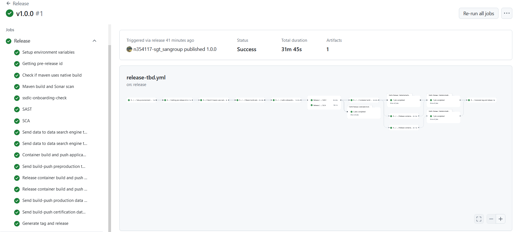

At the end of the workflow, we can see a GitHub Release has been created using the GitHub Tag generated with the Release workflow.


And a new container image has been pushed to the container registry using the same name as the tag of the version:


##### PRE and PRO Deployment

The **Deploy Workflow** can be called manually to deploy the KStream in the PRE and PRO environments.

To learn how the common deployment workflow works, applicable to all technologies, you can refer to the [Common CD Workflow](https://gluon.gs.corp/community/docs/latest/application/ci-cd/cd/cd-rm/cd-workflow/) section of the documentation.

#### Retry a deploy

##### Retry a deployment execution

If the **"Container build and push"** job runs successfully and publishes the Release version, you can rerun the deployment workflow.

### Deploy using the Gluon Release Management

Gluon Release Management is a Gluon portal integration process that aims to automate the creation of releases and tasks in Servicenow ITSM, as well as the orchestration of deployment in Github through the portal itself.

For getting to know how to deploy using this tool, please refer to the [Release Management](https://gluon.gs.corp/community/docs/latest/application/release-management/zero-touch/) documentation.

## Fix/Release Flow

We are now going to describe the **Fix/Release (FR)** workflow, which allows us to manage incidents and
updates in production environments while development remains active in other branches. This flow enables quick fixes
and efficient deployment of new versions without affecting regular development cycles.

The **FR** workflow complements existing workflows such as **GitFlow** or **Trunk-Based Development**,
providing a specific process to handle critical incidents and updates.

### General Overview of the Flow

The **Fix/Release (FR)** flow behaves the same in both **Trunk-Based Development (TBD)** and
**GitFlow Workflow (GFW)** strategies, even though it is implemented differently in each:

#### In Trunk-Based Development (TBD)

In TBD, no new specific user workflows have been created. Instead, the `ci-tbd.yml` user workflow has been
updated to also run on branches following the pattern `release-v[0-9]+.[0-9]+.[xX]`. This allows the FR workflow
to be managed in TBD without additional workflows.

#### In GitFlow Workflow (GFW)

In GFW, two new user workflows have been added specifically for the FR flow:

- **Workflow** `ci-fix-gfw`: This workflow operates on the `release-v[0-9]+.[0-9]+.[xX]` branch and internally calls
the TBD reusable workflows.
- **Workflow** `release-fix-gfw`: This workflow is triggered when a pre-release or release is manually published
(not generated by a bot). Once activated, it internally calls the reusable TBD workflows to handle release to
pre-production or production environments.

#### Workflow Common to Both Strategies

- **Workflow** `create-release-branch.yml`: This is a manual-executable user workflow that creates a new branch `release-v[0-9]+.[0-9]+.[xX]` from a specified tag.

### How to Launch the Fix/Release (FR) Flow

The Fix/Release (FR) flow allows managing production fixes similarly to TBD, but with a dedicated
`release-vX.X.x` branch instead of `main` or `master`.

Below is a diagram illustrating the flow, and after that, we will explain the steps in detail.

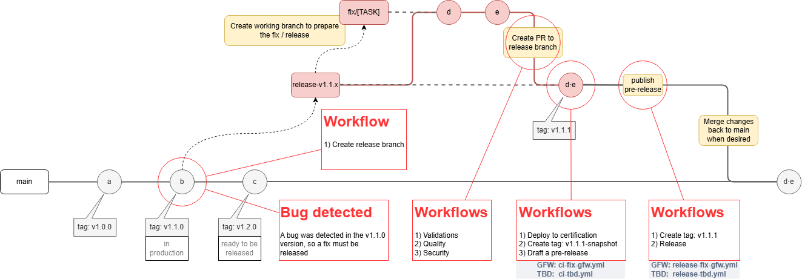

The basic steps are:

1. **Create the Release Branch**:
   - Run the `create-release-branch.yml` workflow manually, specifying the **tag** from which the branch will be
   created (e.g., `1.0.1`) and the target **version** where you want to apply the changes in the format
   `[0-9]+.[0-9]+.x`. This will create a `release-vX.X.x` branch (in this case, `release-v1.0.x`) starting from
   the specified tag `1.0.1`, from which fixes will be managed.

2. **Create and Merge** `fix/` **Branches**:
   - For each fix, create a `fix/[TASK]` branch and open a **Pull Request (PR)** to `release-vX.X.x`.
   - **Automatic Workflow Execution**: When the PR is created, the associated workflows for **version verification**, **quality checks**, and **security validations** will automatically run.
   - Once the PR is merged into `release-vX.X.x`, the `ci-fix-gfw.yml` or `ci-tbd.yml` workflow (depending on the strategy) will be triggered, generating a draft pre-release in GitHub and deploying the version to the certification environment.

3. **Publish the Pre-Release**:
   - After validating the pre-release, publish it. This will trigger the `release-fix-gfw.yml` or `release-tbd.yml` workflow, managing the release in pre-production or production environments.
