This local template provides a way to manage the API software to be deployed into the
Apigee Santander Spain architecture. Contains the product deployment and the reporting
to the API Registry.

**This template is intended to be for Spain use only.**

## Prerequisites

- Have a valid appKey in the darwin catalog developer portal registry that exists in all environments.
- Have a Third-Party API to be deployed (API First implementation).
- Have OAM component updated with deployment environments for APIGee deployment included (must contact DEVOPs to update this component).
- Have credentials to configure secrets to allow workflows to deploy API into any APIGEE configured environment (DEVOPs must configure repository secrets).

## Create Component

First, you have to [**onboard your application.**](../../../../../../application/application-management/application-onboard.md)
Once you have your application created, you can start creating your **API Third-Party Deployment (APIGEE)** component.

To create the component, follow these steps:

- The first step is to create a component using the Gluon portal. Gluon platform creates sample files to
configure the repository to run wonflows successfully.  Further changes must be done after to indicate where
to deploy the APIs referencing OAM environments for certification, preproduction and production. 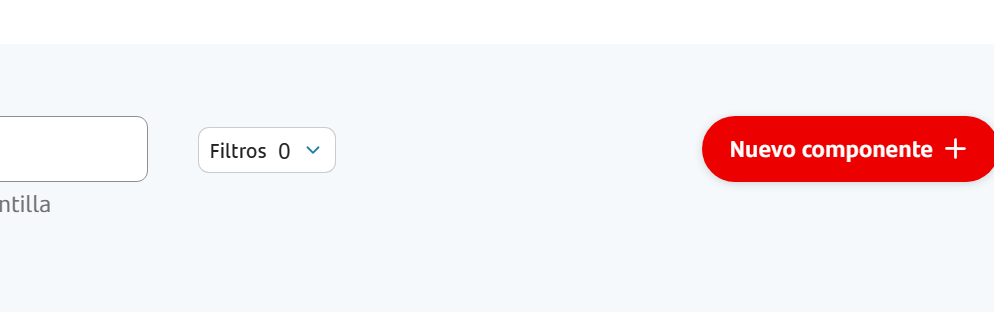

- Select the component type to be created, for this search **API Third-Party Development (APIGEE)**. 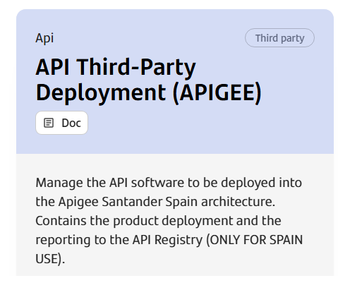

- Fill in the form providing a component name, short name and description. 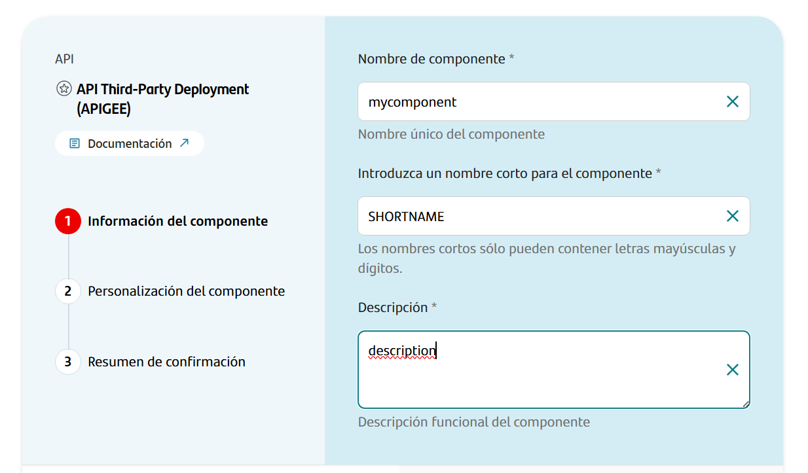
    - **Component name:**  Long name we want the component to appear in the gluon portal component list of
    the application. Following the convention, assign a name that reflects the environment and functionality.
    - **Short name:** Upper case short name for the component. As for other components. **NOTE: component short name must not have more than 16 characters.**
    - **Description:** Required field to provide  a description for the component. This is useful to have a better catalogation of each component.

- Click continue to navigate to next form step with custom API information and branch strategy. 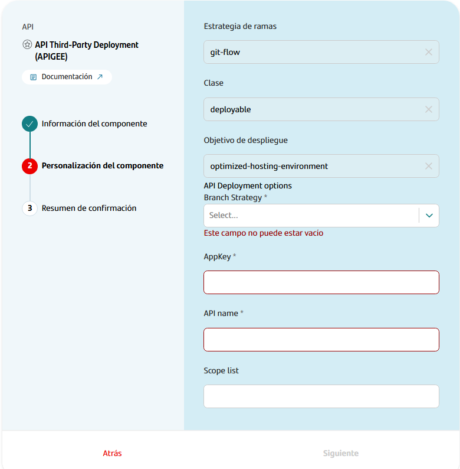

- Fill in the custom API component information in the **API Deployment options** block.
    - **Branch Strategy**.- For this type of components the branch strategy will always be set to **Trunk Based Development**.
    - **AppKey**.- Provide here the value of the **appKey** registered in the darwin catalog
    developer portal registry in all environments where the API will be published. The value provided here
    will be set in the git repository file `deployments/deployment/configDeployment.json`. This file can be
    updated later.
    - **API name**.- This will be the name of the API we want to publish using the provided workflows. It
    is mandatory for new components to follow the pattern `^[a-z]+(_[a-z]+)*_v[1-9]\d*$` or in
    other words, list of words split by a underscore and ending with a vX version suffix where X is a
    number, as an example `my_api_v1`.
    - **Scope list:**.- optional field to provide a comma separated list of scopes that will be filled in the
    file `deployments/deployment/configDeployment.json` scopes attribute, that will be notified to the Darwin
    Registry Portal for further documentation. The value can be changed after creating the component by
    modifying the file in the repository.
    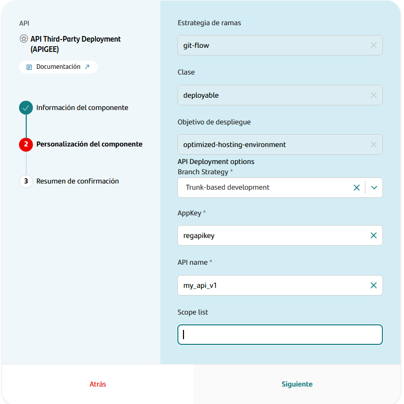

- Review resume to ensure the provided information is correct before clicking create.

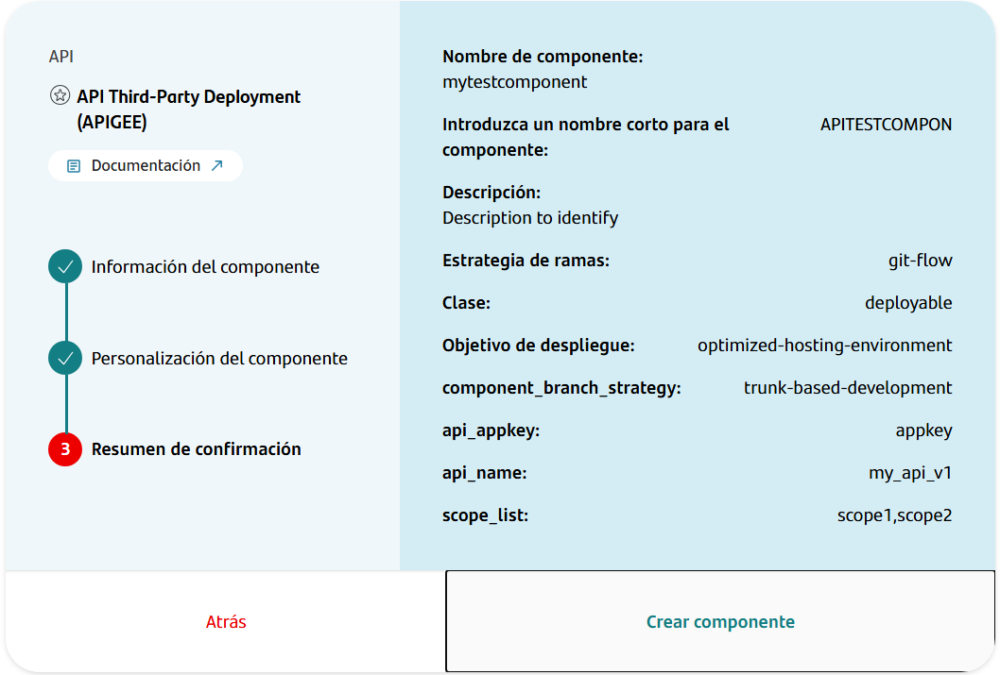

- Click create component and wait for the component to be in a Ready state.

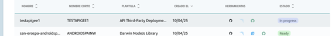

## OAM Configuration

The configuration of the APIGEE regions in the OAM Model repository is based on the gluon configuration, but
simplifying it to has only the minimum required properties.
**NOTE.- this information must be filled in the OAM component by a DEVOPs and is needed by workflows to be able to perform the API deployment**

```yaml
environments:
  - name: cert
    type: certification
    infrastructures:
      - id: CITEST0000001
        properties:
          type: APIGEE
          credentialUserId: APIGEE_USER_DEV
          credentialPassId: APIGEE_USER_DEV_PASS
          manager-url: https://api-management.sgtech.dev.corp
          organization: canalesdigitales
          execution-environment: intranet
```

Let's take a look to the environment properties that need to be defined to deploy Third-Party API:

| **Property**        | **Description** |
|---------------------|--------------|
| **type** | User environment type, must be **APIGEE** for this component. |
| **credentialUserId** | The name of a secret containing the username to authenticate with the API Manager for this environment. |
| **credentialPassId** | The name of a secret containing the password for the user required to authenticate with the API Manager for this environment. |
| **manager-url** | The API Manager host URL to access the instance associated with this environment. The instance where the API software will be deployed. |
| **organization** | The API Manager organization where the software will be deployed inside the API Manager. |
| **execution-environment** | The execution environment inside the API Manager instance where the software will be deployed. Valid values for this are `intranet` and `internet`. This will also identify the KVM folder to use for this region. |

**NOTE.-** There will be no need to configure secrets to access APIGee at repository level if we use the ones
in the list below as they are configured at organization level.

- **APIGEE_USER_DEV**.- credential to use as **crendentialUserId** to access development environment.
- **APIGEE_USER_DEV_PASS**.- credential to use as **credentialPassId** to access development environment.
- **APIGEE_USER_PRE**.- credential to use as **crendentialUserId** to access preproduction environment.
- **APIGEE_USER_PRE_PASS**.- credential to use as **credentialPassId** to access preproduction environment.
- **APIGEE_USER_PRO**.- credential to use as **crendentialUserId** to access production environment.
- **APIGEE_USER_PRO_PASS**.- credential to use as **credentialPassId** to access production environment.

You can get more information about Gluon OAM configuration [here](../../../../../../components/software/api/framework/infrastructure/oam-configuration.md)

## Continuous Integration Configuration

The **properties.env** file contains the configuration for the CI/CD pipeline. It is generated automatically. The parameters that are configured by default are:

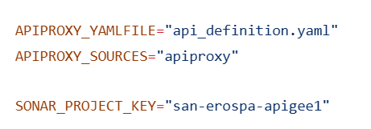

| **Variable**        | **Required** | **Description** | **Example value**               |
|---------------------|--------------|-----------------|---------------------------------|
| **SONAR_PROJECT_KEY** | true         | Project key in Sonar | sgt-adtopt-mynewcomponent |
| **APIPROXY_YAMLFILE** | true         | Path to the API definition file inside repository | api_definition.yml |
| **APIPROXY_FOLDER** | true         | Path where the API files are stored | apiproxy |

???+ info "Important information"

    **APIPROXY_FOLDER** must be set to **apiproxy** as it's required by APIGEE to perform API import successfully.

    **APIPROXY_YAMLFILE** can be updated to match the API definition file.

    **SONAR_PROJECT_KEY** value is generated by gluon and must not be changed.

## Continuous Deployment Configuration

In the folder `.gluon/cd` we can configure the environments from the OAM model repository configured for the gluon application.

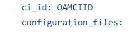

???+ info "Important information"

    As a standard, the template will create `cert`, `pre` and `pro` folders inside the `.gluon/cd` folder to
    perform deployments to `certification`, `preproduction` and `production`.
    
    In each `cd.yml` file we must configure the `CI_ID` taken from the OAM that identifies the desired region
    where to deploy API.

    More information [here](https://santandernet.sharepoint.com/sites/tech-platform-spain/SitePages/Pipeline-Apigee-Local-Gluon.aspx#configuraci%C3%B3n)

## API Configuration

Lets take a look of the files related to the API itself included in the repository after component creation.

### API definition file

In the root folder of the repo a file named `api_definition.yml` file will be created.
This file is provided as a example, and will come with the field `info->title` filled with the value
provided for `API Name` during the component creation process. The file will also be used to retrieve
the version of the API to be deployed.

```yaml
info:
  title: my_api_name_v1
  version: 1.0.0
```

This file must be updated with a **openapi 3.0.x - OAS3** definition for the API in **YAML** format, that will be
used to register the API in the Darwin Registry Portal.

- **info.title:** Will be used to retrieve the API name. A file with this value and xml extension must exist
in the root of the **APIPROXY_SOURCES** folder as this will be validated by workflows.
- **info.version:** This value will be used as the API version. No version.txt file is required in the
repository as it was required in nextgen workflow version.

???+ info "Naming convention"

    It is required to follow the pattern `^[a-z]+(_[a-z]+)*_v[1-9]\d*$` or in other words, list of words
    split by a underscore and ending with a `vX` version suffix where `X` is a number, as an example
    `my_api_v1`.

    This pattern is mandatory for new components. If you are migrating an existing nextgen API take
    this into account as it can become mandatory in further releases of the template, os it's recommended to
    start planning the changes required to match naming convention and prevent further issues.

    It is the domain's responsibility to have a properly catalogued API.    

### API Environment Customization

APIGee provides two options to allow developers to adapt API to work in different environments:

- Key value maps (KVMs)
- XML Properties (setProperties.xml)

#### Key value maps (KVMs)

To make the API work in any environment the manager allows to use what it's known as `keyvaluemaps`. This
files allow users to configure values that will change between environments in the API definition, and will
be these KVM files the ones doing the job.

| **KVM folder**        | **Description** |
|---------------------|--------------|
| **kvms_dev** | Folder where to place KVMs to use for the **certification** environment |
| **kvms_pre** | Folder where to place KVMs to use for the **preproduction** environment |
| **kvms_pro** | Folder where to place KVMs to use for the **production** environment |

Each of those folders will contain two subfolders, one for the `intranet` and one for the `extranet` API
manager environments, and we will use the one needed for our API product.

The user should identify which one is the required one and fill the `kvms.json` file and/or
`setProperties.xml` files in it. As a tip here, the right folder to use is the one we set in the
OAM configuration `execution-environment` property for the APIGEE infrastructure properties.

```json
[
  {
    "name": "my_var_name_plain",
    "value": "my_var_value"
  },
  {
    "name": "value_from_gh_secret",
    "value": "ghsec.MY_REPO_SECRET"
  }
]
```

In the example we can see the format is a JSON array with entries providing name/value pairs.
We have two options to provide values in the file

| **Value entry**        | **Description** |
|---------------------|--------------|
| **Plain text values** | Used to provide a value that is not confidential, we can just set it in plain text in the value field of the KVM entry. |
| **Confidential values** | Used to provide confidential values that the workflow will replace with the referenced secret value. The prefix **ghsec.** will tell workflow the entry is a reference to a GH secret |

???+ info "Confidential values"

    When a value starts with the prefix **ghsec.** workflows will remove this prefix from the value
    and get the value of the secret referenced after prefix.

    As an example, if we set value to **ghsec.MY_REPO_SECRET** the workflow will get the **MY_REPO_SECRET**
    secret and replace the value with the secret value before publishing the KVM to the API manager.

More information about KVM can be found [here](https://santandernet.sharepoint.com/sites/tech-platform-spain/SitePages/Apigee-data-storage---Key-value-map.aspx)

#### XML Properties (setProperties.xml)

As an alternative to the use of `KVM` APIGee allows the use of `setProperties.xml` files. In this case the
user has to provide a `setProperties.xml` file inside the execution environment KVM folder for this API.

```xml
<AssignVariable>
    <Name>propertyTextPlain</Name>
    <Value>https://url</Value>
</AssignVariable>
<AssignVariable>
    <Name>propertyFromSecret</Name>
    <Value>ghsec.MY_REPO_SECRET</Value>
</AssignVariable>
```

In this case we must provide a list of `AssignVariable` name/value pairs in XML format in the
`setProperties.xml` file. As in the case of KVM files we have two options available to do it.

| **Value entry**        | **Description** |
|---------------------|--------------|
| **Plain text values** | Used to provide a value that is not confidential, we can just set it in plain text in the Value field of the AssignVariable entry. |
| **Confidential values** | Used to provide confidential values that the workflow will replace with the referenced secret value. The prefix **ghsec.** will tell workflow the entry is a reference to a GH secret |

???+ info "Confidential values"

    When a value starts with the prefix **ghsec.** workflows will remove this prefix from the value
    and get the value of the secret referenced after prefix.

    As an example, if we set value to **ghsec.MY_REPO_SECRET** the workflow will get the **MY_REPO_SECRET**
    secret and replace the value with the secret value before publishing the KVM to the API manager.

More information about setProperties can be found [here](https://santandernet.sharepoint.com/sites/tech-platform-spain/SitePages/Apigee-data-storage---Key-value-map.aspx#assignmessage-setproperties)

### API Proxy Folder

A further step must be done by the user, and is to provide the API implementation to the repository.
This implementation must be placed in the folder `apiproxy` in the root of the repo (the user must create
it and provide the content). More information can be found [here](https://santandernet.sharepoint.com/sites/tech-platform-spain/SitePages/APIs-deployment-in-practice.aspx)

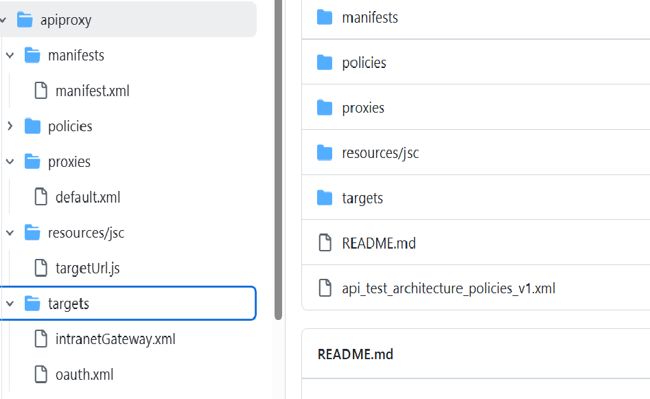

Workflows will validate the structure inside this folder and alert of any issue detected to the user during
the PR validations.

The main validatiosn that will be perform by workflows are the following:

- An xml file with the name of the api must exists in the `apiproxy` root.
- A `manifests` folder exist in the `apiproxy` folder and contains a `manifest.xml` file.
- A folder with name `policies` must exist in the `apiproxy` folder.
- A folder named `poxies` must exist in the `apiproxy` folder and must contain one or more xml files.
- A folder named `resources` must exist inside `apiproxy` folder.
- A folder named `targets` must exist inside `apiproxy` folder and contain files.

More information about validations [here](https://santandernet.sharepoint.com/sites/tech-platform-spain/SitePages/Pipeline-Apigee-Local-Gluon.aspx#validaciones-ci-cd)

### Config deployment file

Inside the folder `deployments/deployment` the template will create a file called `configDeployment.json` with a content similar to the one shown below

```json
{
  "approvalType":"auto",
  "scopes": ["SCOPES_PROVIDED_IN_FORM"],
  "attributes": [
    {
      "name":"appKey",
      "value":"APPKEY_PROVIDED_BY_FORM_CREATION"
    }
  ]
}
```

| **KVM folder**        | **Description** |
|---------------------|--------------|
| **SCOPES_PROVIDED_IN_FORM** | The value will be the requested value by the template form with a comma separated list that will be transform into json format. |
| **APPKEY_PROVIDED_BY_FORM_CREATION** | The value will be filled with the appKey provided by the user during the component creation process. |

The file can be modified after the component is created to adapt the provided values. The scopes defined in this file will be notified into the API Registry to be documented.

More information can be found [here](https://santandernet.sharepoint.com/sites/tech-platform-spain/SitePages/Pipeline-Apigee-Local-Gluon.aspx#configuraci%C3%B3n)

## Workflows

When the component is created using the local component template, the following workflows will be added to the repository.

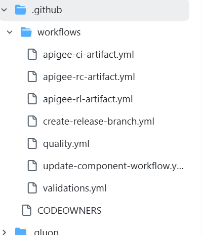

- `apigee-ci-artifact.yml`: This workflow is triggered when a push is made to a **feature** branch,
performing required validations and deploying API into the **certification** environment. If we create a
**development** or **develop** branch the workflow will be also triggered when a push is done to this
branches.
- `apigee-rc-artifact.yml`: This workflow will be triggered when a **Pull Request** is merged into
**main** or **master** branch, and will perform the required validations and deployment into the
**preproduction** environment.
- `apigee-rl-artifact.yml`: This workflow will be triggered when a **Draft release** is published. It can
be also triggered manually by user to redeploy a version previously tagged to a target environment.
- `quality.yml`: This workflow will be triggered when a **Pull Request** is created targeting the
**main**, **master**, **development** or **develop** branch, and will execute a **Sonar** scan over the API
files to ensure code quality.
- `validations.yml`: This workflow will be triggered when a **Pull Request** is created targeting the
**main**, **master**, **development** or **develop** branch, and will perform a validations over repository structure.
- `update-component-workflow.yml`: Workflow to be triggered manually to update workflows provided by the template.
- `create-release-branch.yml`: This is a manual-executable user workflow that creates a new branch release-v[0-9]+.[0-9]+.[xX] from a specified tag.

### Api snapshot deployment

This workflow is the actor that performs deployments into de certification environment. It is triggered when a push to a feature or development branch is done.
The list of branches that trigger the workflow are the following:

- develop
- development
- feature/*

If we push a commit to any of this branches, the workflow execution will be triggered to deploy the API in the configured certification environment.

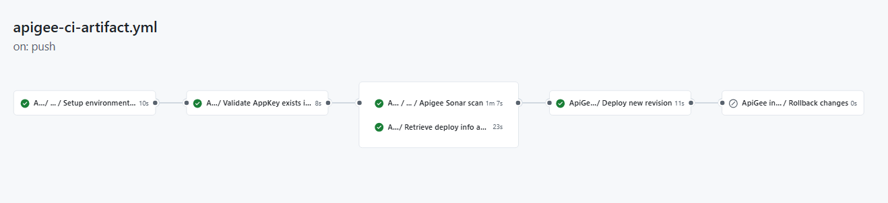

- **Setup environment variables:** retrieves configuration required by the workflow to work.
- **Validate AppKey exists in registry:** performs validations to the repository structure and values provided by the user to ensure they are valid.
- **Apigee Sonar Scan:** executes sonar validations to ensure the quality of the API files in the repository.
- **Retrieve deploy info and extra validations:** as it name tells, it retrieves the deploy configuration from the OAM repository and perform some extra validations on the repository files.
- **Deploy new revision:** performs the deployment into the API Manager assigned to the certification environment configured in the repository.
- **Rollback changes:** performs rollback if something went wrong.

### ApiGee release candidate artifact

This workflow is the actor that performs deployments into the preproduction environment.
It is triggered when a push to main branch is done. As this is a protected branch, the workflow will
trigger when a Pull Request that targets main branch is merged into the main branch.
The list of branches connected to the workflow are the following:

- main
- master

When a Pull Request is integrated into the main/master branch, a push event is triggered in the repository and the workflow starts executing,
promoting the software in main branch to the preproduction environment.
Additionally to the snapshot workflow, this workflow creates a tag and a release candidate in draft/prerelease.
This release candidate will allow us to trigger the release workflow to perform deployments into production environment.

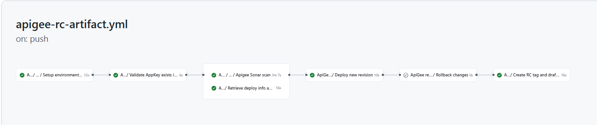

- **Setup environment variables:** retrieves configuration required by the workflow to work.
- **Validate AppKey exists in registry:** performs validations to the repository structure and values provided by the user to ensure they are valid.
- **Apigee Sonar Scan:** executes sonar validations to ensure the quality of the API files in the repository.
- **Retrieve deploy info and extra validations:** as it name tells, it retrieves the deploy configuration from the OAM repository and perform some extra validations on the repository files.
- **Deploy new revision:** performs the deployment into the API Manager assigned to the certification environment configured in the repository.
- **Rollback changes:** performs rollback if something went wrong.
- **Create RC tag and draft release:** creates a tag with a RCX suffix for the version we are currently
working with, where X is a counter from 1 to N. It also creates a draft release linked to the tag created.

### ApiGee release artifact

This workflow is triggered when a release is published in github. The release candidate workflow ends up creating a release in draft status in the github repository.
By editing the release and changing the state from pre-release to published release.

The following image shows how to access the edit form of an existing pre-release inside the github repository, as shown in the image, just click the edit button.

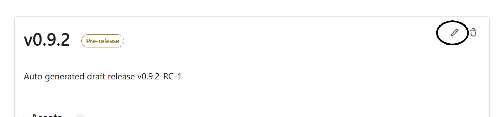

After that, once in the edit form of the release, uncheck the pre-release checkbox and press the Update release button.

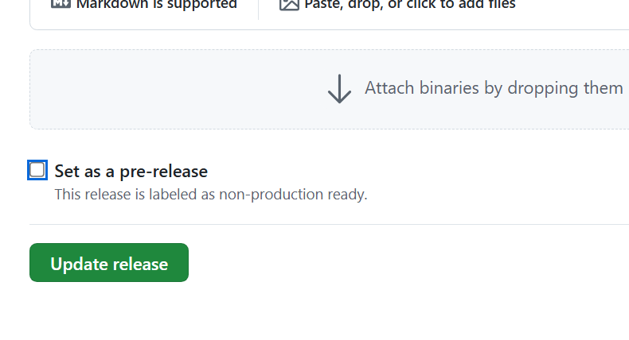

Once the release is published the release workflow will start executing.
In this case, the workflow will stop in the deploy API job waiting for an approver for that environment.

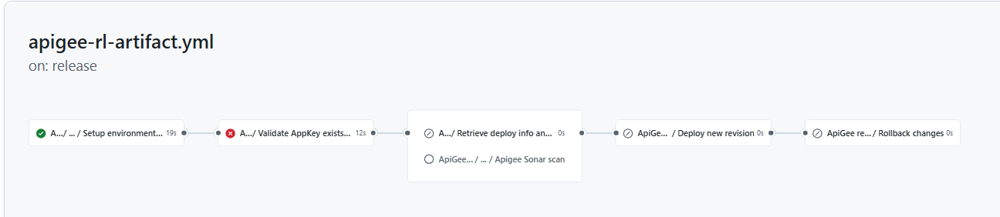

- **Setup environment variables:** retrieves configuration required by the workflow to work.
- **Validate AppKey exists in registry:** performs validations to the repository structure and values provided by the user to ensure they are valid.
- **Apigee Sonar Scan:** executes sonar validations to ensure the quality of the API files in the repository.
- **Retrieve deploy info and extra validations:** as it name tells, it retrieves the deploy configuration from the OAM repository and perform some extra validations on the repository files.
- **Deploy new revision:** performs the deployment into the API Manager assigned to the environment configured in the repository.
The workflow will wait for an approval to approve the deployment to production environment.
- **Rollback changes:** performs rollback if something fails during deployment.

#### Redeploy an existing version

To allow to redeploy older versions in any environment, the release workflow can be called manually including the environment and version to deploy as user inputs.

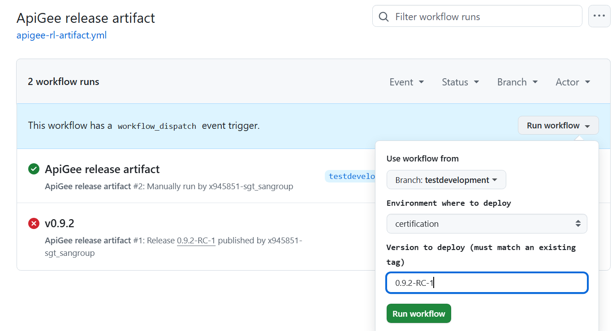

The version must match an existing tag, and the environment can be selected from the options available.
In case we select production as the target environment, an approval will be required prior to perform the deployment.

### Quality

This workflow is triggered when a Pull Request is created and will execute sonar scan.

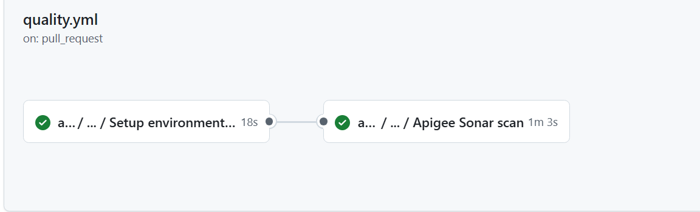

The aim of this workflow is to ensure the quality of API files.

### API Validations

This workflow is also triggered when a Pull Request is created, and will execute validations to ensure the repository has the required structure and files

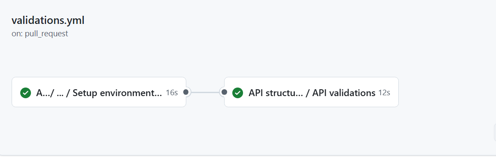

The aim of this workflow is to help users to identify any possible issues before merging changes into an integration or main branch of the repository.

### Update

This workflow is added by default in any local component template, and its intended to be used when
a component update is required, for example, to update the user workflows in the repository.
As it is not API related we will skip this.

### Create Release Branch

This is a manual-executable user workflow that creates a new branch release-v[0-9]+.[0-9]+.[xX] from a
specified tag.
