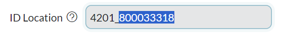

Gluon Applications is a set of components that need to be released together to provide business value. The information required for the creation of an application is detailed in the following sections.

### Gluon SCF companies

The first step in this process entails selecting the appropriate Gluon Company that aligns with your project from the list provided below.

| SCF Gluon Companies                                                                    |
| -------------------------------------------------------------------------------------- |
| [Santander Consumer Austria](https://gluon.gs.corp/gluon/companies/76)                 |
| [Santander Consumer Belgium](https://gluon.gs.corp/gluon/companies/49)                 |
| [Santander Consumer Benelux](https://gluon.gs.corp/gluon/companies/50)                 |
| [Santander Consumer ESP](https://gluon.gs.corp/gluon/companies/15)                     |
| [Santander Consumer Finance Global Services](https://gluon.gs.corp/gluon/companies/48) |
| [Santander Consumer Germany](https://gluon.gs.corp/gluon/companies/13)                 |
| [Santander Consumer HQ](https://gluon.gs.corp/gluon/companies/16)                      |
| [Santander Consumer Italy](https://gluon.gs.corp/gluon/companies/64)                   |
| [Santander Consumer Mobility Services](https://gluon.gs.corp/gluon/companies/60)       |
| [Santander Consumer Nordics](https://gluon.gs.corp/gluon/companies/77)                 |
| [Santander Consumer Operations Services DE](https://gluon.gs.corp/gluon/companies/71)  |
| [Santander Consumer PT](https://gluon.gs.corp/gluon/companies/39)                      |
| [Santander Consumer Technology Services DE](https://gluon.gs.corp/gluon/companies/70)  |
| [Santander Consumer UK](https://gluon.gs.corp/gluon/companies/40)                      |
| [Santander Consumer UK](https://gluon.gs.corp/gluon/companies/40)                      |
| [Santander Consumer Western Europe](https://gluon.gs.corp/gluon/companies/14)          |
| [Hyundai Capital Bank Europe](https://gluon.gs.corp/gluon/companies/72)                |

### Target APM Technical

To proceed, the next step involves identifying the specific Technical APM code linked to your project.
Gluon offers a comprehensive step-by-step guide to assist you in locating this technical APM.
You can access the guide through this [link](https://gluon.gs.corp/community/docs/latest/application/application-management/application-onboard/#how-to-discover-the-target-application-identifier).

???+ info "Target APM Technical"

    It is possible that once the APM Technical of your project is found, gluon does not recognize it as valid when generating the application. This is because the APMT does not work for older applications, in which case the number after the bottom bar of the “ID Location” field should be used.

    

### Creating application and request Application Owner(s)

Any owner or admin of your company can create your application with your APMT code and your application alias (the alias can have a maximum of 7 characters consisting of letters and numbers).
For this purpose, it is recommended to contact *Gluon Champion* in Santander Consumer, José Luis Martínez Bustos.

In turn, it requests the creator of the application to assign as Application Owner(s) to the appropriate person(s).
The Application Owner is in charge of application team management.

### Application team management

The application team members manage the lifecycle of the application components (creation, sdlc, releases...), and any capability offered within your Gluon application.
The Application Owner will be in charge of including people in the different
[Microsoft Entra ID teams](https://gluon.gs.corp/community/docs/latest/application/application-management/application-owners-management/#application-teams-in-microsoft-entra-id), under the roles:

- Developer
- Technical Lead
- Product Owner
- Asset Owner

### Components creation and lifecycle management

A component is a modular and independent unit that is part of a Gluon application that has a representation in the following tools:

- **GitHub**: A component will always have an associated code component.
- **APM**: Every component should be cataloged in the APM tool in SNow.
- **Security Assurance**: Depending on the technology, the component should have an associated Fortify project that ensures the security of the component being built under Gluon.
- **Quality Assurance**: Depending on the technology, the component should have an associated Sonar project that ensures the quality of the component built under Gluon.

Check our curated list of [SCF Brownfield Templates](../local-components/index.md).

The migration of source code repositories associated with Jenkins pipelines to Gluon components, comprehensive technical documentation has been developed to support the adaptation for different technologies.
This specific documentation on code migration will reference the official Gluon component documentation, which offers a comprehensive overview of the lifecycle.
