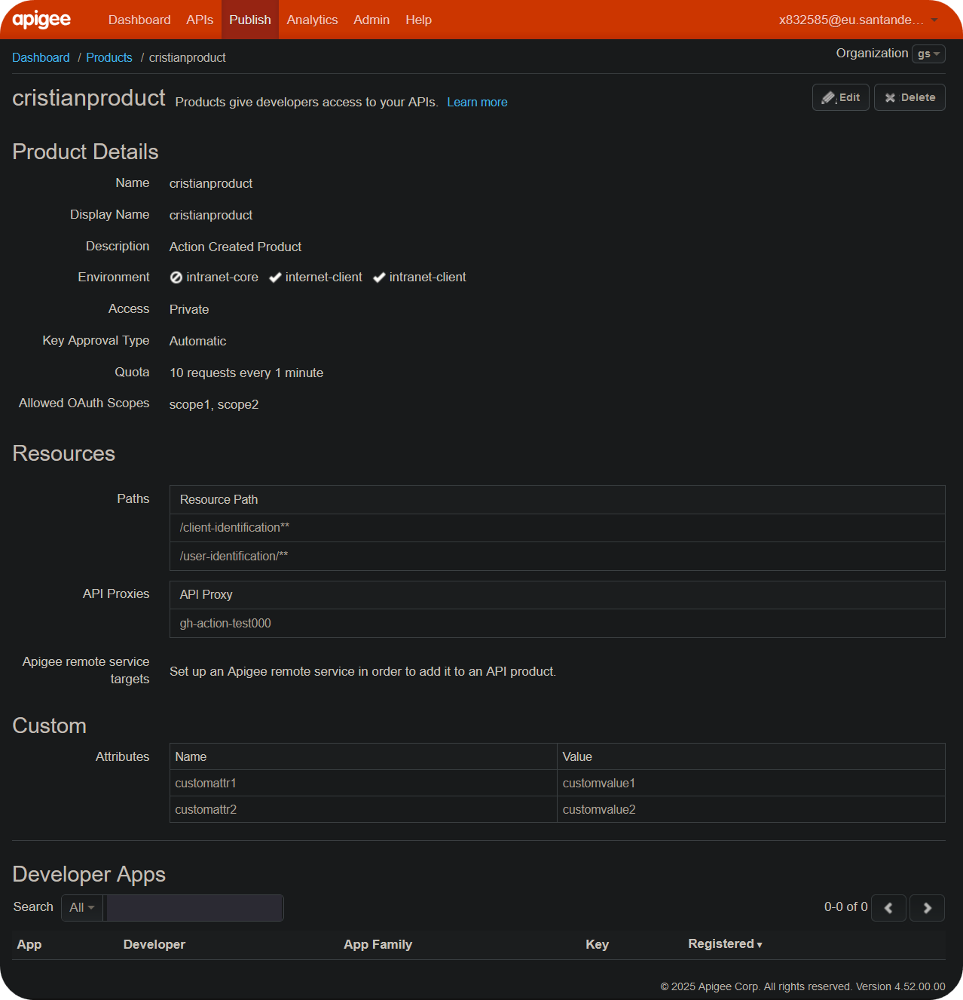

## Overview

This guide details how to use the `Apigee Product Pipeline` to deploy an API Product. It works best when paired with the `(SCF) Apigee` template.

## Prerequisites

Before using this pipeline, ensure you meet the following requirements:

1. **Gluon Application Setup**: You must have an application properly onboarded in Gluon Portal where you can create and manage your components.

2. **Pre-deployed API Proxies**: Most importantly, you must have your API proxies already deployed in Apigee. This component is specifically designed to create and deploy Apigee products for those existing proxies.

Once the proxies and required resources are deployed, the product creation takes place.

## Gluon Portal

To begin, you must onboard your application by setting it up within the system. Once your application is successfully created and onboarded, you can proceed to create your component.

To create a component, follow these detailed steps:

1. **Select the Component Type**:
    First, choose the type of component you wish to create. In this example, we will use **(SCF) APIGEE** as an example, but make sure to search for and select the template for the component you are building.

    

2. **Fill in Component Details**:
    Next, you will be prompted to fill in the necessary details for your component. This includes:
    - **Name**: Provide a unique and descriptive name for your component.
    - **Short Name**: Short names can only contain capital letters and digits.
    - **Description**: Write a detailed description that explains the purpose and functionality of the component.
    - **Branch Strategy**: Choose a branch strategy for your component's repository. The recommended branch strategy for this template is `git flow`, which helps manage the development workflow efficiently.

    

3. **Configure Apigee Product-Specific Settings**:
    When creating an SCF Apigee Product component, you will be prompted to provide the following configuration fields:

    | Field | Description | Required | Example |
    |-------|-------------|----------|---------|
    | **Apigee Planet** | Select the Apigee planet for deployment | Yes | Western Hub (`aws`), Germany (`ger`), New Landing Zone (`new-landing`) |
    | **Apigee Organization** | The Apigee organization name | Yes | `gs` or `cgs-ccoe` |
    | **Environments** | Comma-separated list of environments | Yes | `internet-client,intranet-client` |
    | **Proxies** | Comma-separated list of proxies assigned to the product | Yes | `proxy1,proxy2` |
    | **Scopes** | Comma-separated OAuth scopes | No | `scope1,scope2` |
    | **Product Name** | The name of the product | Yes | `product_santander_sample_001` |
    | **Approval Type** | Select auto or manual approval | Yes | `auto` or `manual` |
    | **Access Level** | Select public, private, or internal access | Yes | `private` |

    ???+ info "Configuration Usage"
        These values will be used to pre-populate the `deployment.yaml` file in your repository with the initial product configuration for the CERT environment. You can modify these values later and add configurations for other environments (PRE, PRO).

By following these steps, you will have successfully created a new component that will be ready for further development within the GitHub repository.

## Description

The workflow automates key steps in deploying API Products, including validation, generation, and deployment across multiple environments.
This pipeline ensures consistency, security, and efficiency while providing ease of use and persistence, with the ability to roll back to previous versions using GitHub tags.
The system provides flexibility in configuration, allowing deployment of different resources with multiple proxies and scopes across various Apigee planets based on architectural requirements.

???+ info "Integration with Apigee Proxy Pipeline"

      This workflow is designed to work seamlessly with the Apigee Proxy Pipeline. The unified pipeline utilities ensure consistent behavior across both proxy and product deployments.

### Credentials

???+ warning "Warning"

      Before jumping into configurations, **ALL** credentials required to deploy in the environments are necessary. If you lack access to the GitHub Secrets repository creation, contact your assigned `DevOps Engineer` to resolve this, or any administrator of your GitHub organization if needed.

The workflow requires specific credentials specified as GitHub Actions Secrets in the repository:

| Secret Name                  | Description                                      |
|------------------------------|--------------------------------------------------|
| `APIGEE_TOKEN_DEV`           | Token for the APIGEE management endpoint in DEV. |
| `APIGEE_TOKEN_PRE`           | Token for the APIGEE management endpoint in PRE. |
| `APIGEE_TOKEN_PRO`           | Token for the APIGEE management endpoint in PRO. |
| `APIGEE_PAT`                 | Token created for analytics & logging purposes.  |

_APIGEE_PAT_ is a `private` token that should not be shared. Therefore, it should be set at the organization level as a globally accessible variable if it is missing. For more information, [contact the owner.](#contact)

#### Generate tokens

  ```bash
  echo -n "user@mail.com:password" | base64
  dXNlckBtYWlsLmNvbTpwYXNzd29yZAo=
  ```

The encoded string is what you will use for the different `$ENV` secrets. You can read more about secrets in the [GitHub documentation page](https://docs.github.com/en/actions/security-for-github-actions/security-guides/using-secrets-in-github-actions).

### Secrets Configuration

There are three types of secrets in GitHub.com:

- **Organization secrets**: Secrets that can be used by all repositories in the organization
- **Repository secrets**: Secrets that can be used only by the repository
- **Environment secrets**: Secrets that can be used only by the repository and the environment

#### How to add secrets in GitHub

To add secrets, you can follow the official [GitHub documentation](https://docs.github.com/en/actions/security-guides/using-secrets-in-github-actions), but this documentation provides a quick step-by-step guide:

1. Navigate to your repository and click on `Settings` under the repository name.

    

2. Under the `Security` tab in settings, go to `Secrets and variables` and click on `Actions`.

    

3. Under the `Repository secrets` section, click on `New repository secret`.

    

4. In this screen, add the secret name. Make sure that the name matches the secret name referenced in the `multiregistry.json` file. In the `Secret` field, fill in the secret value.

    

##### Naming your secrets correctly

Make sure to name your secrets as defined in the `multiregistry.json` file.
There are some general conventions and rules for naming secrets that you can check in [GitHub's official documentation](https://docs.github.com/en/actions/security-guides/using-secrets-in-github-actions#naming-your-secrets).
You can find the most important rules below:

- Names can only contain alphanumeric characters (`[a-z]`, `[A-Z]`, `[0-9]`) or underscores (`_`). Spaces are not allowed.
- Names must not start with the `GITHUB_` prefix.
- Names must not start with a number.
- Names are case insensitive.
- Names must be unique at the level they are created at.

## Repository Structure

The repository should follow this structure:

  ``` bash
  ├── 📂.apigee
  │   ├── config.yml
  │
  ├── 📂.github
  │   └── 📂workflows
  │       ├── DEV.yml
  │       ├── PRE.yml
  │       ├── PRO.yml
  │       └── UPDATE_WORKFLOW.yml
  │
  └── deployment.yaml
  ```

## deployment.yaml Variable overview

The deployment configuration uses a unified schema that supports both proxy and product deployments:

- **environments**: Defines the different deployment environments (e.g., CERT, PRE, PRO).
- **apigee_org**: Specifies the Apigee organization.
- **apigee_planet**: Indicates the Apigee Planet where the deployment will occur (supported values: aws, new-landing, ger).
- **apigee_product**: Contains the product configuration details in YAML format.

???+ note "Unified Configuration"

      The `deployment.yaml` structure is compatible with both proxy and product pipelines, using the same utility functions for environment resolution and authentication.

### deployment.yaml example

  ```yaml title="deployment.yaml example" linenums="1"
  environments:
    CERT:
      apigee_org: gs
      apigee_planet: aws
      apigee_product: |
        apiResources:
          - "/"
        approvalType: "auto"
        attributes:
          - name: "access"
            value: "private"
        description: "Lorem Ipsum"
        displayName: "Santander Product 001"
        environments:
          - "internet-client"
          - "intranet-client"
        name: "product_santander_sample_001"
        proxies:
          - "gh-cristian1"
          - "proxy-cert"
          - "proxy-cert1"
          - "gh-proxy-cert"
          - "gh-oauth-jwe"
        scopes: []

    PRE:
      apigee_org: gs
      apigee_planet: aws
      apigee_product: |
        apiResources:
          - "/"
        approvalType: "auto"
        attributes:
          - name: "access"
            value: "private"
        description: "Lorem Ipsum"
        displayName: "Santander Product 001"
        environments:
          - "internet-client"
          - "intranet-client"
        name: "product_santander_sample_001"
        proxies:
          - "gh-cristian1"
          - "proxy-cert"
          - "proxy-cert1"
          - "gh-proxy-cert"
          - "gh-oauth-jwe"
        scopes: []

    PRO:
      apigee_org: gs
      apigee_planet: aws
      apigee_product: |
        apiResources:
          - "/"
        approvalType: "auto"
        attributes:
          - name: "access"
            value: "private"
        description: "Lorem Ipsum"
        displayName: "Santander Product 001"
        environments:
          - "internet-client"
          - "intranet-client"
        name: "product_santander_sample_001"
        proxies:
          - "gh-cristian1"
          - "proxy-cert"
          - "proxy-cert1"
          - "gh-proxy-cert"
          - "gh-oauth-jwe"
        scopes: []
  ```

## .apigee/config.yml Variable Overview

_These values are used for analytics and metadata purposes. For proper governance, we recommend maintaining a consistent order. All APIs should have the same configuration values as their respective product._

- **APP_NAME**: `apigee-sample2`
  - Represents the name of the application. It should match the existing one.

- **DOMAIN**: `SCF`
  - This variable may represent the domain or environment where the application is deployed.

- **VERSION**: `1.0.0`
  - Indicates the version of the product.

- **PROJECT_NAME**: `'mock-apigee'`
  - Represents the name of the project.

- **PRODUCT**: `Debt-Product`
  - Specifies the Apigee product to be created. This is used for rollback and tagging purposes.

### .apigee/config.yml example

  ```yaml title="config.yml example" linenums="1"
  APP_NAME: apigee-sample2
  DOMAIN: SCF
  VERSION: 1.0.1
  PROJECT_NAME: 'mock-apigee'
  PRODUCT: Debt-Product
  ```

## apigee_product Configuration

The `apigee_product` entry is a YAML block that specifies the configuration for the API product to be created or updated. Below is the structure and description of each field within the `apigee_product` object:

The following table explains the API Product YAML schema in detail, in case you want to customize the default product or bundle multiple proxies together.
You can also refer to the [Apigee API Documentation](https://apidocs.apigee.com/docs/api-products/1/types/APIProduct) for a more detailed explanation of the product structure:

| Field          | Description                                       | Required  | Example Value                        |
|----------------|---------------------------------------------------|-----------|--------------------------------------|
| apiResources   | List of API resources.                            | Yes       | `- "/"`                              |
| approvalType   | How API keys are approved (`auto` or `manual`).   | Yes       | `auto`                               |
| attributes     | List of attributes for the API product.           | Yes       | `- name: "access" value: "public"`   |
| description    | Description of the API product.                   | Yes       | `Action Created Product`             |
| displayName    | Name displayed in the UI or developer portal.     | Yes       | `Action Created Product`             |
| environments   | List of environment names.                        | Yes       | `- "internet-client"`                |
| name           | Internal name of the API Product.                 | Yes       | `actions-custom-product`             |
| proxies        | List of API proxy names.                          | Yes       | `- "cristian2"`                      |
| scopes         | List of OAuth scopes.                             | No        | `- "scope1"`                         |
| quota          | Quota limit for the API product.                  | No        | `10`                                 |
| quotaInterval  | Interval for the quota.                           | No        | `1`                                  |
| quotaTimeUnit  | Time unit for the quota interval.                 | No        | `minute`                             |

Example of a fully customized configuration:

  ```yaml title="deployment.yaml complex example" linenums="1"
  apigee_product: |
    apiResources:
      - "/client-identification**"
      - "/user-identification/**"
    approvalType: "auto"
    attributes:
      - name: "access"
        value: "private"
      - name: "customattr1"
        value: "customvalue1"
      - name: "customattr2"
        value: "customvalue2"
    description: "Lorem Ipsum"
    displayName: "Santander Product 001"
    environments:
      - "internet-client"
      - "intranet-client"
    name: "product_santander_sample_001"
    proxies:
      - "gh-action-test000"
    scopes:
      - "scope1"
      - "scope2"
    quota: '10'
    quotaInterval: '1'
    quotaTimeUnit: minute
  ```

Apigee UI view of the product created with the above `apigee_product`:



### Executing the Workflows

- **Deploy Product to DEV**: Deploys the defined product into the `CERT` environment. This workflow runs on **non-main** branches. If successful, it generates a pull request and tag for rollback and persistence in the main branch.
- **Deploy Product to PRE/PRO**: Deploys the defined product into the `PRE` and `PRO` environments. This can only be executed on the main branch, after the pull request generated by the DEV deployment has been merged.

## Deployment insights

The product schema follows the basic [Apigee JSON schema](https://apidocs.apigee.com/docs/api-products/1/types/APIProduct), but in YAML format.

In addition to translating YAML to JSON, the workflow performs several checks:

1. Checks if environments exist in the specified planet and organization:

    ```yaml
    environments:
        - "internet-client"
        - "intranet-client"
    ```

2. Checks if proxies exist in the organization:

    ```yaml
    proxies:
        - "gh-cristian1"
        - "proxy-cert"
        - "proxy-cert1"
        - "gh-proxy-cert"
        - "gh-oauth-jwe"
    ```

3. Checks if the product itself exists and overrides it if necessary:

    ```yaml
      name: "product_santander_sample_001"
    ```

_You are free to modify the product schema and make it unique per Apigee Planet. However, we recommend maintaining consistency across planets._

## Executing workflow

All workflows require manual execution. Navigate to the `Actions` tab in the repository, select the workflow, and click the `Run Workflow` button.
By default, when DEV is executed, it triggers a pull request to the `main` branch, which can then be merged to deploy to `PRE` and `PRO` using the corresponding workflows.

## Workflow Updates

The repository includes an `UPDATE_WORKFLOW.yml` file that allows you to update the pipeline version on demand. This workflow can be executed manually through GitHub's workflow dispatch feature.

???+ info "Update Workflow Features"

    - **Manual Execution**: Run the workflow anytime via GitHub Actions workflow dispatch.
    - **Version Selection**: Choose to update to the latest version or specify a particular version.
    - **Automatic Updates**: Keeps your pipeline aligned with the latest features and fixes.

    This functionality is available for both:
    - Standard Apigee proxy deployments (using the standard Apigee pipeline)
    - Apigee product deployments (`apigee-product-deploy.yml`)

To execute the update workflow:

1. Navigate to the **Actions** tab in your repository.
2. Select **UPDATE_WORKFLOW** from the workflow list.
3. Click **Run workflow**.
4. Choose your update preferences:
   - Select **latest** for the most recent version.
   - Or specify a particular version tag.
5. Click **Run workflow** to start the update process.

???+ tip "Best Practice"

    Regularly update your workflows to benefit from:
    - Security patches and bug fixes
    - New features and improvements
    - Performance optimizations
    - Enhanced compatibility with Apigee platforms

## Rollback

To perform a rollback, simply execute the workflow from a previously generated `Release Tag`.


This will override the existing `PRODUCT` with the one defined in the selected tag.

Note: The rollback process must start from `DEV`.

## Contact

If you encounter any issues during execution:

- Ensure you have the correct secrets and permissions.
- Gather the log, error, or bug details for investigation.
- Check the syntax and structure, as well as hidden newlines (`\n`) or tab characters.

{!
   include-markdown "./snippets/contact-information.md"
   start="<!--Start-->"
   end="<!--End-->"
!}
