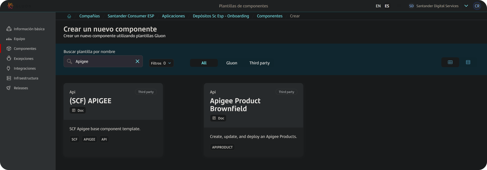
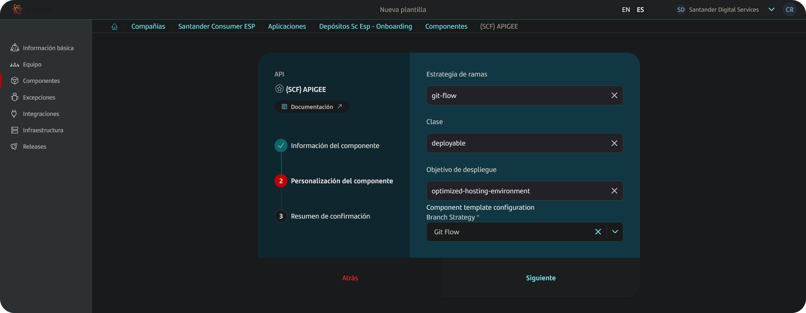
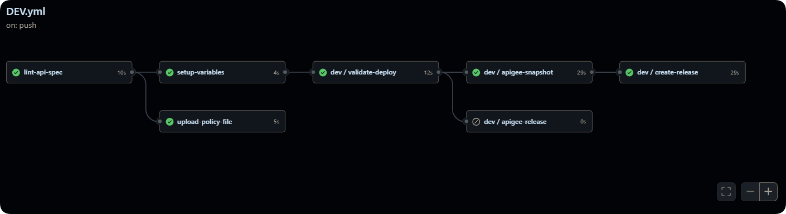
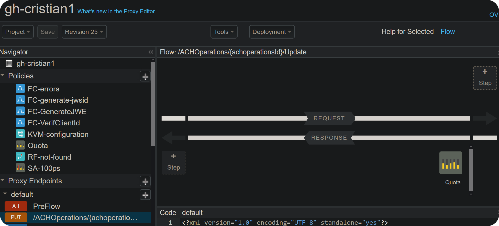
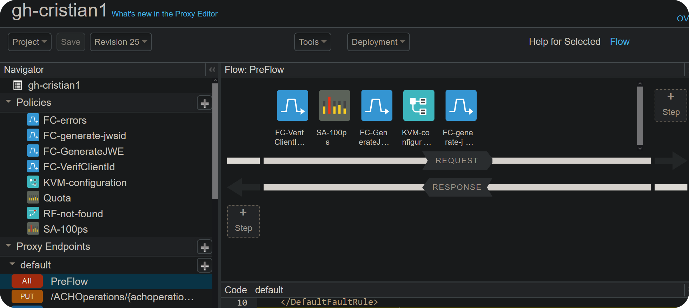
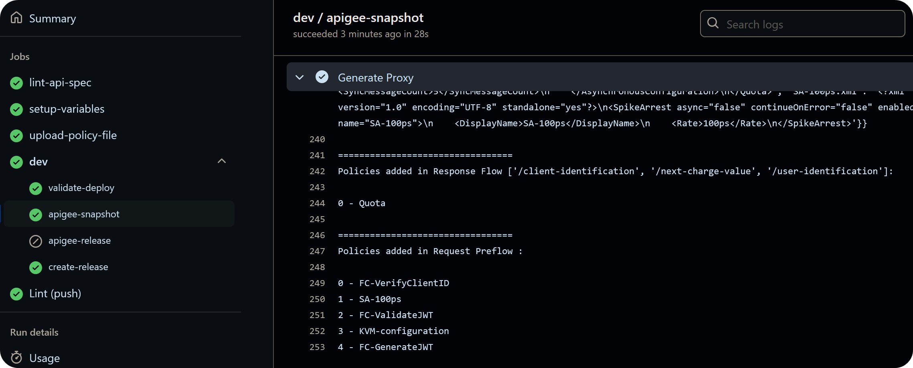
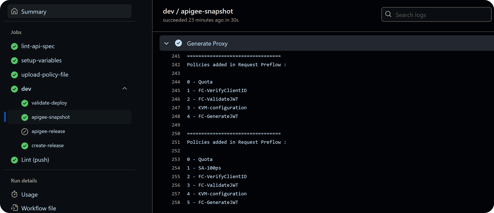
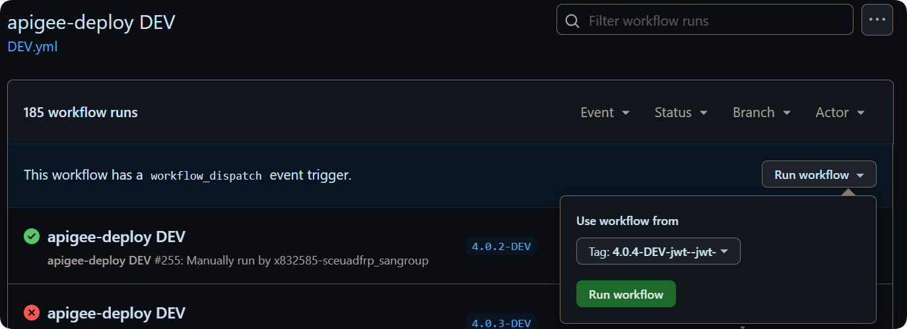

## Overview

This guide explains how to use the `Apigee component` to upload and deploy an **API Proxy** and its corresponding **KVM**, defining security schemes and general configuration.

## Flowchart

You can view a detailed execution flow for API Proxy creation and promotion, along with hyperlinks to documentation for common issues, by clicking [here](https://tinyurl.com/apigee-brownfield):


## Description

The workflow automates key steps in deploying API proxies, including validation, template generation, and managing deployment environments.
This automation ensures consistency, security, and efficiency, while also providing ease of use and persistence. It enables rollback to previous deployments and supports simultaneous mass deployment to different `environments`.

## Gluon Portal

To get started, you must onboard your application by setting it up within the system. Once your application is created and onboarded, you can proceed to create your component.

Follow these steps to create a component:

1. **Select the Component Type**:
    First, choose the type of component you want to create. In this example, we use **(SCF) APIGEE** as an example, but make sure to search for and select the template appropriate for your component.

    

2. **Fill in Component Details**:
    Next, provide the necessary details for your component:
    - **Name**: Enter a unique and descriptive name for your component.
    - **Short Name**: Short names can only contain capital letters and digits.
    - **Description**: Write a detailed description explaining the purpose and functionality of the component.
    - **Branch Strategy**: Choose a branch strategy for your component's repository. The recommended strategy for this template is `git flow`, which helps manage the development workflow efficiently.

    

3. **Configure Apigee-Specific Settings**:
    When creating an SCF Apigee component, you will be prompted to provide specific configuration details that will be used to populate your repository:

    | Field | Description | Required | Example |
    |-------|-------------|----------|---------|
    | **Proxy Name** | The name of the proxy (no spaces or special characters) | Yes | `my-api-proxy` |
    | **Proxy Description** | A description for the proxy | Yes | `API for loan management` |
    | **Proxy Basepath** | The base path where the proxy will be exposed | Yes | `/loans` |
    | **Proxy Target URL** | The backend URL that the proxy will forward requests to | Yes | `https://backend.example.com` |
    | **Environment(s)** | Comma-separated list of Apigee environments for deployment | Yes | `intranet-client,internet-client` |
    | **Audience JWT Claim** | The audience claim for JWT validation | No | `my-audience` |
    | **Apigee Organization** | The Apigee organization for deployment | Yes | `gs` or `cgs-ccoe` |
    | **Apigee Planet** | The geographical location/data center for deployment | Yes | Select one:<br>• `Western Hub` (aws)<br>• `Germany` (ger)<br>• `New Landing Zone` (new-landing) |
    | **OpenAPI Spec** | Optional OpenAPI specification | No | Your OpenAPI 3.0 spec |

    ???+ warning "OpenAPI Spec Limitation"
        Large OpenAPI specifications may fail during component creation. If you have a large spec, it's recommended to add it manually after the repository is created.

    ???+ info "Configuration Usage"
        These values will pre-populate the `deployment.yaml` file in your repository with the initial configuration for the CERT environment. You can modify these values later and add configurations for other environments (PRE, PRO).

4. **Component Creation**:
    After entering the required details, create the component. Once created, a new repository will be generated under your application.
    This repository will be named after your component and integrated with SonarQube for code quality analysis and Fortify for security analysis.

By following these steps, you will have successfully created a new component, ready for further development within the GitHub repository.

## Repository Structure

The repository should follow this structure:

```bash
├── 📂.apigee
│   ├── config.yml
│
├── 📂.github
│   └── 📂workflows
│       ├── DEV.yml
│       ├── PRE.yml
│       ├── PRO.yml
│       └── UPDATE_WORKFLOW.yml
│
├── 📂policies
│   └── policy-conf.json
│   └── ${example_policy1}.xml
│   └── ${example_policy2}.xml
│
├── 📂spec
│   └── proxy.yml
│
├── deployment.yaml
│
└── santander.spectral.js
```

### Credentials

???+ warning "Warning"

      Before configuring, you must have **ALL** credentials required to deploy to the environments. If you lack access to create GitHub Secrets in the repository, contact your assigned `DevOps Engineer` or any administrator of your GitHub organization.

The workflow requires specific credentials set as GitHub Actions Secrets in the repository:

| Secret Name                  | Description                                      |
|------------------------------|--------------------------------------------------|
| `APIGEE_TOKEN_DEV`           | Token for the APIGEE management endpoint in DEV. |
| `APIGEE_TOKEN_PRE`           | Token for the APIGEE management endpoint in PRE. |
| `APIGEE_TOKEN_PRO`           | Token for the APIGEE management endpoint in PRO. |
| `APIGEE_PAT`                 | Token created for analytics & logging purposes.  |

???+ warning "Warning"

      _APIGEE_PAT_ is a `private` token and should not be shared. It should be set at the organization level as a globally accessible variable if missing. For more information, [contact the owner.](#contact)

#### Generate tokens

```bash
echo -n "user@mail.com:password" | base64
dXNlckBtYWlsLmNvbTpwYXNzd29yZAo=
```

The encoded string is used for the different `$ENV` secrets. For more information, see the [GitHub documentation page](https://docs.github.com/en/actions/security-for-github-actions).

## Application Lifecycle Management: How to build and deploy

### Development flow: How to deploy to DEV



To deploy to the DEV environment, push your changes to the `development` branch or any feature branch.
The workflow will automatically trigger and execute the following steps:

- `lint-api-spec`: Lints the proxy definition under `spec/proxy.yml`. Check `Lint(push)` for the summary.
- `setup-variables`: Formats inputs and performs validations.
- `upload-policy-file`: Pulls policy XML files for processing during proxy creation.
- `dev/ validate-deploy`: Validates the deployment and performs checks.
- `dev/ apigee-snapshot`: Generates, imports, and deploys the API.
- `dev/ create-release`: Tags the release version and initiates a PR to the main branch.

### PreProduction and Production flow: How to deploy to PRE and PRO

PreProduction and Production flows are **only** executable in **main**. First, execute the DEV flow to create the PR to the main branch.
Once the PR is merged, **run the workflow manually** from the `Actions` tab, selecting the `PRE` or `PRO` workflow, always from the main branch.
The workflow will execute the following steps:

- `lint-api-spec`: Lints the proxy definition under `spec/proxy.yml`. Check `Lint(push)` for details on errors and warnings.
- `setup-variables`: Formats inputs and performs validations.
- `dev/ validate-deploy`: Validates the deployment and performs checks.
- `dev/ apigee-release`: Exports the previous environment's API, imports to the current environment, and deploys.

## Configuration

> _Any files not mentioned should be **ignored and not modified**. They are dependencies and modifying them could **break** the flow. Renaming any file is **not** needed._

### spec/proxy.yml

Contains the OpenAPI Specification (`spec`) for the API proxy. This will be linted during execution. The version will also be fetched from this file.

#### spec/proxy.yml Application Versioning

Versioning is important as it is the main way to identify releases and perform rollbacks.
When you commit to deploy in DEV, the pipeline automatically fetches the version from the OpenAPI specification under the `spec/proxy.yml` file. The parameter should look like this:

  ```yaml title="simple openapi spec" linenums="1"
  openapi: 3.0.1
  info:
    title: Joe
    description: Hello World!
    version: 19.0.4
  ```

The version would be `19.0.4`. Once deployment is completed in DEV and the PR is merged, a TAG will be generated with the following format: `$VERSION-$ENV-$SECURITY`, for example: `19.0.4-DEV-jwt--jwt-`

### deployment.yaml

The `deployment.yaml` defines the configuration for the API proxy and KVMs used in that API, to be deployed across different environments (e.g., CERT, PRE, PRO).
This file contains variables specifying the proxy's characteristics, such as its name, description, base path, target URL, Apigee environments, and more.
These variables are used by the deployment pipeline to correctly configure and deploy the API proxy in Apigee environments.

Below is a table outlining the variables defined in the `deployment.yml` file, along with their descriptions, whether they are required, and example values.

| Variable Name        | Description                                                                 | Required | Example Value                                              |
|----------------------|-----------------------------------------------------------------------------|----------|------------------------------------------------------------|
| `proxy_name`         | Unique name of the proxy to be deployed.                                    | Yes      | `"ccoe-hub"` (No spaces or special characters)             |
| `proxy_description`  | Description of the proxy.                                                   | Yes      | `"ID Authorization"`                                       |
| `proxy_basepath`     | Base path to expose in the selected Apigee Organization virtual host        | Yes      | `"ccoe-hub"`                                               |
| `proxy_yaml`         | OpenAPI Specification                                                       | Yes      | `"./env/CERT/ccoe-hub.yaml"`                               |
| `proxy_targetUrl`    | Backend API URL                                                             | Yes      | `"https://httpstat.us/418"`                                |
| `proxy_environment`  | Apigee Organization environment for API Proxy deployment                    | Yes      | `"internet-client"`                                        |
| `proxy_audience`     | Audience parameter to be included in ConfigProxy KVM                        | No       | `"users"`                                                  |
| `proxy_revision`     | Used on PRE/PRO, the API Proxy revision to be promoted                      | No       | `1` (Default: pipeline will try to get the latest revision)|
| `proxy_vhosts`       | Used for MTLS Virtualhost setting or pre-defined vhosts                     | No       | `"proxy_vhosts: vhost, extra"` (Generates 2 vhosts)        |
| `apigee_org`         | Apigee organization                                                         | Yes      | `"cgs-ccoe"`                                               |
| `apigee_planet`      | Apigee Planet, possible values: aws, az                                     | No       | `aws, ger` (Default: aws)                                  |
| `apigee_kvm`         | Key-Value Map for Apigee                                                    | No       | `- name: "pre" value: "megasecret-value"`                  |

#### deployment.yaml example

```yaml title="sample deployment.yaml" linenums="1"
environments:
  CERT:
    proxy_name: ccoe-hub
    proxy_description: "ID Authorization"
    proxy_basepath: /ccoe-hub
    proxy_yaml: ./spec/proxy.yml
    proxy_targetUrl: "https://httpstat.us/418"
    proxy_environment: internet-client
    apigee_org: cgs-ccoe
    apigee_planet: "aws"
    proxy_audience: "users"
    apigee_kvm: |
    - name: "config-env"
      value: "cert"
    - name: "api-timeout"
      value: "30000"
  PRE:
    proxy_name: ccoe-hub
    proxy_description: "ID Authorization"
    proxy_basepath: /ccoe-hub
    proxy_yaml: ./spec/proxy.yml
    proxy_targetUrl: "https://httpstat.us/200"
    proxy_environment: internet-client
    apigee_org: cgs-ccoe
    apigee_planet: "aws"
    proxy_audience: "users"
    apigee_kvm: |
    - name: "config-env"
      value: "pre"
    - name: "api-timeout"
      value: "30000"
  PRO:
    proxy_name: ccoe-hub
    proxy_description: "ID Authorization"
    proxy_basepath: /ccoe-hub
    proxy_yaml: ./spec/proxy.yml
    proxy_targetUrl: "https://httpstat.us/200"
    proxy_environment: internet-client
    apigee_org: cgs-ccoe
    apigee_planet: "aws"
    proxy_audience: "users"
    apigee_kvm: |
    - name: "config-env"
      value: "pro"
    - name: "api-timeout"
      value: "30000"
```

### .apigee/config.yml

This file defines metadata for the API and project, as well as the security defined for the APIs.

???+ info "Coming from Jenkins?"

      This information can be found inside your ci-config.groovy file in the old repository.

| Name                  | Description                                                     | Required | Type    | Example Value                |
|-----------------------|-----------------------------------------------------------------|----------|---------|------------------------------|
| DOMAIN                | Entity of the application                                       | Yes      | String  | HQ                           |
| PROJECT_NAME          | Name of the project                                             | Yes      | String  | my_project                   |
| APP_NAME              | Name of the application                                         | Yes      | String  | my_app                       |
| CREATE_RELEASE        | Toggle for enabling/disabling release version creation (DEV)    | No       | Boolean | true/false (Default: false)  |
| RELEASE_NAME          | Identifier for the release                                      | No*      | String  | RLSE000000                   |
| SECURITY_SCHEME       | Security scheme used for the API                                | Yes      | String  | "oauth2"                     |
| SECURITY_FLOW         | Security flow used within the security scheme                   | Yes      | String  | "jwt profile"                |
| SECURITY_PROFILE      | Security profile for the API                                    | Yes      | String  | "oauth2"                     |
| SECURITY_ADDITIONAL   | Additional security configurations                              | Yes      | String  | "jwe"                        |

#### .apigee/config.yml Security configuration

The security configuration follows industry standards and best practices for API security. The table below outlines the supported security schemes and their corresponding policy implementations.

???+ info "Security Standards"

      - **OAuth 2.0**: Implemented according to [RFC 6749](https://tools.ietf.org/html/rfc6749)
      - **JWT**: Based on [RFC 7519](https://tools.ietf.org/html/rfc7519) - JSON Web Token (JWT)
      - **JWS**: Follows [RFC 7515](https://tools.ietf.org/html/rfc7515) - JSON Web Signature (JWS)
      - **JWE**: Complies with [RFC 7516](https://tools.ietf.org/html/rfc7516) - JSON Web Encryption (JWE)

???+ warning "Security Configuration Requirements"

      You **must** comply with one of the following security configurations. An error will be triggered if no proxy matches the specified security characteristics.

_For custom security definitions or schemes not included below, please contact [the owner](#contact) to discuss implementation requirements._

| SECURITY_SCHEME  | SECURITY_FLOW      | SECURITY_ADDITIONAL | SECURITY_PROFILE |                             POLICIES                             |
|------------------|--------------------|---------------------|------------------|------------------------------------------------------------------|
| oauth2           | authorization-code | -                   | oauth2           | verifyClientId + oauthValidation + generateJWSId                 |
| oauth2           | jwt-profile        | -                   | oauth2           | verifyClientId + oauthValidation + generateJWSId                 |
| oauth2           | client-credentials | -                   | oauth2           | verifyClientId + oauthValidation + generateJWSId                 |
| jwt              | -                  | -                   | jwt              | verifyClientID + validateJWT + generateJWT                       |
| jwsid            | -                  | -                   | jwsid            | verifyClientID + validateJSId + generateJWSId                    |
| oauth2           | any                | mTLS                | oauth2-mtls      | verifyClientId + mTLS + oauthValidation + generateJWSId          |
| oauth2           | any                | jwe                 | oauth2-jwe       | verifyClientId + oauthValidation + generateJWE + generateJWSId   |
| -                | -                  | AAD                 | aad              | verifyClientID + validateAADtoken + JS-addSecCtx + generateJWSId |
| migration        | -                  | -                   | -                | generateJWT (Legacy support for proxy migration)                 |
| empty            | -                  | -                   | -                | KVM only (No security policies - requires explicit approval)     |

???+ note "Special Security Profiles"

      **Migration Profile**: Designed for legacy proxy migrations where only JWT generation is required. It includes a single `generateJWT` policy and should be used temporarily during migration phases.

      **Empty Profile**: Creates only the KVM (Key-Value Map) without any security policies. Use only for specific cases where security is handled externally and requires explicit security approval.

???+ warning "mTLS Configuration"

      For mTLS implementation:

      1. [Create the mTLS virtual host](https://docs.apigee.com/api-platform/fundamentals/configuring-virtual-hosts#classic-edge-private-cloud) prior to deployment.

      2. Add the `proxy_vhosts:` parameter in the deployment.yaml file.

Example configurations:

#### .apigee/config.yml example

  ```yaml
  APP_NAME: apigee-sample2
  DOMAIN: SCF
  PROJECT_NAME: 'mock-apigee'
  PRODUCT: PDCT-creditcard
  RELEASE_NAME: RLSE00001
  security-scheme: jwt
  security-flow:
  security-profile: jwt
  security-additional:
  ```

### policies/

This folder contains additional policies you may want to include in the Apigee flow itself. Basic knowledge of Apigee flows is required.
Refer to [What are flows](https://docs.apigee.com/api-platform/fundamentals/what-are-flows?hl=en) and the [policy reference](https://docs.apigee.com/api-platform/reference/policies/flow-callout-policy) documentation.

???+ tip "Best Practice: Use FlowCallouts"

    We strongly recommend using **FlowCallouts** for complex logic instead of JavaScript or Java policies. FlowCallouts offer:

    - Better performance and maintainability
    - Easier debugging and testing
    - Improved code reusability across multiple proxies
    - Reduced security risks

    **Only use JavaScript or Java policies when absolutely necessary**, such as:
    - Simple data transformations that cannot be achieved with standard policies
    - Custom logic that specifically requires programmatic capabilities

    For more information, see the [FlowCallout policy documentation](https://docs.apigee.com/api-platform/reference/policies/flowcallout-policy).

#### Policy example

  ```xml title="Policy AM-sample.xml" linenums="1"
  <?xml version="1.0" encoding="UTF-8" standalone="yes"?>
  <AssignMessage async="false" continueOnError="false" enabled="true" name="AM-sample">
      <DisplayName>AM-sample</DisplayName>
      <Add>
        <Headers>
          <Header name="user-agent">{request.user.agent}</Header>
        </Headers>
      </Add>
      <AssignTo createNew="false" transport="http" type="request"/>
  </AssignMessage>
  ```

### policies/policy-conf.json

This `json` configuration file is the main point of configuration of `where and how` your policies will be positioned and consumed in the API.

- `policy_flow_type`: Specifies the type of flow where the policy will be applied. Common values are `Flow` for any flows or `PreFlow`|`PostFlow` for policies that will be executed always, or interact directly with the security flow.
- `policy_flow_name`: The name of the flow or conditional flow where the policy will be applied. For example, `/Advertising/Create` If `PreFlow` or `PostFlow` is selected, leave **empty**.
- `policy_direction`: Indicates the direction of the policy application. Common values are `Request` or `Response`.
- `policy_index`: The position or order of the policy within the flow. This is an integer value starting from 0.

???+ warning "Warning"

      Beware the order of deployment works as a stack, double check **Generate Proxy** output to confirm how the flows will look like.

If you have doubts regarding what are flows, or where your policies should be placed, feel free to double check the [Apigee Flows Documentation.](https://docs.apigee.com/api-platform/fundamentals/what-are-flows?hl=en)

#### policies/policy-conf.json example

  ```json title="policy-conf.json example" linenums="1"
  {
      "policies": {
          "Quota": {
              "flow_type": "Flow",
              "flow_name": [
                  "/ACHOperations/{achoperationsId}/Retrieve",
                  "/ACHOperations/{achoperationsId}/Update"
              ],
              "direction": "Response",
              "index": 0
          },
          "SA-100ps": {
              "flow_type": "PreFlow",
              "flow_name": "",
              "direction": "Request",
              "index": 1
          }
      }
  }
  ```

This adds the `Quota policy` to the flows listed, in the `Response`, at the `beggining of the flow`:



And adds the `SA-100ps policy` to the PreFlow, in the `Request`. at index 1, so right after the first policy _(at index 0)_.
See also how flow_name is not added in PreFlow / PostFlow `flow_types` as you can see due to them being always executed.



#### Policy debugging

Indexes in stacks can be somewhat confusing, that is why you have a debugging print statement under the Job:
`apigee-snapshot` that displays positional information during each iteration,
the last printed being the final flow scheme in order to better understand how it works. Here is a sample for a `specific flow` and `Preflow`:

**Example of policy logging in different flows:**



**Example only for policies added only on preflow:**



## Workflow Updates

The repository includes an `UPDATE_WORKFLOW.yml` file that allows you to update the pipeline version on demand. This workflow can be executed manually through GitHub's workflow dispatch feature.

???+ info "Update Workflow Features"

    - **Manual Execution**: Run the workflow anytime via GitHub Actions workflow dispatch
    - **Version Selection**: Choose to update to the latest version or specify a particular version
    - **Automatic Updates**: Keeps your pipeline aligned with the latest features and fixes

    This same functionality is available for both:
    - Standard Apigee proxy deployments (`UPDATE_WORKFLOW.yml`)

To execute the update workflow:

1. Navigate to the **Actions** tab in your repository
2. Select **UPDATE_WORKFLOW** from the workflow list
3. Click **Run workflow**
4. Choose your update preferences:
   - Select **latest** for the most recent version
   - Or specify a particular version tag
5. Click **Run workflow** to start the update process

???+ tip "Best Practice"

    Regularly update your workflows to benefit from:
    - Security patches and bug fixes
    - New features and improvements
    - Performance optimizations
    - Enhanced compatibility with Apigee platforms

## Rollback

In order to rollback, all you have to do is to execute the workflow from a already pre-generated `Release Tag`



This will override the existing `API` and `KVM` for the previously defined ones  in the tag.

Beware, the Rollback process has to start from `DEV` and then upstreamed to `PRE` and `PRO` respectively.

## Contact

If you have doubts or issues during execution:

- Ensure you have the proper secrets and permissions
- Get the `log/error/bug` in order to investigate
- Check syntax and structure, as well as hidden newlines "`\n`" or tabulations.

{!
   include-markdown "./snippets/contact-information.md"
   start="<!--Start-->"
   end="<!--End-->"
!}
