The goal of this documentation is to provide guidance on how to create AWS QuickSight resources using the Gluon portal and the SCFGS workflow.
This means that the CI will reside on the Gluon portal infrastructure while the CD resides on the SCFGS infrastructure.

## Prerequisites: AWS Credentials Request

To ensure this pipeline functions correctly, an OIDC configuration with your component repository must be requested.
Note that this template is cataloged as a `Non Microservice components > Miscellaneous`, detailed information to make the request can be found [here](../support/credentials/data.md).

## CI - GLUON

{!
   include-markdown "./liquibase/configuration.md"
   start="<!--start-ci-intro-->"
   end="<!--end-ci-intro-->"
!}

### Create component

{!
   include-markdown "./liquibase/configuration.md"
   start="<!--start-ci-create-component-->"
   end="<!--end-ci-create-component-->"
!}

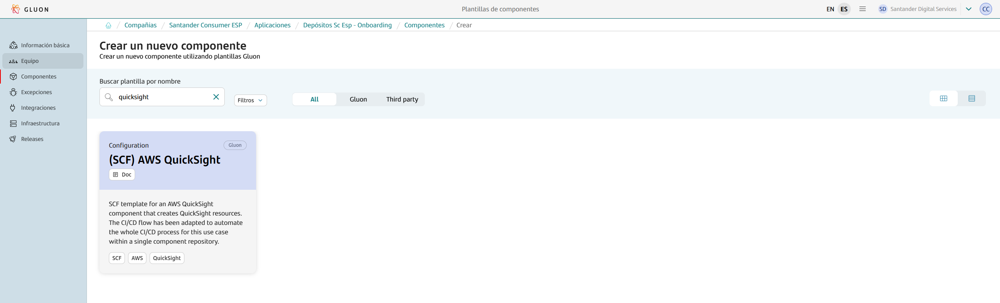

{!
   include-markdown "./liquibase/configuration.md"
   start="<!--start-repo-naming-convention-->"
   end="<!--end-repo-naming-convention-->"
!}

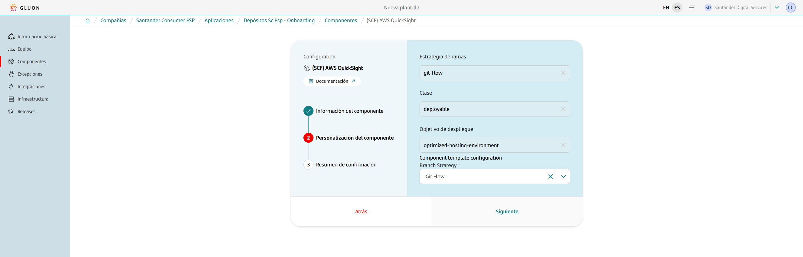

{!
   include-markdown "./liquibase/configuration.md"
   start="<!--start-ci-create-component-2-->"
   end="<!--end-ci-create-component-2-->"
!}

### Git Flow Lifecycle

{!
   include-markdown "./liquibase/configuration.md"
   start="<!--start-gitflow-->"
   end="<!--end-gitflow-->"
!}

### Configuration Files

As mentioned before, the scaffolding workflow generates a set of configuration files and some others that need to be added in order to make the workflows work. Find below the list of configuration files needed and how to configure them.

#### Properties.env

This file is generated by the scaffolding workflow and contains some properties for the CI configuration.

=== "Default"

    ```properties
    # Sonar parameters
    SONAR_ID="SONAR_GLUON_COMMUNITY"
    SONAR_PROJECT_KEY=""

    # Fortify parameters
    FORTIFY_PROJECT=""

    ZERO_TOUCH_ENABLE=true

    # Custom parameters
    EXECUTE_CHANGES=1
    AWS_DEFAULT_REGION="eu-west-1"
    ```

=== "Disable execution Example"

    ```properties
    # Sonar parameters
    SONAR_ID="SONAR_GLUON_COMMUNITY"
    SONAR_PROJECT_KEY=""

    # Fortify parameters
    FORTIFY_PROJECT=""

    ZERO_TOUCH_ENABLE=true

    # Custom parameters
    EXECUTE_CHANGES=0
    AWS_DEFAULT_REGION="eu-west-1"
    ```

### Variables configuration

The AWS QuickSight workflow needs variables to be able to create correctly the required permissions for Template, Analysis and Folder.

In github.com, variables are categorized into three types:

1. **Organization Variables**: These variables are accessible by all repositories within the organization.
2. **Repository Variables**: These variables are exclusive to a specific repository.
3. **Environment Variables**: These variables are restricted to a particular repository and its environment.

We need to add the second and third type: repository and environment variables to our repository in order to make the associated workflows work.

#### Repository variables

{!
   include-markdown "./snippets/variables-global.md"
   start="<!--Start Add Repository Variables-->"
   end="<!--End Add Repository Variables-->"
!}

#### Environment variables

{!
   include-markdown "./snippets/variables-global.md"
   start="<!--Start Add Environment Variables-->"
   end="<!--End Add Environment Variables-->"
!}

### Validate scripts

Once all branches are set up correctly, secrets are configured and configuration files are defined, the repository is ready to do deployments.
In order to make the full cycle, The scripts validation must be done with the CI process of the Gluon infrastructure and then the deployment using SCFGS CD.

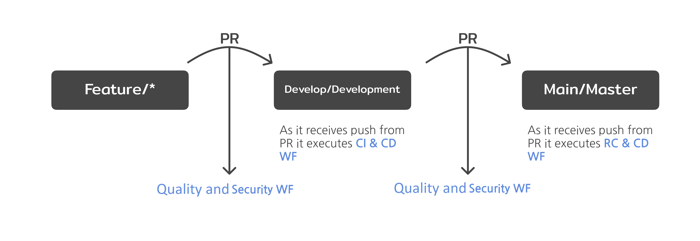

This cycle is the same explained in the **Git-Flow lifecycle section**. During this section more details will be provided for each step.

### Quality gates

As shown in the previous image every time a Pull Request (PR) is made, the security and quality workflows are automatically executed: Quality, Security.
These workflows conform quality gates that are needed to ensure the quality and the security of the prior to the deployment.
There are 3 quality gates:

- **Sonar**: Code Quality and test coverage
- **Fortify**: Analysis of the vulnerabilities of our source code
- **Sonatype**: Analysis of the vulnerabilities of our dependencies.

### Pull Request from feature to development

In order to start developing in the repository, create a new `feature/*` branch from the `development` branch. Make all necessary changes in the newly created feature branch.
When changes are ready to deploy, create a pull request (PR) from the `feature/*` to the `development` branch. The creation of the pull request will trigger the security gate workflows.

??? info "AWS QuickSight CI workflow code"

    ```yaml linenums="1"
    name: AWS QuickSight CI

    on:
      push:
        branches:
          - development
          - develop
          - feature/*
          - fix/*
    
    jobs:
      call-reusable-workflow:
        name: AWS QuickSight CI workflow
        uses: santander-group-scfccoe/gln-workflows/.github/workflows/aws-quicksight-ci.yml@v1
        secrets: inherit
    ```
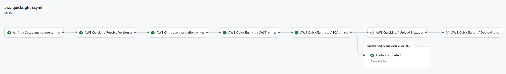

#### Quality workflow

- **Setup environment variables**: Load the properties defined in properties.env file and in the configuration project.
- **Resolve Version**: Get the current execution version.
- **SonarQube**: Executes the sonar analysis to validate the quality gates.

??? info "AWS QuickSight quality workflow code"

    ```yaml linenums="1"
    name: AWS QuickSight quality

    on:
      pull_request:
        branches:
          - development
          - develop
          - main
          - master
          
    jobs:
      call-reusable-workflow:
        name: AWS QuickSight quality ${{ github.ref }}
        uses: santander-group-scfccoe/gln-workflows/.github/workflows/aws-quicksight-quality.yml@v1
        secrets: inherit
    ```
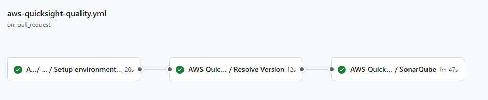

#### Security workflow

- **Setup environment variables**: Load the properties defined in properties.env file and in the configuration project.
- **Resolve Version**: Get the current execution version.
- **SAST**: Executes the reusable Fortify SAST workflow to perform a SAST scan with Fortify and validate the quality gates.
- **SCA**: Executes the reusable The Sonatype SCA workflow to perform a Sonatype SCA scan and analyze third party components from a repository.
- **Send information to Elasticsearch**: Send data to elasticsearch related with SAST and SCA analysis.

??? info "AWS QuickSight security workflow code"

    ```yaml linenums="1"
    name: AWS QuickSight security

    on:
      pull_request:
        branches:
          - development
          - develop
          - main
          - master

    jobs:
      call-reusable-workflow:
        name: AWS QuickSight security ${{ github.ref }}
        uses: santander-group-scfccoe/gln-workflows/.github/workflows/aws-quicksight-security.yml@v1
        secrets: inherit
    ```
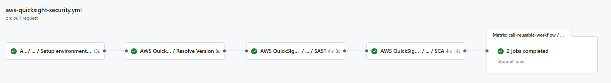

### Push to development

After approving the Pull Request from feature to `development`, a merge will be done. The merge actions does a *push* implicitly. This push event will trigger the aws-quicksight-ci.yml workflow automatically.

The AWS QuickSight CI workflow is a comprehensive process that begins with setting up environment variables, which involves loading properties defined in the `properties.env` file and in the configuration project.

After setting the environment variables, the workflow will perform bash script validation to check the correct bash file format.

After the JSON validation and sonar scan, it runs the reusable **Fortify SAST** workflow to perform a SAST scan with Fortify and validate the quality gates, and sends SAST analysis data to Elasticsearch.
The workflow also executes the reusable **Sonatype SCA** workflow to perform a Sonatype SCA scan. The next step involves **CERT** environment deployment.

??? info "AWS QuickSight CI workflow code"

    ```yaml linenums="1"
    name: AWS QuickSight CI

    on:
      push:
        branches:
          - development
          - develop
          - feature/*
          - fix/*
    
    jobs:
      call-reusable-workflow:
        name: AWS QuickSight CI workflow
        uses: santander-group-scfccoe/gln-workflows/.github/workflows/aws-quicksight-ci.yml@v1
        secrets: inherit
    ```
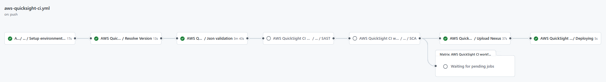

- **Setup environment variables**: Load the properties defined in properties.env file and in the configuration project.
- **Resolve Version**: Loads and builds the version of the current deployment.
- **Script validation**: Validates all JSON files and executes sonar scan.
- **SAST**: Executes the reusable Fortify SAST workflow to perform a SAST scan with Fortify and validate the quality gates.
- **SCA**: Executes the reusable The Sonatype SCA workflow to perform a Sonatype SCA scan and analyze third party components from a repository.
- **Send information to Elasticsearch**: Send data to elasticsearch related with SAST and SCA analysis.
- **Upload Nexus**: Uploads the repository files as artifact to Nexus.
- **Deploying**: Executes the CD workflow.

Once the workflow ends, it triggers the CD workflow automatically.

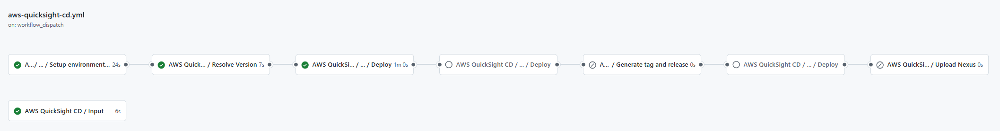

### Pull Request from development to main

When it's time to apply changes on the PRE/PRO environments, we initiate a Pull Request from the integration branch: develop/development to the main/master branch.

This action triggers the aws-quicksight-quality.yml (Sonar) and aws-quicksight-security.yml (Fortify & Sonatype) workflows. defined in the **Pull Request from feature to development** section.

### Push to main

After approving the Pull Request from development to main, a merge will be done. The merge actions does a *push* implicitly. This push event will trigger the aws-quicksight-rc.yml workflow automatically.

This workflow begins by setting up environment variables, loading properties defined in the `properties.env` file and in the configuration project, which is obtained according to the defined secrets.
Validates the JSON files, and then prepares the release candidate by updating the version in the branch (main or master), getting the next release version, and getting the last commit in the branch.

The workflow validates the JSON files and sonar scan, followed by the reusable **Fortify SAST** workflow is executed to perform a SAST scan with Fortify and validate the quality gates. SAST analysis data is sent to Elasticsearch.
The workflow also executes the reusable **Sonatype SCA** workflow to perform a Sonatype SCA scan and analyze third-party components from a repository.
A new tag for release is created, and finally, a new draft **release is created** and the check set is selected as a pre-release tag for release.

??? info "AWS QuickSight RC workflow code"

    ```yaml linenums="1"
    name: AWS QuickSight release candidate

    on:
      push:
        branches:
          - main
          - master
          
    jobs:
      cal-reusable-workflow:
        name: AWS QuickSight release candidate workflow
        uses: santander-group-scfccoe/gln-workflows/.github/workflows/aws-quicksight-rc.yml@v1
        secrets: inherit
    ```
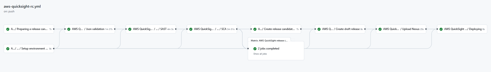

- **Setup environment variables**: Load the properties defined in properties.env file and in the configuration project.
- **Preparing a release candidate**: Loads and builds the version of the current deployment.
- **JSON validation**: Validates all JSON files and executes sonar scan.
- **SAST**: Executes the reusable Fortify SAST workflow to perform a SAST scan with Fortify and validate the quality gates.
- **SCA**: Executes the reusable The Sonatype SCA workflow to perform a Sonatype SCA scan and analyze third party components from a repository.
- **Send information to Elasticsearch**: Send data to elasticsearch related with SAST and SCA analysis.
- **Create release candidate tag**: Create a new tag for RC.
- **Create draft release**: Creates a new draft release and select the check Set as a pre-release tag for RC.
- **Upload Nexus**: Uploads the repository files as artifact to Nexus.
- **Deploying**: Executes the CD workflow.

Once the workflow ends, it triggers the CD workflow automatically.

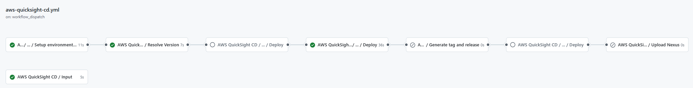

## CD - SCFGS

Once the CI progress is completed, the goal for the **CD workflow** is to create AWS QuickSight into different environments. The setup is designed to have a single executable workflow for all environment.

### CD Workflow stages

The CD workflow consists of 8 tasks that ensure a successful deployment. Below you will find a brief description of each job:


- **Input**: Shows the workflow inputs as summary.
- **Setup environment variables**: Loads all Gluon default configurations and the variables defined in the properties.env
- **Resolve Version**: Loads and builds the version of the current deployment.
- **Deploying in certification**: Creates the AWS QuickSight resources.
- **Deploying in preproduction**: Creates the AWS QuickSight resources.
- **Generate tag and release**: Generates the release version for PRO environment from the release candidate version.
- **Deploying in production**: Creates the AWS QuickSight resources.
- **Upload Nexus**: Uploads the version of the deployed release candidate artifact on production as the final released version artifact.

### Configuration files

As the CI relies on some configuration files in order to work correctly, the CD workflow relies on one `deployment.yaml` file that needs to be configured.

#### deployment.yaml

The `deployment.yaml` file contains the necessary information to perform a deployment in a defined environment. There are some parameters that can be configured in order to configure the deployment file:

|**Variable**|**Required**|**Description**|**Example value**|
|---     |---  |---  |---          |
|**ADMIN_GROUP_ID**| true | The admin group id.  | `admin-group` |
|**AUTHOR_GROUP_ID**| true | The author group id.  | `author-group` |

Find below a `deployment.yaml` example file. Make sure to replace the existing values with the corresponding one for the project.

```yaml title="AWS QuickSight Deployment example" linenums="1"
environments:
  CERT:
    ADMIN_GROUP_ID: admin-group
    AUTHOR_GROUP_ID: author-group
  PRE:
    ADMIN_GROUP_ID: admin-group
    AUTHOR_GROUP_ID: author-group
  PRO:
    ADMIN_GROUP_ID: admin-group
    AUTHOR_GROUP_ID: author-group
```

#### workflow.yml

To invoke the **CD** reusable workflow, you need to establish a workflow file in your project's repository. Workflows are delineated by a YAML file located in the `.github/workflows` directory of a repository. (A repository can contain multiple workflows.)

The workflow to be created should include the following fundamental components:

- One or more events that will instigate the workflow, using the 'on' keyword. (For example, push, workflow_dispatch, etc.)
- One or more jobs, each of which will operate on a runner machine and execute a sequence of one or more steps, depending on the reusable workflow you're referencing.

When using only aws-quicksight-cd, it's advisable to name the YAML file as `aws-quicksight-cd.yml` and use the keyword 'name' with 'CD' to easily locate it among all workflows in your repositories.
Find below a workflow file example, make sure to replace the values to match the deployment you want to perform.

```yaml title="AWS QuickSight CD workflow" linenums="1"
name: AWS QuickSight CD

on:
  workflow_dispatch:
    inputs:
      deploy-version:
        required: false
        type: string
        description: 'Scripts version to deploy. By default the version of the VERSION is obtained.'
      deployment-environment:
        required: true
        type: choice
        default: 'pro'
        options:
        - cert
        - pre
        - cert/pre
        - pre/pro
        - cert/pre/pro
        - pro
        description: "Environment to deploy"
      draft-id:
        required: false
        type: string
        description: 'Draft identity to create release from release candidate and deployment-environment "pre/pro", "cert/pre/pro"'

jobs:
  call-reusable-workflow:
    name: AWS QuickSight CD
    uses: santander-group-scfccoe/gln-workflows/.github/workflows/aws-quicksight-cd.yml@v1
    with:
      deploy-version: ${{ inputs.deploy-version }}
      deployment-environment: ${{ inputs.deployment-environment }}
      draft-id: ${{ inputs.draft-id }}
    secrets: inherit
```

???+ warning "Workflow secrets"

      Credentials are supplied to the workflow via **secrets**. To pass named secrets, use the 'secrets' keyword along with the 'inherit' value. These secrets should be stored within your organization's GitHub secrets, in the actions section, and authorized for your repository. **Check the following section for secrets configuration**.

To pass inputs, use the 'with' keyword in the job. The list of possible inputs is as follows:

|**Name**|**Description**|**Required**|**Type**|**Example value**|
|--------|---------------|------------|--------|-----------------|
| **deploy-version** | Scripts version to deploy. By default the version of the VERSION is obtained. | No | String | `1.0.0-SNAPSHOT` |
| **deployment-environment** | Environment to deploy: <ul><li>cert</li><li>pre</li><li>cert/pre</li><li>pre/pro</li><li>cert/pre/pro</li><li>pro</li></ul> | Yes | Choice | `cert/pre` |
| **draft-id** | Draft identity to create release from release candidate and deployment-environment "pre/pro", "cert/pre/pro", “pro” | No | String | `173392184` |

### Variables configuration

As in the CI workflow, the CD one relies on 4 repository variables and 2 to 1 environment variables (Only 1 for production environment) needed to function correctly.
These variables must be defined in the Repository and Environment variables section inside the repository settings. Find below the list of required variables:

#### Repository variables configuration

| **Variable name**                 | **Description**                                                 | **Value** |
| --------------------------------- | --------------------------------------------------------------- | ------------ |
| ADMIN_AUTHOR_PERMISSIONS          | The admin and author permissions template for folder objects.   | `[{"Principal":"arn:aws:quicksight:##AWS_REGION##:##AWS_ACCOUNT_ID##:group/default/##ADMIN_GROUP_ID##","Actions":["quicksight:CreateFolder","quicksight:DescribeFolder","quicksight:UpdateFolder","quicksight:DeleteFolder","quicksight:CreateFolderMembership","quicksight:DeleteFolderMembership","quicksight:DescribeFolderPermissions","quicksight:UpdateFolderPermissions"]},{"Principal":"arn:aws:quicksight:##AWS_REGION##:##AWS_ACCOUNT_ID##:group/default/##AUTHOR_GROUP_ID##","Actions":["quicksight:DescribeFolder"]}]` |
| READER_PERMISSIONS                | The reader permissions template for folder objects.             | `[{"Principal":"arn:aws:quicksight:##AWS_REGION##:##AWS_ACCOUNT_ID##:group/default/##READER_GROUP_ID##","Actions":["quicksight:DescribeFolder"]}]` |
| AWS_TEMPLATE_READER_PERMISSIONS   | The reader permissions template for template objects.           | `[{"Principal":"arn:aws:iam::##AWS_READER_ACCOUNT_ID##:root","Actions":["quicksight:UpdateTemplatePermissions","quicksight:DescribeTemplate"]}]` |
| ADMIN_AUTHOR_ANALYSIS_PERMISSIONS | The admin and author permissions template for analysis objects. | `[{"Principal":"arn:aws:quicksight:##AWS_REGION##:##AWS_ACCOUNT_ID##:group/default/##ADMIN_GROUP_ID##","Actions":["quicksight:RestoreAnalysis","quicksight:UpdateAnalysisPermissions","quicksight:DeleteAnalysis","quicksight:QueryAnalysis","quicksight:DescribeAnalysisPermissions","quicksight:DescribeAnalysis","quicksight:UpdateAnalysis"]},{"Principal":"arn:aws:quicksight:##AWS_REGION##:##AWS_ACCOUNT_ID##:group/default/##AUTHOR_GROUP_ID##","Actions":["quicksight:RestoreAnalysis","quicksight:UpdateAnalysisPermissions","quicksight:DeleteAnalysis","quicksight:QueryAnalysis","quicksight:DescribeAnalysisPermissions","quicksight:DescribeAnalysis","quicksight:UpdateAnalysis"]}]` |

???+ abstract "How to add a new repository variable?"

      {!
        include-markdown "./snippets/variables-global.md"
        start="<!--Start Add Repository Variables-->"
        end="<!--End Add Repository Variables-->"
      !}

#### Environment variables configuration

| **Variable name**       | **Description**                                                                                                       |
| --------------------- | ----------------------------------------------------------------------------------------------------------------------- |
| AWS_SOURCE_ACCOUNT_ID | The source account id, the value of this id **MUST** always be the **LOWER** environment.                               |
| AWS_READER_ACCOUNT_ID | The reader account id, for **NON PRO** environments, the value of this id **MUST** always be the **UPPER** environment. |
| AWS_ACCOUNT_ID        | The current AWS account id.                                                                                                     |

???+ abstract "How to add a new environment variable?"

      {!
        include-markdown "./snippets/variables-global.md"
        start="<!--Start Add Environment Variables-->"
        end="<!--End Add Environment Variables-->"
      !}

### Deploy AWS QuickSight

Once secrets and configuration files are correctly configured, everything is set up to execute the workflow and make the deployment.
Depending on the trigger events defined in the workflow, the workflow may either run automatically upon a push, or it may require manual execution with specific keywords following the 'on' keyword:

- **Push**: This event triggers the workflow when a push is made to a branch. To configure a push trigger, the 'on' field is used and the push event is specified.
  The branches on which the workflow should be triggered can be defined using the 'branches' keyword. For instance, 'on: push: branches: - master' triggers the workflow when a push is made to the master branch.
- **Workflow dispatch**: This event allows for manual triggering of a workflow via a **button click**. To configure a workflow dispatch trigger, the 'on' field is used and the 'workflow_dispatch' event is specified (on: workflow_dispatch: ).
  To manually run it, navigate to the Actions tab in the repository and select your workflow, which will be named after the name you've assigned it in the YAML.
  Inside the desired workflow, if the 'workflow_dispatch' event is enabled, a 'Run Workflow' button will be visible where the branch to be executed can be selected.

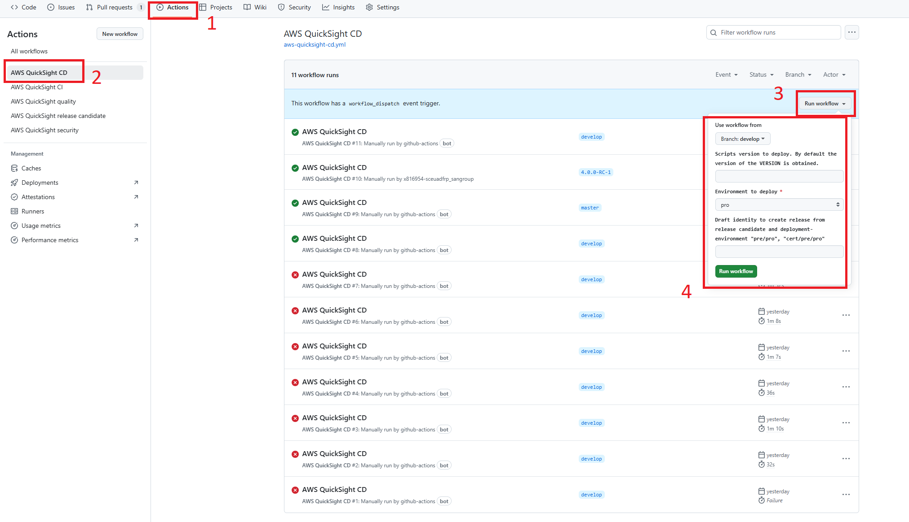

### Deploy in CERT environment

To deploy the AWS QuickSight in the **CERT** environment, a push to the branch develop or development must be done,
this triggers the CI workflow and after it ends, the CD workflow will be triggered automatically with the required inputs for the deployment.

### Deploy in PRE environment

To deploy the AWS QuickSight in the **PRE** environment, a push to the branch main or master must be done, this triggers the RC workflow and after it ends, the CD workflow will be triggered automatically with the required inputs for the deployment.

### Deploy in PRO environment

To deploy the AWS QuickSight in the **PRO** environment, The AWS QuickSight-CD workflow must be run manually using the desired release candidate branch and data to trigger it.
During the fourth step of the deployment process, choose '**Tags**' instead of 'Branches', and then select the Tag that to be deployed.

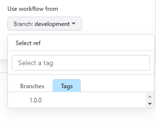

PRO deployment workflow steps

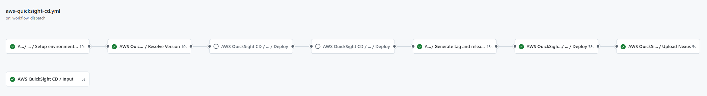

To run manually AWS QuickSight CD workflow, there are fields that we have to fill.

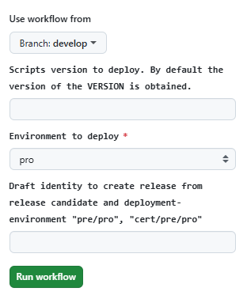

The following fields must be filled and the rest of fields in the previous image must not be modified:

- **Use workflow from**: Select from the tag list, the tag we want to use for the deployment.
- **Environment to deploy**: Select from the drop down list the value “pro“.

## **Repository**

### QuickSight objects

#### Analysis

All ANALYSIS object definition json files **MUST** located in the src/ANALYSIS folder. These files **MUST** have the analysis id as the file name.

Example:

```json
{
    "AnalysisId": "analysis_1",
    "Name": "ANALISIS_1",
    "SourceEntity": {
        "SourceTemplate": {
            "Arn": "arn:aws:quicksight:##AWS_REGION##:##AWS_ACCOUNT_ID##:template/template_1",
            "DataSetReferences": [
                {
                    "DataSetPlaceholder": "DATASET_1",
                    "DataSetArn": "arn:aws:quicksight:##AWS_REGION##:##AWS_ACCOUNT_ID##:dataset/dataset_1"
                }
            ]
        }
    },
    "ThemeArn":"arn:aws:quicksight:##AWS_REGION##:##AWS_ACCOUNT_ID##:theme/theme_1"
}
```

The name of this Analysis file must be **analysis_1**.

In the object definition json files, there will be some token text that will be replaced during workflow execution, developers must follow the example above to create Analysis objects.

Where:

- **##AWS_REGION##** is the region of the target dataset.
- **##AWS_ACCOUNT_ID##** is the account id of the target dataset.

#### Dashboard

All DASHBOARD object definition json files MUST located in the src/DASHBOARD folder. These files MUST have the dashboard id as the file name.

Example:

```json
{
    "DashboardId":"dashboard_1",
    "Name":"Dashboard 1",
    "SourceEntity":{
        "SourceTemplate":{
            "DataSetReferences":[
                {
                    "DataSetPlaceholder": "DATASET_1",
                    "DataSetArn": "arn:aws:quicksight:##AWS_REGION##:##AWS_ACCOUNT_ID##:dataset/dataset_1"
                }
            ],
            "Arn":"arn:aws:quicksight:##AWS_REGION##:##AWS_ACCOUNT_ID##:template/template_1"
        }
    },
    "VersionDescription":"Version-1",
    "DashboardPublishOptions": {
        "AdHocFilteringOption": {
            "AvailabilityStatus": "DISABLED"
        },
        "ExportToCSVOption": {
            "AvailabilityStatus": "ENABLED"
        },
        "SheetControlsOption": {
            "VisibilityState": "EXPANDED"
        }
    },
    "ThemeArn":"arn:aws:quicksight:##AWS_REGION##:##AWS_ACCOUNT_ID##:theme/theme_1"
}
```

The name of this Dashboard file must be **dashboard_1**.

In the object definition json files, there will be some token text that will be replaced during workflow execution, developers must follow the example above to create Dashboard objects.

Where:

- **##AWS_REGION##** is the region of the target dataset.
- **##AWS_ACCOUNT_ID##** is the account id of the target dataset.

#### Data Set

All DATA SET object definition json files **MUST** located in the src/DATASET folder. These files **MUST** have the data set id as the file name.

Example:

```json
{
    "Name": "DATASET_1",
    "DataSetId": "dataset_1",
    "PhysicalTableMap": {
        "physical_table_id": {
            "RelationalTable": {
                "DataSourceArn": "arn:aws:quicksight:##AWS_REGION##:##AWS_ACCOUNT_ID##:datasource/DATASOURCE_NAME",
                "Schema": "TEST_SCHEMA",
                "Name": "TEST_TABLE",
                "InputColumns": [
                    {
                        "Name": "COLUMN_1",
                        "Type": "VALUE_1"
                    },
                    {
                        "Name": "COLUMN_2",
                        "Type": "VALUE_2"
                    }
                ]
            }
        }
    },
    "LogicalTableMap": {
        "physical_table_id": {
            "Alias": "TEST_ALIAS",
            "DataTransforms": [
                {
                    "CastColumnTypeOperation": {
                        "ColumnName": "EXECUTION_TIME",
                        "NewColumnType": "DATETIME",
                        "Format": "yyyy-MM-dd HH:mm:ss"
                    }
                },
                {
                    "ProjectOperation": {
                        "ProjectedColumns": [
                            "P_COLUMN_1",
                            "P_COLUMN_2"
                        ]
                    }
                }
            ],
            "Source": {
                "PhysicalTableId": "PHYSICAL_TABLE_ID"
            }
        }
    },
    "ImportMode": "SPICE"
}
```

The name of this Data set file must be **dataset_1**.

In the object definition json files, there will be some token text that will be replaced during workflow execution, developers must follow the example above to create Data set objects.

Where:

- **##AWS_REGION##** is the region of the target dataset.
- **##AWS_ACCOUNT_ID##** is the account id of the target dataset.

???+ note "Variable substitution"

      **DATASOURCE_NAME** is the name of the datasource create by terraform to define the source of all displayed data.

#### Folder

All FOLDER object definition json files **MUST** located in the src/FOLDER folder. These files **MUST** have the folder id as part of the file name.

Example:

```json
{
    "FolderId":"1000000_folder_1",
    "FolderType": "SHARED",
    "Name": "Folder_1",
    "Tags": [
       {
          "Key": "Folder_1",
          "Value": "Folder"
       }
    ]
}
```

The name of this folder file must be **1000000_folder_1**.

Folders may have dependencies, a folder can be parent folder that has several child folders.
Then, to create correctly all folders, developers **MUST** use a name prefix for the file naming that the workflow can order them correctly and create them in the correct order.

Example:

```bash
folder_1
  | folder_1_1
    | folder_1_1_1
  | folder_1_2
```

The file naming for the above example can be:

```bash
1000000_folder_1
  | 1100000_folder_1_1
    | 1110000_folder_1_1
  | 1200000_folder_1_2
```

#### Folder permissions

Folders has permission access control, this can be set using a configuration file locate at src/FOLDER/permissions_control.json.

Example:

```json
[
    {
        "FolderId": "1000000_folder_1",
        "Groups": [
            "quicksight-reader-group-1",
            "quicksight-reader-group-2"
        ]
    },
    {
        "FolderId": "1100000_folder_1_1",
        "Groups": [
        ]
    },
    {
        "FolderId": "1110000_folder_1_1",
        "Groups": [
            "quicksight-reader-group-2"
        ]
    },
    {
        "FolderId": "1200000_folder_1_2",
        "Groups": [
        ]
    }
]
```

Where:

- **FolderId** is the id of the folder.
- **Groups** is a list of user group ids to which grant access.

???+ warning "Access control"

      All folder id must be included in the access control file.

#### Folder member

All FOLDER MEMBER object definition json files **MUST** located in the src/FOLDER_MEMBER folder. These files **MUST** have affected resources ids as part of the file name. This is to facilitate the identification of the affected resources.

Example:

```json
{
    "FolderId": "1000000_folder_1",
    "MemberId": "dataset_1",
    "MemberType": "DATASET"
}
```

The name of this folder member file can be **dataset_1_1000000**.

Where:

- **FolderId** is the id of the folder.
- **MemberId** is the id of the resource to share in the folder.
- **MemberType** is the type of the resource to share in the folder.

#### Template

All TEMPLATE object definition json files **MUST** located in the src/TEMPLATE/(CERT|PRE|PRO) folder. These files **MUST** have the template id as part of the file name.

Example CERT:

```json
{
    "TemplateId": "template_1",
    "Name": "template_1",
    "SourceEntity": {
        "SourceAnalysis": {
            "Arn": "arn:aws:quicksight:##AWS_REGION##:##AWS_SOURCE_ACCOUNT_ID##:analysis/INITIAL_ANALYSIS_ID",
            "DataSetReferences": [
                {
                    "DataSetPlaceholder": "DATASET_1",
                    "DataSetArn": "arn:aws:quicksight:##AWS_REGION##:##AWS_SOURCE_ACCOUNT_ID##:dataset/INITIAL_DATASET_ID"
                }
            ]
        }
    },
    "VersionDescription": "1"
}
```

Example PRE|PRO:

```json
{
    "TemplateId": "template_1",
    "Name": "template_1",
    "SourceEntity": {
        "SourceTemplate": {
            "Arn": "arn:aws:quicksight:##AWS_REGION##:##AWS_SOURCE_ACCOUNT_ID##:template/template_1"
        }
    },
    "VersionDescription": "1"
}
```

The name of this template file can be **template_1**.

In the object definition json files, there will be some token text that will be replaced during workflow execution, developers must follow the example above to create template objects.

Where:

- **##AWS_REGION##** is the region of the target resource.
- **##AWS_SOURCE_ACCOUNT_ID##** is the account id of the target resource.
- **TemplateId** is the id of the template.
- **Name** is the name of the template.
- **INITIAL_ANALYSIS_ID** (ONLY CERT) is the id of the initial analysis object.
- **INITIAL_DATASET_ID** (ONLY CERT) is the id of the initial data set object.

#### Theme

All THEME object definition json files **MUST** located in the src/THEME folder. These files **MUST** have the theme id as part of the file name.

Example:

```json
{
    "ThemeId":"theme_1",
    "BaseThemeId": "CLASSIC",
    "Configuration": {
        "DataColorPalette": {
            "Colors": [
                "#138C93",
                "#AFD7DB",
                "#6CC0C7"
            ],
            "MinMaxGradient": [
                "#AFD7DB",
                "#16636C"
            ],
            "EmptyFillColor": "#D8D8D8"
        },
        "UIColorPalette": {
            "PrimaryForeground": "#212121",
            "PrimaryBackground": "#FFFFFF",
            "SecondaryForeground": "#0A2533",
            "SecondaryBackground": "#E6E6E6"
        },
        "Sheet": {
            "Tile": {
                "Border": {
                    "Show": true
                }
            },
            "TileLayout": {
                "Gutter": {
                    "Show": true
                },
                "Margin": {
                    "Show": true
                }
            }
        }
    },
    "Name": "theme_1",
    "VersionDescription": "1"
}
```

The name of this template file can be **theme_1**.

In the object definition json files, there will be some token text that will be replaced during workflow execution, developers must follow the example above to create theme objects.

Where:

- **ThemeId** is the id of the theme.
- **Name** is the name of the template.

### Object deletion

To be able de delete an object of any type, the object definition json must be moved to a folder name **DELETE**, inside the object type folders.

Example:

``` bash
📦
 ┗ 📂src
   ┣ 📂ANALYSIS
   ┃ ┗ 📂DELETE
   ┣ 📂DASHBOARD
   ┃ ┗ 📂DELETE
   ┣ 📂DATASET
   ┃ ┗ 📂DELETE
   ┣ 📂FOLDER
   ┃ ┗ 📂DELETE
   ┣ 📂FOLDER_MEMBER
   ┃ ┗ 📂DELETE
   ┣ 📂TEMPLATE
   ┃  ┣ 📂CERT
   ┃  ┃  ┗ 📂DELETE
   ┃  ┣ 📂PRE
   ┃  ┃  ┗ 📂DELETE
   ┃  ┗ 📂PRO
   ┃     ┗ 📂DELETE
   ┗ 📂THEME
     ┗ 📂DELETE
```

### Structure

The AWS QuickSight repository must follow the structure defined below to work:

``` bash
📦
 ┣ 📂envs
 ┃ ┣ 📜properties.env
 ┣ 📂.github
 ┃ ┣ 📂workflows
 ┃ ┃ ┣ 📜aws-quicksight-cd.yml
 ┃ ┃ ┣ 📜aws-quicksight-ci.yml
 ┃ ┃ ┣ 📜aws-quicksight-quality.yml
 ┃ ┃ ┣ 📜aws-quicksight-rc.yml
 ┃ ┃ ┗ 📜aws-quicksight-security.yml
 ┃ ┗ 📜CODEOWNERS
 ┣ 📂src
 ┃ ┣ 📂ANALYSIS
 ┃ ┃ ┣ 📂DELETE
 ┃ ┃ ┃ ┗ 📜analysis_0.json
 ┃ ┃ ┗ 📜analysis_1.json
 ┃ ┣ 📂DASHBOARD
 ┃ ┃ ┣ 📂DELETE
 ┃ ┃ ┃ ┗ 📜dashboard_0.json
 ┃ ┃ ┗ 📜dashboard_1.json
 ┃ ┣ 📂DATASET
 ┃ ┃ ┣ 📂DELETE
 ┃ ┃ ┃ ┗ 📜dataset_0.json
 ┃ ┃ ┗ 📜dataset_1.json
 ┃ ┣ 📂FOLDER
 ┃ ┃ ┣ 📂DELETE
 ┃ ┃ ┃ ┗ 📜1000000_folder_0.json
 ┃ ┃ ┣ 📜1000000_folder_1.json
 ┃ ┃ ┗ 📜permissions_control.json
 ┃ ┣ 📂FOLDER_MEMBER
 ┃ ┃ ┣ 📂DELETE
 ┃ ┃ ┃ ┗ 📜dataset_0_10000000.json
 ┃ ┃ ┗ 📜dataset_1_10000000.json
 ┃ ┣ 📂TEMPLATE
 ┃ ┃ ┣ 📂CERT
 ┃ ┃ ┃ ┣ 📂DELETE
 ┃ ┃ ┃ ┃ ┗ 📜template_0.json
 ┃ ┃ ┃ ┗ 📜template_1.json
 ┃ ┃ ┣ 📂PRE
 ┃ ┃ ┃ ┣ 📂DELETE
 ┃ ┃ ┃ ┃ ┗ 📜template_0.json
 ┃ ┃ ┃ ┗ 📜template_1.json
 ┃ ┃ ┗ 📂PRO
 ┃ ┃   ┣ 📂DELETE
 ┃ ┃   ┃ ┗ 📜template_0.json
 ┃ ┃   ┗ 📜template_1.json
 ┃ ┗ 📂THEME
 ┃   ┣ 📂DELETE
 ┃   ┃ ┗ 📜theme_0.json
 ┃   ┗ 📜theme_1.json
 ┣ 📜deployment.yml
 ┣ 📜VERSION
 ┗ 📜README.md
```

- VERSION

This VERSION file (with no extension) is used by some Gluon Workflow Actions to read your project's version as AWS QuickSight is not supported. Make sure to keep this file updated.

```yml
1.0.0
```
