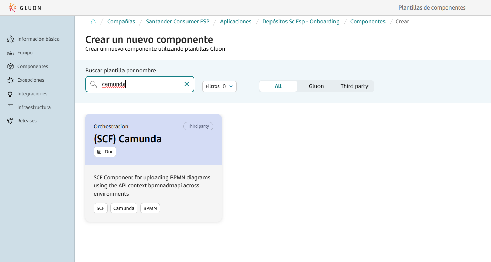
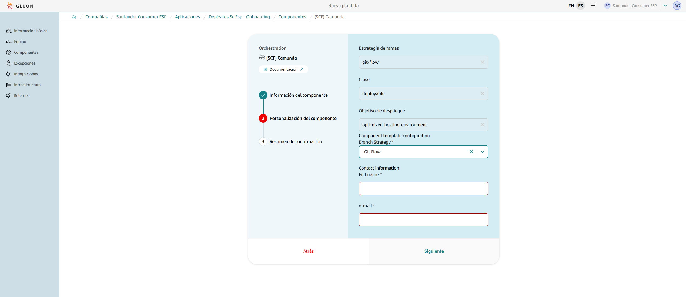

This base component template serves as a comprehensive guide for uploading BPMN diagrams using the API context `bpmnadmapi` across environments within the Gluon portal.

It streamlines the entire process, providing a clear and efficient pathway from development to deployment.

This includes guidance on setting up the project, configuring essential files, managing dependencies, and deploying the solution.
Whether you are starting from scratch or integrating into an existing project, this guide will provide the necessary steps to ensure a smooth and efficient development process.

## Create Component

### Gluon Portal

To begin, you must onboard your application. This involves setting up your application within the system. Once your application is successfully created and onboarded, you can proceed to create your component.

To create a component, follow these detailed steps:

1. **Select the Component Type**:
    First, you need to choose the type of component you wish to create. In this case, select `(SCF) Camunda`.

    

2. **Fill in Component Details**:
    Next, you will be prompted to fill in the necessary details for your component. This includes:
    - **Name**: Provide a unique and descriptive name for your component.
    - **Short Name**: Short names can only contain capital letters and digits.
    - **Description**: Write a detailed description that explains the purpose and functionality of the component.
    - **Branch Strategy**: Choose a branch strategy for your component's repository. The recommended branch strategy for this template is `git flow`, which helps in managing the development workflow efficiently.
    - **Contact Information**: Provide the contact information for the person responsible for the component. Include the name and email address.

    

3. **Component Creation**:
    After filling in the required details, proceed to create the component. Once the component is created, you will notice that a new repository is generated under your application.
    This repository will have the name of your component and will be integrated with SonarQube for code quality analysis and Fortify for security analysis.

By following these steps, you will have successfully created a new component. This component will be ready for further development within the GitHub repository.

### Component Repository

When creating a component from scratch, a scaffolding workflow runs automatically and creates the structure of the repository with the development branch, including all configuration files and workflows.

???+ warning "Scaffolding Note"

      Sometimes the scaffolding doesn't trigger automatically, so it needs to be launched manually from the actions tab.

#### Branches

{!
   include-markdown "./snippets/branch-structure.md"
   start="<!--Start Branch Structure-->"
   end="<!--End Branch Structure-->"
!}

#### Structure

The generated microservice has a structure similar to the following:

``` bash
📦
 ┣ 📂.github
 ┃ ┣ 📂workflows
 ┃ ┃ ┣ 📜cd.yml
 ┃ ┃ ┣ 📜ci.yml
 ┃ ┃ ┣ 📜release.yml
 ┃ ┃ ┣ 📜update-component-workflow.yml
 ┃ ┃ ┗ 📜version-validation.yml
 ┃ ┗ 📜CODEOWNERS
 ┗ 📜VERSION
```

## Component Configuration

This section provides an overview of the necessary configurations for integrating the Gluon component into your project. It covers the required branches and essential configuration files to ensure smooth CI/CD processes.

### Configuration Files

This base component template works with some configuration files that may need some modifications:

???+ warning "Scaffolding Note"

      The .bpmn files that were triply replicated for each environment in the env/DEV, env/PRE and env/PRO folders must be moved to the root of the repository without duplications.

- `VERSION`: Version configuration file.

#### VERSION File

The `VERSION` file is a simple text file that contains the version of the project. This file is used to track the current version of the project in a straightforward manner.

**Example of a `VERSION` file:**

```txt
1.0.0
```

**Customizing the `VERSION` file:**
Users using this template may need to update the version string to match their project's specifics. The version string should follow semantic versioning conventions, such as `MAJOR.MINOR.PATCH` (e.g., `1.0.0`).

If users already have a `VERSION` file, they can update the version string as needed to reflect the current state of their project.

## Application Lifecycle Management: How to build and deploy

{!
   include-markdown "./snippets/camunda-git-flow-lifecycle.md"
   start="<!--Start Flow-->"
   end="<!--End Flow-->"
!}

## Contact Information and Support

{!
   include-markdown "./snippets/contact-information.md"
   start="<!--Start-->"
   end="<!--End-->"
!}
