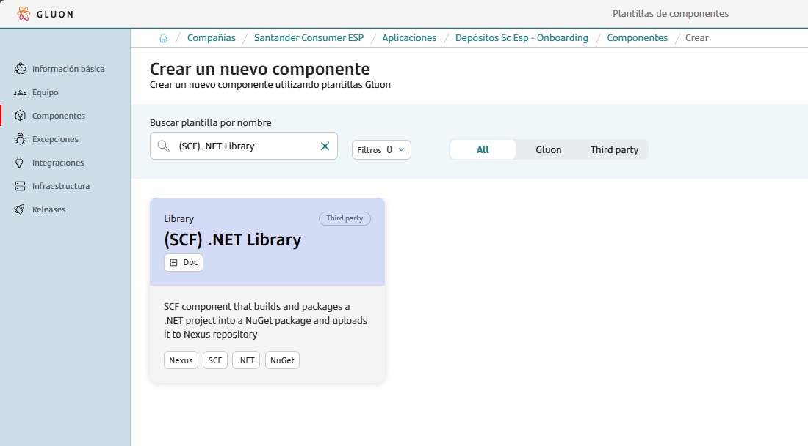
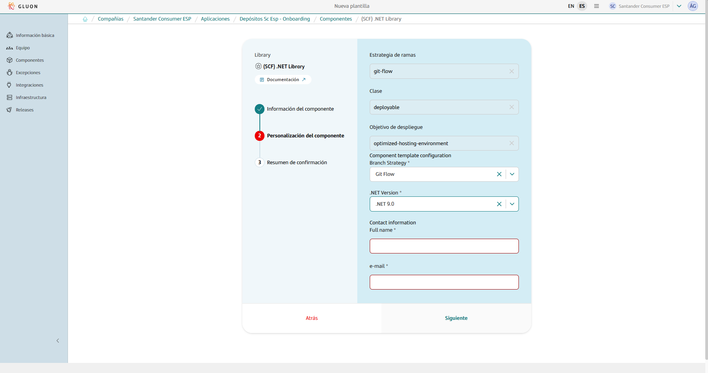

This base component template serves as a comprehensive guide for building, packaging and uploading .NET libraries to Nexus as NuGet packages within the Gluon portal.
It streamlines the entire process, providing a clear and efficient pathway from development to deployment.

In this documentation, users will find detailed instructions, best practices, and examples to effectively utilize the .NET workflow for their libraries.
This includes guidance on setting up the project, configuring essential files, managing dependencies, and uploading the library as a NuGet package to a Nexus repository (scq-nuget-snapshots or scq-nuget-releases).

While it is a brownfield project, we leverage Gluon's SonarQube and Fortify for code quality and security analysis, rather than using our own tools directly.

Whether you are starting from scratch or integrating .NET into an existing project, this guide will provide the necessary steps to ensure a smooth and efficient development and deployment process for .NET libraries.
By following this guide, users can ensure their .NET libraries are properly built, analyzed for quality and security, and deployed as NuGet packages to the appropriate Nexus repository.

## Create Component

### Gluon Portal

To begin, you must onboard your application. This involves setting up your application within the system. Once your application is successfully created and onboarded, you can proceed to create your component.

To create a component, follow these detailed steps:

1. **Select the Component Type**:
    First, you need to choose the type of component you wish to create. In this case, select `(SCF) .NET library`.

    

2. **Fill in Component Details**:
    Next, you will be prompted to fill in the necessary details for your component. This includes:
    - **Name**: Provide a unique and descriptive name for your component.
    - **Short Name**: Short names can only contain capital letters and digits.
    - **Description**: Write a detailed description that explains the purpose and functionality of the component.
    - **Branch Strategy**: Choose a branch strategy for your component's repository. The recommended branch strategy for this template is `git flow`, which helps in managing the development workflow efficiently.
    - **.NET Version**: Specify the .NET version that your library will use.
    - **Contact Information**: Provide the contact information for the person responsible for the component. Include the name and email address.

    

3. **Component Creation**:
    After filling in the required details, proceed to create the component. Once the component is created, you will notice that a new repository is generated under your application.
    This repository will have the name of your component and will be integrated with SonarQube for code quality analysis and Fortify for security analysis.

By following these steps, you will have successfully created a new component. This component will be ready for further development within the GitHub repository.

### Component Repository

When creating a component from scratch, a scaffolding workflow runs automatically and creates the structure of the repository with the development branch, including all configuration files and workflows.

???+ warning "Scaffolding Note"

      Sometimes the scaffolding doesn't trigger automatically, so it needs to be launched manually from the actions tab.

#### Branches

{!
   include-markdown "./snippets/branch-structure.md"
   start="<!--Start Branch Structure-->"
   end="<!--End Branch Structure-->"
!}

#### Structure

The generated library has a structure similar to the following:

``` bash
📦
 ┣ 📂.github
 ┃ ┣ 📂workflows
 ┃ ┃ ┣ 📜ci.yml
 ┃ ┃ ┣ 📜quality.yml
 ┃ ┃ ┣ 📜release.yml
 ┃ ┃ ┣ 📜security.yml
 ┃ ┃ ┣ 📜update-component-workflow.yml
 ┃ ┃ ┗ 📜version-validation.yml
 ┃ ┗ 📜CODEOWNERS
 ┣ 📂.gluon
 ┃ ┣ 📂ci
 ┃ ┗ ┗ 📜properties.env
 ┗ 📜VERSION
```

## Component Configuration

This section provides an overview of the necessary configurations for integrating the Gluon component into your project. It covers the required branches and essential configuration files to ensure smooth CI/CD processes.

### Configuration Files

This base component template works with some configuration files that may need some modifications:

- `properties.env`: Properties with the CI/CD configuration.
- `VERSION`: Version configuration file.

#### Properties

=== "Default"

    ```properties
      # Sonar parameters
      SONAR_ID="SONAR_GLUON_COMMUNITY"
      SONAR_PROJECT_KEY=""

      # Fortify parameters
      FORTIFY_PROJECT=""

      # .NET parameters
      DOTNET_VERSION=""
    ```

The **properties.env** file contains the configuration for the CI/CD pipeline. It is generated automatically.
The parameters that are configured by default are:

=== "Properties.env"

    | **Variable**        | **Required** | **Description** | **Example value**               |
    |---------------------|--------------|-----------------|---------------------------------|
    | **SONAR_PROJECT_KEY** | true         | Project key in Sonar | sgt-gluonad-probemicroframework |
    | **FORTIFY_PROJECT** | true         | Project name in Fortify | sgt-gluonad-probemicroframework |

=== "SONAR Configuration"

    | Property             | Required   | Description                         | Example |
    |----------------------|------------|-------------------------------------|---------------|
    | SONAR_ID             | false      | The name of the Sonar instance to be used. This value is unique and its value will be 'SONAR_GLUON_COMMUNITY'   | 'SONAR_GLUON_COMMUNITY' |
    | SONAR_PROJECT_KEY    | true       | Project key that's created in the sonar instance | "ccc:ccc:test-project:mvn-immutable-test" |
    | SONAR_REPORT_PATH    | false      | Location where the scanner writes the report-task.txt  | 'target/site' |
    | SONAR_MEMORY_PROPERTIES | false   | Memory properties                   | '-Xmx256m' |
    | ELASTICSEARCH_API_URL | true      | Elasticsearch api url with protocol | `https://[url]` |
    | ELASTICSEARCH_ALIAS   | true      | Elastic Search index                | 'index-x' |
    | ELASTICSEARCH_TYPE    | true      | Elasticsearch type                  | '_doc' |
    | QG_ENABLED    | false      | Enables or disables Sonar, Fortify, and Sonatype scans in CI, with 'high' for blocking, 'none' for non-blocking, and empty to skip scans.           | 'high' |

=== "DOTNET Configuration"

    | Property             | Required   | Description                         | Example |
    |----------------------|------------|-------------------------------------|---------------|
    | **DOTNET_VERSION**   | true       | .NET version to use                 | 9.0           |
    | **PROJECT_PATH**   | false      | Project's path (if is not set, it will look for a .sln file in the repository root)                 | dir1/my-solution.sln     |
    | **DOTNET_BUILD_ARGS**   | false       | Arguments for build command                 | '' |
    | **DOTNET_PACK_ARGS**   | false       | Arguments for pack command                 | '' |

???+ info "Naming convention"

    The project name in **Sonar** and **Fortify** must be the same as the component repository name.
    To avoid possible errors, the **properties.env** file is generated with the necessary values for the variables **SONAR_PROJECT_KEY** and **FORTIFY_PROJECT**.

    Example values:

    SONAR_PROJECT_KEY="sgt-gluonad-probemicroframework"

    FORTIFY_PROJECT="sgt-gluonad-probemicroframework"

#### VERSION File

The `VERSION` file is a simple text file that contains the version of the project. This file is used to track the current version of the project in a straightforward manner.

**Example of a `VERSION` file:**

```txt
1.0.0
```

**Customizing the `VERSION` file:**
Users using this template may need to update the version string to match their project's specifics. The version string should follow semantic versioning conventions, such as `MAJOR.MINOR.PATCH` (e.g., `1.0.0`).

If users already have a `VERSION` file, they can update the version string as needed to reflect the current state of their project.

### Secrets Configuration

Nexus credentials for the SCQ NuGet repository are required. `REPOSITORY_SCF_NUGET_USERNAME` and `REPOSITORY_SCF_NUGET_PASSWORD` should be checked at the organization level as GitHub secrets.
It is not necessary to add them since they should already be present, but ensure that they are correctly configured.

To do so, go to Settings > Security > Secrets and variables > Actions and add the following secrets at “Repository secrets” level.

## Application Lifecycle Management: How to build and deploy

{!
   include-markdown "./snippets/lib-git-flow-lifecycle.md"
   start="<!--Start Flow-->"
   end="<!--End Flow-->"
!}

## Contact Information and Support

{!
   include-markdown "./snippets/contact-information.md"
   start="<!--Start-->"
   end="<!--End-->"
!}
