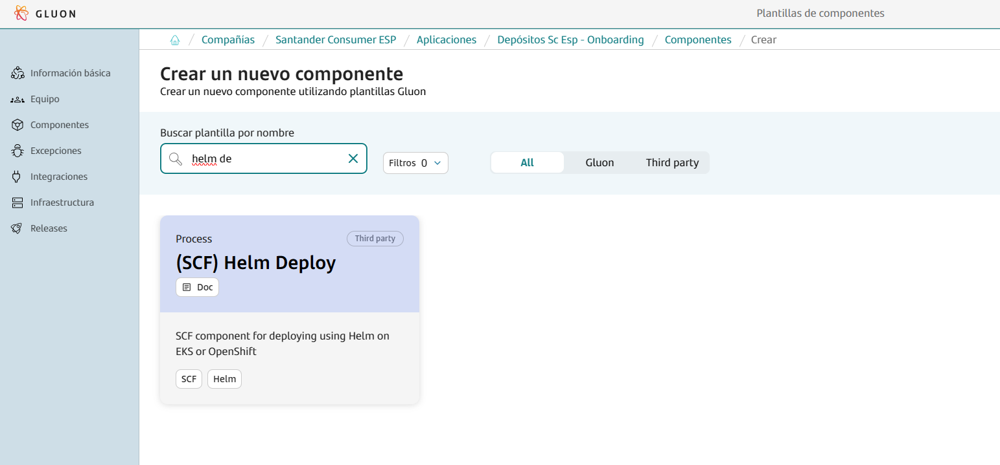
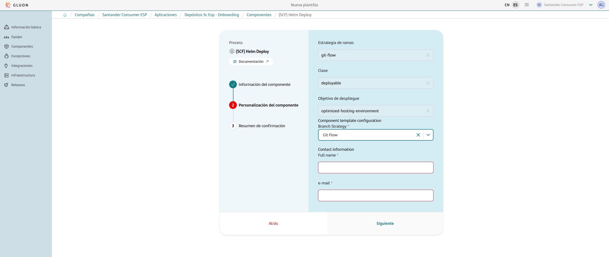

This base component template serves as a comprehensive guide for deploying projects with Helm to AWS EKS or to Openshift within the Gluon portal.
It streamlines the entire process, providing a clear and efficient pathway from development to deployment using Helm charts.

In this documentation, users will find detailed instructions, best practices, and examples to effectively utilize the Helm workflow to deploy to EKS or Openshift.
This includes guidance on setting up the project, configuring essential `values.yaml` files across all environments, managing dependencies, and deploying the Helm charts.

While it is a brownfield project, we leverage Gluon's Sysdig for security analysis.

Whether you are starting from scratch or integrating into an existing project, this guide will provide the necessary steps to ensure a smooth and efficient deployment process using Helm.

## Prerequisites: AWS Credentials Request

For this pipeline to work correctly, you need to request a role + OIDC, which must be specified in the [awsRoleName](#deploymentyml) parameter of the `deployment.yml` file.
Note that this template is cataloged as a `Microservice components > Brownfield`, detailed information to make the request can be found [here](../support/credentials/brownfield.md).

## Create Component

### Gluon Portal

To begin, you must onboard your application. This involves setting up your application within the system. Once your application is successfully created and onboarded, you can proceed to create your component.

To create a component, follow these detailed steps:

1. **Select the Component Type**:
    First, you need to choose the type of component you wish to create. In this case, select `(SCF) helm Deploy`.

    

2. **Fill in Component Details**:
    Next, you will be prompted to fill in the necessary details for your component. This includes:
    - **Name**: Provide a unique and descriptive name for your component.
    - **Short Name**: Short names can only contain capital letters and digits.
    - **Description**: Write a detailed description that explains the purpose and functionality of the component.
    - **Branch Strategy**: Choose a branch strategy for your component's repository. The recommended branch strategy for this template is `git flow`, which helps in managing the development workflow efficiently.
    - **Contact Information**: Provide the contact information for the person responsible for the component. Include the name and email address.

    

3. **Component Creation**:
    After filling in the required details, proceed to create the component. Once the component is created, you will notice that a new repository is generated under your application.
    This repository will have the name of your component and will be integrated with SonarQube for code quality analysis and Fortify for security analysis.

By following these steps, you will have successfully created a new component. This component will be ready for further development within the GitHub repository.

### Component Repository

When creating a component from scratch, a scaffolding workflow runs automatically and creates the structure of the repository with the development branch, including all configuration files and workflows.

???+ warning "Scaffolding Note"

      Sometimes the scaffolding doesn't trigger automatically, so it needs to be launched manually from the actions tab.

#### Branches

{!
   include-markdown "./snippets/branch-structure.md"
   start="<!--Start Branch Structure-->"
   end="<!--End Branch Structure-->"
!}

#### Structure

The generated microservice has a structure similar to the following:

``` bash
📦
 ┣ 📂.chart
 ┃ ┣ 📜values-dev.yaml
 ┃ ┣ 📜values-pre.yaml
 ┃ ┣ 📜values-pro.yaml
 ┣ 📂.github
 ┃ ┣ 📂workflows
 ┃ ┃ ┣ 📜cd.yml
 ┃ ┃ ┣ 📜ci.yml
 ┃ ┃ ┣ 📜release.yml
 ┃ ┃ ┣ 📜update-component-workflow.yml
 ┃ ┃ ┗ 📜version-validation.yml
 ┃ ┗ 📜CODEOWNERS
 ┣ 📂.gluon
 ┃ ┣ 📂ci
 ┃ ┗ ┗ 📜properties.env
 ┣ 📜deployment.yml
```

## Component Configuration

This section provides an overview of the necessary configurations for integrating the Gluon component into your project. It covers the required branches and essential configuration files to ensure smooth CI/CD processes.

### Configuration Files

This base component template works with some configuration files that may need some modifications:

- `properties.env`: Properties with the CI/CD configuration.
- `deployment.yml`: file to define the CD deploy procsess.

#### Properties

=== "Default"

    ```properties
      DOCKER_BUILD_ARGUMENTS=''
      IMAGE_DEPLOY_TYPE="helm"
      HELM_PACKAGE="false"
    ```

The **properties.env** file contains the configuration for the CI/CD pipeline. It is generated automatically.
The parameters that are configured by default are:

=== "Properties.env"

    | **Variable**        | **Required** | **Description** | **Example value**               |
    |---------------------|--------------|-----------------|---------------------------------|
    | **SONAR_PROJECT_KEY** | true         | Project key in Sonar | sgt-gluonad-probemicroframework |
    | **FORTIFY_PROJECT** | true         | Project name in Fortify | sgt-gluonad-probemicroframework |
    | **NODE_VERSION** | true         | Node version to use | 20.12.0 |
    | **DOCKER_BUILD_ARGUMENTS** | false        | Docker arguments for Docker Build | "" |

#### Deployment.yml

The `deployment.yml` file is used to define the CD deploy process for the microservice using Helm in EKS or Openshift.

`awsRoleName`: When using roles a awsRoleName under providerParams needs to be defined (the name of the role is expected and not the entire ARN).

When using roles, if the pod needs credentials to consume AWS resources, it will also be necessary to reference serviceAccountName in the values files (check the Values section for more information).

=== "EKS"

    ```yaml title="Simple deployment EKS example" linenums="1"
    environments:
      - name: cert
        regions:
          - name: dev
            properties:
              application: # application to deploy
              cluster:
                apiServer: # api server url
                namespace: # namespace to deploy
                provider: eks
                providerParams: # only for eks provider
                  awsAccount: # aws account id
                  awsRoleName: # Aws role name
                  awsRegion: # aws region
                  clusterName: # cluster name
              helm:
                host: registry.global.ccc.srvb.can.paas.cloudcenter.corp
                project: # chart template project
                version: # chart template version
                repoType: harbor
                chart: # chart template name
      - name: pre
      ...
    ```

=== "Openshift"

    ```yaml title="Simple deployment Openshift example" linenums="1"
    environments:
      - name: cert
        regions:
          - name: dev
            properties:
              application: # application to deploy
              cluster:
                apiServer: # api server url
                namespace: # namespace to deploy
                provider: ose3
                providerParams: # only for eks provider
                  awsAccount: # aws account id
                  awsRoleName: # Aws role name
                  awsRegion: # aws region
                  clusterName: # cluster name
      - name: pre
      ...
    ```

#### .chart/values-(dev/pre/pro).yaml

In the `deployment.yml` file, we reference the chart that we want to use. In the following example, an excerpt from `deployment.yml` is shown where we reference the chart helm-eks-front-chart in its version 1.0.1.

```yaml title="Deployment file excerpt referencing Helm Chart" linenums="1"
helm:
  host: registry.global.ccc.srvb.can.paas.cloudcenter.corp
  project: # chart template project
  version: # chart template version
  repoType: harbor
  chart: # chart template name
```

This chart is configured/customized using the `values-(env).yml` files explained below:

???+ warning "Note"

      The values files are stored in the repository under the .chart directory and are used to configure the Helm Chart that is parameterized to take them into account. There is a values file for each environment:

```txt
.chart
| values-dev.yaml
| values-pre.yaml
| values-pro.yaml
```

Find below an example of values-dev.yaml:

???+ warning "Note"

      For `serviceAccountname`: If the pod needs credentials to consume AWS resources, it will be necessary to reference a serviceAccountName.

```yaml title="Values-(dev/pre/pro).yaml" linenums="1"
image:
  repository: <image to use by the pod, ex.: 000000000000.dkr.ecr.eu-west-1.amazonaws.com/example/example>
  tag: <Image tag to use. ej.: 1.0.0-SNAPSHOT>
serviceAccountName: <*name of the serviceAccount for IRSA, if applicable>
microservice: <microservice name>
trackingCode: <tracking code>
hostName: <hostname>
secretTls: <TLS secret name to use>
namespace: <Namespace>
path: /
port: <port>
replicas: <pod replicas>
Secrets:
  - <Name of the secret to us>
configurationFiles:
  - name: <name>
    data: |-
      EXAMPLE: "example"
```

???+ warning "Note"

      IRSA (IAM Roles for Service Accounts) should be used in scenarios where you would traditionally use user/password credentials to access AWS resources from within a pod. By using IRSA, you enhance security by leveraging IAM roles and policies, thus avoiding the need to hardcode sensitive credentials in your application code.

      *Warning*: Ensure you are using IRSA when configuring your AWS SDK for Amazon EKS. This is crucial for secure and efficient access management. It is essential for replacing traditional user/password methods when consuming AWS resources from within your pods.

### Secrets Configuration

EKS deployments don’t require setting any credentials as secrets in your repository as authentication is done using roles.
*Only in Openshift* deployment cases, a Token is required for each environment as GitHub Repository Secrets.

To do so, go to Settings > Security > Secrets and variables > Actions and add the following secrets at “Repository secrets” level.


## Application Lifecycle Management: How to build and deploy

{!
   include-markdown "./snippets/helm-git-flow-lifecycle.md"
   start="<!--Start Flow-->"
   end="<!--End Flow-->"
!}

## Contact Information and Support

{!
   include-markdown "./snippets/contact-information.md"
   start="<!--Start-->"
   end="<!--End-->"
!}
