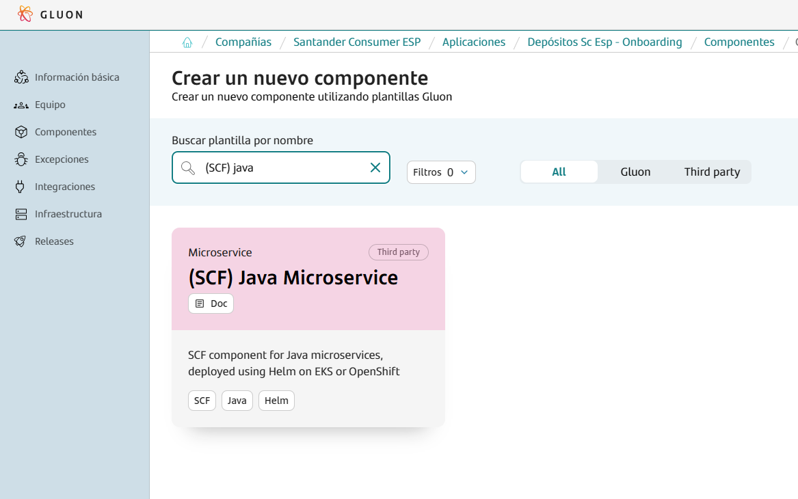
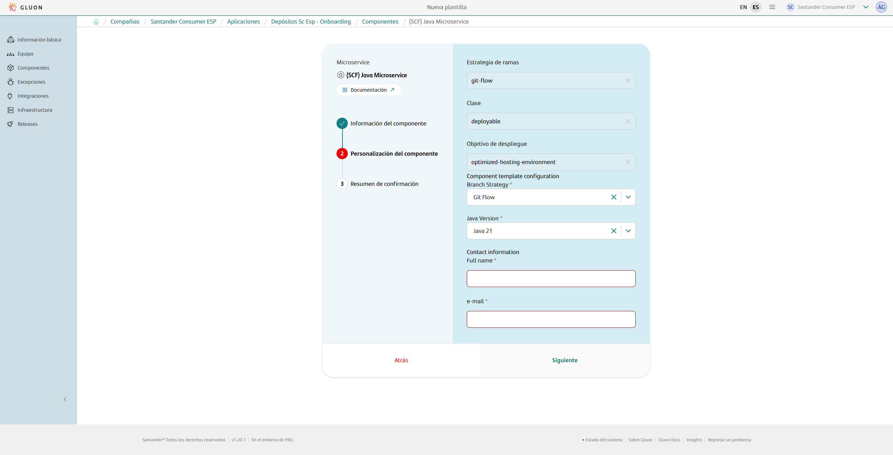
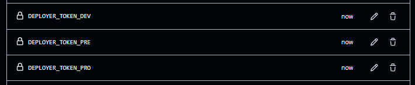

This base component template serves as a comprehensive guide for building and deploying Java microservices within the Gluon portal. It streamlines the entire process, providing a clear and efficient pathway from development to deployment.

In this documentation, users will find detailed instructions, best practices, and examples to effectively utilize the Java workflow for their microservices.

While it is a brownfield project, we leverage Gluon's SonarQube, Sysdig and Fortify for code quality and security analysis, rather than using our own tools directly.

This includes guidance on setting up the project, configuring essential files, managing dependencies, and deploying the microservice.
Whether you are starting from scratch or integrating Java into an existing project, this guide will provide the necessary steps to ensure a smooth and efficient development process.

## Prerequisites

### AWS Credentials Request

For this pipeline to work correctly, you need to request a role + OIDC, which must be specified in the [awsRoleName](#deploymentyaml) parameter of the `deployment.yml` file.  
Note that this template is cataloged as a `Microservice components > Brownfield`, detailed information to make the request can be found [here](../support/credentials/brownfield.md).

### Supported Versions

The following dotnet versions are supported for building and deploying microservices using this template:

- adoptopenjdk-8.0.181+13
- adoptopenjdk-8.0.192+12
- adoptopenjdk-8.0.202+8
- adoptopenjdk-8.0.212+3
- adoptopenjdk-8.0.212+4
- adoptopenjdk-8.0.222+10.1
- adoptopenjdk-8.0.232+9.1
- adoptopenjdk-8.0.242+8.1
- adoptopenjdk-8.0.252+9.1
- adoptopenjdk-8.0.262+10
- adoptopenjdk-8.0.265+1
- adoptopenjdk-8.0.272+10
- adoptopenjdk-8.0.275+1
- adoptopenjdk-8.0.282+8
- adoptopenjdk-8.0.292+10
- adoptopenjdk-8.0.302+8
- adoptopenjdk-8.0.312+7
- adoptopenjdk-8.0.322+6
- adoptopenjdk-8.0.332+9
- adoptopenjdk-8.0.342+7
- adoptopenjdk-8.0.345+1
- adoptopenjdk-8.0.352+8
- adoptopenjdk-8.0.362+9
- adoptopenjdk-8.0.372+7
- adoptopenjdk-8.0.382+5
- adoptopenjdk-8.0.392+8
- adoptopenjdk-8.0.402+6
- adoptopenjdk-8.0.412+8
- adoptopenjdk-8.0.422+5
- adoptopenjdk-8.0.432+6
- adoptopenjdk-8.0.442+6
- **adoptopenjdk-8.0.452+9**
- adoptopenjdk-9.0.0+181
- adoptopenjdk-9.0.4+11
- adoptopenjdk-10.0.2+13.1
- adoptopenjdk-11.0.0+28
- adoptopenjdk-11.0.1+13
- adoptopenjdk-11.0.2+7
- adoptopenjdk-11.0.2+9
- adoptopenjdk-11.0.3+7
- adoptopenjdk-11.0.4+11.1
- adoptopenjdk-11.0.5+10.1
- adoptopenjdk-11.0.6+10.1
- adoptopenjdk-11.0.7+10.1
- adoptopenjdk-11.0.8+10
- adoptopenjdk-11.0.9+11
- adoptopenjdk-11.0.9+101
- adoptopenjdk-11.0.10+9
- adoptopenjdk-11.0.11+9
- adoptopenjdk-11.0.12+7
- adoptopenjdk-11.0.13+8
- adoptopenjdk-11.0.14+9
- adoptopenjdk-11.0.14+101
- adoptopenjdk-11.0.15+10
- adoptopenjdk-11.0.16+8
- adoptopenjdk-11.0.16+101
- adoptopenjdk-11.0.17+8
- adoptopenjdk-11.0.18+10
- adoptopenjdk-11.0.19+7
- adoptopenjdk-11.0.20+8
- adoptopenjdk-11.0.20+101
- adoptopenjdk-11.0.21+9
- adoptopenjdk-11.0.22+7
- adoptopenjdk-11.0.23+9
- adoptopenjdk-11.0.24+8
- adoptopenjdk-11.0.25+9
- adoptopenjdk-11.0.26+4
- **adoptopenjdk-11.0.27+6**
- adoptopenjdk-12.0.0+33
- adoptopenjdk-12.0.1+12
- adoptopenjdk-12.0.2+10.1
- adoptopenjdk-13.0.0+33.1
- adoptopenjdk-13.0.1+9.1
- adoptopenjdk-13.0.2+8.1
- adoptopenjdk-14.0.0+36.1
- adoptopenjdk-14.0.1+7.1
- adoptopenjdk-14.0.2+12
- adoptopenjdk-15.0.0+36
- adoptopenjdk-15.0.1+9
- adoptopenjdk-15.0.2+7
- adoptopenjdk-16.0.0+36
- adoptopenjdk-16.0.1+9
- adoptopenjdk-16.0.2+7
- adoptopenjdk-17.0.0+35
- adoptopenjdk-17.0.1+12
- adoptopenjdk-17.0.2+8
- adoptopenjdk-17.0.3+7
- adoptopenjdk-17.0.4+8
- adoptopenjdk-17.0.4+101
- adoptopenjdk-17.0.5+8
- adoptopenjdk-17.0.6+10
- adoptopenjdk-17.0.7+7
- adoptopenjdk-17.0.8+7
- adoptopenjdk-17.0.8+101
- adoptopenjdk-17.0.9+9
- adoptopenjdk-17.0.10+7
- adoptopenjdk-17.0.11+9
- adoptopenjdk-17.0.12+7
- adoptopenjdk-17.0.13+11
- adoptopenjdk-17.0.14+7
- **adoptopenjdk-17.0.15+6**
- adoptopenjdk-18.0.0+36
- adoptopenjdk-18.0.1+10
- adoptopenjdk-18.0.2+9
- adoptopenjdk-18.0.2+101
- adoptopenjdk-19.0.0+36
- adoptopenjdk-19.0.1+10
- adoptopenjdk-19.0.2+7
- adoptopenjdk-20.0.0+36
- adoptopenjdk-20.0.1+9
- adoptopenjdk-20.0.2+9
- adoptopenjdk-21.0.0+35.0.LTS
- adoptopenjdk-21.0.1+12.0.LTS
- adoptopenjdk-21.0.2+13.0.LTS
- adoptopenjdk-21.0.3+9.0.LTS
- adoptopenjdk-21.0.4+7.0.LTS
- adoptopenjdk-21.0.5+11.0.LTS
- adoptopenjdk-21.0.6+7.0.LTS
- **adoptopenjdk-21.0.7+6.0.LTS**
- adoptopenjdk-22.0.0+36
- adoptopenjdk-22.0.1+8
- adoptopenjdk-22.0.2+9
- adoptopenjdk-23.0.0+37
- adoptopenjdk-23.0.1+11
- adoptopenjdk-23.0.2+7
- adoptopenjdk-24.0.0+36
- adoptopenjdk-24.0.1+9

Ensure that your development environment matches one of these supported versions to guarantee compatibility with the template and associated tools.

When creating the component, you will be prompted to select the major version, and the repository will be initialized with the latest available release corresponding to the selected version.
**If you need a different version, you can always set the JAVA_VERSION in the properties.env file**.

Ensure that your development environment matches one of these supported versions to guarantee compatibility with the template and associated tools.

## Create Component

### Gluon Portal

To begin, you must onboard your application. This involves setting up your application within the system. Once your application is successfully created and onboarded, you can proceed to create your component.

To create a component, follow these detailed steps:

1. **Select the Component Type**:
    First, you need to choose the type of component you wish to create. In this case, select `(SCF) Java Microservice`.

    

2. **Fill in Component Details**:
    Next, you will be prompted to fill in the necessary details for your component. This includes:
    - **Name**: Provide a unique and descriptive name for your component.
    - **Short Name**: Short names can only contain capital letters and digits.
    - **Description**: Write a detailed description that explains the purpose and functionality of the component.
    - **Branch Strategy**: Choose a branch strategy for your component's repository. The recommended branch strategy for this template is `git flow`, which helps in managing the development workflow efficiently.
    - **Java Version**: Specify the major version, and the repository will be initialized with the latest available release corresponding to the selected version.
    If you need a different version, you can always set the JAVA_VERSION in the properties.env file.
    - **Contact Information**: Provide the contact information for the person responsible for the component. Include the name and email address.

    

3. **Component Creation**:
    After filling in the required details, proceed to create the component. Once the component is created, you will notice that a new repository is generated under your application.
    This repository will have the name of your component and will be integrated with SonarQube for code quality analysis and Fortify for security analysis.

By following these steps, you will have successfully created a new component. This component will be ready for further development within the GitHub repository.

### Component Repository

When creating a component from scratch, a scaffolding workflow runs automatically and creates the structure of the repository with the development branch, including all configuration files and workflows.

???+ warning "Scaffolding Note"

      Sometimes the scaffolding doesn't trigger automatically, so it needs to be launched manually from the actions tab.

#### Branches

{!
   include-markdown "./snippets/branch-structure.md"
   start="<!--Start Branch Structure-->"
   end="<!--End Branch Structure-->"
!}

#### Structure

The generated microservice has a structure similar to the following:

``` bash
📦
 ┣ 📂.chart
 ┃ ┣ 📜values-dev.yaml
 ┃ ┣ 📜values-pre.yaml
 ┃ ┣ 📜values-pro.yaml
 ┣ 📂.github
 ┃ ┣ 📂workflows
 ┃ ┃ ┣ 📜cd.yml
 ┃ ┃ ┣ 📜ci.yml
 ┃ ┃ ┣ 📜quality.yml
 ┃ ┃ ┣ 📜release.yml
 ┃ ┃ ┣ 📜security.yml
 ┃ ┃ ┣ 📜update-component-workflow.yml
 ┃ ┃ ┗ 📜version-validation.yml
 ┃ ┗ 📜CODEOWNERS
 ┣ 📂.gluon
 ┃ ┣ 📂ci
 ┃ ┗ ┗ 📜properties.env
 ┣ 📜.dockerignore
 ┣ 📜deployment.yaml
 ┣ 📜Dockerfile
 ┣ 📜multiregistry.json
 ┣ 📜pom.xml
 ┗ 📜README.md
```

## Component Configuration

This section provides an overview of the necessary configurations for integrating the Gluon component into your project. It covers the required branches and essential configuration files to ensure smooth CI/CD processes.

### Configuration Files

This base component template works with some configuration files that may need some modifications:

- `properties.env`: Properties with the CI/CD configuration.
- `Dockerfile`: Configuration to build the image.
- `multiregistry.json`: registry configuration and credentials to upload the image.
- `deployment.yaml`: file to define the CD deploy procsess.
- `.chart/values-(dev/pre/pro).yaml`: files to customize the Helm Chart.
- `pom.xml`: Java configuration file.

#### Properties

=== "Default"

    ```properties
      # Sonar parameters
      SONAR_ID="SONAR_GLUON_COMMUNITY"
      SONAR_PROJECT_KEY=""

      # Fortify parameters
      FORTIFY_PROJECT=""

      DOCKER_BUILD_ARGUMENTS=''
      IMAGE_DEPLOY_TYPE="helm"
      HELM_PACKAGE="false"
    ```

The **properties.env** file contains the configuration for the CI/CD pipeline. It is generated automatically.
The parameters that are configured by default are:

=== "Properties.env"

    | **Variable**        | **Required** | **Description** | **Example value**               |
    |---------------------|--------------|-----------------|---------------------------------|
    | **SONAR_PROJECT_KEY** | true         | Project key in Sonar | sgt-gluonad-probemicroframework |
    | **FORTIFY_PROJECT** | true         | Project name in Fortify | sgt-gluonad-probemicroframework |
    | **JAVA_VERSION** | true         | Java version to use from [available versions](#supported-versions) | 20.12.0 |
    | **DOCKER_BUILD_ARGUMENTS** | false        | Docker arguments for Docker Build | "" |

=== "SONAR Configuration"

    | Property             | Required   | Description                         | Example |
    |----------------------|------------|-------------------------------------|---------------|
    | SONAR_ID             | false      | The name of the Sonar instance to be used. This value is unique and its value will be 'SONAR_GLUON_COMMUNITY'   | 'SONAR_GLUON_COMMUNITY' |
    | SONAR_PROJECT_KEY    | true       | Project key that's created in the sonar instance | "ccc:ccc:test-project:mvn-immutable-test" |
    | SONAR_REPORT_PATH    | false      | Location where the scanner writes the report-task.txt  | 'target/site' |
    | SONAR_MEMORY_PROPERTIES | false   | Memory properties                   | '-Xmx256m' |
    | ELASTICSEARCH_API_URL | true      | Elasticsearch api url with protocol | `https://[url]` |
    | ELASTICSEARCH_ALIAS   | true      | Elastic Search index                | 'index-x' |
    | ELASTICSEARCH_TYPE    | true      | Elasticsearch type                  | '_doc' |
    | QG_ENABLED    | false      | Enables or disables Sonar, Fortify, and Sonatype scans in CI, with 'high' for blocking, 'none' for non-blocking, and empty to skip scans.                  | 'high' |

???+ info "Naming convention"

    The project name in **Sonar** and **Fortify** must be the same as the component repository name.
    To avoid possible errors, the **properties.env** file is generated with the necessary values for the variables **SONAR_PROJECT_KEY** and **FORTIFY_PROJECT**.

    Example values:

    SONAR_PROJECT_KEY="sgt-gluonad-probemicroframework"

    FORTIFY_PROJECT="sgt-gluonad-probemicroframework"

#### Dockerfile

The `Dockerfile` is a critical file used to build the Docker image for the microservice during the *Build* stage of the CI/CD pipeline.
This file contains a series of instructions that specify how to assemble the Docker image, including setting up the base image, copying application files, and defining any additional commands needed to configure the container environment.

An example `Dockerfile` might look like this:

```dockerfile title="Dockerfile Proposal" linenums="1"
FROM ...

# Copy the published application into the container with this command:
WORKDIR /artifact/path
COPY . .

# Add your Dockerfile instructions below
```

#### pom.xml

The `pom.xml` file is a crucial component of any Maven-based Java project. It serves as the manifest file for the project, containing metadata relevant to the project such as the project name, version, description, main class, dependencies, and more.
This file allows Maven to manage the project's dependencies and build lifecycle efficiently.

**Key Sections of `pom.xml`:**

 - **groupId**: The group ID of your project.
 - **artifactId**: The artifact ID of your project.
 - **version**: The current version of your project.
 - **name**: The name of your project.
 - **description**: A brief description of your project.
 - **dependencies**: Packages required for the project to run.
 - **build**: Configuration for building the project, including plugins and resources.

**Customizing `pom.xml`:**
Users using this template may need to update the `groupId`, `artifactId`, `version`, `name`, and `description` fields to match their project's specifics.
Additionally, they might need to add or modify dependencies and build configurations to suit their project's requirements.
If users already have a `pom.xml` file, they can merge the dependencies and build configurations from the template with their existing file.

#### Multiregistry

The JSON snippet below illustrates a simple multi-registry configuration.

???+ warning "Note"

      In case of deploying to Openshift (**OSE3**), note that the registry should be set to **Harbor**.

In the case of using **Harbor** as a registry, make sure to add `harbor_host` in the file and to have the secrets `HARBOR_USERNAME` and `HARBOR_PASSWORD` configured in the repository.

Find below an example of a multiregistry file with an AWS ECR case and Harbor examples:

```json title="Simple multiregistry example" linenums="1"
[
  {
    "environment": "dev",
    "registries": [
      {
        "registry-type":"ecr|harbor",
        "harbor_host": "registry.global.ccc.srvb.can.paas.cloudcenter.corp",
        "repository": "",
        "awsRegion":   "",
        "awsAccount": "",
        "kms": ""
      }
    ]
  },
  {
    "environment": "pre",
    "registries": [
      {
        "registry-type":"ecr|harbor",
        "harbor_host": "registry.global.ccc.srvb.can.paas.cloudcenter.corp",
        "repository": "",
        "awsRegion":   "",
        "awsAccount": "",
        "kms": ""
      }
    ]
  },
  {
    "environment": "pro",
    "registries": [
      {
        "registry-type":"[ecr|harbor]",
        "harbor_host": "registry.global.ccc.srvb.can.paas.cloudcenter.corp",
        "repository": "",
        "awsRegion":   "",
        "awsAccount": "",
        "kms": ""
      }
    ]
  }
]
```

In this configuration:

- `registry-type` refers to the type of registry, being `ecr` or `harbor`.
- `awsRegion` to deploy to when `registry-type` is set to `ecr`.
- `repository` denotes the Docker image in the registry.
- `awsAccount` ID if wen `registry-type` is set to `ecr`.
- `kms` refers tot he kms key.
- `harbor_host` needs to be defined when `registry-type` is set to `harbor`.

This configuration is essential when managing and deploying Docker images across different registries. It ensures each Docker image is correctly authenticated, deployed, and scanned.
Please note that the usernameId and passwordId should be registered as secrets in your repository and be valid credentials for deploying in the registries.

???+ warning "Credentials and Secrets for Harbor"

      Make sure the parameters `HARBOR_USERNAME` and `HARBOR_PASSWORD` are registered as secrets in your repository when registry-type is set to harbor.
      Note that no credentials are needed for AWS ECR image upload.

#### Deployment.yaml

The `deployment.yaml` file is used to define the CD deploy process for the microservice using Helm in **EKS** or **Openshift**.

`awsRoleName`: When using roles a awsRoleName under providerParams needs to be defined (the name of the role is expected and not the entire ARN).

When using roles, if the pod needs credentials to consume AWS resources, it will also be necessary to reference serviceAccountName in the values files (check the Values section for more information).

```yaml title="Simple deployment for EKS and OSE3 example" linenums="1"
environments:
  - name: cert
    regions:
      - name: dev
        properties:
          application: # application to deploy
          cluster:
            apiServer: # api server url
            namespace: # namespace to deploy
            provider: eks/ose3 # choose between EKS or Openshift Deployment type
            ose3TokenSecretName: # Deployment Token Secret Name for OSE3 (empty defaults to DEPLOYER_TOKEN_DEV)
            providerParams: # only for eks provider
              awsAccount: # aws account id
              awsRoleName: # role name
              awsRegion: # aws region
              clusterName: # cluster name
          helm:
            host: registry.global.ccc.srvb.can.paas.cloudcenter.corp
            project: # chart template project
            version: # chart template version
            repoType: harbor
            chart: # chart template name
  - name: pre
  ...
```

???+ info "Multi Region Deployment"

    Note that multiple regions can be configured within each environment. For instance within the *cert* environment users could configure multiple regions such as *dev*, *dev2* or whatever name fits best. The same applies to other environments.

#### .chart/values-(dev/pre/pro).yaml

In the `deployment.yml` file, we reference the chart that we want to use. In the following example, an excerpt from `deployment.yml` is shown where we reference the chart helm-eks-front-chart in its version 1.0.1.

```yaml title="Deployment file excerpt referencing Helm Chart" linenums="1"
helm:
  host: registry.global.ccc.srvb.can.paas.cloudcenter.corp
  project: # chart template project
  version: # chart template version
  repoType: harbor
  chart: # chart template name
```

This chart is configured/customized using the `values-(env).yml` files explained below:

???+ warning "Note"

      The values files are stored in the repository under the .chart directory and are used to configure the Helm Chart that is parameterized to take them into account. There is a values file for each environment:

```txt
.chart
| values-dev.yaml
| values-pre.yaml
| values-pro.yaml
```

Find below an example of values-dev.yaml:

???+ warning "Note"

      For `serviceAccountname`: If the pod needs credentials to consume AWS resources, it will be necessary to reference a serviceAccountName.

```yaml title="Values-(dev/pre/pro).yaml" linenums="1"
image:
  repository: <image to use by the pod, ex.: 000000000000.dkr.ecr.eu-west-1.amazonaws.com/example/example>
  tag: <Image tag to use. ej.: 1.0.0-SNAPSHOT>
serviceAccountName: <*name of the serviceAccount for IRSA, if applicable>
microservice: <microservice name>
trackingCode: <tracking code>
hostName: <hostname>
secretTls: <TLS secret name to use>
namespace: <Namespace>
path: /
port: <port>
replicas: <pod replicas>
Secrets:
  - <Name of the secret to us>
configurationFiles:
  - name: <name>
    data: |-
      EXAMPLE: "example"
```

???+ warning "Note"

      IRSA (IAM Roles for Service Accounts) should be used in scenarios where you would traditionally use user/password credentials to access AWS resources from within a pod. By using IRSA, you enhance security by leveraging IAM roles and policies, thus avoiding the need to hardcode sensitive credentials in your application code.

      *Warning*: Ensure you are using IRSA when configuring your AWS SDK for Amazon EKS. This is crucial for secure and efficient access management. It is essential for replacing traditional user/password methods when consuming AWS resources from within your pods.

### Secrets Configuration

EKS deployments don’t require setting any credentials as secrets in your repository as authentication is done using roles.
*Only in Openshift* deployment cases, a Token is required for each environment as GitHub Repository Secrets.

Configure all required secrets for each environment as in the following example in the [deployment.yml file](#deploymentyaml).

```yaml title="OSE3 Token secret name example" linenums="1"
environments:
  - name: cert
    regions:
      - name: dev
        properties:
          cluster:
            ose3TokenSecretName: YOUR_OSE3_SECRET_NAME
  ...
```

Make sure to have your secrets configured with the provided name.
To do so, go to Settings > Security > Secrets and variables > Actions and add the following secrets at “Repository secrets” level.

If no custom secrets are configured within the deployment.yaml file the workflow will search the following default secrets:



*Only* if the image is uploaded to a *Harbor* registry instead of AWS ECR a HARBOR_USERNAME and HARBOR_PASSWORD must be as secrets:


## Application Lifecycle Management: How to build and deploy

{!
   include-markdown "./snippets/micro-git-flow-lifecycle.md"
   start="<!--Start Flow-->"
   end="<!--End Flow-->"
!}

## Contact Information and Support

{!
   include-markdown "./snippets/contact-information.md"
   start="<!--Start-->"
   end="<!--End-->"
!}
