The goal of this documentation is to provide guidance on how to create Kafka Connect connectors in EKS pods using the Gluon portal and the SCFGS workflow.
This means that the CI will reside on the Gluon portal infrastructure while the CD resides on the SCFGS infrastructure.

## Prerequisites: AWS Credentials Request

For this pipeline to work correctly, you need to request a role + OIDC.
Note that this pipeline requires special attention so make sure to read [this section](../support/credentials/special.md).

## CI - GLUON

{!
   include-markdown "./liquibase/configuration.md"
   start="<!--start-ci-intro-->"
   end="<!--end-ci-intro-->"
!}

### Create component

{!
   include-markdown "./liquibase/configuration.md"
   start="<!--start-ci-create-component-->"
   end="<!--end-ci-create-component-->"
!}

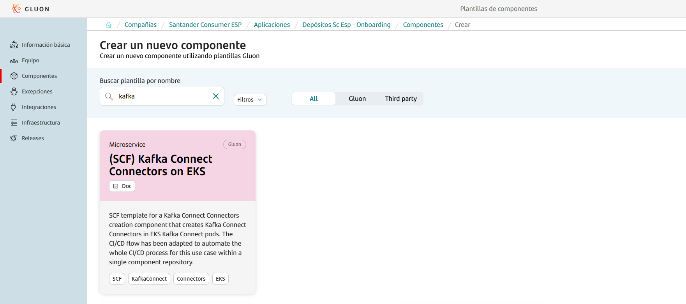

{!
   include-markdown "./liquibase/configuration.md"
   start="<!--start-repo-naming-convention-->"
   end="<!--end-repo-naming-convention-->"
!}

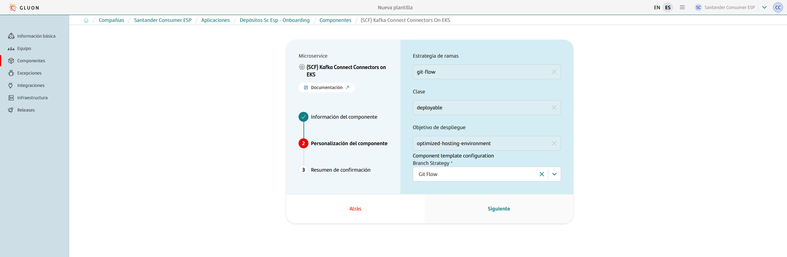

{!
   include-markdown "./liquibase/configuration.md"
   start="<!--start-ci-create-component-2-->"
   end="<!--end-ci-create-component-2-->"
!}

### Git Flow Lifecycle

{!
   include-markdown "./liquibase/configuration.md"
   start="<!--start-gitflow-->"
   end="<!--end-gitflow-->"
!}

### Configuration Files

As mentioned before, the scaffolding workflow generates a set of configuration files and some others that need to be added in order to make the workflows work. Find below the list of configuration files needed and how to configure them.

#### Properties.env

This file is generated by the scaffolding workflow and contains some properties for the CI configuration.

=== "Default"

    ```properties
    # Sonar parameters
    SONAR_ID="SONAR_GLUON_COMMUNITY"
    SONAR_PROJECT_KEY=""

    # Fortify parameters
    FORTIFY_PROJECT=""

    ZERO_TOUCH_ENABLE=true
    ```

### Variables configuration

The Kafka Connect connectors on EKS workflow needs variables to be able to make backups.

In github.com, variables are categorized into three types:

1. **Organization Variables**: These variables are accessible by all repositories within the organization.
2. **Repository Variables**: These variables are exclusive to a specific repository.
3. **Environment Variables**: These variables are restricted to a particular repository and its environment.

We need to add the third type: environment variables to our repository in order to make the associated workflows work.

#### Environment variables

{!
   include-markdown "./snippets/variables-global.md"
   start="<!--Start Add Environment Variables-->"
   end="<!--End Add Environment Variables-->"
!}

### Validate scripts

Once all branches are set up correctly, secrets are configured and configuration files are defined, the repository is ready to do deployments.
In order to make the full cycle, The scripts validation must be done with the CI process of the Gluon infrastructure and then the deployment using SCFGS CD.


This cycle is the same explained in the **Git-Flow lifecycle section**. During this section more details will be provided for each step.

### Quality gates

As shown in the previous image every time a Pull Request (PR) is made, the security and quality workflows are automatically executed: Quality, Security.
These workflows conform quality gates that are needed to ensure the quality and the security of the prior to the deployment.
There are 3 quality gates:

- **Sonar**: Code Quality and test coverage
- **Fortify**: Analysis of the vulnerabilities of our source code
- **Sonatype**: Analysis of the vulnerabilities of our dependencies.

### Pull Request from feature to development

In order to start developing in the repository, create a new `feature/*` branch from the `development` branch. Make all necessary changes in the newly created feature branch.
When changes are ready to deploy, create a pull request (PR) from the `feature/*` to the `development` branch. The creation of the pull request will trigger the security gate workflows.

??? info "Kafka Connect Connectors CI workflow code"

    ```yaml linenums="1"
    name: Kafka Connect Connectors CI

    on:
      push:
        branches:
          - development
          - develop
          - feature/*
          - fix/*
    
    jobs:
      call-reusable-workflow:
        name: Kafka Connect Connectors CI workflow
        uses: santander-group-scfccoe/gln-workflows/.github/workflows/kafka-connect-connectors-ci.yml@v1
        secrets: inherit
    ```
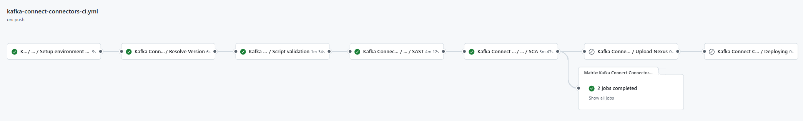

#### Quality workflow

- **Setup environment variables**: Load the properties defined in properties.env file and in the configuration project.
- **Resolve Version**: Get the current execution version.
- **SonarQube**: Executes the sonar analysis to validate the quality gates.

??? info "Kafka Connect Connectors quality workflow code"

    ```yaml linenums="1"
    name: Kafka Connect Connectors quality

    on:
      pull_request:
        branches:
          - development
          - develop
          - main
          - master
          
    jobs:
      call-reusable-workflow:
        name: Kafka Connect Connectors quality ${{ github.ref }}
        uses: santander-group-scfccoe/gln-workflows/.github/workflows/kafka-connect-connectors-quality.yml@v1
        secrets: inherit
    ```
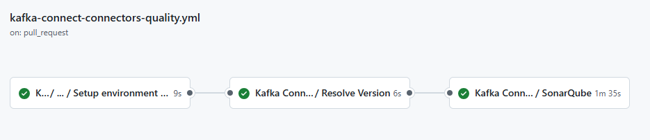

#### Security workflow

- **Setup environment variables**: Load the properties defined in properties.env file and in the configuration project.
- **Resolve Version**: Get the current execution version.
- **SAST**: Executes the reusable Fortify SAST workflow to perform a SAST scan with Fortify and validate the quality gates.
- **SCA**: Executes the reusable The Sonatype SCA workflow to perform a Sonatype SCA scan and analyze third party components from a repository.
- **Send information to Elasticsearch**: Send data to elasticsearch related with SAST and SCA analysis.

??? info "Kafka Connect Connectors security workflow code"

    ```yaml linenums="1"
    name: Kafka Connect Connectors security

    on:
      pull_request:
        branches:
          - development
          - develop
          - main
          - master

    jobs:
      call-reusable-workflow:
        name: Kafka Connect Connectors security ${{ github.ref }}
        uses: santander-group-scfccoe/gln-workflows/.github/workflows/kafka-connect-connectors-security.yml@v1
        secrets: inherit
    ```
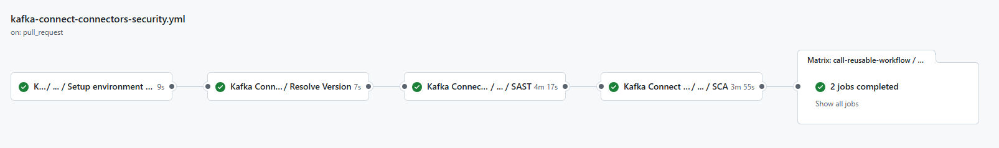

### Push to development

After approving the Pull Request from feature to `development`, a merge will be done. The merge actions does a *push* implicitly. This push event will trigger the kafka-connect-connectors-ci.yml workflow automatically.

The Kafka Connect Connectors CI workflow is a comprehensive process that begins with setting up environment variables, which involves loading properties defined in the `properties.env` file and in the configuration project.

After setting the environment variables, the workflow will perform bash script validation to check the correct bash file format.

After the JSON validation and sonar scan, it runs the reusable **Fortify SAST** workflow to perform a SAST scan with Fortify and validate the quality gates, and sends SAST analysis data to Elasticsearch.
The workflow also executes the reusable **Sonatype SCA** workflow to perform a Sonatype SCA scan. The next step involves **CERT** environment deployment.

??? info "Kafka Connect Connectors CI workflow code"

    ```yaml linenums="1"
    name: Kafka Connect Connectors CI

    on:
      push:
        branches:
          - development
          - develop
          - feature/*
          - fix/*
    
    jobs:
      call-reusable-workflow:
        name: Kafka Connect Connectors CI workflow
        uses: santander-group-scfccoe/gln-workflows/.github/workflows/kafka-connect-connectors-ci.yml@v1
        secrets: inherit
    ```
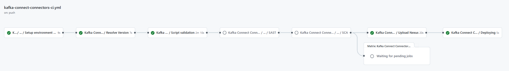

- **Setup environment variables**: Load the properties defined in properties.env file and in the configuration project.
- **Resolve Version**: Loads and builds the version of the current deployment.
- **Script validation**: Validates all bash scripts and executes sonar scan.
- **SAST**: Executes the reusable Fortify SAST workflow to perform a SAST scan with Fortify and validate the quality gates.
- **SCA**: Executes the reusable The Sonatype SCA workflow to perform a Sonatype SCA scan and analyze third party components from a repository.
- **Send information to Elasticsearch**: Send data to elasticsearch related with SAST and SCA analysis.
- **Upload Nexus**: Uploads the repository files as artifact to Nexus.
- **Deploying**: Executes the CD workflow.

Once the workflow ends, it triggers the CD workflow automatically.

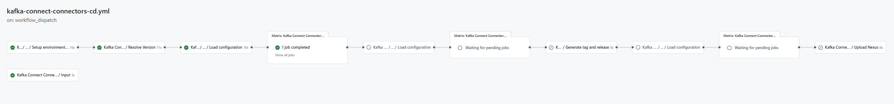

### Pull Request from development to main

When it's time to apply changes on the PRE/PRO environments' pod, we initiate a Pull Request from the integration branch: develop/development to the main/master branch.

This action triggers the kafka-connect-connectors-quality.yml (Sonar) and kafka-connect-connectors-security.yml (Fortify & Sonatype) workflows. defined in the **Pull Request from feature to development** section.

### Push to main

After approving the Pull Request from development to main, a merge will be done. The merge actions does a *push* implicitly. This push event will trigger the kafka-connect-connectors-rc.yml workflow automatically.

This workflow begins by setting up environment variables, loading properties defined in the `properties.env` file and in the configuration project, which is obtained according to the defined secrets.
Validates the bash scripts files, and then prepares the release candidate by updating the version in the branch (main or master), getting the next release version, and getting the last commit in the branch.

The workflow validates the bash scripts files and sonar scan, followed by the reusable **Fortify SAST** workflow is executed to perform a SAST scan with Fortify and validate the quality gates. SAST analysis data is sent to Elasticsearch.
The workflow also executes the reusable **Sonatype SCA** workflow to perform a Sonatype SCA scan and analyze third-party components from a repository.
A new tag for release is created, and finally, a new draft **release is created** and the check set is selected as a pre-release tag for release.

??? info "Kafka Connect Connectors RC workflow code"

    ```yaml linenums="1"
    name: Kafka Connect Connectors release candidate

    on:
      push:
        branches:
          - main
          - master
          
    jobs:
      cal-reusable-workflow:
        name: Kafka Connect Connectors release candidate workflow
        uses: santander-group-scfccoe/gln-workflows/.github/workflows/kafka-connect-connectors-rc.yml@v1
        secrets: inherit
    ```
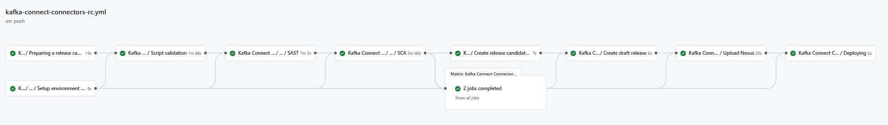

- **Setup environment variables**: Load the properties defined in properties.env file and in the configuration project.
- **Preparing a release candidate**: Loads and builds the version of the current deployment.
- **Script validation**: Validates all bash scripts and executes sonar scan.
- **SAST**: Executes the reusable Fortify SAST workflow to perform a SAST scan with Fortify and validate the quality gates.
- **SCA**: Executes the reusable The Sonatype SCA workflow to perform a Sonatype SCA scan and analyze third party components from a repository.
- **Send information to Elasticsearch**: Send data to elasticsearch related with SAST and SCA analysis.
- **Create release candidate tag**: Create a new tag for RC.
- **Create draft release**: Creates a new draft release and select the check Set as a pre-release tag for RC.
- **Upload Nexus**: Uploads the repository files as artifact to Nexus.
- **Deploying**: Executes the CD workflow.

Once the workflow ends, it triggers the CD workflow automatically.

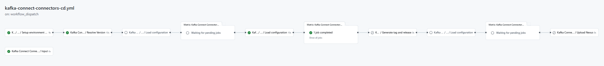

## CD - SCFGS

Once the CI progress is completed, the goal for the **CD workflow** is to create kafka connect connectors into different environments. The setup is designed to have a single executable workflow for all environment.

### CD Workflow stages

The CD workflow consists of 8 tasks that ensure a successful deployment. Below you will find a brief description of each job:


- **Input**: Shows the workflow inputs as summary.
- **Setup environment variables**: Loads all Gluon default configurations and the variables defined in the properties.env
- **Resolve Version**: Loads and builds the version of the current deployment.
- **Deploying in certification**: Creates the Kafka Connect connectors in the CERT EKS Kafka Connect pods.
- **Deploying in preproduction**: Creates the Kafka Connect connectors in the PRE EKS Kafka Connect pods.
- **Generate tag and release**: Generates the release version for PRO environment from the release candidate version.
- **Deploying in production**: Creates the Kafka Connect connectors in the PRO EKS Kafka Connect pods.
- **Upload Nexus**: Uploads the version of the deployed release candidate artifact on production as the final released version artifact.

### Configuration files

As the CI relies on some configuration files in order to work correctly, the CD workflow relies on one `deployment.yaml` file that needs to be configured.

#### deployment.yaml

The `deployment.yaml` file contains the necessary information to perform a deployment in a defined environment. There are some parameters that can be configured in order to configure the deployment file:

|**Variable**|**Required**|**Description**|**Example value**|
|---     |---  |---  |---          |
|**(cert/pre/pro)node(numbers)**| true | The name of the node, it is not the real node name, used to separate inputs.  | `certnode1` |
|**NAMESPACE**| true | The namespace where the kafka connector pod is deployed.  | `scf-test-dev` |
|**LABEL_APP_NAME**| true | The value of the Kubernetes label **app.kubernetes.io/name** assigned to the kafka connector pod.  | `kafka-connect` |
|**EKS_NAME**| true | The name of the EKS cluster where the kafka connector pod is deployed.  | `cbed2airacccbeeksgene001` |
|**EKS_REGION**| true | The region of the EKS cluster where the kafka connector pod is deployed.  | `eu-west-1` |

Find below a `deployment.yaml` example file. Make sure to replace the existing values with the corresponding one for the project.

```yaml title="Kafka Connect Connectors Deployment example" linenums="1"
CERT:
  certnode1:
    NAMESPACE: scf-test-dev
    LABEL_APP_NAME: kafka-connect
    AWS_ROLE_NAME: <your-aws-role-name>
    EKS_NAME: cbed2airacccbeeksgene001
    EKS_REGION: eu-west-1
  ...
PRE:
  prenode1:
    NAMESPACE: scf-test-pre
    LABEL_APP_NAME: kafka-connect
    AWS_ROLE_NAME: <your-aws-role-name>
    EKS_NAME: cbei2airacccbeeksgene001
    EKS_REGION: eu-west-1
  ...
PRO:
  pronode1:
    NAMESPACE: scf-test-pro
    LABEL_APP_NAME: kafka-connect
    AWS_ROLE_NAME: <your-aws-role-name>
    EKS_NAME: cbep2airacccbeeksgene001
    EKS_REGION: eu-west-1
```

#### workflow.yml

To invoke the **CD** reusable workflow, you need to establish a workflow file in your project's repository. Workflows are delineated by a YAML file located in the `.github/workflows` directory of a repository. (A repository can contain multiple workflows.)

The workflow to be created should include the following fundamental components:

- One or more events that will instigate the workflow, using the 'on' keyword. (For example, push, workflow_dispatch, etc.)
- One or more jobs, each of which will operate on a runner machine and execute a sequence of one or more steps, depending on the reusable workflow you're referencing.

When using only kafka-connect-connectors-cd, it's advisable to name the YAML file as `kafka-connect-connectors-cd.yml` and use the keyword 'name' with 'CD' to easily locate it among all workflows in your repositories.
Find below a workflow file example, make sure to replace the values to match the deployment you want to perform.

```yaml title="Kafka Connect Connectors CD workflow" linenums="1"
name: Kafka Connect Connectors CD

on:
  workflow_dispatch:
    inputs:
      deploy-version:
        required: false
        type: string
        description: 'Scripts version to deploy. By default the version of the VERSION is obtained.'
      deployment-environment:
        required: true
        type: choice
        default: 'pro'
        options:
        - cert
        - pre
        - cert/pre
        - pre/pro
        - cert/pre/pro
        - pro
        description: "Environment to deploy"
      draft-id:
        required: false
        type: string
        description: 'Draft identity to create release from release candidate and deployment-environment "pre/pro", "cert/pre/pro"'

jobs:
  call-reusable-workflow:
    name: Kafka Connect Connectors CD
    uses: santander-group-scfccoe/gln-workflows/.github/workflows/kafka-connect-connectors-cd.yml@v1
    with:
      deploy-version: ${{ inputs.deploy-version }}
      deployment-environment: ${{ inputs.deployment-environment }}
      draft-id: ${{ inputs.draft-id }}
    secrets: inherit
```

???+ warning "Workflow secrets"

      Credentials are supplied to the workflow via **secrets**. To pass named secrets, use the 'secrets' keyword along with the 'inherit' value. These secrets should be stored within your organization's GitHub secrets, in the actions section, and authorized for your repository. **Check the following section for secrets configuration**.

To pass inputs, use the 'with' keyword in the job. The list of possible inputs is as follows:

|**Name**|**Description**|**Required**|**Type**|**Example value**|
|--------|---------------|------------|--------|-----------------|
| **deploy-version** | Scripts version to deploy. By default the version of the VERSION is obtained. | No | String | `1.0.0-SNAPSHOT` |
| **deployment-environment** | Environment to deploy: <ul><li>cert</li><li>pre</li><li>cert/pre</li><li>pre/pro</li><li>cert/pre/pro</li><li>pro</li></ul> | Yes | Choice | `cert/pre` |
| **draft-id** | Draft identity to create release from release candidate and deployment-environment "pre/pro", "cert/pre/pro", “pro” | No | String | `173392184` |

### Variables configuration

As in the CI workflow, the CD one relies on 1 environment variables needed to function correctly.
These variables must be defined in the Environment variables section inside the repository settings. Find below the list of required variables:

#### Environment variables configuration

| **Variable name**     | **Description**     |
| --------------------- | ------------------- |
| AWS_ACCOUNT_ID        | The AWS account id. |

???+ abstract "How to add a new environment variable?"

      {!
        include-markdown "./snippets/variables-global.md"
        start="<!--Start Add Environment Variables-->"
        end="<!--End Add Environment Variables-->"
      !}

### Deploy Kafka Connect connectors

Once secrets and configuration files are correctly configured, everything is set up to execute the workflow and make the deployment.
Depending on the trigger events defined in the workflow, the workflow may either run automatically upon a push, or it may require manual execution with specific keywords following the 'on' keyword:

- **Push**: This event triggers the workflow when a push is made to a branch. To configure a push trigger, the 'on' field is used and the push event is specified.
  The branches on which the workflow should be triggered can be defined using the 'branches' keyword. For instance, 'on: push: branches: - master' triggers the workflow when a push is made to the master branch.
- **Workflow dispatch**: This event allows for manual triggering of a workflow via a **button click**. To configure a workflow dispatch trigger, the 'on' field is used and the 'workflow_dispatch' event is specified (on: workflow_dispatch: ).
  To manually run it, navigate to the Actions tab in the repository and select your workflow, which will be named after the name you've assigned it in the YAML.
  Inside the desired workflow, if the 'workflow_dispatch' event is enabled, a 'Run Workflow' button will be visible where the branch to be executed can be selected.

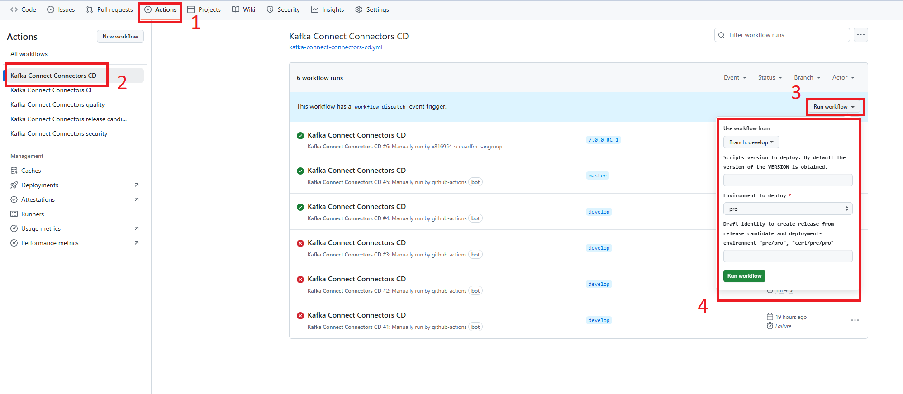

### Deploy in CERT environment

To deploy the Kafka Connect connectors in the **CERT** environment, a push to the branch develop or development must be done,
this triggers the CI workflow and after it ends, the CD workflow will be triggered automatically with the required inputs for the deployment.

### Deploy in PRE environment

To deploy the Kafka Connect connectors in the **PRE** environment, a push to the branch main or master must be done, this triggers the RC workflow and after it ends, the CD workflow will be triggered automatically with the required inputs for the deployment.

### Deploy in PRO environment

To deploy the Kafka Connect connectors in the **PRO** environment, The Kafka Connect Connectors-CD workflow must be run manually using the desired release candidate branch and data to trigger it.
During the fourth step of the deployment process, choose '**Tags**' instead of 'Branches', and then select the Tag that to be deployed.


PRO deployment workflow steps

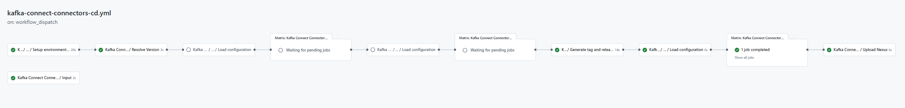

To run manually Kafka Connect Connectors CD workflow, there are fields that we have to fill.

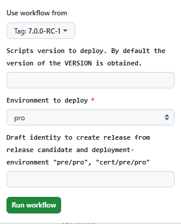

The following fields must be filled and the rest of fields in the previous image must not be modified:

- **Use workflow from**: Select from the tag list, the tag we want to use for the deployment.
- **Environment to deploy**: Select from the drop down list the value “pro“.

## **Repository**

### Connector script file

There is a script file called connectors.sh for each environment, where the connector commands are defined:

Example:

```bash
#!/bin/sh

curl -X POST http://localhost:8083/connectors -H "Content-Type: application/json" -d '
{
  "name": "xxxxxxxxxxxxxxxx",
  "config":{
    "connector.class": "io.confluent.connect.s3.S3SinkConnector",
    "name": "xxxxxxxxxxxxxxxx",
    "tasks.max":2,
    "_comment":"It is useful the next value to override the group id",
    "consumer.override.group.id": "xxxxxxxxxxxxxxxx",
    "topics":"xxxxxxxxxxxxxxxx",
    "s3.region": "eu-west-1",
    "s3.bucket.name": "xxxxxxxxxxxxxxxx",
    "topics.dir": "xxxxxxxxxxxxxxxx",
    "_comment": "The size in bytes of a single part in a multipart upload. The last part is of s3.part.size bytes or less. This property does not affect the total size of an S3 object uploaded by the S3 connector",
    "s3.part.size": "5242880",
    "_comment": "The maximum number of Kafka records contained in a single S3 object. Here a high value to allow for time-based partition to take precedence",
    "flush.size": "100000",
    "_comment": "The time interval in milliseconds to periodically invoke file commits.",
    "rotate.schedule.interval.ms": "180000",
    "storage.class": "io.confluent.connect.s3.storage.S3Storage",
    "format.class": "io.confluent.connect.s3.format.json.JsonFormat",
    "partitioner.class": "io.confluent.connect.storage.partitioner.TimeBasedPartitioner",
    "path.format": "'\'partition_date\''=YYYY-MM-dd/",
    "_comment": "24 Hours duration partition",
    "partition.duration.ms": "86400000",
    "_comment": "Parquet compression code",
    "schema.compatibility": "NONE",
    "_comment": "The locale used by the time-based partitioner to encode the date string",
    "locale":"en",
    "_comment": "The interval between timestamps that is sufficient to upload a new object to S3. Every new file that appears in S3 will contain records that were published in Kafka within a two minutes.",
    "rotate.interval.ms" : "120000",
    "_comment": "The class to use to derive the timestamp for each record. Here Kafka record timestamps are used",
    "timestamp.extractor":"Record",
    "_comment": "Setting the timezone of the timestamps is also required by the time-based partitioner",
    "timezone":"UTC",
    "key.converter": "org.apache.kafka.connect.storage.StringConverter",
    "key.converter.schema.registry.url": "XXXXXXXXXXXXXXXXXXXXXXXX",
    "key.converter.basic.auth.credentials.source":"USER_INFO",
    "key.converter.schema.registry.basic.auth.user.info": "'"$ENVIRONMENT_VARIABLE"'",
    "value.converter": "io.confluent.connect.avro.AvroConverter",
    "value.converter.schema.registry.url": "XXXXXXXXXXXXXXXXXXXXXXXX",
    "value.converter.basic.auth.credentials.source":"USER_INFO",
    "value.converter.schema.registry.basic.auth.user.info": "'"$ENVIRONMENT_VARIABLE"'",
    "confluent.topic.bootstrap.servers": "XXXXXXXXXXXXXXXXXXXXXXXX",
    "confluent.topic.sasl.jaas.config": "'"$ENVIRONMENT_VARIABLE"'",
    "confluent.topic.security.protocol":"SASL_SSL",
    "confluent.topic.sasl.mechanism":"PLAIN",
    "confluent.license": "'"$ENVIRONMENT_VARIABLE"'"
 }
}'

#get connectors
curl -X GET localhost:8083/connectors

#get status
curl -X GET localhost:8083/connectors/xxxxxxxxxxxxxxxx/status
```

### Structure

The Kafka Connect Connectors repository must follow the structure defined below to work:

``` bash
📦
 ┣ 📂envs
 ┃ ┣ 📜properties.env
 ┣ 📂.github
 ┃ ┣ 📂workflows
 ┃ ┃ ┣ 📜kafka-connect-connectors-cd.yml
 ┃ ┃ ┣ 📜kafka-connect-connectors-ci.yml
 ┃ ┃ ┣ 📜kafka-connect-connectors-quality.yml
 ┃ ┃ ┣ 📜kafka-connect-connectors-rc.yml
 ┃ ┃ ┗ 📜kafka-connect-connectors-security.yml
 ┃ ┗ 📜CODEOWNERS
 ┣ 📂src
 ┃ ┣ 📂CERT
 ┃ ┃ ┗ 📜connectors.sh
 ┃ ┣ 📂PRE
 ┃ ┃ ┗ 📜connectors.sh
 ┃ ┗ 📂PRO
 ┃   ┗ 📜connectors.sh
 ┣ 📜deployment.yml
 ┗ 📜README.md
```

- VERSION

This VERSION file (with no extension) is used by some Gluon Workflow Actions to read your project's version as Kafka Connect Connectors is not supported. Make sure to keep this file updated.

```yml
1.0.0
```
