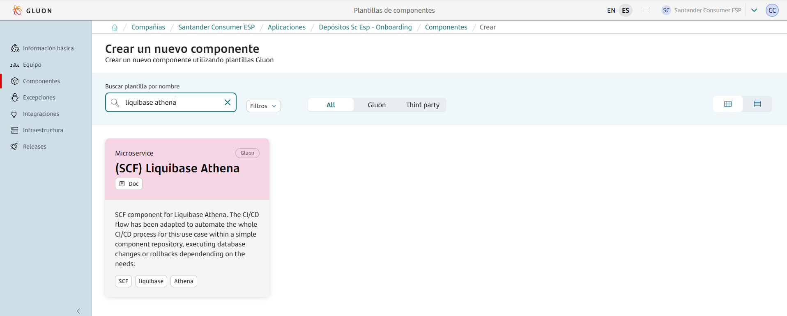
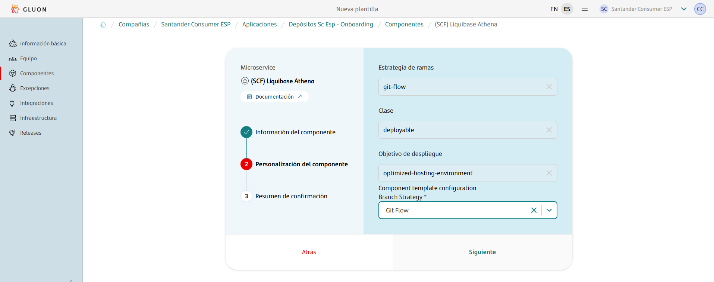

{!
   include-markdown "./liquibase/configuration.md"
   start="<!--start-intro-->"
   end="<!--end-intro-->"
!}

## Prerequisites: AWS Credentials Request

For this pipeline to work correctly, you need to request a role + OIDC.
Note that this template is cataloged as a `Non Microservice components > Miscellaneous`, detailed information to make the request can be found [here](../support/credentials/data.md).

## CI - GLUON

{!
   include-markdown "./liquibase/configuration.md"
   start="<!--start-ci-intro-->"
   end="<!--end-ci-intro-->"
!}

### Create component

{!
   include-markdown "./liquibase/configuration.md"
   start="<!--start-ci-create-component-->"
   end="<!--end-ci-create-component-->"
!}



{!
   include-markdown "./liquibase/configuration.md"
   start="<!--start-repo-naming-convention-->"
   end="<!--end-repo-naming-convention-->"
!}



{!
   include-markdown "./liquibase/configuration.md"
   start="<!--start-ci-create-component-2-->"
   end="<!--end-ci-create-component-2-->"
!}

### Git Flow Lifecycle

{!
   include-markdown "./liquibase/configuration.md"
   start="<!--start-gitflow-->"
   end="<!--end-gitflow-->"
!}

### Configuration Files

As mentioned before, the scaffolding workflow generates a set of configuration files and some others that need to be added in order to make the workflows work. Find below the list of configuration files needed and how to configure them.

#### Properties.env

This file is generated by the scaffolding workflow and contains some properties for the CI configuration.

=== "Default"

    ```properties
    # Sonar parameters
    SONAR_ID="SONAR_GLUON_COMMUNITY"
    SONAR_PROJECT_KEY=""

    # Fortify parameters
    FORTIFY_PROJECT=""

    # Quality parameters
    ZERO_TOUCH_ENABLE=true

    # Execution parameters
    DEBUG_MODE=0
    DEPLOYMENT_YAML="deployment"
    AWS_DEFAULT_REGION="eu-west-1"

    # Backup parameters
    # The DISABLE_BACKUP parameter only affects certification environment
    MAX_DB_BACKUPS=10
    DISABLE_BACKUP=0
    ```

=== "Disable backup Example"

    ```properties
    # Sonar parameters
    SONAR_ID="SONAR_GLUON_COMMUNITY"
    SONAR_PROJECT_KEY=""

    # Fortify parameters
    FORTIFY_PROJECT=""

    # Quality parameters
    ZERO_TOUCH_ENABLE=true

    # Execution parameters
    DEBUG_MODE=0
    DEPLOYMENT_YAML="deployment"
    AWS_DEFAULT_REGION="eu-west-1"

    # Backup parameters
    # The DISABLE_BACKUP parameter only affects certification environment
    MAX_DB_BACKUPS=10
    DISABLE_BACKUP=1
    ```

### Secrets configuration

{!
   include-markdown "./liquibase/configuration.md"
   start="<!--start-secret-configuration-->"
   end="<!--end-secret-configuration-->"
!}

#### Environment secrets

{!
   include-markdown "./liquibase/configuration.md"
   start="<!--start-add-environment-secrets-->"
   end="<!--end-add-environment-secrets-->"
!}

### Variables configuration

The Liquibase Athena workflow needs variables to be able to connect to Athena and make backups.

In github.com, variables are categorized into three types:

1. **Organization Variables**: These variables are accessible by all repositories within the organization.
2. **Repository Variables**: These variables are exclusive to a specific repository.
3. **Environment Variables**: These variables are restricted to a particular repository and its environment.

We need to add the third type: environment variables to our repository in order to make the associated workflows work.

#### Environment variables

{!
   include-markdown "./snippets/variables-global.md"
   start="<!--Start Add Environment Variables-->"
   end="<!--End Add Environment Variables-->"
!}

### Validate scripts

{!
   include-markdown "./liquibase/configuration.md"
   start="<!--start-validate-script-->"
   end="<!--end-validate-script-->"
!}

## CD - SCFGS

Once the CI progress is completed, the goal for the **CD workflow** is to apply database scripts into different environments. The setup is designed to have a single executable workflow for all environment.

### CD Workflow stages

{!
   include-markdown "./liquibase/configuration.md"
   start="<!--start-cd-workflow-stages-->"
   end="<!--end-cd-workflow-stages-->"
!}

### Configuration files

As the CI relies on some configuration files in order to work correctly, the CD workflow relies on one `deployment.yaml` file that needs to be configured.

#### deployment.yaml

The `deployment.yaml` file contains the necessary information to perform a deployment in a defined environment. There are some parameters that can be configured in order to configure the deployment file:

|**Variable**|**Required**|**Description**|**Example value**|
|---     |---  |---  |---          |
|**DB_URL**| true | The full connection URL for the DB.  | `jdbc:awsathena://AwsRegion=[Region];User=[AccessKey];Password=[SecretKey];S3OutputLocation=[Output_bucket_full_path];UseResultsetStreaming=[0,1];AwsCredentialsProviderClass=com.simba.athena.amazonaws.auth.profile.ProfileCredentialsProvider;AwsCredentialsProviderArguments=default;[Property1]=[Value1];[Property2]=[Value2];...` |
|**DB_DRIVER**| true | DB driver to use.  | `liquibase.ext.athena.database.AthenaClientDriver` |
|**DB_TYPE**| true | Type of the DB. | `ATHENA` |
|**CHANGELOG_FILE**| true | Name of the file with the changelog instructions.  | *`sql_changelog.yml`* |
|**CHANGELOG_TYPE**| true | The change log type. | `SQL` |
|**DB_CATALOG_BUCKET_FULL_PATH**| true | The s3 bucket and folder full path where all catalog files are located. | `s3://my_source_bucket/my_database_folder/warehouse`  |
|**DB_BACKUP_BUCKET_NAME**| true | The s3 bucket name for catalog files back up. | `my_backup_destination_bucket` |
|**DB_BACKUP_BUCKET_FOLDER_NAME**| true | The s3 folder name for catalog files back up. | `my_backup_destination_folder` |

Find below a `deployment.yaml` example file. Make sure to replace the existing values with the corresponding one for the project.

```yaml title="Liquibase Athena Deployment example" linenums="1"
environments:
  CERT:
    DB_URL: jdbc:awsathena://AwsRegion=[Region];S3OutputLocation=[Output_cert_bucket_full_path];UseResultsetStreaming=0;AwsCredentialsProviderClass=com.simba.athena.amazonaws.auth.profile.ProfileCredentialsProvider;AwsCredentialsProviderArguments=default;
    DB_DRIVER: liquibase.ext.athena.database.AthenaClientDriver
    DB_TYPE: ATHENA
    CHANGELOG_FILE: sql_changelog.yml
    CHANGELOG_TYPE: SQL
    # Athena
    DB_CATALOG_BUCKET_FULL_PATH: s3://my_source_cert_bucket/my_database_folder/warehouse
    DB_BACKUP_BUCKET_NAME: my_backup_cert_destination_bucket
    DB_BACKUP_BUCKET_FOLDER_NAME: my_backup_cert_destination_folder
  PRE:
    DB_URL: jdbc:awsathena://AwsRegion=[Region];S3OutputLocation=[Output_pre_bucket_full_path];UseResultsetStreaming=0;AwsCredentialsProviderClass=com.simba.athena.amazonaws.auth.profile.ProfileCredentialsProvider;AwsCredentialsProviderArguments=default;
    DB_DRIVER: liquibase.ext.athena.database.AthenaClientDriver
    DB_TYPE: ATHENA
    CHANGELOG_FILE: sql_changelog.yml
    CHANGELOG_TYPE: SQL
    # Athena
    DB_CATALOG_BUCKET_FULL_PATH: s3://my_source_pre_bucket/my_database_folder/warehouse
    DB_BACKUP_BUCKET_NAME: my_backup_pre_destination_bucket
    DB_BACKUP_BUCKET_FOLDER_NAME: my_backup_pre_destination_folder
  PRO:
    DB_URL: jdbc:awsathena://AwsRegion=[Region];S3OutputLocation=[Output_pro_bucket_full_path];UseResultsetStreaming=0;AwsCredentialsProviderClass=com.simba.athena.amazonaws.auth.profile.ProfileCredentialsProvider;AwsCredentialsProviderArguments=default;
    DB_DRIVER: liquibase.ext.athena.database.AthenaClientDriver
    DB_TYPE: ATHENA
    CHANGELOG_FILE: sql_changelog.yml
    CHANGELOG_TYPE: SQL
    # Athena
    DB_CATALOG_BUCKET_FULL_PATH: s3://my_source_pro_bucket/my_database_folder/warehouse
    DB_BACKUP_BUCKET_NAME: my_backup_pro_destination_bucket
    DB_BACKUP_BUCKET_FOLDER_NAME: my_backup_pro_destination_folder
```

#### workflow.yml

{!
   include-markdown "./liquibase/configuration.md"
   start="<!--start-cd-workflow-file-->"
   end="<!--end-cd-workflow-file-->"
!}

### Secrets configuration (Deprecated)

As in the CI workflow, the CD one relies on 2 configuration secrets needed to function correctly. These secrets must be defined in the Environments Secrets section inside the repository settings. Find below the list of required secrets:

| **Secret name**       | **Description**                                                                    |
| --------------------- | ---------------------------------------------------------------------------------- |
| AWS_ACCESS_KEY_ID     | The AWS access key associated with an IAM user or role that will execute the code. |
| AWS_SECRET_ACCESS_KEY | The AWS secret key associated with the access key.                                 |

In order to add secrets you can follow the official [GitHub documentation](https://docs.github.com/en/actions/security-guides/using-secrets-in-github-actions) but this documentation provides a quick step by step guide:

???+ abstract "How to add a new secret?"

      {!
        include-markdown "./liquibase/configuration.md"
        start="<!--start-add-environment-secrets-->"
        end="<!--end-add-environment-secrets-->"
      !}

### Variables configuration

As in the CI workflow, the CD one relies on 1 environment variables needed to function correctly.
These variables must be defined in the Environment variables section inside the repository settings. Find below the list of required variables:

#### Environment variables configuration

| **Variable name**     | **Description**     |
| --------------------- | ------------------- |
| AWS_ACCOUNT_ID        | The AWS account id. |

???+ abstract "How to add a new environment variable?"

      {!
        include-markdown "./snippets/variables-global.md"
        start="<!--Start Add Environment Variables-->"
        end="<!--End Add Environment Variables-->"
      !}

### Apply database changes

{!
  include-markdown "./liquibase/configuration.md"
  start="<!--start-apply-db-change-->"
  end="<!--end-apply-db-change-->"
!}

### Rollback possibilities

#### **Athena**

- Athena does not support database backup or taking snapshots, but all the table files are saved in S3 buckets, then, the workflow takes backup of the bucket where the files are located. and these files can be used to do rollback.
- Use the tag created by the workflow to rollback the DB state prior to applying any of our changes.
  This rollback need to be done 1 release after another (It's not possible to jump from version 1.0.3 to 1.0.1 directly without restoring to the tag 1.0.2 before)
- If we define one or more tags inside our code, we could also rollback to them, allowing us to rollback some of the changes applied.

#### Rollback

{!
  include-markdown "./liquibase/configuration.md"
  start="<!--start-rollback-db-change-->"
  end="<!--end-rollback-db-change-->"
!}

## **Repository**

### Structure

The liquibase repository must follow the structure defined below to work:

``` bash
📦
 ┣ 📂.github
 ┃ ┣ 📂workflows
 ┃ ┃ ┣ 📜liquibase-cd.yml
 ┃ ┃ ┣ 📜liquibase-ci.yml
 ┃ ┃ ┣ 📜liquibase-rc.yml
 ┃ ┃ ┣ 📜liquibase-rollback.yml
 ┃ ┃ ┗ 📜liquibase-security.yml
 ┃ ┗ 📜CODEOWNERS
 ┣ 📂envs
 ┃ ┗ 📜properties.env
 ┣ 📂.gluon
 ┃ ┗ 📜black-file
 ┣ 📂resources
 ┃ ┣ 📂sql-examples
 ┃ ┃ ┗ 📜example code
 ┃ ┣ 📜rollback.png
 ┃ ┗ 📜summary.png
 ┣ 📂src
 ┃ ┣ 📂CERT
 ┃ ┃ ┣ 📂dcl
 ┃ ┃ ┃ ┗ your code
 ┃ ┃ ┣ 📂ddl
 ┃ ┃ ┃ ┗ your code
 ┃ ┃ ┗ 📂dml
 ┃ ┃   ┗ your code
 ┃ ┣ 📂PRE
 ┃ ┃ ┣ 📂dcl
 ┃ ┃ ┃ ┗ your code
 ┃ ┃ ┣ 📂ddl
 ┃ ┃ ┃ ┗ your code
 ┃ ┃ ┗ 📂dml
 ┃ ┃   ┗ your code
 ┃ ┗ 📂PRO
 ┃   ┣ 📂dcl
 ┃   ┃ ┗ your code
 ┃   ┣ 📂ddl
 ┃   ┃ ┗ your code
 ┃   ┗ 📂dml
 ┃     ┗ your code
 ┣ 📜VERSION
 ┣ 📜README.md
 ┣ 📜deployment.yaml
 ┗ 📜sql_changelog.yml
```

- sql_changelog.yml

The sql_changelog.yml file is used to include scripts files to the liquibase execution.

```yaml title="Liquibase changelog file example" linenums="1"
databaseChangeLog:
  - includeAll:
      path: env/${ENVIRONMENT}/ddl
      relativeToChangelogFile: true
  - includeAll:
      path: env/${ENVIRONMENT}/dml
      relativeToChangelogFile: true
  - includeAll:
      path: env/${ENVIRONMENT}/dcl
      relativeToChangelogFile: true
```

- dcl/ddl/dml/100-000-code-statement.sql

```sql title="Liquibase SQL script file example" linenums="1"
--liquibase formatted sql
--changeset ccoe:create_country_table_dev
--comment: test
CREATE TABLE IF NOT EXISTS AwsDataCatalog.demo_ccoe_dev.country (
    id int,
    name string
)
LOCATION 's3://test-liquibase-athena/databases-dev/warehouse/demo_ccoe_dev.db/country/'
TBLPROPERTIES ('table_type' ='ICEBERG');
--rollback DROP TABLE IF EXISTS AwsDataCatalog.demo_ccoe_dev.country;
--changeset author:changeset_id_2 labels:changeset_label_3
--comment: insert
INSERT INTO AwsDataCatalog.demo_ccoe_dev.country
(id, name)
VALUES
(1, 'SPAIN'),
(2, 'GERMANY')
--rollback not required
```

???+ info "Liquibase fields"

      - **author**: Identifies the author of the changeset
        - In SQL scripts, the field author must be the developmer identifier.
      - **changeset_id**: Identifies the changeset, it must be a very short description, without white spaces, of the changeset, it must be unique.
        - In SQL scripts, the field author must be the developmer identifier.

- VERSION

This VERSION file (with no extension) is used by some Gluon Workflow Actions to read your project's version as liquibase is not supported. Make sure to keep this file updated.

```yml
1.0.0
```

## Aspects to consider

Since AWS Athena is not a database itself, to make it compatible with Liquibase, the following aspects must be matched:

- An AWS Glue database named **liquibase** must exist, Liquibase control tables will be created in this database.
- The user associated to the credentials must have enough permissions to run the provided statements in AWS Athena as well as access the Liquibase tables in AWS Athena.
- Schemas don't exist in Atena, there are Data Sources, Databases and Tables, to make Athena compatible with Liquibase, we have to treat Data Sources as Databases and Databases as Schemas.
- Athena transforms every object to **LOWERCASE**, so, it is necessary to use LOWERCASE names for object names to avoid possible errors.
- Athena transforms every table column name to **LOWERCASE**, so, it is necessary to use LOWERCASE names for column names to avoid possible errors.

Example:

```sql title="Athena SQL structure example" linenums="1"
CREATE TABLE my_catalog.my_database.my_table (
    id int
)
LOCATION 's3://bucket/my_catalog/my_database.db/my_table/'
TBLPROPERTIES ('table_type' ='ICEBERG');
```

## Limitations

Liquibase does not have object dependency detection to run changesets in the correct order. Then, it is necessary to name the SQL files following a naming convention that make possible file ordering by name.

Example:

- File names start with **100-000** → 100-000-data-statement.sql
- Where **100-000** enables file ordering by name
- Where **data-statement** is the description of the script content

## Not To Do

It is **MANDATORY** to **NOT MODIFY** any changeset that have been applied previously, if so, liquibase will detect that change, and try to apply it again.
This may cause errors if there is a statement like "CREATE TABLE", and Liquibase may do rollback of that changeset and make database **inconsistent**.

Any modification of an object, **MUST** be done in a different changeset.

Example:

- A create table script has been executed at 01-01-2024

```sql title="Table creation example" linenums="1"
--changeset ccoe:create_person_company_dev
--comment: example comment 2
CREATE TABLE IF NOT EXISTS AwsDataCatalog.demo_ccoe_dev.company (
    id int,
    name string,
    address1 string,
    address2 string,
    city string
)
LOCATION 's3://test-liquibase-athena/databases-dev/warehouse/demo_ccoe_dev.db/company/'
TBLPROPERTIES ('table_type' ='ICEBERG');
--rollback DROP TABLE IF EXISTS AwsDataCatalog.demo_ccoe_dev.company;
```

- A modification needed for that table at 20-03-2024

```sql title="Table modification example" linenums="1"
--changeset ccoe:add_column_country_person_dev
--comment: example comment 3
ALTER TABLE AwsDataCatalog.demo_ccoe_dev.person ADD COLUMNS (country string)
--rollback SELECT * FROM AwsDataCatalog.demo_ccoe_dev.personte;
```
