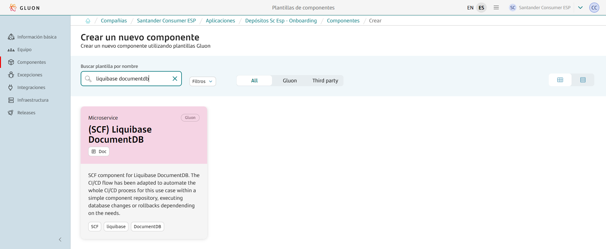
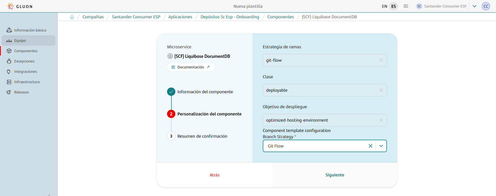

{!
   include-markdown "./liquibase/configuration.md"
   start="<!--start-intro-->"
   end="<!--end-intro-->"
!}

## Prerequisites: AWS Credentials Request

For this pipeline to work correctly, you need to request a role + OIDC.
Note that this template is cataloged as a `Non Microservice components > Miscellaneous`, detailed information to make the request can be found [here](../support/credentials/data.md).

## CI - GLUON

{!
   include-markdown "./liquibase/configuration.md"
   start="<!--start-ci-intro-->"
   end="<!--end-ci-intro-->"
!}

### Create component

{!
   include-markdown "./liquibase/configuration.md"
   start="<!--start-ci-create-component-->"
   end="<!--end-ci-create-component-->"
!}



{!
   include-markdown "./liquibase/configuration.md"
   start="<!--start-repo-naming-convention-->"
   end="<!--end-repo-naming-convention-->"
!}



{!
   include-markdown "./liquibase/configuration.md"
   start="<!--start-ci-create-component-2-->"
   end="<!--end-ci-create-component-2-->"
!}

### Git Flow Lifecycle

{!
   include-markdown "./liquibase/configuration.md"
   start="<!--start-gitflow-->"
   end="<!--end-gitflow-->"
!}

### Configuration Files

As mentioned before, the scaffolding workflow generates a set of configuration files and some others that need to be added in order to make the workflows work. Find below the list of configuration files needed and how to configure them.

#### Properties.env

This file is generated by the scaffolding workflow and contains some properties for the CI configuration.

=== "Default"

    ```properties
    # Sonar parameters
    SONAR_ID="SONAR_GLUON_COMMUNITY"
    SONAR_PROJECT_KEY=""

    # Fortify parameters
    FORTIFY_PROJECT=""

    # Quality parameters
    ZERO_TOUCH_ENABLE=true

    # Execution parameters
    DEBUG_MODE=0
    DEPLOYMENT_YAML="deployment"
    AWS_DEFAULT_REGION="eu-west-1"

    # Backup parameters
    # The DISABLE_BACKUP parameter only affects certification environment
    MAX_DB_BACKUPS=10
    DISABLE_BACKUP=0
    ```

=== "Disable backup Example"

    ```properties
    # Sonar parameters
    SONAR_ID="SONAR_GLUON_COMMUNITY"
    SONAR_PROJECT_KEY=""

    # Fortify parameters
    FORTIFY_PROJECT=""

    # Quality parameters
    ZERO_TOUCH_ENABLE=true

    # Execution parameters
    DEBUG_MODE=0
    DEPLOYMENT_YAML="deployment"
    AWS_DEFAULT_REGION="eu-west-1"

    # Backup parameters
    # The DISABLE_BACKUP parameter only affects certification environment
    MAX_DB_BACKUPS=10
    DISABLE_BACKUP=1
    ```

### Secrets configuration

{!
   include-markdown "./liquibase/configuration.md"
   start="<!--start-secret-configuration-->"
   end="<!--end-secret-configuration-->"
!}

#### Environment secrets

{!
   include-markdown "./liquibase/configuration.md"
   start="<!--start-add-environment-secrets-->"
   end="<!--end-add-environment-secrets-->"
!}

### Variables configuration

The Liquibase DocumentDB workflow needs variables to be able to make backups.

In github.com, variables are categorized into three types:

1. **Organization Variables**: These variables are accessible by all repositories within the organization.
2. **Repository Variables**: These variables are exclusive to a specific repository.
3. **Environment Variables**: These variables are restricted to a particular repository and its environment.

We need to add the third type: environment variables to our repository in order to make the associated workflows work.

#### Environment variables

{!
   include-markdown "./snippets/variables-global.md"
   start="<!--Start Add Environment Variables-->"
   end="<!--End Add Environment Variables-->"
!}

### Validate scripts

{!
   include-markdown "./liquibase/configuration.md"
   start="<!--start-validate-script-->"
   end="<!--end-validate-script-->"
!}

## CD - SCFGS

Once the CI progress is completed, the goal for the **CD workflow** is to apply database scripts into different environments. The setup is designed to have a single executable workflow for all environment.

### CD Workflow stages

{!
   include-markdown "./liquibase/configuration.md"
   start="<!--start-cd-workflow-stages-->"
   end="<!--end-cd-workflow-stages-->"
!}

### Configuration files

As the CI relies on some configuration files in order to work correctly, the CD workflow relies on one `deployment.yaml` file that needs to be configured.

#### deployment.yaml

The `deployment.yaml` file contains the necessary information to perform a deployment in a defined environment. There are some parameters that can be configured in order to configure the deployment file:

|**Variable**|**Required**|**Description**|**Example value**|
|---     |---  |---  |---          |
|**DB_URL**| true | The full connection URL for the DB.  | `jdbc:documentdb://[DB_ENDPOINT_NAME]:[Port]/[Database]?tls=true&tlsCAFile=global-bundle.pem&replicaSet=rs0&readPreference=secondaryPreferred&retryWrites=false` |
|**DB_DRIVER**| true | DB driver to use.  | `liquibase.ext.documentdb.database.DocumentDbClientDriver` |
|**DB_TYPE**| true | Type of the DB. | `AWS` |
|**CHANGELOG_FILE**| true | Name of the file with the changelog instructions.  | `sql_changelog.yml` |
|**CHANGELOG_TYPE**| true | The change log type, allowed value is: **JSON** and **XML** | `JSON` |
|**AWS_CLUSTER_ID**| true if in cluster mode | ID of the cluster in AWS where the DB is hosted. Only one of AWS_CLUSTER_ID or AWS_INSTANCE_ID should be provided. |  `cgsd1airrdaiacprdgene001` |
|**AWS_INSTANCE_ID**| true if in instance mode | ID of the instance in AWS where the DB is hosted. Only one of AWS_CLUSTER_ID or AWS_INSTANCE_ID should be provided. | `cgsd1airrdaiacprdgene001` |

Find below a `deployment.yaml` example file. Make sure to replace the existing values with the corresponding one for the project.

```yaml title="Liquibase Athena Deployment example" linenums="1"
environments:
  CERT:
    DB_URL: jdbc:documentdb://[DB_ENDPOINT_NAME]:[Port]/[Database]?tls=true&tlsCAFile=global-bundle.pem&replicaSet=rs0&readPreference=secondaryPreferred&retryWrites=false
    DB_DRIVER: liquibase.ext.documentdb.database.DocumentDbClientDriver
    DB_TYPE: AWS
    CHANGELOG_FILE: sql_changelog.yml
    CHANGELOG_TYPE: JSON
    # Required if database is in a cluster
    AWS_CLUSTER_ID: MY_CERT_CLUSTER_ID
    # Required if database is in an instance
    AWS_INSTANCE_ID:
  PRE:
    DB_URL: jdbc:documentdb://[DB_ENDPOINT_NAME]:[Port]/[Database]?tls=true&tlsCAFile=global-bundle.pem&replicaSet=rs0&readPreference=secondaryPreferred&retryWrites=false
    DB_DRIVER: liquibase.ext.documentdb.database.DocumentDbClientDriver
    DB_TYPE: AWS
    CHANGELOG_FILE: sql_changelog.yml
    CHANGELOG_TYPE: JSON
    # Required if database is in a cluster
    AWS_CLUSTER_ID: MY_PRE_CLUSTER_ID
    # Required if database is in an instance
    AWS_INSTANCE_ID:
  PRO:
    DB_URL: jdbc:documentdb://[DB_ENDPOINT_NAME]:[Port]/[Database]?tls=true&tlsCAFile=global-bundle.pem&replicaSet=rs0&readPreference=secondaryPreferred&retryWrites=false
    DB_DRIVER: liquibase.ext.documentdb.database.DocumentDbClientDriver
    DB_TYPE: AWS
    CHANGELOG_FILE: sql_changelog.yml
    CHANGELOG_TYPE: JSON
    # Required if database is in a cluster
    AWS_CLUSTER_ID: MY_PRO_CLUSTER_ID
    # Required if database is in an instance
    AWS_INSTANCE_ID:
```

#### workflow.yml

{!
   include-markdown "./liquibase/configuration.md"
   start="<!--start-cd-workflow-file-->"
   end="<!--end-cd-workflow-file-->"
!}

### Secrets configuration

As in the CI workflow, the CD one relies on 4 configuration secrets needed to function correctly. These secrets must be defined in the Environments Secrets section inside the repository settings. Find below the list of required secrets:

| **Secret name**       | **Description**                                                                    |
| --------------------- | ---------------------------------------------------------------------------------- |
| AWS_ACCESS_KEY_ID (Deprecated)     | The AWS access key associated with an IAM user or role that will execute the code. |
| AWS_SECRET_ACCESS_KEY (Deprecated) | The AWS secret key associated with the access key.                                 |
| DB_USERNAME           | The database username.                                                             |
| DB_PASSWORD           | The database password.                                                             |

In order to add secrets you can follow the official [GitHub documentation](https://docs.github.com/en/actions/security-guides/using-secrets-in-github-actions) but this documentation provides a quick step by step guide:

???+ abstract "How to add a new secret?"

      {!
        include-markdown "./liquibase/configuration.md"
        start="<!--start-add-environment-secrets-->"
        end="<!--end-add-environment-secrets-->"
      !}

### Variables configuration

As in the CI workflow, the CD one relies on 1 environment variables needed to function correctly.
These variables must be defined in the Environment variables section inside the repository settings. Find below the list of required variables:

#### Environment variables configuration

| **Variable name**     | **Description**     |
| --------------------- | ------------------- |
| AWS_ACCOUNT_ID        | The AWS account id. |

???+ abstract "How to add a new environment variable?"

      {!
        include-markdown "./snippets/variables-global.md"
        start="<!--Start Add Environment Variables-->"
        end="<!--End Add Environment Variables-->"
      !}

### Apply database changes

{!
  include-markdown "./liquibase/configuration.md"
  start="<!--start-apply-db-change-->"
  end="<!--end-apply-db-change-->"
!}

### Rollback possibilities

#### **DocumentDB**

Since our first step its to perform a DB backup, we have several rollback possibilities:

- Use the DB backup to perform a rollback to its initial state, prior to tagging the database. The information for this restore is the following:
  - This backup type is a SNAPSHOT.
  - The Terraform module from CCoE SCF for DocumentDB [GitHub](https://github.com/santander-group-scfccoe/terraform-aws-iac-ccoescf-documentdb) for versions 1.0.7 and later,
    allow to create a DocumentDB Cluster from a existing snapshot using snapshot_identifier variable, passing the ARN ID for this snapshot.
  - The user can recreate a existing cluster passing this variable allow to recreate the DocumentDb cluster from a different snapshot or create a new cluster from the source snapshot.
    The first option generate a break in the service because the applications using that RDS Cluster will be down and the second can be changed and minimize the break-down.
  - After restoring the RDS Cluster you have to change your connection string (located in a Secret Manager, ConfigMap or wherever) and update with the restored RDS Cluster and the applications will start using that new RDS Restored Cluster.
- Use the tag created by the pipeline to rollback the DB state prior to applying any of our changes.
  This rollback need to be done 1 release after another (It's not possible to jump from version 1.0.3 to 1.0.1 directly without restoring to the tag 1.0.2 before)
- If we define one or more tags inside our code, we could also rollback to them, allowing us to rollback some of the changes applied.

#### Rollback

{!
  include-markdown "./liquibase/configuration.md"
  start="<!--start-rollback-db-change-->"
  end="<!--end-rollback-db-change-->"
!}

## **Repository**

### Structure

The liquibase repository must follow the structure defined below to work:

``` bash
📦
 ┣ 📂.github
 ┃ ┣ 📂workflows
 ┃ ┃ ┣ 📜liquibase-cd.yml
 ┃ ┃ ┣ 📜liquibase-ci.yml
 ┃ ┃ ┣ 📜liquibase-rc.yml
 ┃ ┃ ┣ 📜liquibase-rollback.yml
 ┃ ┃ ┗ 📜liquibase-security.yml
 ┃ ┗ 📜CODEOWNERS
 ┣ 📂envs
 ┃ ┗ 📜properties.env
 ┣ 📂.gluon
 ┃ ┗ 📜black-file
 ┣ 📂resources
 ┃ ┣ 📂documentdb-examples
 ┃ ┃ ┗ 📂json
 ┃ ┃   ┗ 📜example code
 ┃ ┣ 📜rollback.png
 ┃ ┗ 📜summary.png
 ┣ 📂src
 ┃ ┣ 📂CERT
 ┃ ┃ ┣ 📂dcl
 ┃ ┃ ┃ ┗ your code
 ┃ ┃ ┣ 📂ddl
 ┃ ┃ ┃ ┗ your code
 ┃ ┃ ┗ 📂dml
 ┃ ┃   ┗ your code
 ┃ ┣ 📂PRE
 ┃ ┃ ┣ 📂dcl
 ┃ ┃ ┃ ┗ your code
 ┃ ┃ ┣ 📂ddl
 ┃ ┃ ┃ ┗ your code
 ┃ ┃ ┗ 📂dml
 ┃ ┃   ┗ your code
 ┃ ┗ 📂PRO
 ┃   ┣ 📂dcl
 ┃   ┃ ┗ your code
 ┃   ┣ 📂ddl
 ┃   ┃ ┗ your code
 ┃   ┗ 📂dml
 ┃     ┗ your code
 ┣ 📜VERSION
 ┣ 📜README.md
 ┣ 📜deployment.yaml
 ┗ 📜sql_changelog.yml
```

- sql_changelog.yml

The sql_changelog.yml file is used to include scripts files to the liquibase execution.

```yaml title="Liquibase changelog file example" linenums="1"
databaseChangeLog:
  - includeAll:
      path: env/${ENVIRONMENT}/ddl
      relativeToChangelogFile: true
  - includeAll:
      path: env/${ENVIRONMENT}/dml
      relativeToChangelogFile: true
  - includeAll:
      path: env/${ENVIRONMENT}/dcl
      relativeToChangelogFile: true
```

- dcl/ddl/dml/100-000-code-statement.json

```json title="Liquibase JSON script file example" linenums="1"
{
  "databaseChangeLog": [
    {
      "changeSet": {
        "id": "1",
        "author": "Alex",
        "comment": "Create person collection",
        "changes": [
          {
            "createCollection": {
              "collectionName": "person",
              "options": {
                "$rawJson": {}
              }
            }
          }
        ]
      }
    },
    {
      "changeSet": {
        "id": "2",
        "author": "Nick",
        "comment": "Populate person table",
        "changes": [
          {
            "insertOne": {
              "collectionName": "person",
              "document": {
                "$rawJson": {
                  "name": "Alexandru Slobodcicov",
                  "address": "Moldova"
                }
              }
            }
          },
          {
            "insertMany": {
              "collectionName": "person",
              "documents": {
                "$rawJson": [
                  {
                    "name": "Nicolas Bodros",
                    "address": "Spain",
                    "age": 34
                  },
                  {
                    "name": "Luka Modrich",
                    "address": null,
                    "age": 55
                  }
                ]
              }
            }
          }
        ]
      }
    }
  ]
}
```

- dcl/ddl/dml/100-000-code-statement.xml

```xml title="Liquibase XML script file example" linenums="1"
<!--
  #%L
  Liquibase MongoDB Extension
  %%
  Copyright (C) 2019 Mastercard
  %%
  Licensed under the Apache License, Version 2.0 (the "License").
  You may not use this file except in compliance with the License.
  You may obtain a copy of the License at

      http://www.apache.org/licenses/LICENSE-2.0

  Unless required by applicable law or agreed to in writing, software
  distributed under the License is distributed on an "AS IS" BASIS,
  WITHOUT WARRANTIES OR CONDITIONS OF ANY KIND, either express or implied.
  See the License for the specific language governing permissions and
  limitations under the License.
  #L%
  -->
<databaseChangeLog
        xmlns="http://www.liquibase.org/xml/ns/dbchangelog"
        xmlns:xsi="http://www.w3.org/2001/XMLSchema-instance"
        xmlns:ext="http://www.liquibase.org/xml/ns/dbchangelog-ext"
        xsi:schemaLocation="http://www.liquibase.org/xml/ns/dbchangelog http://www.liquibase.org/xml/ns/dbchangelog/dbchangelog-3.6.xsd
        http://www.liquibase.org/xml/ns/dbchangelog-ext http://www.liquibase.org/xml/ns/dbchangelog/dbchangelog-ext.xsd">

    <changeSet id="1" author="alex">
            <ext:createCollection collectionName="createCollectionWithValidatorAndOptionsTest">
                <ext:options>
                    {
                    validator: {
                        $jsonSchema: {
                            bsonType: "object",
                            required: ["name", "address"],
                            properties: {
                                name: {
                                    bsonType: "string",
                                    description: "The Name"
                                },
                                address: {
                                    bsonType: "string",
                                    description: "The Address"
                                }
                            }
                        }
                    },
                    validationAction: "warn",
                    validationLevel: "strict"
                    }
                </ext:options>
            </ext:createCollection>

        <ext:createCollection collectionName="createCollectionWithEmptyValidatorTest">
            <ext:options>

            </ext:options>

        </ext:createCollection>

        <ext:createCollection collectionName="createCollectionWithNoValidator"/>

    </changeSet>

</databaseChangeLog>

```

???+ info "Liquibase fields"

      - **author**: Identifies the author of the changeset
        - In JSON and XML, the field is presented as a key value pair.
      - **changeset_id**: Identifies the changeset, it must be a very short description, without white spaces, of the changeset, it must be unique.
        - In JSON and XML, the field is presented as a key value pair.

- VERSION

This VERSION file (with no extension) is used by some Gluon Workflow Actions to read your project's version as liquibase is not supported. Make sure to keep this file updated.

```yml
1.0.0
```

## Limitations

Liquibase does not have object dependency detection to run changesets in the correct order. Then, it is necessary to name the JSON or XML files following a naming convention that make possible file ordering by name.

Example:

- File names start with **100-000** → 100-000-data-statement.json
- Where **100-000** enables file ordering by name
- Where **data-statement** is the description of the script content

## Not To Do

It is **MANDATORY** to **NOT MODIFY** any changeset that have been applied previously, if so, liquibase will detect that change, and try to apply it again.
This may cause errors if there is a statement like "CREATE TABLE", and Liquibase may do rollback of that changeset and make database **inconsistent**.

Any modification of an object, **MUST** be done in a different changeset.
