<!--start-intro-->
The goal of this documentation is to provide guidance on how to deploy database scripts using the Gluon portal and the SCFGS workflow. This means that the CI will reside on the Gluon portal infrastructure while the CD resides on the SCFGS infrastructure.
<!--end-intro-->

<!--start-ci-intro-->
For the initial files validation, the Gluon platform will be used. The CI part of the entire CI/CD workflow will be managed by gluon in organizations whose name ends in "-gln".
Shown below is a detailed step by step guide on how to create a component in the Gluon platform, configure it and validate the files and security scans.
<!--end-ci-intro-->

<!--start-ci-create-component-->
The first step is to create a component using the Gluon portal. Is **important** to do this step using this platform as it creates all the required files, branch structure, environments and configurations required for the workflows to run correctly.

In order to create the component go to the `Gluon portal-> Applications -> Gluon Core -> Components -> Create.` In this screen select the type of component to create. To name the repository is important to follow GLUON's naming convention.
<!--end-ci-create-component-->

<!--start-repo-naming-convention-->
???+ info "GLUON repository naming convention"

      When creating a component in Gluon it will automatically create a repository in github.com with the following naming convention:
      <**acronym-company**>**-**<**acronym-application**>**-**<**short-name-component**>

      - **acronym-company**: Length of 3 characters, this field comes from APM.
      - **acronym-application**: Length of 7 characters, it will be requested in the application onboarding in Gluon.
      - **short-name-component** Length of 16 characters, it will be requested when creating the component in Gluon.
<!--end-repo-naming-convention-->

<!--start-ci-create-component-2-->
Select the *git-flow* branch strategy that will be explained in the following section. Once the component is created, it will appear in the component list followed by the used template, a short description and links to the repository in github.com, sonar,
fortify and catalog. Example:

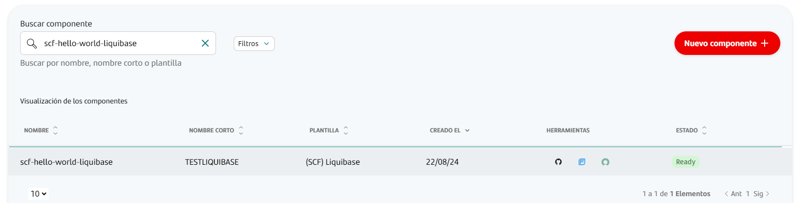

Once the component is created in the Gluon portal, a repository is created in github.com with a branch named *init-branch* that will run a scaffolding workflow to set up all required branches, environments and configuration files.
This workflow is expected to run automatically, so the expected behaviour is to find everything correctly configured.

???+ warning "Scaffolding workflow"

      In some cases the scaffolding workflow will not run automatically. To solve this go to the Actions section of the repository and run the workflow manually from the *init-branch.* This will run the scaffolding workflow to perform all the necessary tasks to prepare the component. 

Once this workflow ends, the *init-branch* will disappear and two new branches will appear. The main branch will contain the `.github/workflows` folder with the required workflows and a CODEOWNERS file.
A development branch will also be available in the repository with the same workflows and CODEOWNERS file as in the main branch followed by some example and configuration files.

Read the following section to get to know the git-flow branch structure as it’s the only way to work and build the application using Gluon’s workflows.
<!--end-ci-create-component-2-->

<!--start-secret-configuration-->
The liquibase workflow needs secrets to be able to access to the database and create the required backup, these secrets must be added as environment secrets.

In github.com, secrets are categorized into three types:

1. **Organization Secrets**: These secrets are accessible by all repositories within the organization.
2. **Repository Secrets**: These secrets are exclusive to a specific repository.
3. **Environment Secrets**: These secrets are restricted to a particular repository and its environment.

We need to add the third type: environment secrets to our repository in order to make the associated workflows work.
<!--end-secret-configuration-->

<!--start-add-environment-secrets-->
In order to add secrets, follow the official [GitHub documentation](https://docs.github.com/en/actions/security-for-github-actions/security-guides/using-secrets-in-github-actions#creating-secrets-for-an-environment),
but this documentation provides a quick step by step guide:

1. Navigate to your repository and under the repository name click on `settings`.<br>

2. Under the `Code and automation` tab inside settings click on `Environments`.<br>

3. Click on the environment where to set the secrets.<br>

4. Under the `Environment secrets` section click on `Add environment secret`.<br>
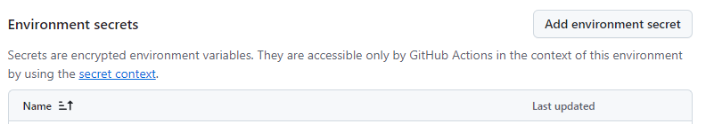
5. In this screen add the secret name. Make sure that the secret name matches the required secret names. In the `secret` space fill the secret value.<br>
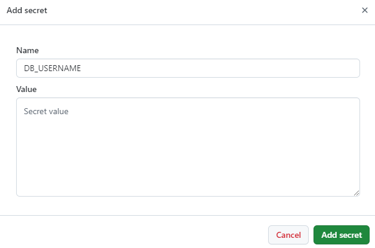
<!--end-add-environment-secrets-->

<!--start-gitflow-->
As soon as the scaffoling workflow is done, a repository with two branches is created: main and development. Both branches will be prepared with the necessary workflows to run the entire lifecycle.
The following image shows a visual representation of the Git-Flow lifecycle and the workflows executed in each step.


In the Git Flow model, developers start by creating a new branch from the `development` branch for each feature, named `feature/*`. Once the feature is complete, they create a pull request to merge the `feature/*` branch into `development`.
When opening the pull request, the quality and the security scan workflow is executed automatically: **Quality** running SonarQube and **Security** running fortify. If everything is satisfactory,
the pull request is approved and the `feature/*` branch can be merged into `development`.
When the `development` branch receives the merge from the pull request, the **CI** workflow is executed automatically. When the current version is ready for a new release candidate, a pull request from `development` to `main` is created.
As in the `feature` branch, when opening the pull request, the quality and the security workflow are executed automatically: **Quality** running SonarQube and **Security** running fortify and if everything is in order,
the pull request can be merged, moving changes from `development` to `main`.
The code in main is now ready to be released, completing the lifecycle by running the **RC** workflow.

???+ note "Branch creation"

      Make sure to create the `feature/*` branch from the `development` branch, as this branch contains all the necessary workflows and configuration files to run all workflows.
<!--end-gitflow-->

<!--start-validate-script-->
Once all branches are set up correctly, secrets are configured and configuration files are defined, the repository is ready to do deployments.
In order to make the full cycle, The scripts validation must be done with the CI process of the Gluon infrastructure and then the deployment using SCFGS CD.


This cycle is the same explained in the **Git-Flow lifecycle section**. During this section more details will be provided for each step.

### Quality gates

As shown in the previous image every time a Pull Request (PR) is made, the security and quality workflows are automatically executed: Quality, Security.
These workflows conform quality gates that are needed to ensure the quality and the security of the prior to the deployment.
There are 3 quality gates:

- **Sonar**: Code Quality and test coverage
- **Fortify**: Analysis of the vulnerabilities of our source code
- **Sonatype**: Analysis of the vulnerabilities of our dependencies.

### Pull Request from feature to development

In order to start developing in the repository, create a new `feature/*` branch from the `development` branch. Make all necessary changes in the newly created feature branch.
When changes are ready to deploy, create a pull request (PR) from the `feature/*` to the `development` branch. The creation of the pull request will trigger the security gate workflows.

??? info "Liquibase CI workflow code"

    ```yaml linenums="1"
    name: Liquibase CI

    on:
      push:
        branches:
          - development
          - develop
          - feature/*
          - fix/*

    jobs:
      call-reusable-workflow:
        name: Liquibase CI workflow
        uses: santander-group-scfccoe/gln-workflows/.github/workflows/liquibase-ci.yml@v1
        secrets: inherit
    ```
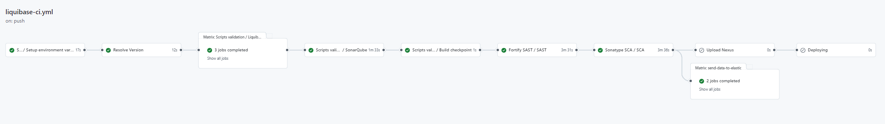

#### Quality workflow

- **Setup environment variables**: Load the properties defined in properties.env file and in the configuration project.
- **Resolve Version**: Get the current execution version.
- **SonarQube**: Executes the sonar analysis to validate the quality gates.

??? info "Liquibase quality workflow code"

    ```yaml linenums="1"
    name: Liquibase quality

    on:
      pull_request:
        branches:
          - development
          - develop
          - main
          - master

    jobs:
      call-reusable-workflow:
        name: Liquibase quality ${{ github.ref }}
        uses: santander-group-scfccoe/gln-workflows/.github/workflows/liquibase-quality.yml@v1
        secrets: inherit
    ```
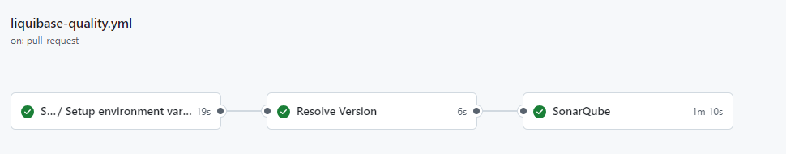

#### Security workflow

- **Setup environment variables**: Load the properties defined in properties.env file and in the configuration project.
- **SAST**: Executes the reusable Fortify SAST workflow to perform a SAST scan with Fortify and validate the quality gates.
- **SCA**: Executes the reusable The Sonatype SCA workflow to perform a Sonatype SCA scan and analyze third party components from a repository.
- **Send information to Elasticsearch**: Send data to elasticsearch related with SAST and SCA analysis.

??? info "Liquibase security workflow code"

    ```yaml linenums="1"
    name: Liquibase security

    on:
      pull_request:
        branches:
          - development
          - develop
          - main
          - master

    jobs:
      call-reusable-workflow:
        name: Liquibase security ${{ github.ref }}
        uses: santander-group-scfccoe/gln-workflows/.github/workflows/liquibase-security.yml@v1
        secrets: inherit
    ```
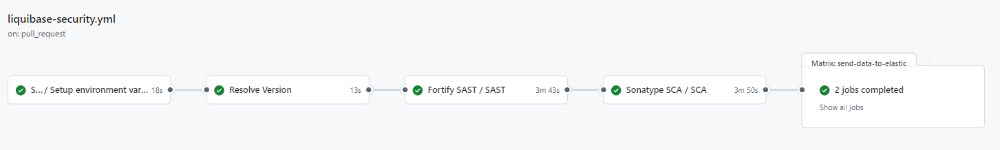

### Push to development

After approving the Pull Request from feature to `development`, a merge will be done. The merge actions does a *push* implicitly. This push event will trigger the liquibase-ci.yml workflow automatically.

The liquibase CI workflow is a comprehensive process that begins with setting up environment variables, which involves loading properties defined in the `properties.env` file and in the configuration project.

After setting the environment variables, the workflow will perform liquibase script validation to check the correct liquibase file format.

After the scripts validation and sonar scan, it runs the reusable **Fortify SAST** workflow to perform a SAST scan with Fortify and validate the quality gates, and sends SAST analysis data to Elasticsearch.
The workflow also executes the reusable **Sonatype SCA** workflow to perform a Sonatype SCA scan. The next step involves **CERT** environment deployment.

??? info "Liquibase CI workflow code"

    ```yaml linenums="1"
    name: Liquibase CI

    on:
      push:
        branches:
          - development
          - develop
          - feature/*
          - fix/*

    jobs:
      call-reusable-workflow:
        name: Liquibase CI workflow
        uses: santander-group-scfccoe/gln-workflows/.github/workflows/liquibase-ci.yml@v1
        secrets: inherit
    ```
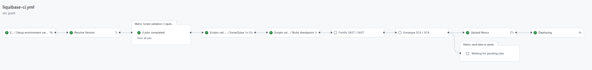

- **Setup environment variables**: Load the properties defined in properties.env file and in the configuration project.
- **Resolve Version**: Loads and builds the version of the current deployment.
- **Scripts validation**: Validates all liquibase script formats and executes sonar scan.
- **SAST**: Executes the reusable Fortify SAST workflow to perform a SAST scan with Fortify and validate the quality gates.
- **SCA**: Executes the reusable The Sonatype SCA workflow to perform a Sonatype SCA scan and analyze third party components from a repository.
- **Send information to Elasticsearch**: Send data to elasticsearch related with SAST and SCA analysis.
- **Upload Nexus**: Uploads the repository files as artifact to Nexus.
- **Deploying**: Executes the CD workflow.

Once the workflow ends, it triggers the CD workflow automatically.
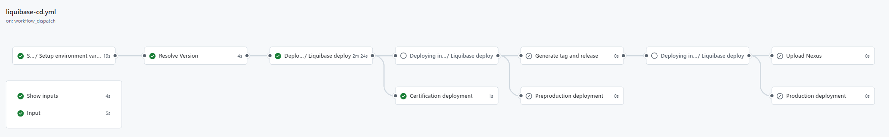

### Pull Request from development to main

When it's time to apply changes on the PRE/PRO environments' databases, we initiate a Pull Request from the integration branch: develop/development to the main/master branch.

This action triggers the liquibase-quality.yml (Sonar) and liquibase-security.yml (Fortify & Sonatype) workflows. defined in the **Pull Request from feature to development** section.

### Push to main

After approving the Pull Request from development to main, a merge will be done. The merge actions does a *push* implicitly. This push event will trigger the liquibase-rc.yml workflow automatically.

This workflow begins by setting up environment variables, loading properties defined in the `properties.env` file and in the configuration project, which is obtained according to the defined secrets.
Validates the liquibase scripts, and then prepares the release candidate by updating the version in the branch (main or master), getting the next release version, and getting the last commit in the branch.

The workflow validates the liquibase scripts and sonar scan, followed by the reusable **Fortify SAST** workflow is executed to perform a SAST scan with Fortify and validate the quality gates. SAST analysis data is sent to Elasticsearch.
The workflow also executes the reusable **Sonatype SCA** workflow to perform a Sonatype SCA scan and analyze third-party components from a repository.
A new tag for release is created, and finally, a new draft **release is created** and the check set is selected as a pre-release tag for release.

??? info "Liquibase RC workflow code"

    ```yaml linenums="1"
    name: Liquibase release

    on:
      push:
        branches:
          - main
          - master
          
    jobs:
      cal-reusable-workflow:
        name: Liquibase release workflow
        uses: santander-group-scfccoe/gln-workflows/.github/workflows/liquibase-rc.yml@v1
        secrets: inherit
    ```
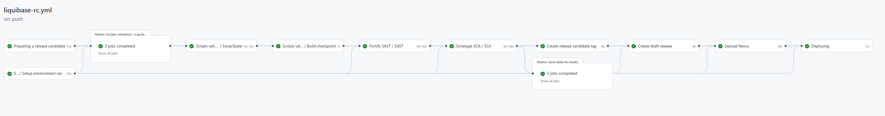

- **Setup environment variables**: Load the properties defined in properties.env file and in the configuration project.
- **Preparing a release candidate**: Loads and builds the version of the current deployment.
- **Scripts validation**: Validates all liquibase script formats and executes sonar scan.
- **SAST**: Executes the reusable Fortify SAST workflow to perform a SAST scan with Fortify and validate the quality gates.
- **SCA**: Executes the reusable The Sonatype SCA workflow to perform a Sonatype SCA scan and analyze third party components from a repository.
- **Send information to Elasticsearch**: Send data to elasticsearch related with SAST and SCA analysis.
- **Create release candidate tag**: Create a new tag for RC.
- **Create draft release**: Creates a new draft release and select the check Set as a pre-release tag for RC.
- **Upload Nexus**: Uploads the repository files as artifact to Nexus.
- **Deploying**: Executes the CD workflow.

Once the workflow ends, it triggers the CD workflow automatically.
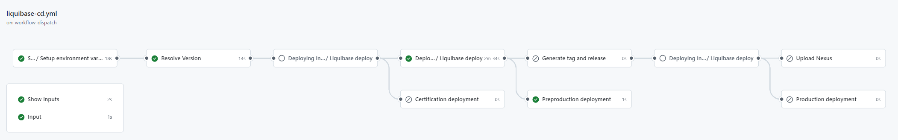

<!--end-validate-script-->

<!--start-cd-workflow-stages-->
The CD workflow consists of 12 tasks that ensure a successful deployment. Below you will find a brief description of each job:


- **Show inputs**: Shows the workflow inputs as annotations.
- **Input**: Shows the workflow inputs as summary. This information can be used to perform release or rollback actions.
- **Setup environment variables**: Loads all Gluon default configurations and the variables defined in the properties.env
- **Resolve Version**: Loads and builds the version of the current deployment.
- **Deploying in certification**: Deploys the liquibase database scripts in the CERT database.
- **Certification deployment summary**: Shows the CERT deployment tag and version, these information can be used to do rollback actions if needed.
- **Deploying in preproduction**: Deploys the liquibase database scripts in the PRE database.
- **Preproduction deployment summary**: Shows the PRE deployment tag and version, these information can be used to do rollback actions if needed.
- **Generate tag and release**: Generates the release version for PRO environment from the release candidate version.
- **Deploying in production**: Deploys the liquibase database scripts in the PRO database.
- **Upload Nexus**: Uploads the version of the deployed release candidate artifact on production as the final released version artifact.
- **Production deployment summary**: Shows the PRO deployment tag and version, these information can be used to do rollback actions if needed.
<!-- - **Close Task (ITSM)**: Closes the ServiceNow ticket for the release deployment. -->
<!--end-cd-workflow-stages-->

<!--start-cd-workflow-file-->
To invoke the **CD** reusable workflow, you need to establish a workflow file in your project's repository. Workflows are delineated by a YAML file located in the `.github/workflows` directory of a repository. (A repository can contain multiple workflows.)

The workflow to be created should include the following fundamental components:

- One or more events that will instigate the workflow, using the 'on' keyword. (For example, push, workflow_dispatch, etc.)
- One or more jobs, each of which will operate on a runner machine and execute a sequence of one or more steps, depending on the reusable workflow you're referencing.

When using only liquibase-cd, it's advisable to name the YAML file as `liquibase-cd.yml` and use the keyword ‘name' with 'CD' to easily locate it among all workflows in your repositories.
Find below a workflow file example, make sure to replace the values to match the deployment you want to perform.

```yaml title="Liquibase CD workflow" linenums="1"
name: Liquibase CD

workflow_dispatch:
  inputs:
    deploy-version:
      required: false
      type: string
      description: 'Scripts version to deploy. By default the version of the VERSION is obtained.'
    deployment-yaml-name:
      required: false
      type: string
      default: 'deployment'
      description: 'Name of yaml file that includes the deployment configuration for one or more environments.'
    config-version:
      required: false
      type: string
      description: 'Version of properties and deployment.yaml file to use in the deployment'
    deployment-environment:
      required: true
      type: choice
      options:
        - cert
        - pre
        - cert/pre
        - pre/pro
        - cert/pre/pro
        - pro
      description: "Environment to deploy"
    draft-id:
      required: false
      type: string
      description: 'Draft identity to create release from release candidate and deployment-environment "pre/pro", "cert/pre/pro"'
    branch-strategy:
      required: true
      type: choice
      default: 'gitflow'
      options:
        - gitflow
        - trunk-based
      description: 'Branch strategy to use in the deployment process.'
    itsm-task:
      type: string
      required: false
      description: 'ITSM task to validate'
    date_tag:
      type: string
      required: false
      description: 'The date tag for database tagging.'
      default: $(date '+%Y%m%d%H%M%S')

jobs:
  call-reusable-workflow:
    name: Liquibase CD
    uses: santander-group-scfccoe/gln-workflows/.github/workflows/liquibase-cd.yml@v1
    with:
      deploy-version: ${{ inputs.deploy-version }}
      deployment-yaml-name: ${{ inputs.deployment-yaml-name }}
      config-version: ${{ inputs.config-version }}
      deployment-environment: ${{ inputs.deployment-environment }}
      draft-id: ${{ inputs.draft-id }}
      branch-strategy: ${{ inputs.branch-strategy }}
      itsm-task: ${{ inputs.itsm-task }}
      date_tag: ${{ inputs.date_tag }}
    secrets: inherit
```

???+ warning "Workflow secrets"

      Credentials are supplied to the workflow via **secrets**. To pass named secrets, use the 'secrets' keyword along with the 'inherit' value. These secrets should be stored within your organization's GitHub secrets, in the actions section, and authorized for your repository. **Check the following section for secrets configuration**.

To pass inputs, use the 'with' keyword in the job. The list of possible inputs is as follows:

|**Name**|**Description**|**Required**|**Type**|**Example value**|
|--------|---------------|------------|--------|-----------------|
| **deploy-version** | Scripts version to deploy. By default the version of the VERSION is obtained. | No* | String | `1.0.0-SNAPSHOT` |
| **deployment-yaml-name** | Name of yaml file that includes the deployment configuration for one or more environments. | No | String |`deployment` |
| **config-version** | Version of properties and deployment.yaml file to use in the deployment. | No | String | `1.0.0-SNAPSHOT` |
| **deployment-environment** | Environment to deploy: <ul><li>cert</li><li>pre</li><li>cert/pre</li><li>pre/pro</li><li>cert/pre/pro</li><li>pro</li></ul> | Yes | Choice | `cert/pre` |
| **draft-id** | Draft identity to create release from release candidate and deployment-environment "pre/pro", "cert/pre/pro", “pro” | No* | String | `173392184` |
| **branch-strategy** | Branch strategy to use in the deployment process: <ul><li>gitflow</li><li>trunk-based</li></ul> | Yes | Choice | `gitflow` |
| **itsm-task** | (Not used yet) ITSM task to validate. | No* | String | `RITMXXXXXXX` |
| **date_tag** | The date tag for database tagging. | No | String | `20240906095838` |

???+ important "Workflow inputs"

      `*` Mandatory if deploying a release version.
<!--end-cd-workflow-file-->

<!--start-apply-db-change-->
Once secrets and configuration files are correctly configured, everything is set up to execute the workflow and make the deployment.
Depending on the trigger events defined in the workflow, the workflow may either run automatically upon a push, or it may require manual execution with specific keywords following the 'on' keyword:

- **Push**: This event triggers the workflow when a push is made to a branch. To configure a push trigger, the 'on' field is used and the push event is specified.
  The branches on which the workflow should be triggered can be defined using the 'branches' keyword. For instance, 'on: push: branches: - master' triggers the workflow when a push is made to the master branch.
- **Workflow dispatch**: This event allows for manual triggering of a workflow via a **button click**. To configure a workflow dispatch trigger, the 'on' field is used and the 'workflow_dispatch' event is specified (on: workflow_dispatch: ).
  To manually run it, navigate to the Actions tab in the repository and select your workflow, which will be named after the name you've assigned it in the YAML.
  Inside the desired workflow, if the 'workflow_dispatch' event is enabled, a 'Run Workflow' button will be visible where the branch to be executed can be selected.

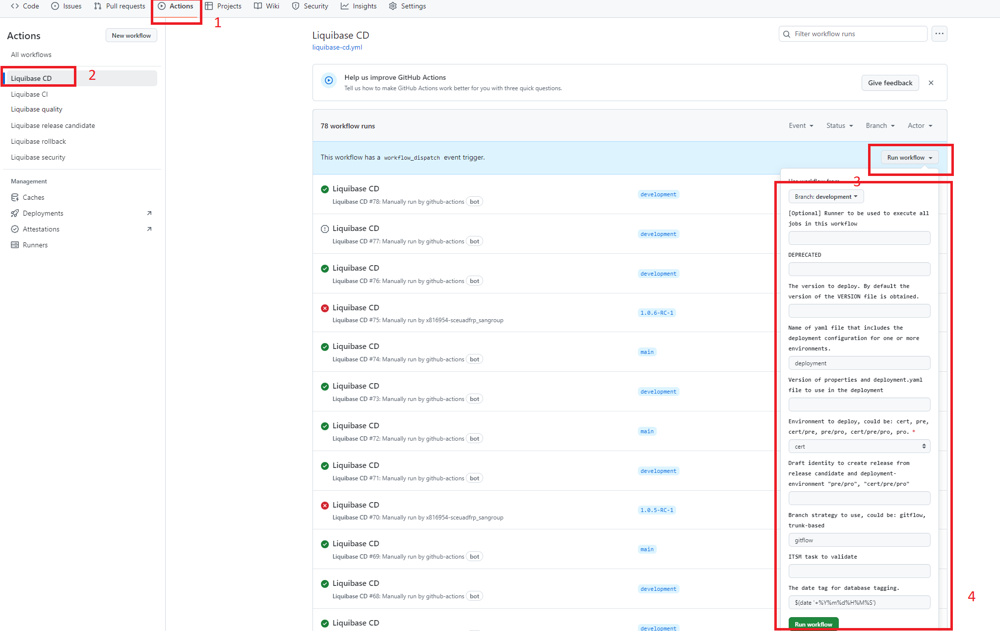

### Deploy in CERT environment

To deploy the database scripts in the **CERT** environment, a push to the branch develop or development must be done, this triggers the CI workflow and after it ends, the CD workflow will be triggered automatically with the required inputs for the deployment.

### Deploy in PRE environment

To deploy the database scripts in the **PRE** environment, a push to the branch main or master must be done, this triggers the RC workflow and after it ends, the CD workflow will be triggered automatically with the required inputs for the deployment.

### Deploy in PRO environment

To deploy the database scripts in the **PRO** environment, The Liquibase-CD workflow must be run manually using the desired release candidate branch and data to trigger it.
During the fourth step of the deployment process, choose '**Tags**' instead of 'Branches', and then select the Tag that to be deployed.


PRO deployment workflow steps

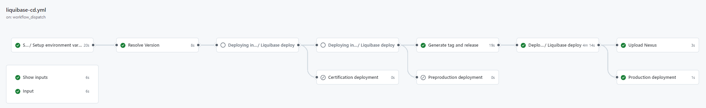

To run the Liquibase CD workflow to deploy to PRO environment, we should retrieve the deployment summary of the release candidate that we want to use.

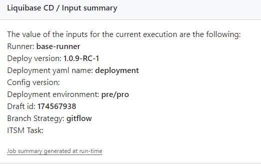

To run manually Liquibase CD workflow, there are fields that we have to fill.

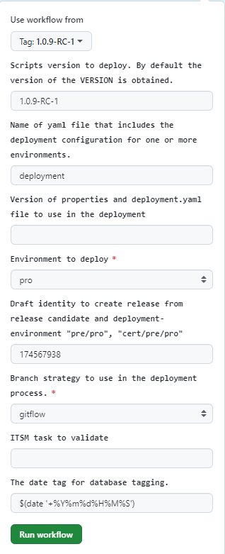

The following fields must be filled and the rest of fields in the previous image must not be modified:

- **Use workflow from**: Select from the tag list, the tag we want to use for the deployment.
- **Scripts version to deploy**: By default the version of the VERSION is obtained: Use the value of the Deploy version of the summary.
- **Environment to deploy**: Select from the drop down list the value “pro“.
- **Draft identity to create release from release candidate and deployment-environment "pre/pro", "cert/pre/pro"**: Use the value of the Draft id of the summary.
<!--end-apply-db-change-->

<!--start-rollback-db-change-->
If rollback is required after a deployment, the liquibase-rollback.yml workflow can be run manually using the data exposed in the deployment summary.

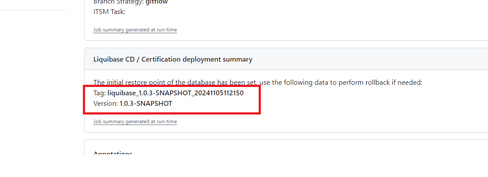

The value of the Tag must be copied and filled in the rollback workflows’s tag field.

Depending on the version’s value, different branches must be selected.

- Snapshot version (**certification environment**): select the development branch
- Release candidate version (**preproduction environment**): select the tag related to the release candidate version
- Release version (**production environment**): select the tag related to the release version

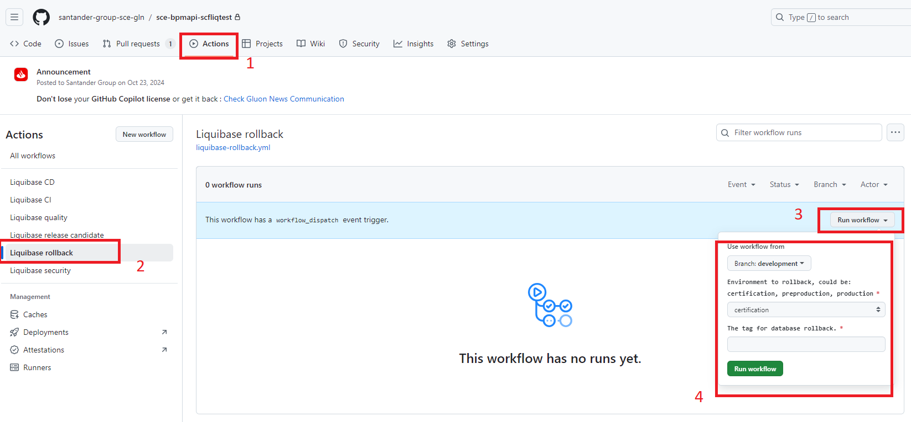

Rollback workflow steps

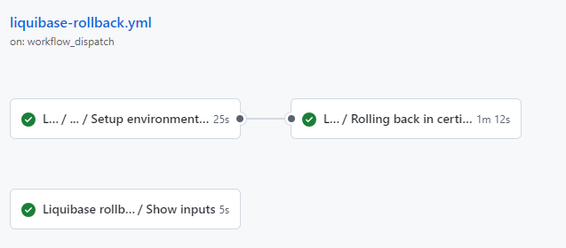

???+ warning "Rollback order"

      To perform rollbacks, the order of the execution must be the inverse of the order of the database changes. The latest database change **MUST** be rolled back first.
<!--end-rollback-db-change-->
