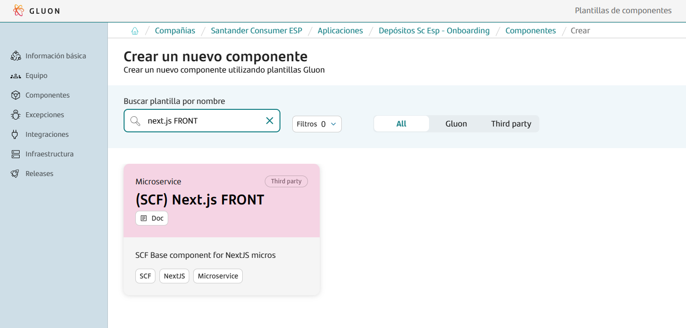
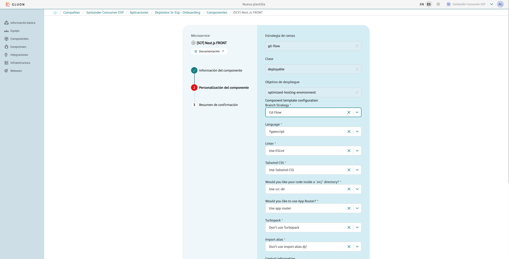

This base component template serves as a comprehensive guide for building and deploying Next.js microservices within the Gluon portal.
It simplifies the entire process, offering a clear and efficient workflow from development to deployment.

The template is specifically designed for **Next.js components** that integrate seamlessly with Gluon's microfrontend workflows and Node.js ecosystem.
It enhances these workflows by introducing an additional layer of customization through specific Next.js configuration files, enabling developers to tailor their microservices to meet unique requirements.

Within this documentation, users will find detailed instructions, best practices, and examples to effectively leverage the Next.js workflow for their microservices.
This includes step-by-step guidance on setting up the project, configuring essential files, managing dependencies, and deploying the microservice within the Gluon platform.

Whether starting a new project or incorporating Next.js into an existing microfrontend architecture, this guide provides all the necessary steps to ensure a smooth and efficient development process.
By following this template, developers can fully utilize the robust features and optimizations of both Next.js and Gluon, creating scalable and high-performing microservices.

## Create Component

### Gluon Portal

To begin, you must onboard your application. This involves setting up your application within the system. Once your application is successfully created and onboarded, you can proceed to create your component.

To create a component, follow these detailed steps:

1. **Select the Component Type**:
    First, you need to choose the type of component you wish to create. In this case, select `(SCF) NextJs FRONT`.

    

2. **Fill in Component Details**:
    Next, you will be prompted to fill in the necessary details for your component. This includes:
    - **Name**: Provide a unique and descriptive name for your component.
    - **Short Name**: Short names can only contain capital letters and digits.
    - **Description**: Write a detailed description that explains the purpose and functionality of the component.
    - **Branch Strategy**: Choose a branch strategy for your component's repository. The recommended branch strategy for this template is `git flow`, which helps in managing the development workflow efficiently.
    - **Language**: Choose the programming language for your project. You can select between **JavaScript** or **TypeScript**.
    TypeScript is a superset of JavaScript that adds static typing, which can help catch errors during development.
    - **Linter**: Decide whether to include **ESLint** in your project.
    ESLint is a popular tool for identifying and fixing problems in your JavaScript or TypeScript code, ensuring code quality and consistency.
    - **Tailwind CSS**: Choose whether to include **Tailwind CSS**, a utility-first CSS framework that simplifies styling by providing pre-defined classes.
    It allows for rapid UI development with minimal custom CSS.
    - **src/ directory**: Decide whether to organize your project files inside a `src` directory.
    This is a common convention that helps separate source code from other project files, making your project structure cleaner and more maintainable.
    - **App Router**: Choose whether to use the **App Router**, which is the new file-based routing system introduced in Next.js 13.
    It provides enhanced features like nested layouts, server components, and improved data fetching capabilities.
    - **Turbopack**: Decide whether to enable **Turbopack**, a new bundler introduced by Vercel.
    Turbopack is designed to be faster than Webpack and optimized for large-scale applications, improving build and development speeds.
    - **Import alias**: Configure custom **import aliases** for your project.
    This allows you to define shortcuts for importing files or modules, making your code cleaner and easier to maintain.
    For example, you can set `@components` to reference your `components` folder.
    - **Contact Information**: Provide the contact information for the person responsible for the component. Include the name and email address.

    

3. **Component Creation**:
    After filling in the required details, proceed to create the component. Once the component is created, you will notice that a new repository is generated under your application.
    This repository will have the name of your component and will be integrated with SonarQube for code quality analysis and Fortify for security analysis.

By following these steps, you will have successfully created a new component. This component will be ready for further development within the GitHub repository.

### Component Repository

When creating a component from scratch, a scaffolding workflow runs automatically and creates the structure of the repository with the development branch, including all configuration files and workflows.

???+ warning "Scaffolding Note"

      Sometimes the scaffolding doesn't trigger automatically, so it needs to be launched manually from the actions tab.

#### Branches

{!
   include-markdown "./snippets/branch-structure.md"
   start="<!--Start Branch Structure-->"
   end="<!--End Branch Structure-->"
!}

#### Structure

The generated microservice has a structure similar to the following.

???+ info "Note"

      Note that, depending on the configuration options selected during the creation process in the Gluon Portal, additional files such as `tsconfig.json` or `tailwind.config.ts` may be automatically generated and included in the project.

```bash
📦
 ┣ 📂.github
 ┃ ┣ 📂workflows
 ┃ ┃ ┣ 📜bluegreen-switch-workflow.yml
 ┃ ┃ ┣ 📜cd.yml
 ┃ ┃ ┣ 📜ci-gfw.yml
 ┃ ┃ ┣ 📜quality.yml
 ┃ ┃ ┣ 📜release-gfw.yml
 ┃ ┃ ┣ 📜security.yml
 ┃ ┃ ┣ 📜update-component-workflow.yml
 ┃ ┃ ┗ 📜version-validation.yml
 ┃ ┗ 📜CODEOWNERS
 ┣ 📂.gluon
 ┃ ┣ 📂ci
 ┃ ┗ ┗ 📜properties.env
 ┃ ┣ 📂cd
 ┃ ┣ ┣ 📂cert
 ┃ ┃ ┣ ┣ 📜cd.yml
 ┃ ┃ ┗ ┗ 📜values.yml
 ┃ ┣ ┣ 📂cert
 ┃ ┃ ┣ ┣ 📜cd.yml
 ┃ ┃ ┗ ┗ 📜values.yml
 ┃ ┣ ┣ 📂cert
 ┃ ┃ ┣ ┣ 📜cd.yml
 ┃ ┃ ┗ ┗ 📜values.yml
 ┃ ┗ ┗ 📜values.yml
 ┣ 📂public
 ┣ 📂src/app
 ┣ 📜Dockerfile
 ┣ 📜next.config.js
 ┗ 📜package.json
```

## Kubernetes Infrastructure

{!
   include-markdown "../../../../components/software/front/web/snippets/kubernetes-for-front.md"
!}

## Component Configuration

This section provides an overview of the necessary configurations for integrating the Gluon component into your project. It covers the required branches and essential configuration files to ensure smooth CI/CD processes.

{!
   include-markdown "../../../../components/snippets/configuration/front-config.md"
   start="<!--Start front config init-->"
   end="<!--End front config init-->"
!}

=== "Darwin Microfront example"

    ```properties
    # Npm parameters
    NODE_VERSION='16.20.2'
    NPM_CONFIGURATION_DIST_DIRECTORY='nginx/'
    NPM_RUN_TEST_COMMAND='npm test --coverage'

    # Sonar parameters
    SONAR_PROJECT_KEY="san-demo-mycomponent"

    # Fortify parameters
    FORTIFY_PROJECT="san-demo-mycomponent"

    DOCKER_BUILD_ARGUMENTS='--build-arg ARTIFACT_PATH=${ARTIFACT_PATH} --build-arg CONFIG_PATH=${CONFIG_PATH}'

    # NPM GROUP
    NPM_APPLICATION_GROUP=santander-group-gluon-test
    ```

#### Next.config.js

The `next.config.js` file is a configuration file for Next.js, a popular React framework for building server-side rendered and static web applications.
This file allows you to customize various aspects of your Next.js application, such as webpack configuration, environment variables, and more.

**Key Configurations in `next.config.js`:**

- **webpack**: Customize the webpack configuration used by Next.js.
- **env**: Define environment variables that can be accessed in your application.
- **i18n**: Configure internationalization settings.
- **images**: Configure image optimization settings.

**Customizing `next.config.js`:**
Users using this template may need to modify the `next.config.js` file to include specific configurations required by their project.
For example, they might need to add custom webpack configurations, set environment variables, or configure internationalization settings.
If users already have a `next.config.js` file, they can merge the necessary configurations from the template with their existing file to ensure their application works correctly.

By understanding and customizing these files, users can ensure that their Next.js application is set up correctly and tailored to their specific needs.

{!
   include-markdown "../../../../components/snippets/configuration/front-config.md"
   start="<!--Start front config end-->"
   end="<!--End front config end-->"
!}

## Build and Deploy your application

{!
   include-markdown "../../../../components/snippets/lifecycle/gitflow-for-front.md"
!}

## Contact Information and Support

{!
   include-markdown "./snippets/contact-information.md"
   start="<!--Start-->"
   end="<!--End-->"
!}
