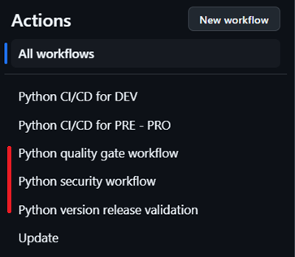
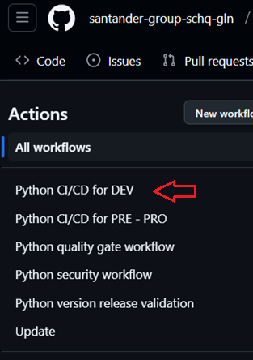

This base component template serves as a comprehensive guide for building Node.js/npm components and deploying the relevant files to an AWS S3 Bucket.
It streamlines the entire process, providing a clear and efficient pathway from development to production deployment.

In this documentation, users will find detailed instructions, best practices, and examples to effectively utilize the Node.js S3 component workflows for their projects.
The guide includes comprehensive guidance on setting up the Node.js project, configuring essential files, managing dependencies, packaging the application, and performing the deployment process to an S3 Bucket.

Whether you are starting from scratch or integrating the Node.js S3 component into an existing project, this guide will provide the necessary steps to ensure a smooth and efficient development and deployment process.
By following this guide, users can ensure their Node.js applications are properly packaged and uploaded to AWS S3, ready for production use.

## Prerequisites: AWS Credentials Request

For this pipeline to work correctly, you need to request a role + OIDC.  
You can find more details about the request to be submitted to the BAU [here](../support/credentials.md).
Note that this template is cataloged as a `Non Microservice components > Miscellaneous`, detailed information to make the request can be found [here](../support/credentials/data.md).

## Git Flow Lifecycle

As soon as the scaffolding workflow is done, you will find a repository with two branches: main and development.
Both branches will be prepared with the necessary workflows to run the entire component lifecycle.
The following image shows a visual representation of the Git-Flow lifecycle and the workflows executed in each step.


In the Git Flow model, developers start by creating a new branch off the `development` branch for each feature, named `feature/*`. Once the feature is complete, they create a pull request to merge the `feature/*`branch into `development`.
When opening the pull request, three workflows are executed automatically: **Security, Quality** running sonar and fortify, and **Version Validation**.
If everything is satisfactory, the pull request is approved and the `feature/*` branch is merged into `development`.

???+ warning "Note"

      The version of the project can remain the same in order to deploy to development environment, but it must be higher than the previous version to deploy to PRE and PRO environments.

When the `development` branch receives the push from the pull request the **CI/CD** workflow is executed automatically. To deploy to PRE environment, a pull request from `development` to `main` has to be created.

As in the `feature` branch, when opening the pull request, these workflows are executed automatically: **Security, Quality and Version Validation**.
If they are correctly executed, merging the pull request moving changes from `development` to `main` will trigger the **CI/CD** to deploy to PRE environment.

The code is now in main and a tag is created. To complete the lifecycle, you need to publish a GitHub release using the mentioned tag to finally deploy to the production environment.

???+ warning "Note"

      Make sure to create your `feature/*` branch off the `development` branch as this branch contains all the necessary workflows and configuration files to run all workflows.

## Create Component

### Gluon Portal

{!
   include-markdown "./snippets/create-component-gluon.md"
   start="<!--Start creation-->"
   end="<!--End creation-->"
!}

### Component Repository

When creating a component from scratch, a scaffolding workflow runs automatically and creates the structure of the repository with the development branch, including all configuration files and workflows.

???+ warning "Scaffolding Note"

      Sometimes the scaffolding doesn't trigger automatically, so it needs to be launched manually from the actions tab.

#### Branches

{!
   include-markdown "./snippets/branch-structure.md"
   start="<!--Start Branch Structure-->"
   end="<!--End Branch Structure-->"
!}

#### Structure

The generated component has a structure similar to the following:

``` bash
📦
 ┣ 📂.github
 ┃ ┣ 📂workflows
 ┃ ┃ ┣ 📜node-ci-cd.yml
 ┃ ┃ ┣ 📜node-ci-cd-rl.yml
 ┃ ┃ ┣ 📜node-quality.yml
 ┃ ┃ ┣ 📜node-security.yml
 ┃ ┃ ┣ 📜node-version-validation.yml
 ┃ ┃ ┗ 📜upload-workflow.yml
 ┃ ┗ 📜CODEOWNERS
 ┣ 📂.gluon/ci
 ┃ ┗ 📜properties.env
 ┣ 📂src
 ┃ ┗ your code
 ┣ 📂tests
 ┃ ┗ your tests
 ┣ 📜.gitignore
 ┣ 📜.npmignore
 ┣ 📜.npmrc
 ┣ 📜changelog.md
 ┣ 📜deployment.yml
 ┣ 📜package.json
 ┗ 📜README.md
```

## Component Configuration

This section provides an overview of the necessary configurations for integrating the Gluon component into your project. It covers the required branches and essential configuration files to ensure smooth CI/CD processes.

### Configuration files that directly affect the CI/CD workflows

This base component template works with some configuration files that need modifications:

* `package.json`: file with the core of your project configuration, from metadata to build scripts.
* `deployment.yaml`: file with key information for the deployment.
* `properties.env`: file with parameters used by the CI workflows.

#### Package.json

The `package.json` file is a crucial component of any Node.js project. It serves as the manifest file for the project, containing metadata relevant to the project such as the project name, version, description, main file, scripts, dependencies, and more.
This file allows npm (Node Package Manager) to manage the project's dependencies and scripts efficiently.

**Key Sections of `package.json`:**

* **name**: The name of your project.
* **version**: The current version of your project.
* **description**: A brief description of your project.
* **main**: The entry point of your application.
* **scripts**: Scripts to run various tasks such as starting the server, running tests, building the project, etc.
* **dependencies**: Packages required for the project to run.
* **devDependencies**: Packages required for development purposes.

**Customizing `package.json`:**
Users using this template may need to update the `name`, `version`, and `description` fields to match their project's specifics.
Additionally, they might need to add or modify dependencies and scripts to suit their project's requirements.
If users already have a `package.json` file, they can merge the dependencies and scripts from the template with their existing file.

#### Deployment.yaml

The `deployment.yaml` file is used to define the CD deploy process depending on the target cloud services and your specific needs.

You will find a deployment file with the following parameters. Set the values accordingly to the specified instructions and your specific needs.

Based on certain values the workflow will behave differently, making this component more adaptable and reducing the amount of components required.

If you set these two values instead of letting them empty or commented out, the workflow will update the indicated Lambda.

```yaml
    LAMBDA_NAME: "myLambdaName"
    LAMBDA_HANDLER: "index.handler"
```

If you set this value instead of letting it empty or commented out, the workflow will also execute the following command: `aws cloudfront create-invalidation --distribution-id <CLOUDFRONT_ID> --paths '/*'`.
Replace the placeholder value with the real ID.

```yaml
    CLOUDFRONT_ID: "E0ANDSPI0CYM0"
```

```yaml title="Deployment.yaml file with placeholder and instructions" linenums="1"
# Parameters for each environment. The comments written below for the DEV parameters also apply to the PRE and PRO parameters.
environments:
  DEV:
    AWS_ACCOUNT_ID: 111222333444          ## Required to deploy using roles instead of access_key and secret_key.
    S3BUCKET_NAME: "myBucket"             ## s3://<S3BUCKET_NAME> - It must previously exist
    TARGET_FOLDER: "my/folder"            ## s3://<S3BUCKET_NAME>/<TARGET_FOLDER> - If it doesn't exist, it will be created.
    COMPRESS_FILE_NAME: "testing"         ## Name of the compressed artifact that will be uploaded to the S3
    COMPRESSION_TYPE: ".zip"              ## Value must be: .zip || .tar.gz || .tar
    OVERWRITE: 0                          ## Set to 1 to replace everything located at s3://<S3BUCKET_NAME>/<TARGET_FOLDER>
    IS_PUBLIC: 0                          ## Set to 1 to make your bucket public (NOTE: this will make your bucket files public)
    AWS_REGION: "eu-west-1"               ## Only change if it's on a different region

    # LAMBDA_NAME: "myLambdaName"           ## - OPTIONAL! The lambda name that will be updated. When updating a lambda is required, set the value.
    # LAMBDA_HANDLER: "index.handler"       ## - OPTIONAL! This refers to file.function. For example, index.js and handler() -> index.handler. When updating a lambda is required, set the value.

    # CLOUDFRONT_ID: "E0ANDSPI0CYM0"        ## - OPTIONAL! Set the value if you need to invalidate CloudFront Cache.

  PRE:
    AWS_ACCOUNT_ID: 111222333444
    S3BUCKET_NAME: "myBucket"
    TARGET_FOLDER: "my/folder"
    COMPRESS_FILE_NAME: "testing"
    COMPRESSION_TYPE: ".zip"
    OVERWRITE: 0
    IS_PUBLIC: 0
    AWS_REGION: "eu-west-1"

    # LAMBDA_NAME: "myLambdaName"
    # LAMBDA_HANDLER: "index.handler"

    # CLOUDFRONT_ID: "E0ANDSPI0CYM0"

  PRO:
    AWS_ACCOUNT_ID: 111222333444
    S3BUCKET_NAME: "myBucket"
    TARGET_FOLDER: "my/folder"
    COMPRESS_FILE_NAME: "testing"
    COMPRESSION_TYPE: ".zip"
    OVERWRITE: 0
    IS_PUBLIC: 0
    AWS_REGION: "eu-west-1"

    # LAMBDA_NAME: "myLambdaName"
    # LAMBDA_HANDLER: "index.handler"

    # CLOUDFRONT_ID: "E0ANDSPI0CYM0"
```

#### properties.env

Found in the .gluon/ci directory, this file contains parameters that the CI workflows can retrieve for different purposes.

The parameter NODE_VERSION can be modified indicating the node version your project needs. The NPM_APPLICATION_DIST_DIRECTORY can also be configured.

???+ warning "Scaffolding Note"

      Do not modify SONAR_ID, SONAR_PROJECT_KEY, FORTIFY_PROJECT, NPM_SONAR_PROPERTIES and other related parameters.

```txt title="properties.env" linenums="1"
# For TypeScript dist/
NPM_APPLICATION_DIST_DIRECTORY='dist/'

# For JavaScript src/
NPM_APPLICATION_DIST_DIRECTORY='app/'

NPM_RUN_INSTALL_COMMAND='npm install'
NPM_RUN_TEST_COMMAND='npm run test:coverage'

# Sonar Properties for Typescript library
NPM_SONAR_PROPERTIES='-Dsonar.sources=./src,package.json -Dsonar.javascript.coveragePlugin=lcov -Dsonar.javascript.lcov.reportPath=./coverage/lcov.info -Dsonar.typescript.lcov.reportPaths=./coverage/lcov.info -Dsonar.typescript.coveragePlugin=lcov'

# Sonar parameters
SONAR_ID="SONAR_GLUON_COMMUNITY"
SONAR_PROJECT_KEY=""

# Fortify parameters
FORTIFY_PROJECT=""

# Replace with the current version of your project
NODE_VERSION='18.18.2'
```

### Other configuration files

#### .npmignore

The .npmignore file is used by npm (Node Package Manager) to determine which files and directories should be excluded from the package when it is published. It works similarly to a .gitignore file but affects the contents of the npm package.
This helps to keep the package size small and avoid including unnecessary files such as documentation, tests, or development files.

```plaintext
# Santander Arquitectura Cloud git ignore file

## exclude ts files ##
**/*.ts

### Mac ###
.DS_Store

### SonarQube ###
.scannerwork/*

# Test
coverage/*

# Visual Studio Code
.vscode/*

#### OTHER DIRECTORIES & FILES ####
```

#### .npmrc

The .npmrc file is used by npm (Node Package Manager) to configure npm settings and behaviors. It can be used to set the registry for package downloads, manage authentication tokens, and configure various other npm settings.
This file can be placed in a project directory to apply settings locally, or in a user's home directory for global settings.

```ini
registry=https://nexus.alm.europe.cloudcenter.corp/repository/npm-public/
@darwin-node:registry=https://nexusmaster.alm.europe.cloudcenter.corp/repository/npm-releases
strict-ssl=false
```

### Secrets Configuration

There is no need to add any secret at repository or organization level. Even though the workflow is capable to use them if they exist, the preferred way to deploy is using roles set in the GitHub Actions workflows.

## Build and Deploy your application

To start working, create a new branch from the existing development branch that starts with feature/ like feature/init, for example.

You can now add your source code to the new repository. Pay attention to the following information in order to make the GitHub Actions CI/CD workflows properly run.

In order to deploy to the target service or resource for each environment, follow the next steps.

### Deploying process - DEV environment

* Create feature/my-branchfrom development branch.

* Make all the changes in the feature branch.

* To deploy to the DEV environment follow these steps:

* First create a Pull Request from feature/my-branch to development. This will trigger the following workflows



* Wait until quality, security and version validation workflows end.

* Once the previous workflows have finished, if you merge the Pull Request, the CI/CD workflow will be executed automatically, deploying to the DEV environment.



???+ warning "Note"

      You can deploy to the DEV environment even if Quality and Security gates fail. However it won't be possible to deploy to PRE or PRO environments if those workflows fail.

### Deploying process - PRE environment

* now that we have the source code in the development branch, the first step is creating a Pull Request from development to main.

* Quality, security and version validation workflows will be executed again, wait until they finish.


* Once the previous workflows have finished, if you merge the Pull Request, the CI/CD workflow will be automatically executed, but deploying to the PRE environment.


### Deploying process - PRO environment

Finally, in order to deploy to the PRO environment, the trigger is publishing a GitHub Release.

* In the releases section of your repository, there should be an existing release generated automatically, similar to the one you can see in the following screenshot:


* Press the edit button (above the red mark) and then go to the bottom of the page, disable the “Set as pre-release” option and click on Set as the latest release. Then, click the publish release button.


* This will trigger the following CI/CD workflow that deploys to the PRO environment.


* If you don’t find an automatically generated release, you can always generate a new one by clicking the Draft a new release button and choosing the latest tag generated in the previous workflows.

## Contact Information and Support

{!
   include-markdown "./snippets/contact-information.md"
   start="<!--Start-->"
   end="<!--End-->"
!}
