The goal of this documentation is to provide guidance on how to create PowerBI Library using the Gluon portal and the SCFGS workflow.

## CI - GLUON

{!
   include-markdown "./liquibase/configuration.md"
   start="<!--start-ci-intro-->"
   end="<!--end-ci-intro-->"
!}

### Create component

{!
   include-markdown "./liquibase/configuration.md"
   start="<!--start-ci-create-component-->"
   end="<!--end-ci-create-component-->"
!}

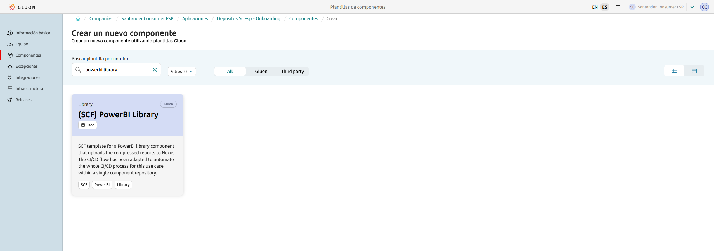

{!
   include-markdown "./liquibase/configuration.md"
   start="<!--start-repo-naming-convention-->"
   end="<!--end-repo-naming-convention-->"
!}

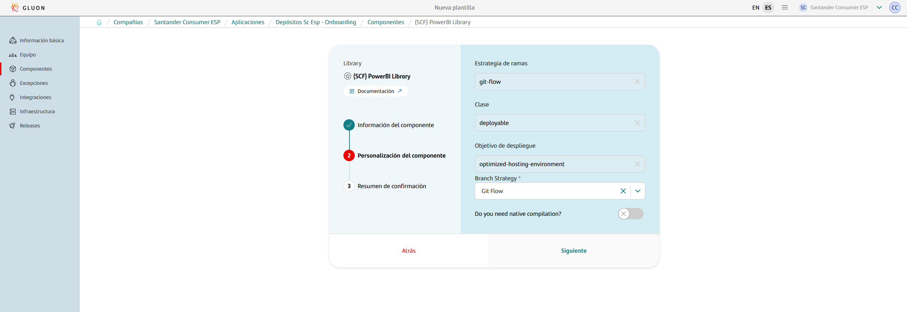

{!
   include-markdown "./liquibase/configuration.md"
   start="<!--start-ci-create-component-2-->"
   end="<!--end-ci-create-component-2-->"
!}

### Git Flow Lifecycle

{!
   include-markdown "./snippets/git-flow-lifecycle.md"
   start="<!--start-lib-gitflow-->"
   end="<!--end-lib-gitflow-->"
!}

### Configuration Files

As mentioned before, the scaffolding workflow generates a set of configuration files and some others that need to be added in order to make the workflows work. Find below the list of configuration files needed and how to configure them.

#### Properties.env

This file is generated by the scaffolding workflow and contains some properties for the CI configuration.

=== "Default"

    ```properties
    # Sonar parameters
    SONAR_ID="SONAR_GLUON_COMMUNITY"
    SONAR_PROJECT_KEY=""

    # Fortify parameters
    FORTIFY_PROJECT=""

    ZERO_TOUCH_ENABLE=true

    # Quality parameters
    ```

### Quality gates

As shown in the previous image every time a Pull Request (PR) is made, the security and quality workflows are automatically executed: Quality, Security.
These workflows conform quality gates that are needed to ensure the quality and the security of the prior to the deployment.
There are 3 quality gates:

- **Sonar**: Code Quality and test coverage
- **Fortify**: Analysis of the vulnerabilities of our source code
- **Sonatype**: Analysis of the vulnerabilities of our dependencies.

### Pull Request from feature to development

In order to start developing in the repository, create a new `feature/*` branch from the `development` branch. Make all necessary changes in the newly created feature branch.
When changes are ready to deploy, create a pull request (PR) from the `feature/*` to the `development` branch. The creation of the pull request will trigger the security gate workflows.

??? info "PowerBI Library CI workflow code"

    ```yaml linenums="1"
    name: PowerBI library CI

    on:
      push:
        branches:
          - development
          - develop
          - feature/*
          - fix/*
    
    jobs:
      call-reusable-workflow:
        name: PowerBI library CI workflow
        uses: santander-group-shared-assets/gln-workflows/.github/workflows/maven-ci-library.yml@v1
        secrets: inherit
    ```
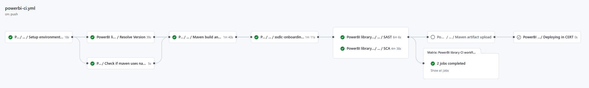

#### Quality workflow

- **Setup environment variables**: Load the properties defined in properties.env file and in the configuration project.
- **Maven build and Sonar scan**: Executes the default commands of MAVEN_BUILD_GOAL: clean verify.

??? info "PowerBI Library quality workflow code"

    ```yaml linenums="1"
    name: PowerBI library quality

    on:
      pull_request:
        branches:
          - development
          - develop
          - main
          - master
          
    jobs:
      call-reusable-workflow:
        name: PowerBI library quality ${{ github.ref }}
        uses: santander-group-shared-assets/gln-workflows/.github/workflows/maven-quality.yml@v1
        secrets: inherit
    ```
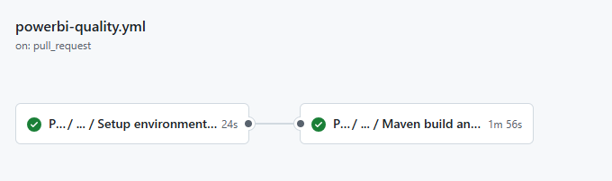

#### Security workflow

- **Setup environment variables**: Load the properties defined in properties.env file and in the configuration project.
- **Get current version from pom**: Get the current execution version.
- **Check if maven uses native build**: Check if native is used.
- **SSDLC Onboarding Check**: Check component and version in Fortify and create it in case it does not exist.
- **Check if multiregistry and dockerfile exists**: Check if the multiregistry.json and dockerfile exists.
- **SAST**: Executes the reusable Fortify SAST workflow to perform a SAST scan with Fortify and validate the quality gates.
- **SCA**: Executes the reusable The Sonatype SCA workflow to perform a Sonatype SCA scan and analyze third party components from a repository.
- **Send information to Elasticsearch**: Send data to elasticsearch related with SAST and SCA analysis.

??? info "PowerBI Library security workflow code"

    ```yaml linenums="1"
    name: PowerBI library security

    on:
      pull_request:
        branches:
          - development
          - develop
          - main
          - master

    jobs:
      call-reusable-workflow:
        name: PowerBI library security ${{ github.ref }}
        uses: santander-group-shared-assets/gln-workflows/.github/workflows/maven-security-image.yml@v1
        secrets: inherit
    ```
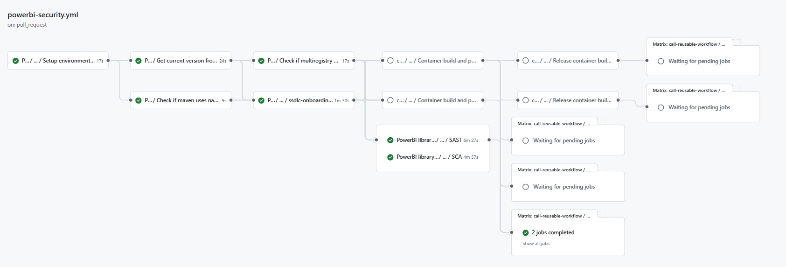

### Push to development

After approving the Pull Request from feature to `development`, a merge will be done. The merge actions does a *push* implicitly. This push event will trigger the powerbi-libs-ci.yml workflow automatically.

The PowerBI Library CI workflow is a comprehensive process that begins with setting up environment variables, which involves loading properties defined in the `properties.env` file and in the configuration project.

After setting the environment variables, the workflow will perform Maven build and Sonar analysis.

After the Maven build and sonar scan, it runs the reusable **Fortify SAST** workflow to perform a SAST scan with Fortify and validate the quality gates, and sends SAST analysis data to Elasticsearch.
The workflow also executes the reusable **Sonatype SCA** workflow to perform a Sonatype SCA scan. The next step involves **CERT** environment deployment.

??? info "PowerBI Library CI workflow code"

    ```yaml linenums="1"
    name: PowerBI library CI

    on:
      push:
        branches:
          - development
          - develop
          - feature/*
          - fix/*
    
    jobs:
      call-reusable-workflow:
        name: PowerBI library CI workflow
        uses: santander-group-shared-assets/gln-workflows/.github/workflows/maven-ci-library.yml@v1
        secrets: inherit

    ```
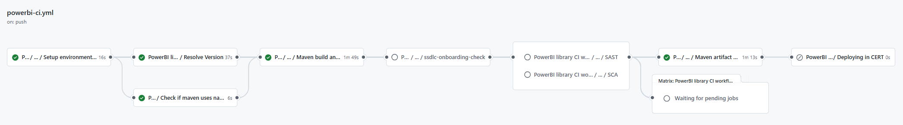

- **Setup environment variables**: Load the properties defined in properties.env file and in the configuration project.
- **Resolve Version**: Loads and builds the version of the current deployment.
- **Check if maven uses native build**: Check if native is used.
- **Maven build and Sonar scan**: Executes the default commands of MAVEN_BUILD_GOAL: clean verify.
- **SSDLC Onboarding Check**: Check component and version in Fortify and create it in case it does not exist.
- **SAST**: Executes the reusable Fortify SAST workflow to perform a SAST scan with Fortify and validate the quality gates.
- **SCA**: Executes the reusable The Sonatype SCA workflow to perform a Sonatype SCA scan and analyze third party components from a repository.
- **Send information to Elasticsearch**: Send data to elasticsearch related with SAST and SCA analysis.
- **Upload Nexus**: Uploads the repository files as artifact to Nexus.
- **Deploying in CERT**: Executes the CD workflow.

### Pull Request from development to main

When it's time to release the library, we initiate a Pull Request from the integration branch: develop/development to the main/master branch.

This action triggers the powerbi-libs-quality.yml (Sonar) and powerbi-libs-security.yml (Fortify & Sonatype) workflows. defined in the **Pull Request from feature to development** section.

### Push to main

After approving the Pull Request from development to main, a merge will be done. The merge actions does a *push* implicitly. This push event will trigger the powerbi-release.yml workflow automatically.

This workflow begins by setting up environment variables, loading properties defined in the `properties.env` file and in the configuration project, which is obtained according to the defined secrets.

After setting the environment variables, the workflow will perform Maven build and Sonar analysis.
 and then prepares the release candidate by updating the version in the branch (main or master), getting the next release version, and getting the last commit in the branch.

The workflow executes Maven build and Sonar scan, followed by the reusable **Fortify SAST** workflow is executed to perform a SAST scan with Fortify and validate the quality gates. SAST analysis data is sent to Elasticsearch.
The workflow also executes the reusable **Sonatype SCA** workflow to perform a Sonatype SCA scan and analyze third-party components from a repository.
A new tag for release is created, and finally, a new draft **release is created** and the check set is selected as a pre-release tag for release.

??? info "PowerBI Library Release workflow code"

    ```yaml linenums="1"
    name: PowerBI library release

    on:
      push:
        branches:
          - main
          - master
      release:
        types: [published]
          
    jobs:
      cal-reusable-workflow:
        name: PowerBI library release workflow
        uses: santander-group-shared-assets/gln-workflows/.github/workflows/maven-rl-library.yml@v1
        secrets: inherit
    ```
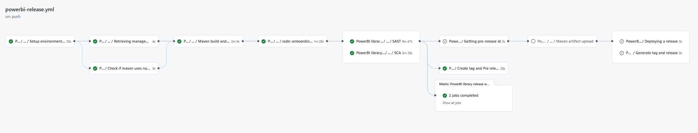

- **Setup environment variables**: Load the properties defined in properties.env file and in the configuration project.
- **Retrieving management assurance information**: Retrieve information about quality and security management.
- **Check if maven uses native build**: Check if native is used.
- **SSDLC Onboarding Check**: Check component and version in Fortify and create it in case it does not exist.
- **Check if multiregistry and dockerfile exists**:  
- **SAST**: Executes the reusable Fortify SAST workflow to perform a SAST scan with Fortify and validate the quality gates.
- **SCA**: Executes the reusable The Sonatype SCA workflow to perform a Sonatype SCA scan and analyze third party components from a repository.
- **Send information to Elasticsearch**: Send data to elasticsearch related with SAST and SCA analysis.
- **Create tag and Pre release**: Create a new tag for Release.
- **Getting pre-release id**: Get the pre release id and select the check Set as a pre-release tag for Release.
- **Maven artifact upload**: Uploads the repository files as artifact to Nexus.
- **Deploying a release**: Executes the CD workflow.
- **Generate tag and release**: Generate final release tag and publish it.

## CD - SCFGS

### Configuration files

#### deployment.json

The `deployment.json` file contains the necessary information to perform a deployment in a defined environment. To configure it correctly, please, refer to [06 JSON Configuration - Deployment](https://san-sc-we.atlassian.net/wiki/spaces/arq/pages/87694293/06+JSON+Configuration+-+Deployment).

Find below a `deployment.json` example file. Make sure to replace the existing values with the corresponding one for the project.

```json title="PowerBI Library Deployment example" linenums="1"
{
  "cert": {
    "nameWorkspace": "",
    "reports": [
      {
        "nameReport": "",
        "pathLocalReport": "./reports/XXXX.pbix",
        "datasourceId": "",
        "nameDatasource": "",
        "parameters": [
        ],
        "refreshSchedule" : {
          "enabled": true,
          "notifyOption": "NoNotification",
          "days": [
          ],
          "times": [
          ],
          "localTimeZoneId": "UTC"
        },
        "waitForResultOfRefresh": false
      }
    ]
  },
  "pre": {
    "nameWorkspace": "",
    "reports": [
      {
        "nameReport": "",
        "pathLocalReport": "./reports/XXXX.pbix",
        "datasourceId": "",
        "nameDatasource": "",
        "parameters": [
        ],
        "refreshSchedule" : {
          "enabled": true,
          "notifyOption": "NoNotification",
          "days": [
          ],
          "times": [
          ],
          "localTimeZoneId": "UTC"
        },
        "waitForResultOfRefresh": false
      }
    ]
  },
  "pro": {
    "nameWorkspace": "",
    "reports": [
      {
        "nameReport": "",
        "pathLocalReport": "./reports/XXXX.pbix",
        "datasourceId": "",
        "nameDatasource": "",
        "parameters": [
        ],
        "refreshSchedule" : {
          "enabled": true,
          "notifyOption": "MailOnFailure",
          "days": [
          ],
          "times": [
          ],
          "localTimeZoneId": "UTC"
        },
        "waitForResultOfRefresh": false
      }
    ]
  }
}
```

#### pom.xml

This file is used to build and versionate the project. Application library dependences can be expecified.

```xml title="PowerBI Library pom example" linenums="1"
<project xmlns="http://maven.apache.org/POM/4.0.0" xmlns:xsi="http://www.w3.org/2001/XMLSchema-instance"
  xsi:schemaLocation="http://maven.apache.org/POM/4.0.0 http://maven.apache.org/xsd/maven-4.0.0.xsd">
  <modelVersion>4.0.0</modelVersion>
  
    <groupId></groupId>
    <artifactId></artifactId>
    <version>1.0.0</version>
    <packaging>pom</packaging>
    <build>
        <plugins>
            <plugin>
                <artifactId>maven-assembly-plugin</artifactId>
                <version>3.2.0</version>
                <executions>
                    <execution>
                        <id>Create Powerbi distribution package</id>
                        <configuration>
                            <finalName>${project.artifactId}-${project.version}</finalName>
                            <appendAssemblyId>false</appendAssemblyId>
                            <descriptors>
                                <descriptor>assembly${file.separator}assembly_full.xml</descriptor>
                            </descriptors>
                        </configuration>
                        <phase>package</phase>
                        <goals>
                            <goal>single</goal>
                        </goals>
                    </execution>
                </executions>
            </plugin>
            <plugin>
                <groupId>org.apache.maven.plugins</groupId>
                <artifactId>maven-deploy-plugin</artifactId>
                <version>2.8.2</version>
            </plugin>
        </plugins>
    </build>
</project>
```

Where:

- **groupId** The name of the repository of nexus.
- **artifactId** The name of the artifact file.
- **version** The version number of the artifact.

#### assembly_full.xml

Property file to assembly the application.

```xml title="PowerBI Library assembly example" linenums="1"
<?xml version="1.0" encoding="UTF-8"?>
<assembly
    xmlns="http://maven.apache.org/plugins/maven-assembly-plugin/assembly/2.4"
    xmlns:xsi="http://www.w3.org/2001/XMLSchema-instance"
    xsi:schemaLocation="http://maven.apache.org/plugins/maven-assembly-plugin/assembly/2.4 http://maven.apache.org/xsd/assembly-2.4.xsd">

    <id>FullPowerBIZip</id>
    <formats>
        <format>zip</format>
    </formats>
    <includeBaseDirectory>false</includeBaseDirectory>
    <fileSets>
        <fileSet>
            <directory>${project.basedir}</directory>
            <outputDirectory></outputDirectory>
              <excludes>
                <exclude>assembly/**</exclude>
                <exclude>target/**</exclude>
                <exclude>.github/**</exclude>
                <exclude>Jenkinsfile</exclude>
                <exclude>.gitignore</exclude>
                <exclude>pom.xml</exclude>
              </excludes>
          </fileSet>
    </fileSets>
</assembly>
```

### Release PowerBI Library

After the draf release has been created, the release can be marked as a release. This triggers the powerbi-release.yml workflow automatically.

This workflow begins by setting up environment variables, loading properties defined in the `properties.env` file and in the configuration project, which is obtained according to the defined secrets.

After setting the environment variables, the workflow will upload the artifact to Nexus repository, and then modifies the release name to the final version.

??? info "PowerBI Library Release workflow code"

    ```yaml linenums="1"
    name: PowerBI library release

    on:
      push:
        branches:
          - main
          - master
      release:
        types: [published]
          
    jobs:
      cal-reusable-workflow:
        name: PowerBI library release workflow
        uses: santander-group-shared-assets/gln-workflows/.github/workflows/maven-rl-library.yml@v1
        secrets: inherit
    ```

PowerBI library release workflow steps

- To release the PowerBI library, the required release must be chose.

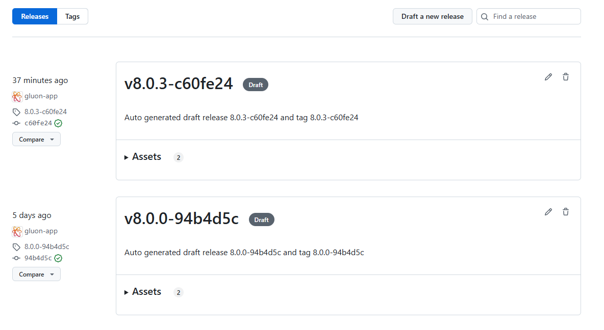

- Click on the `edit` button (pencil).

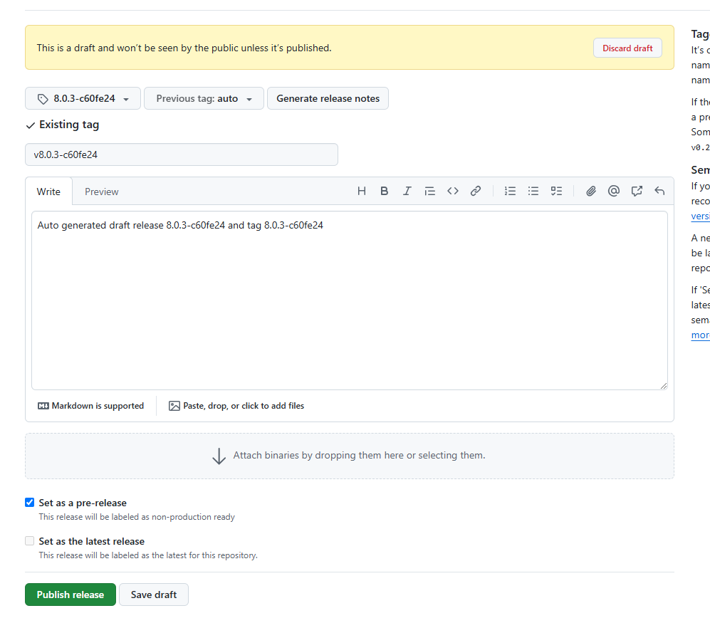

- Uncheck the `Set as a pre-release` checkbox and click `Publish release` button.

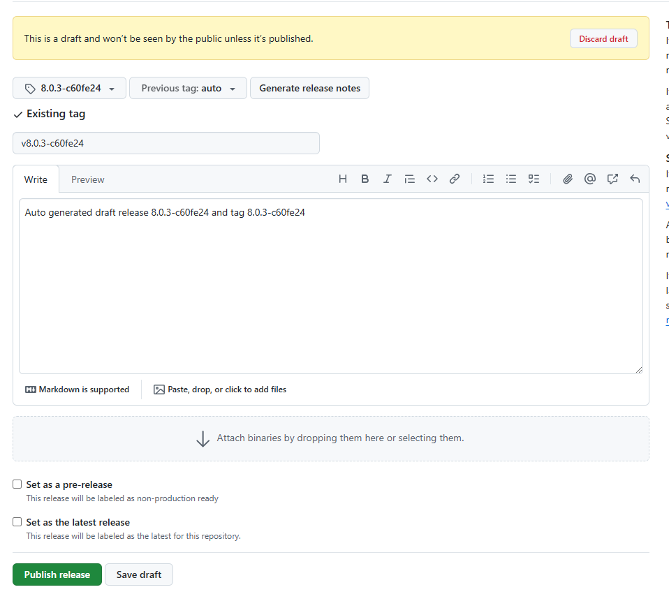

- Release published.

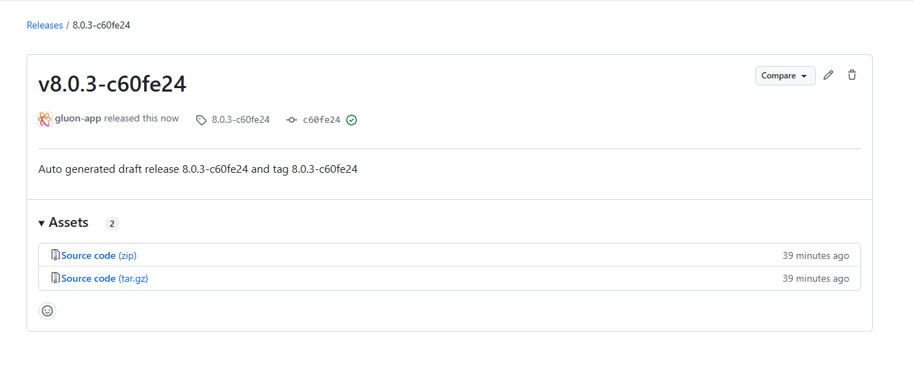

This release publish action, will trigger powerbi-release.yml workflow automatically.

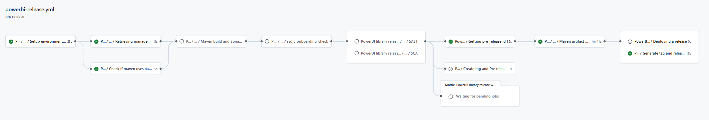

Once the workflow finished, the artifact will be available in [Nexus](https://nexusmaster.alm.europe.cloudcenter.corp/#browse/browse:maven-releases).

## **Repository**

### Structure

The PowerBI Library repository must follow the structure defined below to work:

``` bash
📦
 ┣ 📂envs
 ┃ ┣ 📜properties.env
 ┣ 📂.github
 ┃ ┣ 📂workflows
 ┃ ┃ ┣ 📜powerbi-ci.yml
 ┃ ┃ ┣ 📜powerbi-quality.yml
 ┃ ┃ ┣ 📜powerbi-release.yml
 ┃ ┃ ┗ 📜powerbi-security.yml
 ┃ ┗ 📜CODEOWNERS
 ┣ 📂reports
 ┃ ┣ 📜.gitkeep
 ┃ ┗ 📜your_report.pbix
 ┣ 📂assembly
 ┃ ┗ 📜assembly_full.xml
 ┣ 📜deployment.json
 ┣ 📜pom.xml
 ┗ 📜README.md
```
