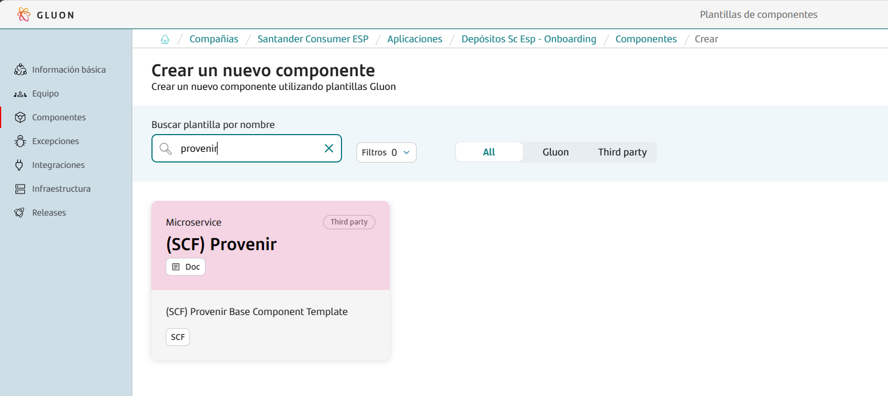
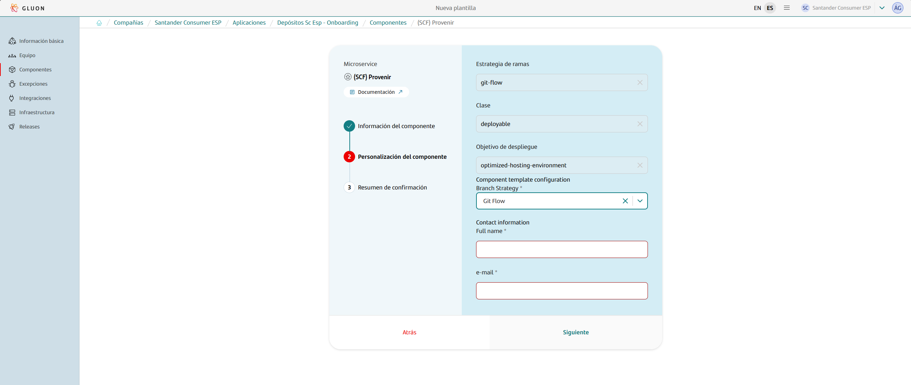

This base component template serves as a comprehensive guide for building and deploying Provenir projects within the Gluon portal.
It streamlines the entire process, providing a clear and efficient pathway from development to deployment.

In this documentation, users will find detailed instructions, best practices, and examples to effectively utilize the workflow for their microservices.
This includes guidance on setting up the project, configuring essential files, managing dependencies, and deploying the microservice.

The deployment process for Provenir projects involves performing an export version in the development environment.
For pre-production and production environments, the process includes importing the version and restarting the pods with the artifact downloaded from Nexus.
This ensures that the latest version of the application is consistently deployed across all environments.

While it is a brownfield project, we leverage Gluon's SonarQube, Sysdig, and Fortify for code quality and security analysis, rather than using our own tools directly.

Whether you are starting from scratch or integrating into an existing project, this guide will provide the necessary steps to ensure a smooth and efficient development and deployment process for Provenir projects.

## Create Component

### Gluon Portal

To begin, you must onboard your application. This involves setting up your application within the system. Once your application is successfully created and onboarded, you can proceed to create your component.

To create a component, follow these detailed steps:

1. **Select the Component Type**:
    First, you need to choose the type of component you wish to create. In this case, select `(SCF) Provenir`.

    

2. **Fill in Component Details**:
    Next, you will be prompted to fill in the necessary details for your component. This includes:
    - **Name**: Provide a unique and descriptive name for your component.
    - **Short Name**: Short names can only contain capital letters and digits.
    - **Description**: Write a detailed description that explains the purpose and functionality of the component.
    - **Branch Strategy**: Choose a branch strategy for your component's repository. The recommended branch strategy for this template is `git flow`, which helps in managing the development workflow efficiently.
    - **Contact Information**: Provide the contact information for the person responsible for the component. Include the name and email address.

    

3. **Component Creation**:
    After filling in the required details, proceed to create the component. Once the component is created, you will notice that a new repository is generated under your application.
    This repository will have the name of your component and will be integrated with SonarQube for code quality analysis and Fortify for security analysis.

By following these steps, you will have successfully created a new component. This component will be ready for further development within the GitHub repository.

### Component Repository

When creating a component from scratch, a scaffolding workflow runs automatically and creates the structure of the repository with the development branch, including all configuration files and workflows.

???+ warning "Scaffolding Note"

      Sometimes the scaffolding doesn't trigger automatically, so it needs to be launched manually from the actions tab.

#### Branches

{!
   include-markdown "./snippets/branch-structure.md"
   start="<!--Start Branch Structure-->"
   end="<!--End Branch Structure-->"
!}

#### Structure

The generated microservice has a structure similar to the following:

``` bash
📦
 ┣ 📂.github
 ┃ ┣ 📂workflows
 ┃ ┃ ┣ 📜cd.yml
 ┃ ┃ ┣ 📜ci.yml
 ┃ ┃ ┣ 📜quality.yml
 ┃ ┃ ┣ 📜release.yml
 ┃ ┃ ┣ 📜security.yml
 ┃ ┃ ┣ 📜update-component-workflow.yml
 ┃ ┃ ┗ 📜version-validation.yml
 ┃ ┗ 📜CODEOWNERS
 ┣ 📂.gluon
 ┃ ┣ 📂ci
 ┃ ┗ ┗ 📜properties.env
 ┣ 📜deployment.yml
 ┣ 📜VERSION
 ┗ 📜pom.xml
```

## Component Configuration

This section provides an overview of the necessary configurations for integrating the Gluon component into your project. It covers the required branches and essential configuration files to ensure smooth CI/CD processes.

### Configuration Files

This base component template works with some configuration files that may need some modifications:

- `properties.env`: Properties with the CI/CD configuration.
- `VERSION`: Version configuration file.
- `deployment.yml`: file to define the CD deploy procsess.
- `pom.xml`: Java configuration file.

#### Properties

The **properties.env** file contains the configuration settings for the CI/CD pipeline and is generated automatically.
This file includes essential parameters that are required for various stages of the pipeline, such as Sonar and Fortify project keys, Java version, and Maven deployment arguments.
By default, the file configures parameters like `SONAR_PROJECT_KEY`, `FORTIFY_PROJECT`, `JAVA_VERSION`, and `ARTIFACT_NATIVE_COMPILATION`.
These settings ensure that the pipeline has the necessary information to perform code quality checks, security scans, and build processes.

=== "Default"

    ```properties
        # Sonar parameters
        SONAR_PROJECT_KEY=""

        # Fortify parameters
        FORTIFY_PROJECT=""

        # JVM using to build the project
        JAVA_VERSION="adoptopenjdk-17.0.8+7"
        MAVEN_DEPLOY_ARGS=""

        # Active native compilation
        ARTIFACT_NATIVE_COMPILATION="false"

        # Maven additional parameters
        MAVEN_BUILD_GOAL=""
    ```

Additionally, the **properties.env** file includes detailed configurations for Sonar, such as the Sonar instance name, project key, report path, memory properties, and Elasticsearch settings.
These configurations are crucial for integrating SonarQube into the CI/CD pipeline, enabling comprehensive code analysis and reporting.
The naming convention for project names in Sonar and Fortify must match the component repository name to avoid errors. The file is generated with the necessary values for `SONAR_PROJECT_KEY` and `FORTIFY_PROJECT` to ensure consistency and accuracy.
The parameters that are configured by default are:

=== "Properties.env"

    | **Variable**        | **Required** | **Description** | **Example value**               |
    |---------------------|--------------|-----------------|---------------------------------|
    | **SONAR_PROJECT_KEY** | true         | Project key in Sonar | sgt-gluonad-probemicroframework |
    | **FORTIFY_PROJECT** | true         | Project name in Fortify | sgt-gluonad-probemicroframework |
    | **JAVA_VERSION** | true         | Java version to use | 20.12.0 |
    | **DOCKER_BUILD_ARGUMENTS** | false        | Docker arguments for Docker Build | "" |

=== "SONAR Configuration"

    | Property             | Required   | Description                         | Example |
    |----------------------|------------|-------------------------------------|---------------|
    | SONAR_ID             | false      | The name of the Sonar instance to be used. This value is unique and its value will be 'SONAR_GLUON_COMMUNITY'   | 'SONAR_GLUON_COMMUNITY' |
    | SONAR_PROJECT_KEY    | true       | Project key that's created in the sonar instance | "ccc:ccc:test-project:mvn-immutable-test" |
    | SONAR_REPORT_PATH    | false      | Location where the scanner writes the report-task.txt  | 'target/site' |
    | SONAR_MEMORY_PROPERTIES | false   | Memory properties                   | '-Xmx256m' |
    | ELASTICSEARCH_API_URL | true      | Elasticsearch api url with protocol | `https://[url]` |
    | ELASTICSEARCH_ALIAS   | true      | Elastic Search index                | 'index-x' |
    | ELASTICSEARCH_TYPE    | true      | Elasticsearch type                  | '_doc' |
    | QG_ENABLED    | false      | Enables or disables Sonar, Fortify, and Sonatype scans in CI, with 'high' for blocking, 'none' for non-blocking, and empty to skip scans.                  | 'high' |

???+ info "Naming convention"

    The project name in **Sonar** and **Fortify** must be the same as the component repository name.
    To avoid possible errors, the **properties.env** file is generated with the necessary values for the variables **SONAR_PROJECT_KEY** and **FORTIFY_PROJECT**.

    Example values:

    SONAR_PROJECT_KEY="sgt-gluonad-probemicroframework"

    FORTIFY_PROJECT="sgt-gluonad-probemicroframework"

#### VERSION File

The `VERSION` file is a simple text file that contains the version of the project. This file is used to track the current version of the project in a straightforward manner.

**Example of a `VERSION` file:**

```txt
1.0.0
```

**Customizing the `VERSION` file:**
Users using this template may need to update the version string to match their project's specifics. The version string should follow semantic versioning conventions, such as `MAJOR.MINOR.PATCH` (e.g., `1.0.0`).

If users already have a `VERSION` file, they can update the version string as needed to reflect the current state of their project.

#### Deployment.yaml

The `deployment.yaml` file is used to define the continuous deployment (CD) process for different environments.
This file specifies the necessary fields for each environment, ensuring that the deployment process is tailored to the specific requirements of each stage, such as CERT (certification), PRE (pre-production), and PRO (production).

Use this file to define for each environment the necessary fields for the CD process such in the following example:

``` yaml
environments:
  CERT:
    NodeCERT1:
      repository_url:
      provenir_env: CERT
      project:
      provenir_credentials:
  PRE:
    NodePRE1:
      repository_url:
      provenir_env: PRE
      project:
      provenir_credentials:
      ocp_server:
      ocp_credentials:
      oc_project:
      oc_deployment:
    NodePRE2:
      repository_url:
      provenir_env: PRE
      project:
      provenir_credentials:
      ocp_server:
      ocp_credentials:
      oc_project:
      oc_deployment:
  PRO:
    NodePRO1:
      repository_url:
      provenir_env: PRO
      project:
      provenir_credentials:
      ocp_server:
      ocp_credentials:
      oc_project:
      oc_deployment:
    NodePRO2:
      repository_url:
      provenir_env: PRO
      project:
      provenir_credentials:
      ocp_server:
      ocp_credentials:
      oc_project:
      oc_deployment:
```

#### pom.xml

The `pom.xml` file is a crucial component of any Maven-based Java project. It serves as the manifest file for the project, containing metadata relevant to the project such as the project name, version, description, main class, dependencies, and more.
This file allows Maven to manage the project's dependencies and build lifecycle efficiently.

**Key Sections of `pom.xml`:**

 - **groupId**: The group ID of your project.
 - **artifactId**: The artifact ID of your project.
 - **version**: The current version of your project.
 - **name**: The name of your project.
 - **description**: A brief description of your project.
 - **dependencies**: Packages required for the project to run.
 - **build**: Configuration for building the project, including plugins and resources.

**Customizing `pom.xml`:**
Users using this template may need to update the `groupId`, `artifactId`, `version`, `name`, and `description` fields to match their project's specifics.
Additionally, they might need to add or modify dependencies and build configurations to suit their project's requirements.
If users already have a `pom.xml` file, they can merge the dependencies and build configurations from the template with their existing file.

### Secrets Configuration

In order to have your artifact uploaded to Nexus `NEXUS_USERNAME` and `NEXUS_PASSWORD` must be added as repository secrets within the repository.

To do so, go to Settings > Security > Secrets and variables > Actions and add the following secrets at “Repository secrets” level.

It’s also necessary to set your openshift token as `OCP_TOKEN` as well as your provenir credentials as `PROVENIR_USER` and `PROVENIR_PASSWORD` that are used in the CD process to deploy.

## Application Lifecycle Management: How to build and deploy

{!
   include-markdown "./snippets/provenir-git-flow-lifecycle.md"
   start="<!--Start Flow-->"
   end="<!--End Flow-->"
!}

## Contact Information and Support

{!
   include-markdown "./snippets/contact-information.md"
   start="<!--Start-->"
   end="<!--End-->"
!}
