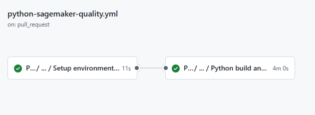
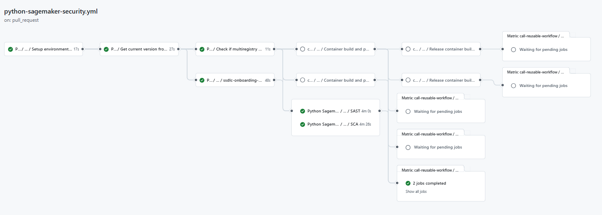
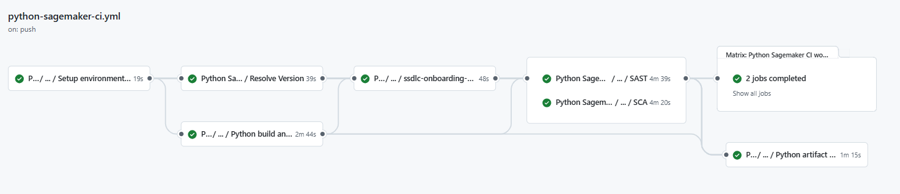
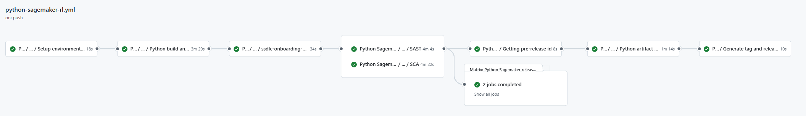
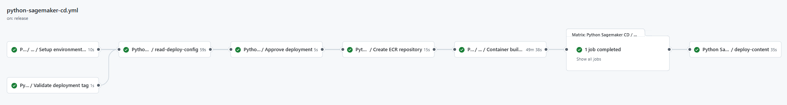

This base component template serves as a comprehensive guide for building and deploying Python scripts to S3 bucket and Docker image building within the Gluon portal.
It streamlines the entire process, providing a clear and efficient pathway from development to deployment.

This documentation specifically focuses on Python Sagemaker components and the layer of customization with specific Python Sagemaker configuration files.

In this documentation, users will find detailed instructions, best practices, and examples to effectively utilize the Python Sagemaker workflow.
This includes guidance on setting up the project, configuring essential files, managing dependencies, and deploying the Python scripts and Docker image.

## Prerequisites: AWS Credentials Request

For this pipeline to work correctly, you need to request a role + OIDC.
Note that this pipeline requires special attention so make sure to read [this section](../support/credentials/special.md).

## Introduction

The goal of this documentation is to provide guidance on how to build a Python package, upload it to an AWS S3 bucket and build a Docker image if needed.

This guide will allow you to understand how to build and deploy through a CI/CD process.

## Git Flow Lifecycle

{!
   include-markdown "./snippets/git-flow-lifecycle.md"
   start="<!--Start Flow-->"
   end="<!--End Flow-->"
!}

## Create Component

### Gluon Portal

{!
   include-markdown "./snippets/create-component-gluon.md"
   start="<!--Start creation-->"
   end="<!--End creation-->"
!}

### Python Sagemaker Template

#### Branches

{!
   include-markdown "./snippets/branch-structure.md"
   start="<!--Start Branch Structure-->"
   end="<!--End Branch Structure-->"
!}

#### Structure

The generated Python Sagemaker has a structure similar to the following:

##### Python Sagemaker Structure

``` bash
📦
 ┣ 📂envs
 ┃ ┣ 📜properties.env
 ┣ 📂.github
 ┃ ┣ 📂workflows
 ┃ ┃ ┣ 📜python-sagemaker-cd.yml
 ┃ ┃ ┣ 📜python-sagemaker-ci.yml
 ┃ ┃ ┣ 📜python-sagemaker-quality.yml
 ┃ ┃ ┣ 📜python-sagemaker-rl.yml
 ┃ ┃ ┗ 📜python-sagemaker-security.yml
 ┃ ┗ 📜CODEOWNERS
 ┣ 📂src
 ┃ ┗ your code
 ┣ 📂resources
 ┃ ┗ optional resource files
 ┣ 📜deployment.yaml
 ┣ 📜requirements.txt
 ┣ 📜setup.py
 ┗ 📜README.md
```

## Component Configuration

### Branches

Gluon works with two branches that will need to be incorporated into our project:

* The main branch (main by default or master in old projects)
* The integration branch (development/develop by default)
This is because the workflows works with GitFlow strategy, so we need to have the integration branch to merge the feature branches and create the Pull Request to the main branch.

### Configuration Files

This base component template works with some configuration files that may need some modifications:

* deployment.yaml: Configuration for deploying the application.
* requirements.txt: Lists the dependencies required for the project.
* setup.py: Script for setting up the package, including dependencies and metadata.

### Deployment.yml

The deployment.yml file is a configuration file used to define deployment settings for different environments such as DEV, PRE, and PRO.
Each environment section specifies parameters like S3BUCKET_NAME, which is the name of the S3 bucket where deployment artifacts will be stored, and TARGET_FOLDER, which is the folder within the S3 bucket where these artifacts will be placed.
The OVERWRITE parameter indicates whether existing files should be overwritten (0 for no, 1 for yes), and IS_PUBLIC determines if the files should be publicly accessible (0 for no, 1 for yes).
To configure this file, you need to replace the placeholder values with actual values specific to your deployment environment.
This setup ensures that the deployment process is consistent and tailored to the requirements of each environment, facilitating a smooth and controlled deployment workflow.

If `REGISTRY_DEPLOY` is set to true an image will be deployed to an ECR Registry.

```yaml
KMS_KEY:
S3BUCKET_NAME:
TARGET_FOLDER:
IS_PUBLIC: false
OVERWRITE: false
REGISTRY_DEPLOY: false
```

### Requirements.txt

The requirements.txt file is a standard file used in Python projects to list all the dependencies required for the project.
Each line in this file specifies a package and its version, ensuring that the project can be consistently replicated with the same dependencies across different environments.
To configure it, you simply list each dependency on a new line, optionally specifying a version number using comparison operators like == for an exact version, >= for a minimum version, or <= for a maximum version.
For example, requests==2.25.1 ensures that version 2.25.1 of the requests library is installed. This file is typically used with package managers like pip to install all the dependencies at once by running pip install -r requirements.txt.
This approach helps maintain a consistent development environment and simplifies dependency management.

```bash
--trusted-host nexus.alm.europe.cloudcenter.corp
--trusted-host nexusmaster.alm.europe.cloudcenter.corp
--index https://nexus.alm.europe.cloudcenter.corp/repository/pypi-public/
--index-url https://nexus.alm.europe.cloudcenter.corp/repository/pypi-public/simple/

# all libraries must be defined below
```

### Setup.py

The setup.py file is a crucial script used for packaging and distributing Python projects. It contains metadata about the project, such as its name, version, author, and dependencies.
This metadata is used by tools like pip to install the project and its dependencies correctly. In the provided example, the script is actually a Bash script embedded within a Python code block, which is unusual for a setup.py file.
This script sets the SONAR_PROJECT_KEY and FORTIFY_PROJECT in a properties.env file. It checks if the properties.env file exists and verifies that the sonar_project_key and fortify_project parameters are not empty.
If these checks pass, it updates the properties.env file with the provided values. To configure this script, you need to provide the sonar_project_key and fortify_project as arguments when running the script.
This setup ensures that the necessary environment variables are correctly set for tools like SonarQube and Fortify, which are used for code quality and security analysis.

```python
from setuptools import setup

setup(
    name="",
    version="1.0.0"
)
```

### Dockerfile

This is an optional file, if present in the root folder, the workflow will try to build a Docker image.

```Dockerfile
FROM base_image_url
```

Where:

* **base_image_url** The base image to use to build the docker image.

### multiregistry.json

This is an optional file, required if Dockerfile is present in the root folder, it defines the registry deployment required variables.

???+ info "Note"

    By default, the SCF Python Sagemaker component does not upload images to an ECR.
    However, if this functionality is required, a role must be created and defined in the `multiregistry.json` file under the "awsRoleName" field.
    In order to create the role follow this [guide](../support/credentials/ecr.md)

```json
[
  {
    "environment": "pro",
    "registries": [
      {
        "registry-type":"ecr",
        "awsRegion": "",
        "repository": "",
        "awsAccount": "",
        "awsRoleName": "",
        "kms": ""
      }
    ]
  }
]
```

Where:

* **environment** The environment of the deployment, can be only **pro**.
* **registries** The list of registries to deploy.
* **registry-type** The type of the registry to deploy the image.
* **awsRegion** The AWS region name of the registry if registry-type is **ecr**.
* **repository** The image destination name, must follow the format **namespace/image_name**.
* **awsAccount** The AWS account id.
* **awsRoleName** AWS role name needed for uploading the image to the ECR registry.
* **kms** The AWS registry KMS key id.

### Variables configuration

As in the CI workflow, the CD one relies on 1 environment variables needed to function correctly.
These variables must be defined in the Environment variables section inside the repository settings. Find below the list of required variables:

#### Environment variables configuration

| **Variable name**     | **Description**     |
| --------------------- | ------------------- |
| AWS_ACCOUNT_ID        | The AWS account id. |

???+ abstract "How to add a new environment variable?"

      {!
        include-markdown "./snippets/variables-global.md"
        start="<!--Start Add Environment Variables-->"
        end="<!--End Add Environment Variables-->"
      !}

## Build and Deploy your application

Now we are going to describe the steps that a user has to perform in order to make a complete cycle, from the construction process (CI) to the deployment through the PRO environments (CD)

The cycle explained below is based on **GitFlow**.

### Quality Gates

We want our code to have the maximum quality in Gluon prior to deployment to production environment, so it will be necessary to have the OK in:

* **Sonar**: Code Quality and test coverage.
* **Fortify**: Analysis of the vulnerabilities of our source code.
* **Sonatype**: Analysis of the vulnerabilities of our dependencies.

### Pull Request from Feature to Develop

We will start working on the "Feature" branches of our GitHub repository and we will be integrating our changes into the integration branch (develop or development).

When we create the **Pull Request** event from our **"Feature" branch to the integration branch** (develop or development), the python-sagemaker-quality.yml (Sonar) and python-sagemaker-security.yml (Fortify & Sonatype) workflows will be executed automatically.

Next we detail which steps are executed in each of these two workflows:

#### Python Sagemaker quality gate workflow

* **Setup environment variables**: Load the properties defined in properties.env file and in the configuration project.
* **Python build & Sonar scan**: Executes the default commands to build Python.



??? info "Python quality gate workflow code"

    ```yaml linenums="1"
    name: Python Sagemaker quality

    on:
    pull_request:
      branches:
        - development
        - develop
        - main
        - master
          
    jobs:
    call-reusable-workflow:
      name: Python Sagemaker quality ${{ github.ref }}
      uses: santander-group-shared-assets/gln-workflows/.github/workflows/python-quality-image.yml@v1
      secrets: inherit
    ```

#### Python Sagemaker security workflow

* **Setup environment variables**: Load the properties defined in properties.env file and in the configuration project.
* **Get current version from setup.py**: Obtain current version from setup.py.
* **SSDLC Onboarding Check**: Check component and version in Fortify and create it in case it does not exist.
* **Check if multiregistry and dockerfile exists**: Check if multiregistry.json and Dockerfile is present in the repository.
* **SAST**: Executes the reusable Fortify SAST workflow to perform a SAST scan with Fortify and validate the quality gates.
* **SCA**: Executes the reusable The Sonatype SCA workflow to perform a Sonatype SCA scan and analyze third party components from a repository.
* **Container build and push**: Build Docker image and scans it using Sysdig.
* **Send data to data search engine tool**: Send data to elasticsearch related with SAST and SCA analysis.

??? info "Python Sagemaker security workflow code"

    ```yaml linenums="1"
    name: Python Sagemaker security

    on:
      pull_request:
        branches:
          - development
          - develop
          - main
          - master

    jobs:
      call-reusable-workflow:
        name: Python Sagemaker security ${{ github.ref }}
        uses: santander-group-shared-assets/gln-workflows/.github/workflows/python-security-image.yml@v1
        secrets: inherit
    ```



### Push to Develop

When approving the Pull Request of the previous step on the integration branch (development/develop) we will generate a push event on this branch and therefore the python-sagemaker-ci.yml workflow will be executed automatically.

Next we detail which steps are executed in this workflow:

#### Python Sagemaker CI workflow

* **Setup environment variables**:Load the properties defined in properties.env file and in the configuration project.
* **Resolve version**: Resolve the version of the component.
* **Python build & Sonar scan**: Executes the default commands of PYTHON_BUILD_COMMAND=''
* **SSDLC Onboarding Check**: Check component and version in Fortify and create it in case it does not exist.
* **SAST**: Executes the reusable Fortify SAST workflow to perform a SAST scan with Fortify and validate the quality gates.
* **SCA**: Executes the reusable The Sonatype SCA workflow to perform a Sonatype SCA scan and analyze third party components from a repository.
* **Send information to Elasticsearch**: Send data to elasticsearch related with SAST and SCA analysis.
* **Python artifact upload**: Then pack the files in **src** folder, encrypting the tar.gz file using aws-encryption-cli, and finally, compress the required files using zip command and upload it to nexus.

??? info "Python Sagemaker CI workflow code"

    ```yaml linenums="1"
    name: Python Sagemaker CI

    on:
      push:
        branches:
          - development
          - develop
          - feature/*
          - fix/*
    
    jobs:
      call-reusable-workflow:
        name: Python Sagemaker CI workflow
        uses: santander-group-scfccoe/gln-workflows/.github/workflows/python-sagemaker-ci-artifact-gfw.yml@v1
        secrets: inherit
    ```


If everything works correctly, we will have our artifact uploaded to nexus.

### Pull Request from develop to main

When we are ready to promote our code to production, we will create a Pull Request from the integration branch (develop or development) to the main branch.

This event will launch the **python-sagemaker-quality.yml workflow** (Sonar), the **python-sagemaker-security.yml workflows** (Fortify & Sonatype).

### Push to main

When we approve the PR of the previous step on the main branch, we will generate a push event on this branch and therefore the **python-sagemaker-rl.yml** workflow will be executed automatically.

This workflow will create a commit with the release version in the main branch.

#### Python Sagemaker release workflow

This workflow contains all the steps from **python-sagemaker-ci.yml workflow** (Python build) and **python-sagemaker-security.yml workflow** (Security) plus:

* **Getting release id**: Get the release id.
* **Generate tag and release**: Generate a tag and release in the repository.

??? info "Python Sagemaker release workflow code"

    ```yaml linenums="1"
    name: Python Sagemaker release

    on:
      push:
        branches:
          - main
          - master
          
    jobs:
      cal-reusable-workflow:
        name: Python Sagemaker release workflow
        uses: santander-group-scfccoe/gln-workflows/.github/workflows/python-sagemaker-release-artifact-gfw.yml@v1
        secrets: inherit
    ```



### Python Sagemaker CD workflow

Once the tag and release is published, then workflow **python-sagemaker-cd.yml** will be triggered automatically. This workflow can also be triggered manually.

* **Setup environment variables**: Load the properties defined in properties.env file and in the configuration project.
* **Validate deployment tag**: Check if the execution is triggered using a tag.
* **Load deployment configuration**: Loads the required configurations from the setup.py, multiregistry.json and deployment.yaml files.
* **Approve deployment**: Wait for the approval of the required reviewer.
* **Create ECR repository**: Creates ECR repository if not exists and if needed.
* **Container build and push**: Builds the image and push it to registry.
* **Send build-push data to data search engine tool**: Send data to elasticsearch related with SAST and SCA analysis.
* **Deploy content**: Downloads the artifact, decrypt the files, check if the S3 bucket has the required tag **MODELS_SAGEMAKER** and finally upload the required files to S3 bucket.

??? info "Python Sagemaker CD workflow code"

    ```yaml linenums="1"
    name: Python Sagemaker CD

    on:
      workflow_dispatch:

      release:
        types: [released]
        
    jobs:
      call-reusable-workflow:
        name: Python Sagemaker CD
        uses: santander-group-scfccoe/gln-workflows/.github/workflows/python-sagemaker-cd.yml@v1
        secrets: inherit
    ```


If everything works correctly, we will have our code uploaded to the S3 bucket, and if required, the image uploaded to the registry.
