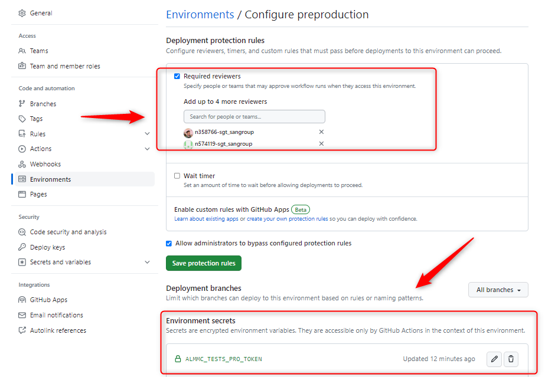
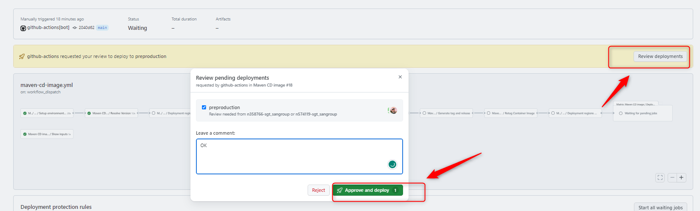

<!--Start Flow-->
Now we are going to describe the steps that a user has to perform in order to make a complete cycle, from the construction process (CI) to the deployment through the DEV, PRE and PRO environments (Apply). The cycle explained below is based on **GitFlow**

In the Git Flow model, developers start by creating a new branch off the `development` branch for each feature, named `feature/*`. Once the feature is complete, they create a pull request to merge the `feature/*`branch into `development`.
When opening the pull request, the **CI** workflow is executed automatically. If everything is satisfactory, the pull request is approved and the `feature/*` branch is merged into `development`.
When the `development` branch receives the push from the pull request the **CI** workflow is executed automatically. When ready for a new release, a pull request from `development` to `main` is created.
As in the `feature` branch, when opening the pull request, the **CI** workflow is executed automatically and if everything is in order, the pull request is merged, moving changes from `development` to `main`.
The code in main is now ready to be released, completing the lifecycle by running the **Release** workflow.

???+ warning "Note"

      Make sure to create your `feature/*` branch off the `development` branch as this branch contains all the necessary workflows and configuration files to run all workflows.

- **CI Workflow**: Executes whenever changes are pushed to the feature or development branches.
It includes jobs for setting up environment variables, making an ansible check, and running development in CERT.
- **Release Workflow**: Executes when changes are merged into the `main` branch.
It includes jobs for setting up environment variables, making an ansible check, scanning images, and tagging and releasing.
- **Validate version Workflow**: Includes jobs for setting up environment variables, retrieving the current version, and validating the release version.
- **Update Framework Workflow**: Used to update the component to the latest version of the template.
It includes jobs for setting up environment variables, retrieving the next version of the component template, updating the component, creating a pull request with the updates, and merging the pull request if there are no conflicts.
- **Apply Workflow**: Responsible for deploying the playbooks to the desired environment.
It includes jobs for resolving the playbook version, validating the deployment, summarizing deployment parameters, setting up environment variables, defining deployment regions, and deploying to CERT, PRE, and PRO environments.

???+ warning "Apply Workflow Note"

      Note that deployment to the PRO environment can only be executed from a tag (generated with the release workflow), deployment to the PRE environment can only be executed from a tag or the `main` branch,
      and deployment to the DEV environment can be executed from a tag, `main`, `development`, or `develop` branches.

### GitFlow Lifecycle

Note that is very important to follow the Git Flow of not working directly on the `development` branch, but instead working on `feature` branches and the overall workflow.

The full flow is described as follows:

#### 1. Edit in Feature or Fix Branch

When changes are made in a feature branch, the CI workflow is triggered without deploying to the `development` environment. Note that Fix and Feature branches must depend on the `development` branch, as they originate from it.

#### 2. Pull Request from Feature to Development

A pull request (PR) is created from the feature branch to the `development` branch. This triggers the CI workflow.

#### 3. Merge to Development

Once the PR is approved and merged into the `development` branch, the CI workflow is triggered,
and the Apply workflow is initiated for the `development` environment, this will result in the playbook being applied to the DEV environment.

#### 4. Pull Request from Development to Main

A PR is created from the `development` branch to the `main` branch. This triggers the CI workflow.

#### 5. Merge to Main

Once the PR is approved and merged into the `main` branch, the release workflow is triggered.
This generates a tag (e.g., `1.0.0`), and creates a release (e.g., `v1.0.0`).

#### 6. Manual Apply for Production and Preproduction environments

The Apply workflow for the PRE and PRO environments is manually triggered through workflow dispatch exclusively from a tag or main branch.

#### 7. Rollback

To perform a rollback execute the Apply workflow manually from the previous tag you want to restore in the environments where you want to perform the rollback.

Rollback is a manual process and should be executed carefully to ensure the integrity of the environments.

### CI Workflow

The CI workflow is executed whenever changes are pushed to the feature or development branches. It includes the following jobs:

By default, security checks are not executed for deployments in the `development` environment.

- **Setup Environment Variables**: Sets up necessary environment variables.
- **Resolve Version**: Obtains project's version from VERSION file.
- **Check Ansible**: Makes a Playbook check and checks syntax in DEV environment.
- **Ansible Artifact Upload**: Uploads ansible artifact.
- **Run Deployment in CERT**: CD is executed for DEV environment (this job is executed only in the `develop` and `development` branches, but not in the `feature` branches).

### Release Workflow

The release workflow is executed when changes are merged into the `main` branch. It includes the following jobs:

- **Setup Environment Variables**: Sets up necessary environment variables.
- **Check Ansible**: Makes a Playbook check and checks syntax in DEV environment.
- **Getting pre-release id**: Gets project's token and sets release version.
- **Ansible Artifact Upload**: Uploads ansible artifact.
- **Tag and Release**: Generates a tag and creates a release.

### Validate version Workflow

The Validate version workflow includes the following jobs:

- **Setup Environment Variables**: Sets up necessary environment variables.
- **Get Version**: Retrieves the current version.
- **Check Release**: Validates the release version.

### Updating your Component

To update your Component, follow these steps:

1. **Find your Component**: Go to the Components page, use the search bar to type the name of your Component, and click the button to go to the GitHub page.

2. **Open the Actions tab**: Once on the main page of your project, click on the 'Actions' tab located above the repository name.

3. **Identify the Update Component Workflow**: On the Actions page, you will see the latest workflow runs. In the upper left corner, you will find the list of workflows for this repository. Select the 'Update Framework' workflow.

4. **Execute the Update Component Workflow**: After selecting the workflow, a message will appear stating 'This workflow has a workflow_dispatch event trigger'. A new button labeled 'Run Workflow' will appear.
Click on this button, enter the version you want to update your Component to, and then click the green 'Run Workflow' button.

Under the `Pull requests` section inside your repository, a PR will be created with all the changes related to the specified version. You can review these changes and then click on 'Squash and Merge' to merge the PR.

### Apply Workflow

The Apply workflow is responsible for deploying the playbooks to the desired environment. It includes the following jobs:

- **Validate Deploy**: Ensures that the deployment parameters are correct and valid.
- **Setup Environment Variables**: Sets up necessary environment variables for deployment.
- **Deploy Params Summary**: Summarizes the deployment parameters for review.
- **Resolve Playbook Version**: Determines the version of the playbook to be deployed.
- **Deployment Regions Matrix**: Defines the regions where the playbook will be applied.
- **Deploy in Region CERT**: Applies the playbook to the CERT environment.
- **Deploy in Region PRE**: Applies the playbook to the PRE environment.
- **Deploy in Region PRO**: Makes an playbook check, checks syntax and applies the playbook to the PRO environment.

Note that it's important to have a validation before applying for each environment due to protection rules.

#### Protection Rules

When trying to deploy to the `PRE` or `PRO` environment, protection rules are enforced. Only authorized reviewers can approve the deployment.
To check the list of allowed reviewers, go to the `environment configuration` under the `settings` tab of your repository.

Just before deploying to the `PRE` or `PRO` environment, the workflow stops and waits for a reviewer to approve the pending deployment.
To approve it, click on `Review Deployments` on the top right part of the workflow summary screen, set a comment, and approve the deployment.

<!--End Flow-->
