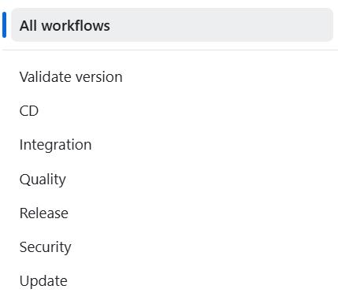
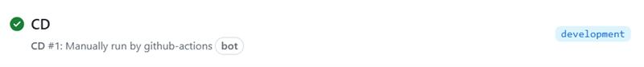
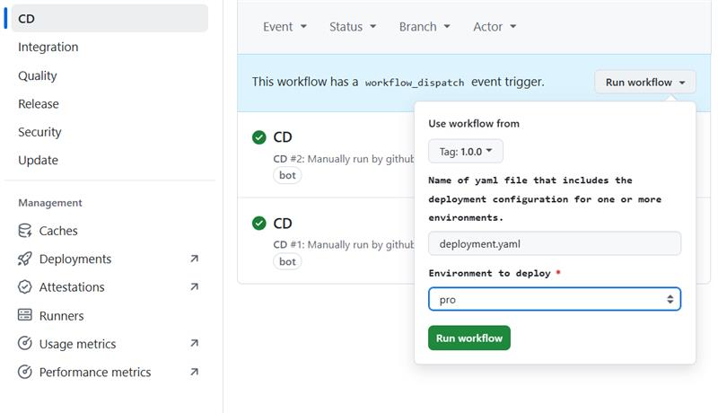
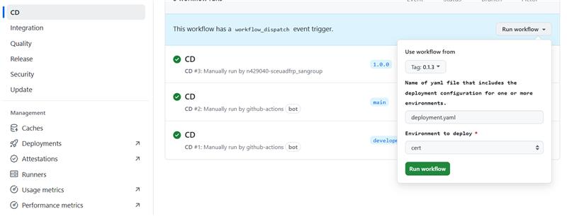
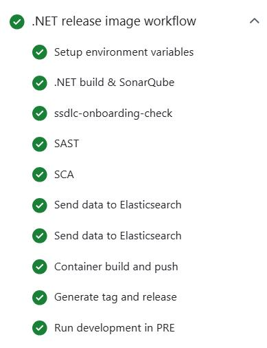

<!--Start Flow-->
Now we are going to describe the steps that a user has to perform in order to make a complete cycle, from the construction process (CI) to the deployment through the DEV, PRE and PRO environments (CD). The cycle explained below is based on **GitFlow**

The scaffolding generates a set of workflows:

In the Git Flow model, developers start by creating a new branch off the `development` branch for each feature, named `feature/*`. Once the feature is complete, they create a pull request to merge the `feature/*`branch into `development`.
When opening the pull request and the pull request is approved and the `feature/*` branch is merged into `development`.
When the `development` branch receives the push from the pull request the **CI** workflow is executed automatically. When ready for a new release, a pull request from `development` to `main` is created.
As in the `feature` branch, when opening the pull request and the pull request is merged, it moves changes from `development` to `main`.
The code in main is now ready to be released, completing the lifecycle by running the **RC** workflow.

???+ warning "Note"

      Make sure to create your `feature/*` branch off the `development` branch as this branch contains all the necessary workflows and configuration files to run all workflows.

- **CI Workflow**: Executes whenever changes are pushed to the feature or development branches.
- **Release Workflow**: Executes when changes are merged into the `main` branch.
- **Validate version Workflow**: Includes jobs for setting up environment variables, retrieving the current version, and validating the release version.
- **Update Framework Workflow**: Used to update the component to the latest version of the template.
It includes jobs for setting up environment variables, retrieving the next version of the component template, updating the component, creating a pull request with the updates, and merging the pull request if there are no conflicts.
- **CD Workflow**: Responsible for deploying the application to the desired environment.
It includes jobs for resolving the image version, validating the deployment, summarizing deployment parameters, setting up environment variables, defining deployment regions, and deploying to CERT, PRE, and PRO environments.

???+ warning "CD Workflow Note"

      Note that deployment to the PRO environment can only be executed from a tag (generated with the release workflow), deployment to the PRE environment can only be executed from a tag or the `main` branch,
      and deployment to the DEV environment can be executed from a tag, `main`, `development`, or `develop` branches.

### GitFlow Lifecycle

Note that is very important to follow the Git Flow of not working directly on the `development` branch, but instead working on `feature` branches and the overall workflow.

The full flow is described as follows:

#### 1. Edit in Feature or Fix Branch

When changes are made in a feature branch, the CI workflow is triggered without deploying to the `development` environment. Note that Fix and Feature branches must depend on the `development` branch, as they originate from it.

#### 2. Pull Request from Feature to Development

A pull request (PR) is created from the feature branch to the `development` branch.

#### 3. Merge to Development

Once the PR is approved and merged into the `development` branch, the CI workflow is triggered,
and the CD workflow is initiated for the `development` environment, this will result in the micro deployed to the DEV environment.

#### 4. Pull Request from Development to Main

A PR is created from the `development` branch to the `main` branch.

#### 5. Merge to Main

Once the PR is approved and merged into the `main` branch, a the release workflow is triggered.
This uploads the image to the `PRE` and `PRO` environments, generates a tag (e.g., `1.0.0`), and creates a release (e.g., `v1.0.0`).

#### 6. Manual Apply for Production and Preproduction environments

The Apply workflow for the PRE and PRO environments is manually triggered through workflow dispatch exclusively from a tag or main branch.

#### 7. Rollback

To perform a rollback execute the CD workflow manually from the previous tag you want to restore in the environments where you want to perform the rollback.

Rollback is a manual process and should be executed carefully to ensure the integrity of the environments.

### CI Workflow

The CI workflow is executed whenever changes are pushed to the feature or development branches.

### Release Workflow

The release workflow is executed when changes are merged into the `main` branch. It includes the following jobs:

- **Setup Environment Variables**: Sets up necessary environment variables.
- **Tag and Release**: Generates a tag and creates a release, uploads the image to the `PRE` and `PRO` environments.

### Validate version Workflow

The Validate version workflow includes the following jobs:

- **Setup Environment Variables**: Sets up necessary environment variables.
- **Get Current Version**: Retrieves the current version.
- **Check Release**: Validates the release version.

### Updating your Component

To update your Component, follow these steps:

1. **Find your Component**: Go to the Components page, use the search bar to type the name of your Component, and click the button to go to the GitHub page.

2. **Open the Actions tab**: Once on the main page of your project, click on the 'Actions' tab located above the repository name.

3. **Identify the Update Component Workflow**: On the Actions page, you will see the latest workflow runs. In the upper left corner, you will find the list of workflows for this repository. Select the 'Update Framework' workflow.

4. **Execute the Update Component Workflow**: After selecting the workflow, a message will appear stating 'This workflow has a workflow_dispatch event trigger'. A new button labeled 'Run Workflow' will appear.
Click on this button, enter the version you want to update your Component to, and then click the green 'Run Workflow' button.

Under the `Pull requests` section inside your repository, a PR will be created with all the changes related to the specified version. You can review these changes and then click on 'Squash and Merge' to merge the PR.

### CD Workflow

The Continuous Deployment (CD) workflow is a critical component of the deployment pipeline, responsible for automating the process of deploying the application to the desired environment.
The workflow is composed of several jobs, each designed to handle specific aspects of the deployment process, from validation to applying configurations to the Kubernetes cluster.
It is important to note that this workflow is not for deploying applications, but for applying Kubernetes objects.

It includes the following jobs:

- **Validate Deploy**: Ensures that all deployment parameters are correct and valid before proceeding.
This step checks for any misconfigurations or missing information that could cause the deployment to fail.
- **Deploy Params Summary**: Provides a summary of the deployment parameters for review.
This allows the team to verify that the correct settings and configurations are being used for the deployment.
- **Read Deployment**: Reads all necessary environment variables required for the deployment.
This job gathers information such as AWS credentials, cluster details, and other essential parameters.
- **Assume Role**: Handles authentication against AWS using roles.
This job assumes the necessary AWS Identity and Access Management (IAM) role to gain the required permissions for deployment tasks.
- **EKS Login**: Logs in to the EKS (Elastic Kubernetes Service) cluster.
This job establishes a connection to the Kubernetes cluster where the Kubernetes objects will be applied.
- **EKS Apply**: Executes a `kubectl apply` command for all files in the defined folder to make updates to the cluster.
This command applies the configuration files to the Kubernetes cluster, ensuring that the Kubernetes objects are applied and updated as specified.
<!--End Flow-->