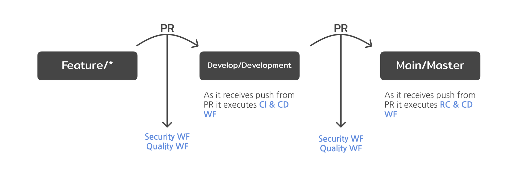
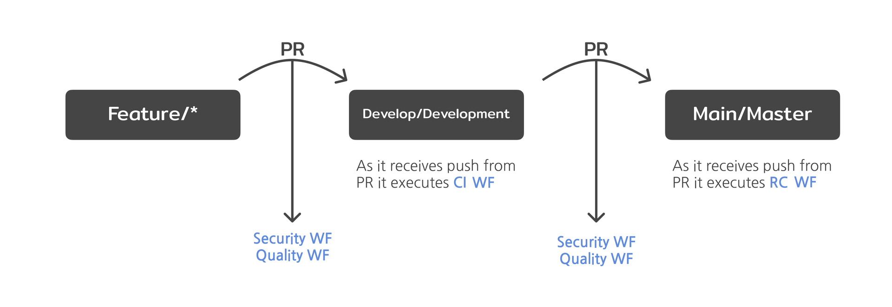

<!--Start Flow-->
As soon as the scaffoling workflow is done, you will find a repository with two branches: main and development.
oth branches will be prepared with the necessary workflows to run the entire microservice lifecycle.
The following image shows a visual representation of the Git-Flow lifecycle and the workflows executed in each step.

In the Git Flow model, developers start by creating a new branch off the `development` branch for each feature, named `feature/*`. Once the feature is complete, they create a pull request to merge the `feature/*`branch into `development`.
When opening the pull request, two workflows are executed automatically: **Security and Quality** running sonar and fortify. If everything is satisfactory, the pull request is approved and the `feature/*` branch is merged into `development`.
When the `development` branch receives the push from the pull request the **CI** workflow is executed automatically. When ready for a new release, a pull request from `development` to `main` is created.
As in the `feature` branch, when opening the pull request, two workflows are executed automatically: **Security and Quality** running sonar and fortify and if everything is in order, the pull request is merged, moving changes from `development` to `main`.
The code in main is now ready to be released, completing the lifecycle by running the **RC** workflow.

???+ warning "Note"

      Make sure to create your `feature/*` branch off the `development` branch as this branch contains all the necessary workflows and configuration files to run all workflows.
<!--End Flow-->

<!--start-lib-gitflow-->
As soon as the scaffoling workflow is done, you will find a repository with two branches: main and development.
oth branches will be prepared with the necessary workflows to run the entire microservice lifecycle.
The following image shows a visual representation of the Git-Flow lifecycle and the workflows executed in each step.

In the Git Flow model, developers start by creating a new branch off the `development` branch for each feature, named `feature/*`. Once the feature is complete, they create a pull request to merge the `feature/*`branch into `development`.
When opening the pull request, two workflows are executed automatically: **Security and Quality** running sonar and fortify. If everything is satisfactory, the pull request is approved and the `feature/*` branch is merged into `development`.
When the `development` branch receives the push from the pull request the **CI** workflow is executed automatically. When ready for a new release, a pull request from `development` to `main` is created.
As in the `feature` branch, when opening the pull request, two workflows are executed automatically: **Security and Quality** running sonar and fortify and if everything is in order, the pull request is merged, moving changes from `development` to `main`.
The code in main is now ready to be released, completing the lifecycle by running the **RC** workflow.

???+ warning "Note"

      Make sure to create your `feature/*` branch off the `development` branch as this branch contains all the necessary workflows and configuration files to run all workflows.
<!--end-lib-gitflow-->
