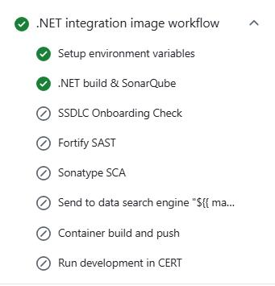

<!--Start Flow-->
Now we are going to describe the steps that a user has to perform in order to make a complete cycle for the Image Upload component, which uploads images to an ECR (Elastic Container Registry) or Harbor without deploying them anywhere.
The cycle explained below is based on **GitFlow**.

In the Git Flow model, developers start by creating a new branch off the `development` branch for each feature, named `feature/*`. Once the feature is complete, they create a pull request to merge the `feature/*` branch into `development`.
When opening the pull request, the **Image Upload** workflow is executed automatically. If everything is satisfactory, the pull request is approved and the `feature/*` branch is merged into `development`.
When the `development` branch receives the push from the pull request, the **Image Upload** workflow is executed automatically. When ready for a new release, a pull request from `development` to `main` is created.
As in the `feature` branch, when opening the pull request, the **Image Upload** workflow is executed automatically. If everything is in order, the pull request is merged, moving changes from `development` to `main`.
The code in `main` is now ready to be released, completing the lifecycle by running the **Release** workflow.

???+ warning "Note"

      Make sure to create your `feature/*` branch off the `development` branch as this branch contains all the necessary workflows and configuration files to run all workflows.

- **Image Upload Workflow**: Executes whenever changes are pushed to the feature or development branches.
It includes jobs for setting up environment variables, building artifacts, running SonarQube, building and pushing Docker containers.
- **Release Workflow**: Executes when changes are merged into the `main` branch.
It includes jobs for setting up environment variables, building artifacts, running SonarQube, building and pushing Docker containers, and tagging and releasing.
- **Validate Version Workflow**: Includes jobs for setting up environment variables, retrieving the current version, and validating the release version.
- **Update Component Workflow**: Used to update the component to the latest version of the template.
It includes jobs for setting up environment variables, retrieving the next version of the component template, updating the component, creating a pull request with the updates, and merging the pull request if there are no conflicts.

### GitFlow Lifecycle

Note that it is very important to follow the Git Flow of not working directly on the `development` branch, but instead working on `feature` branches and the overall workflow.

The full flow is described as follows:

#### 1. Edit in Feature or Fix Branch

When changes are made in a feature branch, the Image Upload workflow is triggered.

#### 2. Pull Request from Feature to Development

A pull request (PR) is created from the feature branch to the `development` branch. This triggers the Image Upload workflow.

#### 3. Merge to Development

Once the PR is approved and merged into the `development` branch, the Image Upload workflow is triggered.

#### 4. Pull Request from Development to Main

A PR is created from the `development` branch to the `main` branch. This triggers the Image Upload workflow.

#### 5. Merge to Main

Once the PR is approved and merged into the `main` branch, the Release workflow is triggered. This uploads the image to the ECR or Harbor.

### Image Upload Workflow

The Image Upload workflow is executed whenever changes are pushed to the feature or development branches. It includes the following jobs:

- **Setup Environment Variables**: Sets up necessary environment variables.
- **Get Version**: Obtains project's version from VERSION file.
- **Container Build and Push**: Builds the Docker image and pushes it to the registry.

### Release Workflow

The release workflow is executed when changes are merged into the `main` branch. It includes the following jobs:

- **Setup Environment Variables**: Sets up necessary environment variables.
- **Get Version**: Obtains project's version from VERSION file.
- **Container Build and Push**: Builds the Docker image and pushes it to the registry.
- **Generate Tag and Release**: Generates a tag and creates a release.

### Validate Version Workflow

The Validate Version workflow includes the following jobs:

- **Setup Environment Variables**: Sets up necessary environment variables.
- **Get Version**: Retrieves the current version.
- **Check Release**: Validates the release version.

### Updating your Component

To update your Component, follow these steps:

1. **Find your Component**: Go to the Components page, use the search bar to type the name of your Component, and click the button to go to the GitHub page.

2. **Open the Actions tab**: Once on the main page of your project, click on the 'Actions' tab located above the repository name.

3. **Identify the Update Component Workflow**: On the Actions page, you will see the latest workflow runs. In the upper left corner, you will find the list of workflows for this repository. Select the 'Update Framework' workflow.

4. **Execute the Update Component Workflow**: After selecting the workflow, a message will appear stating 'This workflow has a workflow_dispatch event trigger'. A new button labeled 'Run Workflow' will appear.
Click on this button, enter the version you want to update your Component to, and then click the green 'Run Workflow' button.

Under the `Pull requests` section inside your repository, a PR will be created with all the changes related to the specified version. You can review these changes and then click on 'Squash and Merge' to merge the PR.

<!--End Flow-->
