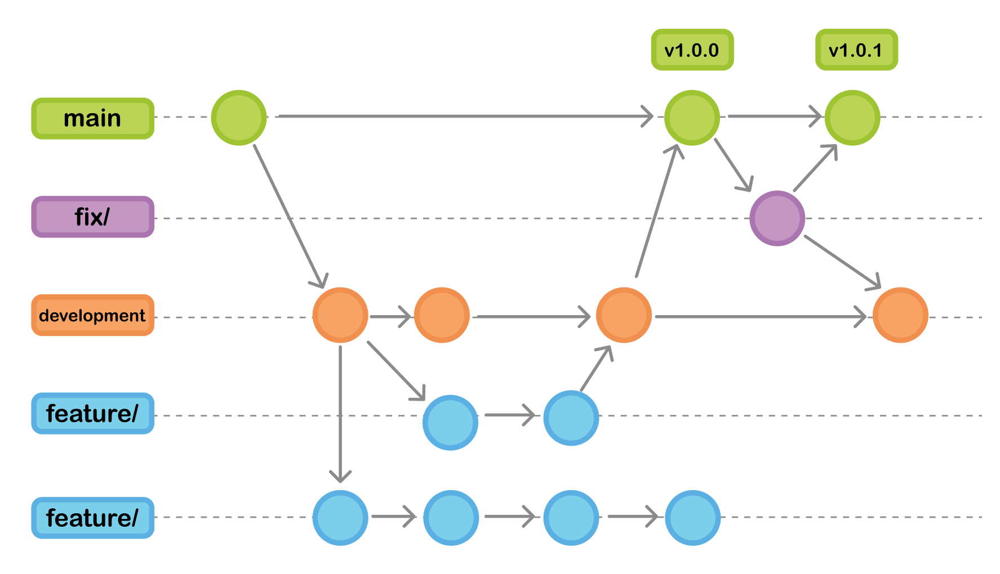
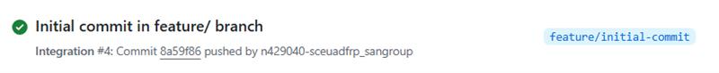
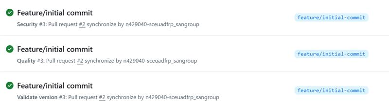
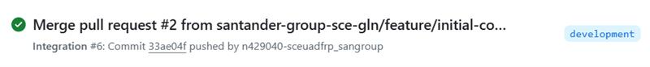
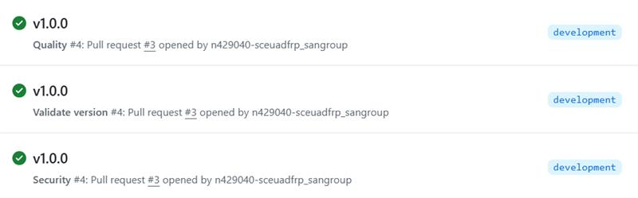
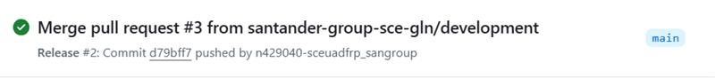
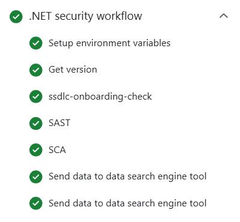
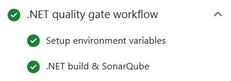
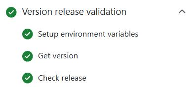
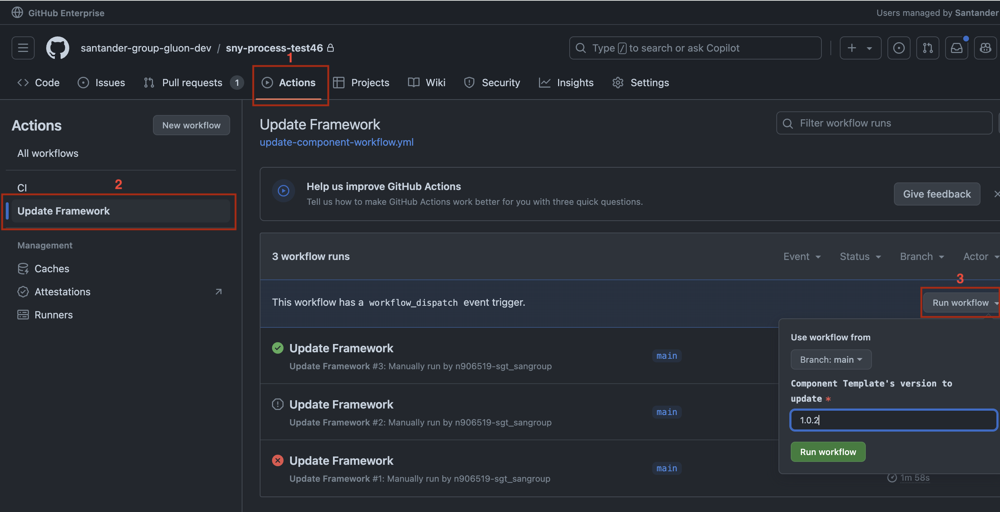

<!--Start Flow-->
Now we are going to describe the steps that a user has to perform in order to make a complete cycle, from the construction process (CI) to the release process. The cycle explained below is based on **GitFlow**

In the Git Flow model, developers start by creating a new branch off the `development` branch for each feature, named `feature/*`. Once the feature is complete, they create a pull request to merge the `feature/*`branch into `development`.
When opening the pull request, the **CI** workflow is executed automatically. If everything is satisfactory, the pull request is approved and the `feature/*` branch is merged into `development`.
When the `development` branch receives the push from the pull request the **CI** workflow is executed automatically. When ready for a new release, a pull request from `development` to `main` is created.
As in the `feature` branch, when opening the pull request, the **CI** workflow is executed automatically and if everything is in order, the pull request is merged, moving changes from `development` to `main`.
When opening the PR the security and quality workflows are triggered.

The code in main is now ready to be released, completing the lifecycle by running the **Release** workflow.

???+ warning "Note"

      Make sure to create your `feature/*` branch off the `development` branch as this branch contains all the necessary workflows and configuration files to run all workflows.

- **CI Workflow**: Executes whenever changes are pushed to the feature or development branches.
It includes jobs for setting up environment variables, building libraries, and uploading libraries.
- **Release Workflow**: Executes when changes are merged into the `main` branch.
- **Security Workflow**: Includes jobs for setting up environment variables, retrieving the current version, running Fortify SAST, Sonatype SCA, and performing security checks using ElasticSearch.
- **Quality Workflow**: Includes jobs for setting up environment variables, building libraries, and running Sonar scans.
It includes jobs for setting up environment variables, building libraries, tagging and releasing, and uploading libraries.
- **Validate version Workflow**: Includes jobs for setting up environment variables, retrieving the current version, and validating the release version.
- **Update Framework Workflow**: Used to update the component to the latest version of the template.
It includes jobs for setting up environment variables, retrieving the next version of the component template, updating the component, creating a pull request with the updates, and merging the pull request if there are no conflicts.

### GitFlow Lifecycle

Note that is very important to follow the Git Flow of not working directly on the `development` branch, but instead working on `feature` branches and the overall workflow.

The full flow is described as follows:

#### 1. Edit in Feature or Fix Branch

When changes are made in a feature branch, the CI workflow is triggered without deploying to the `development` environment. Note that Fix and Feature branches must depend on the `development` branch, as they originate from it.

#### 2. Pull Request from Feature to Development

A pull request (PR) is created from the feature branch to the `development` branch. This triggers the CI workflow.

#### 3. Merge to Development

Once the PR is approved and merged into the `development` branch, the CI workflow is triggered.

#### 4. Pull Request from Development to Main

A PR is created from the `development` branch to the `main` branch. This triggers the CI workflow.

#### 5. Merge to Main

Once the PR is approved and merged into the `main` branch, the release workflow is triggered.
This generates a tag (e.g., `1.0.0`), and creates a release (e.g., `v1.0.0`).

### CI Workflow

The CI workflow is executed whenever changes are pushed to the feature or development branches. It includes the following jobs:

By default, security checks are not executed for deployments in the `development` environment.

- **Setup Environment Variables**: Sets up necessary environment variables.
- **Library Build and SonarQube**: Compiles the code and runs unit tests, performs code quality analysis.
- **Fortify SAST**: Analyzes vulnerabilities in the source code.
- **Sonatype SCA**: Analyzes vulnerabilities in dependencies.
- **Library Upload**: Uploads the built libraries.

???+ info "Sonar & Fortify"

    In order to make a Sonar and Fortify analysis during the CI Workflow the `QG_ENABLED` tag must be set to true within the `properties.env` file.
    QG_ENABLED Enables or disables Sonar, Fortify, and Sonatype scans in CI, with 'high' for blocking, 'none' for non-blocking, and empty to skip scans.

### Release Workflow

The release workflow is executed when changes are merged into the `main` branch. It includes the following jobs:

- **Setup Environment Variables**: Sets up necessary environment variables.
- **library Build and SonarQube**: Compiles the code and runs unit tests, performs code quality analysis.
- **Fortify SAST**: Analyzes vulnerabilities in the source code.
- **Sonatype SCA**: Analyzes vulnerabilities in dependencies.
- **Library upload**: Uploads the built libraries.
- **Tag and Release**: Generates a tag and creates a release, uploads the image to the `PRE` and `PRO` environments.

### Security Workflow

The security workflow includes the following jobs:

- **Setup Environment Variables**: Sets up necessary environment variables.
- **Get Version**: Retrieves the current version.
- **Fortify SAST**: Analyzes vulnerabilities in the source code.
- **Sonatype SCA**: Analyzes vulnerabilities in dependencies.
- **ElasticSearch**: Performs security checks using ElasticSearch.

### Quality Workflow

The quality workflow includes the following jobs:

- **Setup Environment Variables**: Sets up necessary environment variables.
- **Library Build and Sonar Scan**: Compiles the code, runs unit tests, and performs code quality analysis.

### Validate version Workflow

The Validate version workflow includes the following jobs:

- **Setup Environment Variables**: Sets up necessary environment variables.
- **Get Version**: Retrieves the current version.
- **Check Release**: Validates the release version.

### Updating your Component

To update your Component, follow these steps:

1. **Find your Component**: Go to the Components page, use the search bar to type the name of your Component, and click the button to go to the GitHub page.

2. **Open the Actions tab**: Once on the main page of your project, click on the 'Actions' tab located above the repository name.

3. **Identify the Update Component Workflow**: On the Actions page, you will see the latest workflow runs. In the upper left corner, you will find the list of workflows for this repository. Select the 'Update Framework' workflow.

4. **Execute the Update Component Workflow**: After selecting the workflow, a message will appear stating 'This workflow has a workflow_dispatch event trigger'. A new button labeled 'Run Workflow' will appear.
Click on this button, enter the version you want to update your Component to, and then click the green 'Run Workflow' button.

Under the `Pull requests` section inside your repository, a PR will be created with all the changes related to the specified version. You can review these changes and then click on 'Squash and Merge' to merge the PR.

<!--End Flow-->
