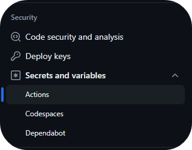
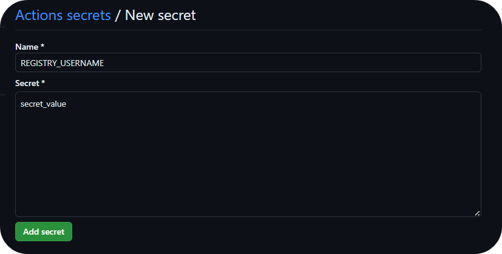

<!--Start Github Secrets-->

There are three types of secrets in Github.com

- **Organization secrets**: Secrets that can be used by all repositories in the organization
- **Repository secrets**: Secrets that can be used only by the repository
- **Environment secrets**: Secrets that can be used only by the repository and the environment.

#### Registry Secrets

Those credentials are referenced in the **multiregistry.json** file and defined at repository secrets level.
If your component has a **multiregistry.json** file make sure to add the required secrets. For this example you will need to add
**REGISTRY_USERNAME** and **REGISTRY_PASS** as repository secrets inside your repository.
Check the **How to add secrets inside GitHub** section for more information on how to add secrets inside GitHub.

```json title="Simple multiregistry example" linenums="1" hl_lines="7 8"
[
{
    "registry":   "registry.global.ccc.srvb.can.paas.cloudcenter.corp",
    "image":      "santander-group-sds-gln/sov-kofax-mymicjs",
    "registry-type": "harbor",
    "chart": "santander-group-sds-gln/sov-kofax-mymicjs-chart",
    "usernameId": "REGISTRY_USERNAME",
    "passwordId": "REGISTRY_PASS"
}
]
```

#### Deploy Secrets

Those credentials are referenced in the **deployment.yaml** file and defined at **environment secrets level**, so we have to create the secrets in each environment (CERT,PRE and PRO).
if you have a **deployment.yaml** file make sure to add the necessary secrets as secrets inside the **environment** and NOT at repository level. Check the **How to add secrets inside GitHub** section for more information on how to add secrets inside GitHub.

- credentialsId
- credentialUserId
- credentialPassId
- kubeconfigFile

#### How to add secrets inside GitHub

<!--Start Add Secrets-->
In order to add secrets you can follow the official [GitHub documentation](https://docs.github.com/en/actions/security-guides/using-secrets-in-github-actions) but this documentation provides a quick step by step guide:

1. Navigate to your repository and under the repository name click on `settings`.

    

2. Under the `security` tab inside settings go to `Secrets and variables` and click on `Actions`.

    

3. Under the `Repository secrets` section click on `New repository secret`.

    

4. In this screen add the secret name. Make sure that the name matches the secret name referenced in the `multiregistry.json` file. In the `secret` space fill the secret value.

    

##### Naming your secrets correctly

Make sure to name your secrets as defined in the `multiregistry.json` file.
There are some general conventions and rules to name secrets that you can check in [GitHub’s official documentation](https://docs.github.com/en/actions/security-guides/using-secrets-in-github-actions#naming-your-secrets),
you can find the most important rules below:

- Names can only contain alphanumeric characters (`[a-z]`, `[A-Z]`, `[0-9]`) or underscores (`_`). Spaces are not allowed.
- Names must not start with the `GITHUB_` prefix.
- Names must not start with a number.
- Names are case insensitive.
- Names must be unique at the level they are created at.
<!--End Add Secrets-->
<!--End Github Secrets-->
