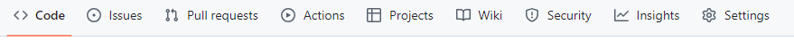
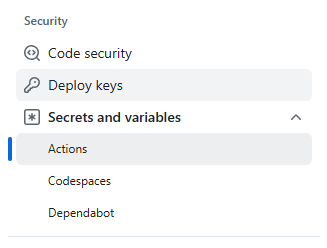
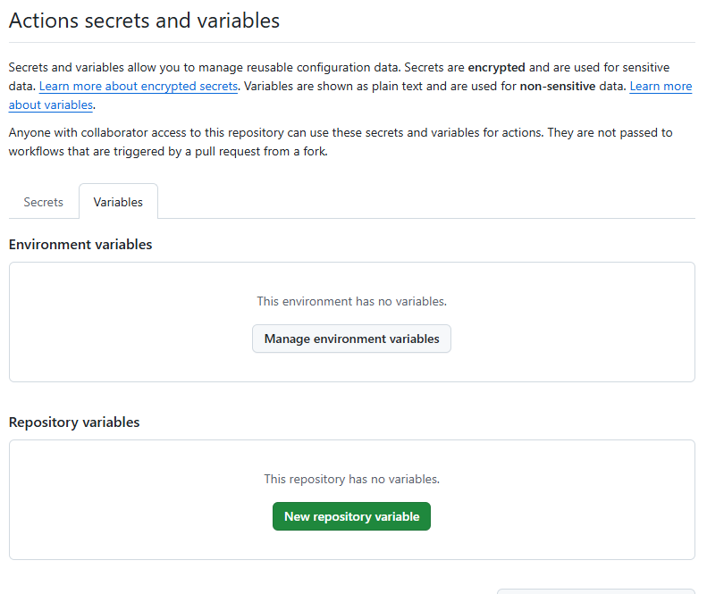
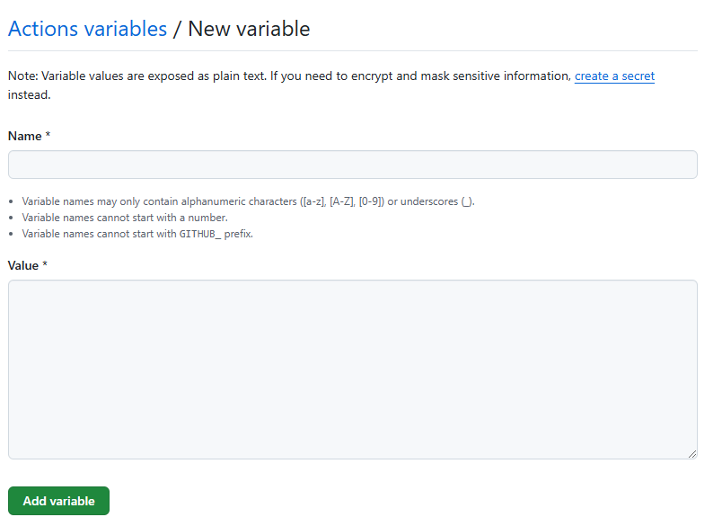
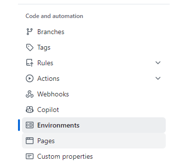
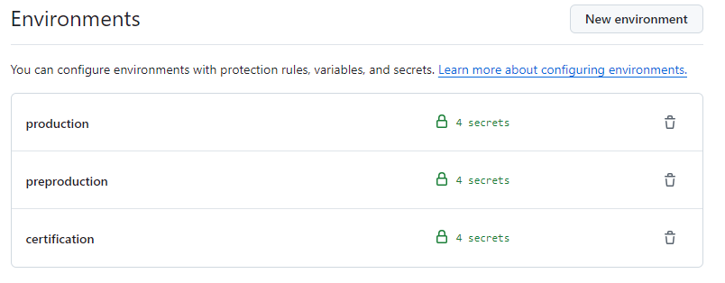
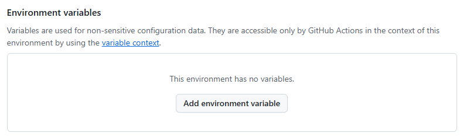
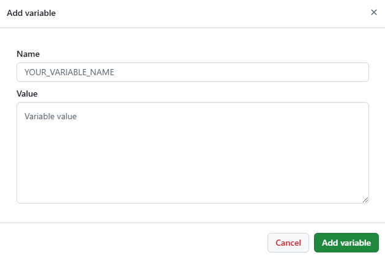

<!--Start Add Repository Variables-->
In order to add repository variables, follow the official [GitHub documentation](https://docs.github.com/en/actions/writing-workflows/choosing-what-your-workflow-does/store-information-in-variables#creating-configuration-variables-for-a-repository),
but this documentation provides a quick step by step guide:

1. Navigate to your repository and under the repository name click on `settings`. 

2. Under the `Security` tab inside settings click on `Secrets and variables` - `Actions`. 

3. Click on the `New repository variable` button to set the variables. 

4. In this screen add the variable name. Make sure that the variable name matches the required variable names. In the `Value` space fill the variable value. 

<!--End Add Repository Variables-->

<!--Start Add Environment Variables-->
In order to add environment variables, follow the official [GitHub documentation](https://docs.github.com/en/actions/writing-workflows/choosing-what-your-workflow-does/store-information-in-variables#creating-configuration-variables-for-an-environment),
but this documentation provides a quick step by step guide:

1. Navigate to your repository and under the repository name click on `settings`. 

2. Under the `Code and automation` tab inside settings click on `Environments`. 

3. Click on the environment where to set the variables. 

4. Under the `Environment variables` section click on `Add environment variables`. 

5. In this screen add the variable name. Make sure that the variable name matches the required variable names. In the `Value` space fill the variable value. 

<!--End Add Environment Variables-->