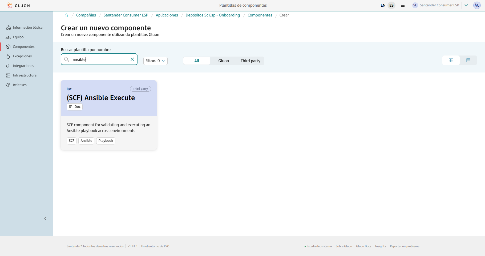
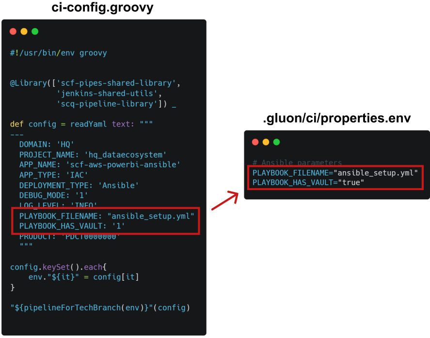
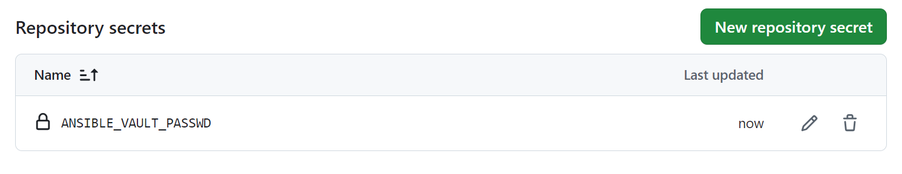
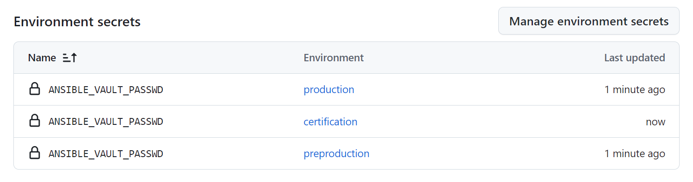

This page aims to assist in the migration of components that previously relied on the ALM Multicloud pipeline `pipelineForIACAnsible`in Jenkins.
The guide focuses on the migration and adaptation of the GitHub repository files to comply with Gluon.
Full information about to use this component template can be found in [documentation](https://gluon.gs.corp/community/docs/latest/local/local-references/scf/local-components/ansible-execute/).

## Create component in Gluon

When creating a component in Gluon it will automatically create a repository in `http://github.com` with the following naming convention: `acronym_company`**-**`acronym_application`**-**`short_name_component`.

- acronym-company: Length of 3 characters, this field comes from APM.
- acronym-application: Length of 7 characters, it will be requested in the application onboarding in Gluon.
- short-name-component Length of 16 characters, it will be requested when creating the component in Gluon.

In order to create the component go to your application in Gluon portal > Components > New Component and select `(SCF) Ansible Execute`.



When selecting the component to create, you will be prompted to enter the short-name-component and contact information for the maintainer.
The mandatory branch strategy for this template is *git flow*, which helps in managing the development workflow efficiently.
The *git-flow* branch strategy is explained indetail in [git-flow lifecycle](https://gluon.gs.corp/community/docs/latest/local/local-references/scf/local-components/ansible-execute/#gitflow-lifecycle).

Once the component is created, it will appear in the component list of your application followed by the used template, a short description and links to the GitHub repository.

The repository is created with a branch named `init-branch` that will run a scaffolding workflow to set up all required branches, environments and configuration files.
This workflow is expected to run automatically, so the expected behaviour is to find everything correctly configured.

???+ info "Scaffolding workflow"

    In some cases the scaffolding workflow will not run automatically. To solve this go to the Actions section of the repository and run the workflow manually from the *init-branch.*

## Repository migration

When the scaffolding is executed, the repository will have this structure in the `development`branch, which must be respected for the workflow to work correctly:

``` bash
📂.github
 ┣ 📂workflows
 ┃ ┣ 📜cd.yml
 ┃ ┣ 📜ci.yml
 ┃ ┣ 📜release.yml
 ┃ ┣ 📜update-component-workflow.yml
 ┃ ┗ 📜version-validation.yml
 ┗ 📜CODEOWNERS
📂.gluon
 ┣ 📂ci
 ┃ ┗ 📜properties.env
📂inventories
 ┣ 📂cert
 ┃ ┗ 📜hosts
 ┣ 📂pre
 ┃ ┗ 📜hosts
 ┣ 📂pro
 ┃ ┗ 📜hosts
📜ansible_setup.yml
📜README.md
📜VERSION
```

You must take the source code of your component to the source repository  in the `development`branch and pay attention to the following adaptations:

### ci-config.groovy → properties.env

Los campos **PLAYBOOK_FILENAME** y **PLAYBOOK_HAS_VAULT** del fichero `ci-config.groovy` situado en la raiz del repositorio pasa al fichero de configuración `properties.env` localizado en la carpeta `.gluon/ci/`.



### version.json → VERSION

La versión del ficero `version.json` situado en la raiz del repositorio pasa al fichero de configuración `VERSION`también en la raíz del repositorio.


???+ info "SNAPSHOT Note"

    Es importante tener en cuenta que en Gluon no se debe añadir “-SNAPSHOT”, se añade automáticamente cuando se lanza el CI en la rama development.

### Vault password → GitHub Actions secret

In case you have Vault, in addition to setting **PLAYBOOK_HAS_VAULT** to “true” in the `properties.env`, it will be necessary to add the content of the password-file as a secret in GitHub Actions.

To do this, go to `Settings > Security > Secrets and variables > Actions` and add the secret **ANSIBLE_VAULT_PASSWD** at the “Repository secrets” level.



In case you need different passwords for the environments, you must create them in "Environment secrets" in the environments created when the component was created (certification, preproduction, and production).
To do this, go to `Settings > Environments` and in Environment secrets → Add environment secret.


