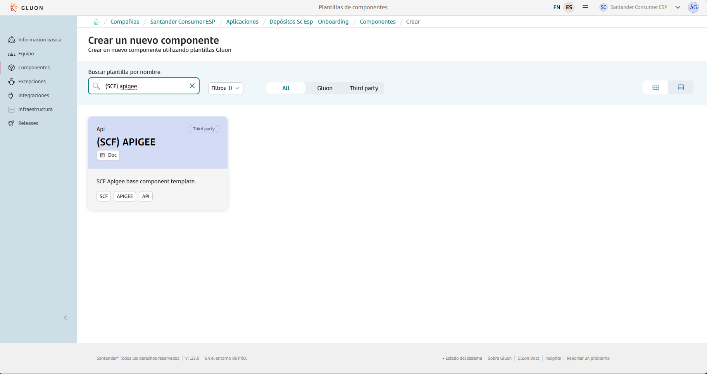
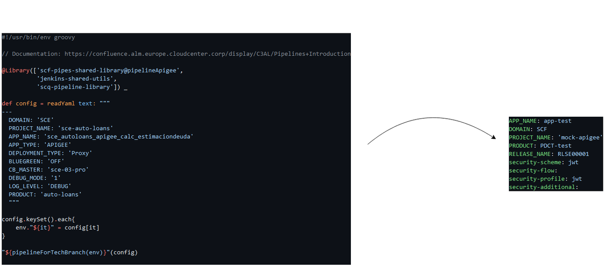
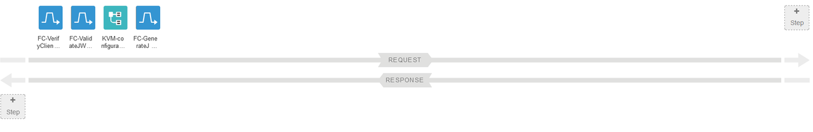
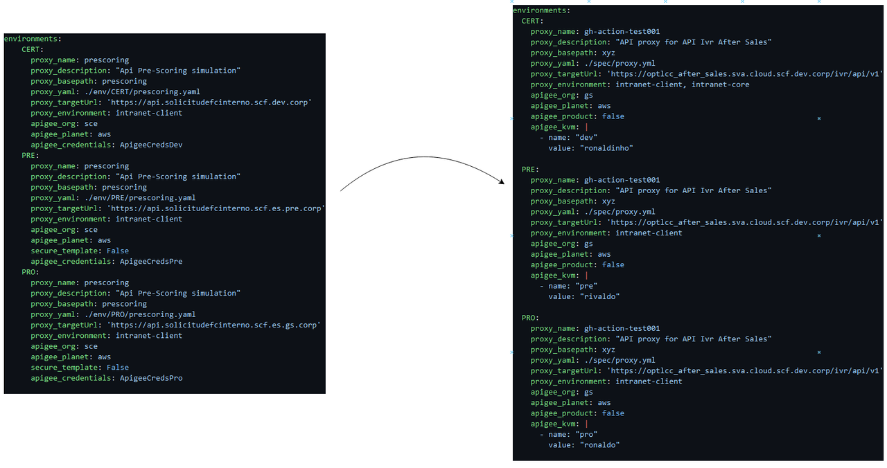
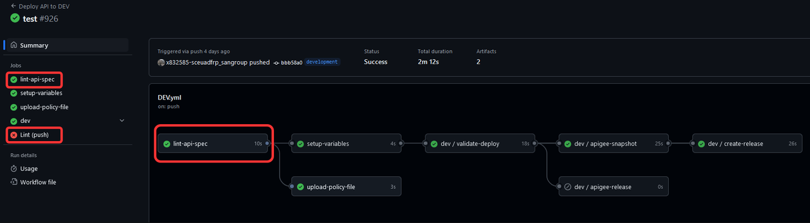
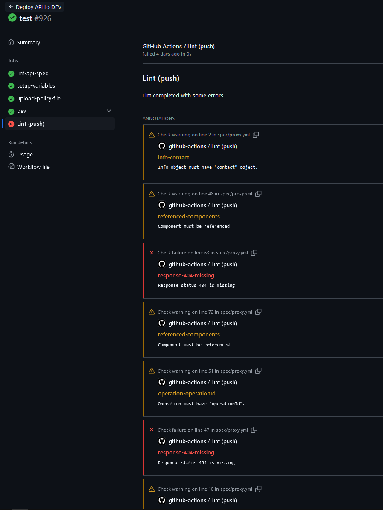
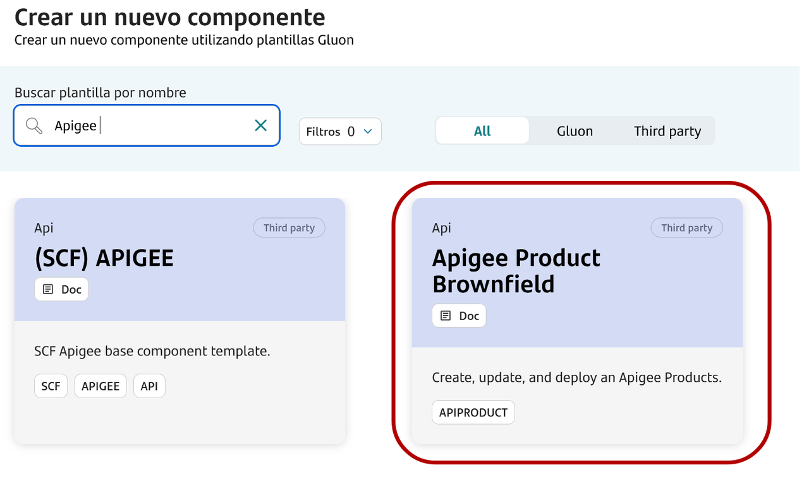
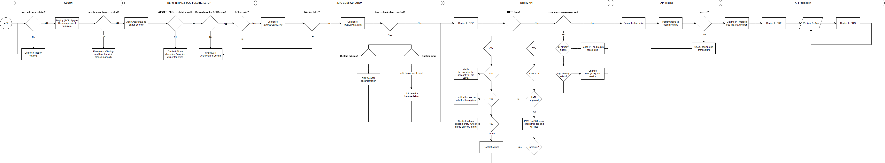

This page aims to assist in the migration of components that previously relied on the ALM Multicloud pipeline `PipelineForApigeeProxy` in Jenkins.
The guide focuses on the migration and adaptation of the GitHub repository files to comply with Gluon.
Full information about to use this component template can be found in [documentation](https://gluon.gs.corp/community/docs/latest/local/local-references/scf/local-components/apigee/).

## Documentation reference

For a more detailed explanation of the pipeline structure usage and configuration please refer to the documentation, basic API best practices knowledge and APIGEE specific basic understanding are assumed:

- [**New Apigee Proxy Pipeline Documentation**](https://gluon.gs.corp/community/docs/latest/local/local-references/scf/local-components/apigee/#index)
- [**HTTP Status codes**](https://docs.apigee.com/api-platform/troubleshoot/http-status-codes)
- [**Apigee terminology**](https://docs.apigee.com/api-platform/get-started/basic-concepts)
- [**Apigee broad overview**](https://docs.apigee.com/private-cloud/v4.18.01/about-planets-regions-pods-organizations-environments-and-virtual-hosts)
- [**About github actions**](https://docs.github.com/es/actions/about-github-actions/understanding-github-actions)

## Create component in Gluon

When creating a component in Gluon it will automatically create a repository in `http://github.com`  with the following naming convention: `acronym_company`**-**`acronym_application`**-**`short_name_component`.

- acronym-company: Length of 3 characters, this field comes from APM.
- acronym-application: Length of 7 characters, it will be requested in the application onboarding in Gluon.
- short-name-component Length of 16 characters, it will be requested when creating the component in Gluon.

In order to create the component go to your application in Gluon portal > Components > New Component  and select `(SCF) Apigee`.



When selecting the component to create, you will be prompted to enter the short-name-component and contact information for the maintainer.
The mandatory and only branch strategy for this template is *git flow*, which helps in managing the development workflow efficiently.
The *git-flow* branch strategy is explained indetail in [git-flow lifecycle](https://gluon.gs.corp/community/docs/latest/components/software/front/web/afe/framework/development-guides/best-practices/gitflow/).

Once the component is created, it will appear in the component list of your application followed by the used template, a short description and links to the GitHub repository.

The repository is created with a branch named `init-branch` that will run a scaffolding workflow to set up all required branches, environments and configuration files.
This workflow is expected to run automatically, so the expected behaviour is to find everything correctly configured.

???+ info "Scaffolding workflow"

    In some cases the scaffolding workflow will not run automatically. To solve this go to the Actions section of the repository and run the workflow manually from the *init-branch.*

## Repository migration

When the scaffolding is executed, the repository will have this structure in the `development`branch, which must be respected for the workflow to work correctly:

### New repository structure

```bash
├── 📂.apigee
│   ├── config.yml
│
├── 📂.github
│   └── 📂workflows
│       ├── DEV.yml
│       ├── PRE.yml
│       └── PRO.yml
│
├── 📂.gluon
│
├── 📂policies
│   └── policy-conf.json
│   └── ${example_policy1}.xml
│   └── ${example_policy2}.xml
│
├── 📂spec
│   └── proxy.yml
│
├── deployment.yaml
│
├── README.md
│
└── santander.spectral.js
```

You must take the source code of your component to the source repository  in the `development`branch and pay attention to the following adaptations:

### Repository adaptations

#### Old repository structure

```txt
├── 📂.env
│   ├── 📂CERT
│   │   └── ${proxy}.yaml
│   ├── 📂PRE
│   │   └── ${proxy}.yaml
│   └── 📂PRO
│       └── ${proxy}.yaml
│
├── ci-config.groovy
│
├── deployment.yaml
│
├── README.md
```

### Setup Github secrets

Moving from *Jenkins* to *Github Actions* requires different credentials management, the workflow requires specific credentials specified as *Github Actions Secrets* in the repository:

| Secret Name        | Description                                                                                                                                                                              |
| ------------------ | ---------------------------------------------------------------------------------------------------------------------------------------------------------------------------------------- |
| `APIGEE_TOKEN_DEV` | This token is used for accessing the APIGEE management endpoint in the development (DEV) environment.                                                                                    |
| `APIGEE_TOKEN_PRE` | This token is utilized for the APIGEE management endpoint in the pre-production (PRE) environment.                                                                                       |
| `APIGEE_TOKEN_PRO` | This token grants access to the APIGEE management endpoint in the production (PRO) environment.                                                                                          |
| `APIGEE_PAT`       | This token is designed for analytics and logging purposes. It is recommended to set this at the GitHub organization level to avoid the need for manual configuration in each repository. |

???+ info "Scaffolding workflow"

    *APIGEE_PAT* is a `private` token, it should not be shared, therefore it should be set at the organization level as a globally accessible variable if it is missing. for more information

Apigee tokens are generated using `base64` encoded credentials, bear in mind that the apigee user would need specific permissions in order to be able to work with the pipeline such as *Proxy creation, KVM creation:*

#### Generate tokens

```txt
echo -n "user@mail.com:password" | base64

dXNlckBtYWlsLmNvbTpwYXNzd29yZAo=
```

The encoded string is what you will use for the different `$ENV` secrets you can read more about secrets in the [github documentation page](https://docs.github.com/en/actions/security-for-github-actions/security-guides/using-secrets-in-github-actions).

### Where is the config.groovy

The `ci-config.groovy` now lives as `.apigee/config.yml`

We moved out of groovy, to plain text, as well as a simplification and restructure of the fields required:



#### `config` Removed fields

- `APP_TYPE`
- `DEPLOYMENT_TYPE`
- `BLUEGREEN`
- `CB_MASTER`
- `DEBUG_MODE`
- `LOG_LEVEL`

#### `config` New fields

- `RELEASE_NAME`: Example: `RLSE000000`, identifier for the API release
- `security-scheme`
- `security-flow`
- `security-profile`
- `security-additional`

| Name                | Description                                                    | Required | Type    | Example Value               |
| ------------------- | -------------------------------------------------------------- | -------- | ------- | --------------------------- |
| DOMAIN              | Entity of the application                                      | Yes      | String  | HQ                          |
| PROJECT_NAME        | Name of the project                                            | Yes      | String  | my_project                  |
| APP_NAME            | Name of the application                                        | Yes      | String  | my_app                      |
| PRODUCT             | Unique identifier for the product, (CCOE or PDCT*)             | Yes      | String  | PDCT000000                  |
| CREATE_RELEASE      | Toggle for enabling/disabling release version creation *(DEV)* | No       | Boolean | true/false (Default: false) |
| RELEASE_NAME        | Identifier for the release                                     | No*      | String  | RLSE000000                  |
| SECURITY_SCHEME     | Security scheme used for the API                               | Yes      | String  | "oauth2"                    |
| SECURITY_FLOW       | Security flow used within the security scheme                  | Yes      | String  | "jwt profile"               |
| SECURITY_PROFILE    | Security profile for the API                                   | Yes      | String  | "oauth2"                    |
| SECURITY_ADDITIONAL | Additional security configurations                             | Yes      | String  | "jwe"                       |

All new security fields are part of the new features added, now you will be able to specify what security grants your proxies will follow depending on the project necessities and other factors.
If you feel like some are missing or you would like to have new ones, feel free to contact the owner in order to add it.
Bear in mind that new grants require new policies, check the documentation.



For the migrated proxies, as all of them are simply `Generate JWT` set `profile` and `scheme` as jwt, although they should be set as so by default.

#### apigee/config.yaml example

```yaml
APP_NAME: apigee-sample2
DOMAIN: SCF
PROJECT_NAME: 'mock-apigee'
PRODUCT: PDCT-creditcard
RELEASE_NAME: RLSE00001
security-scheme: jwt
security-flow:
security-profile: jwt
security-additional:
```

### What about deployment.yaml?

 The `deployment.yaml` now introduces more configurations and flexibility. with the added feature of `apigee_kvm` which allows you to *optionally* add key value pairs to the KVM that is created and consumed in each proxy: `ConfigProxy_${proxyname}`

Now credentials are set in a `repo` scope, each repo containing their own credentials if wished



| Variable Name       | Variable Description                                              | Required | Example Value                                               |
| ------------------- | ----------------------------------------------------------------- | -------- | ----------------------------------------------------------- |
| `proxy_name`        | Unique name of the proxy to be deployed.                          | Yes      | `"ccoe-hub"` No spaces or special chars                     |
| `proxy_description` | Description of the proxy.                                         | Yes      | `"ID Authorization"`                                        |
| `proxy_basepath`    | Base path to expose in Apigee Organization selected virtual host  | Yes      | `"ccoe-hub"`                                                |
| `proxy_yaml`        | Open API Specification                                            | Yes      | `"./env/CERT/ccoe-hub.yaml"`                                |
| `proxy_targetUrl`   | Backend API URL                                                   | Yes      | `"[https://httpstat.us/418](https://httpstat.us/418)"`      |
| `proxy_environment` | Apigee Organization environment(s) where API Proxy will be deploy | Yes      | `"internet-client"`                                         |
| `proxy_audience`    | Audience parameter to be included in ConfigProxy KVM              | No       | `"users"`                                                   |
| `proxy_revision`    | Used on PRE/PRO, the API Proxy revision to be promoted            | No       | `1` (Default: pipeline will try to get the latest revision) |
| `proxy_vhosts`      | Used for MTLS Virtualhost setting or pre-defined vhosts           | No       | `"    proxy_vhosts:  vhost, extra"` This will gen 2 vhosts  |
| `apigee_org`        | Apigee organization                                               | Yes      | `"cgs-ccoe"`                                                |
| `apigee_planet`     | Apigee Planet, has two possible values: aws, az                   | No       | `aws, ger`  (Default: aws)                                  |
| `apigee_kvm`        | Key-Value Map for Apigee                                          | No       | `- name: "pre" value: "megasecret-value"`                   |

Key changes also include:

- Optional capability to deploy to multiple environments at the same time:

```yaml
proxy_environment: intranet-client, intranet-core
```

- Optional capability to add *ADHOC* key value pairs to the apigee kvm

```yaml
  apigee_kvm: |
    - name: "dev"
      value: "ronaldinho"
```

#### deployment.yaml example

```yaml
environments:
  CERT:
    proxy_name: gh-action-test001
    proxy_description: "API proxy for API Ivr After Sales"
    proxy_basepath: xyz
    proxy_yaml: ./spec/proxy.yml
    proxy_targetUrl: 'https://optlcc_after_sales.sva.cloud.scf.dev.corp/ivr/api/v1'
    proxy_environment: intranet-client, intranet-core
    apigee_org: gs
    apigee_planet: aws
    apigee_product: false
    apigee_kvm: |
      - name: "dev"
        value: "ronaldinho"

  PRE:
    proxy_name: gh-action-test001
    proxy_description: "API proxy for API Ivr After Sales"
    proxy_basepath: xyz
    proxy_yaml: ./spec/proxy.yml
    proxy_targetUrl: 'https://optlcc_after_sales.sva.cloud.scf.dev.corp/ivr/api/v1'
    proxy_environment: intranet-client
    apigee_org: gs
    apigee_planet: aws
    apigee_product: false
    apigee_kvm: |
      - name: "pre"
        value: "rivaldo"

  PRO:
    proxy_name: gh-action-test001
    proxy_description: "API proxy for API Ivr After Sales"
    proxy_basepath: xyz
    proxy_yaml: ./spec/proxy.yml
    proxy_targetUrl: 'https://optlcc_after_sales.sva.cloud.scf.dev.corp/ivr/api/v1'
    proxy_environment: intranet-client
    apigee_org: gs
    apigee_planet: aws
    apigee_product: false
    apigee_kvm: |
      - name: "pro"
        value: "ronaldo"

```

### Where are the proxy specs?

The previous specs are now centralized in a single point, under `spec/proxy.yml`.
Now there is no need to reference them as during repository scaffolding the deployment.yaml will be pre-configured with the variable `proxy_yaml:` referencing to `spec/proxy.yml`

### Proxy promotion process?

The process remains pretty similar, with the addition of custom kvms per environment, this allows unique key value pairs per environment, which is one of the many edge cases covered as the backend the API sends information to might differ from ENV
to ENV requiring different information.
For the rest, the process is exactly the same, the pipeline takes the latest deployed revision of the apiproxy and deploys to the respective planet selected as `apigee_planet`.

### Key proxy promotion differences

- Now, the *DEV* deployment will be executed upon a [*commit*](https://docs.github.com/en/pull-requests/committing-changes-to-your-project/creating-and-editing-commits/about-commits) which means,
it’s expected and mandatory to fully configure the repository before jumping into committing.
- Also during *DEV* deployment now you will se a [*job*](https://docs.github.com/en/actions/writing-workflows/choosing-what-your-workflow-does/using-jobs-in-a-workflow) lint-api-spec.
This linting job is for you to see what is missing from your apispec to be gluon approved, its not restrictive just informatory and for future migration purposes, bear in mind that we expect you to comply as much as possible to the gluon standards
and we want you to work on modifying the spec to be as compliant as possible when needed in the near future.
- After correct execution of the whole **Deploy API to DEV** [wofklow](https://docs.github.com/en/actions/writing-workflows/about-workflows) you will have a [tag](https://docs.github.com/en/repositories/releasing-projects-on-github/viewing-your-repositorys-releases-and-tags)
which contains all source code of the repo, therefore, used as versioning storage and [rollback](https://gluon.gs.corp/community/docs/latest/local/local-references/scf/local-components/apigee/#rollback)purposes.
simultaneously you will see a [Pull Request](https://docs.github.com/articles/about-pull-requests)being opened to `main`. Once your pull request is reviewed approved and merged, you will see your configuration from the working branch is now in *main*,
which is where you will be able to deploy to *PRE/PRO* environments respectively, the configuration should remain unchanged, bear that in mind.

#### DEV deployment linting step

As mentioned above, this is informational for the time being, you can see the job here:



Clicking on lint-api-spec will open the execution and variable gathering that the pipeline executes for proper governance of the proxies, but the interesting part is Lint(push)
which explains why it did not pass and the errors/warnings raised based on your repository openapi spec file:



### what about `Apigee products` and the `policies` folder?

#### API Products

The Jenkins pipeline directly deployed 1 product per proxy, a 1-1 relationship, this in retrospective is neither a best practice or industry standard,
that is why we implemented a new [pipeline for product creation and management](https://gluon.gs.corp/community/docs/latest/local/local-references/scf/local-components/apigee-product/):



Although unrecommended, you can ignore this if you're just migrating, by default it will continue to create API_Products for the time being. But it is highly suggested to configure it, you can set the new field `apigee_product: false`
in the `deployment.yaml` to skip the creation. If you're planning to deploy more than a single proxy for the custom product.

#### New `policies` folder

The Jenkins pipeline also did not provide the capabilities to deploy custom policies in specific flows, this usually was done my hand through the UI.
This has also changed with this new version, allowing you to add as many policies in as many positions of the proxy execution as you wish.

##### Policy conf example

```json
{
    "policies": {
        "Quota": {
            "flow_type": "Flow",
            "flow_name": [
                "/ACHOperations/{achoperationsId}/Retrieve",
                "/ACHOperations/{achoperationsId}/Update"
            ],
            "direction": "Response",
            "index": 0
        },
        "SA-100ps": {
            "flow_type": "PreFlow",
            "flow_name": "",
            "direction": "Request",
            "index": 1
        }
    }
}
```

This is not relevant per-se to the migration, but recommended to get used to and at least know the capabilities of it, if you wish, refer to the documentation [here.](https://gluon.gs.corp/community/docs/latest/local/local-references/scf/local-components/apigee/#policies)

## In depth diagram


