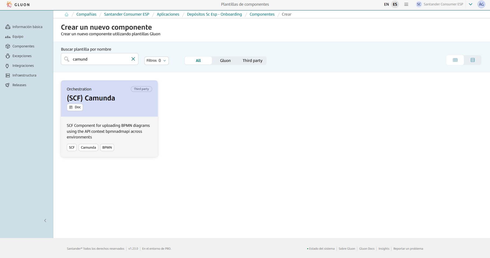

This page aims to assist in the migration of components that previously relied on the ALM Multicloud pipeline `pipelineForCamunda`in Jenkins.
The guide focuses on the migration and adaptation of the GitHub repository files to comply with Gluon.
Full information about to use this component template can be found in [documentation](https://gluon.gs.corp/community/docs/latest/local/local-references/scf/local-components/camunda/).

## Create component in Gluon

When creating a component in Gluon it will automatically create a repository in `http://github.com` with the following naming convention: `acronym_company`**-**`acronym_application`**-**`short_name_component`.

- acronym-company: Length of 3 characters, this field comes from APM.
- acronym-application: Length of 7 characters, it will be requested in the application onboarding in Gluon.
- short-name-component Length of 16 characters, it will be requested when creating the component in Gluon.

In order to create the component go to your application in Gluon portal > Components > New Component and select `(SCF) Camunda`.



When selecting the component to create, you will be prompted to enter the short-name-component and contact information for the maintainer.
The mandatory branch strategy for this template is *git flow*, which helps in managing the development workflow efficiently.
The *git-flow* branch strategy is explained indetail in [git-flow lifecycle](https://gluon.gs.corp/community/docs/latest/local/local-references/scf/local-components/ansible-execute/#gitflow-lifecycle).

Once the component is created, it will appear in the component list of your application followed by the used template, a short description and links to the GitHub repository.

The repository is created with a branch named `init-branch` that will run a scaffolding workflow to set up all required branches, environments and configuration files.
This workflow is expected to run automatically, so the expected behaviour is to find everything correctly configured.

???+ info "Scaffolding workflow"

    In some cases the scaffolding workflow will not run automatically. To solve this go to the Actions section of the repository and run the workflow manually from the *init-branch.*

## Repository migration

When scaffolding is executed, the repository will have this structure in the `development`branch, which must be respected for the workflow to work correctly:

```bash
📂.github
 ┣ 📂workflows
 ┃ ┣ 📜cd.yml
 ┃ ┣ 📜ci.yml
 ┃ ┣ 📜release.yml
 ┃ ┣ 📜update-component-workflow.yml
 ┃ ┗ 📜version-validation.yml
 ┗ 📜CODEOWNERS
📜VERSION
```

You must take the source code of your component to the source repository  in the `development`branch and pay attention to the following adaptations:

### version.json → VERSION

The version of the `version.json` file located in the repository root is passed to the `VERSION` configuration file also in the repository root.


???+ info "Scaffolding workflow"

    It is important to note that “-SNAPSHOT” should not be added in Gluon, it is automatically added when the CI is launched in the development branch.

### env/DEV , env/PRE , env/PRO → Repository root

The `.bpmn` files that were triply replicated for each environment in the env/DEV, env/PRE and env/PRO folders must be moved to the root of the repository without duplications.
