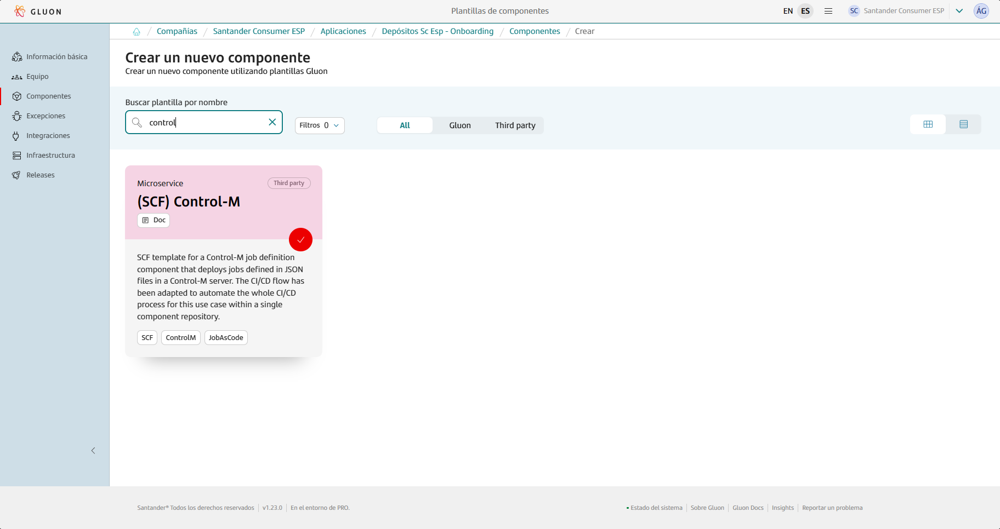
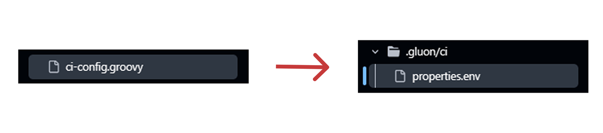
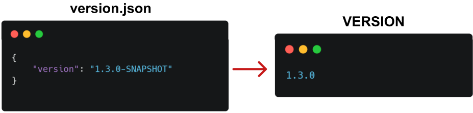
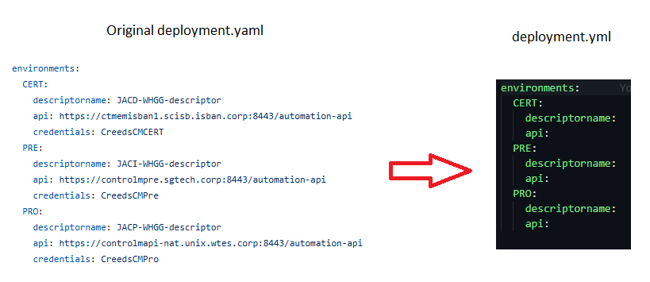
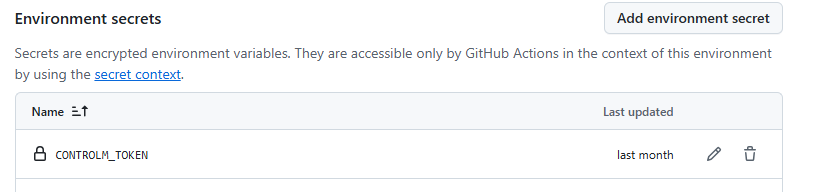

This page aims to assist in the migration of components that previously relied on the ALM Multicloud pipeline `pipelineForControlM` in Jenkins.
The guide focuses on the migration and adaptation of the GitHub repository files to comply with Gluon.
Full information about to use these component templates can be found in the following documentations: [(SCF) Control-M](https://gluon.gs.corp/community/docs/latest/local/local-references/scf/local-components/controlm/).

## Create component in Gluon

When creating a component in Gluon it will automatically create a repository in `http://github.com` with the following naming convention: `acronym_company`**-**`acronym_application`**-**`short_name_component`.

- acronym-company: Length of 3 characters, this field comes from APM.
- acronym-application: Length of 7 characters, it will be requested in the application onboarding in Gluon.
- short-name-component Length of 16 characters, it will be requested when creating the component in Gluon.

In order to create the component go to your application in Gluon portal > Components > New Component and select `(SCF) Control M`.



When selecting the component to create, you will be prompted to enter the short-name-component and contact information for the maintainer.
The mandatory branch strategy for this template is *git flow*, which helps in managing the development workflow efficiently.
The *git-flow* branch strategy is explained indetail in [git-flow lifecycle](https://gluon.gs.corp/community/docs/latest/local/local-references/scf/local-components/ansible-execute/#gitflow-lifecycle).

Once the component is created, it will appear in the component list of your application followed by the used template, a short description and links to the GitHub repository.

The repository is created with a branch named `init-branch` that will run a scaffolding workflow to set up all required branches, environments and configuration files.
This workflow is expected to run automatically, so the expected behaviour is to find everything correctly configured.

???+ info "Scaffolding workflow"

    In some cases the scaffolding workflow will not run automatically. To solve this go to the Actions section of the repository and run the workflow manually from the *init-branch.*

## Repository migration

When scaffolding is executed, the repository will have this structure in the `development`branch, which must be respected for the workflow to work correctly:

```bash
📦
 ┣ 📂envs
 ┃ ┣ 📜properties.env
 ┣ 📂.github
 ┃ ┣ 📂workflows
 ┃ ┃ ┣ 📜controlm-cd.yml
 ┃ ┃ ┣ 📜controlm-ci.yml
 ┃ ┃ ┣ 📜controlm-quality.yml
 ┃ ┃ ┣ 📜controlm-rc.yml
 ┃ ┃ ┗ 📜controlm-security.yml
 ┃ ┗ 📜CODEOWNERS
 ┣ 📂environments
 ┃ ┣ 📂CERT
 ┃ ┃ ┗ 📜descriptor.json
 ┃ ┣ 📂PRE
 ┃ ┃ ┗ 📜descriptor.json
 ┃ ┣ 📂PRO
 ┃ ┃ ┗ 📜descriptor.json
 ┃ ┗ 📂JOB
 ┃   ┗ 📜job-definition.json
 ┣ 📜deployment.yml
 ┣ 📜jobs.json
 ┗ 📜README.md
```

You must take the source code of your component to the source repository in the `development`branch and pay attention to the following adaptations:

### ci-config.groovy → properties.env

Information from the file `ci-config.groovy` located at the root of the repository is transferred to the configuration file `properties.env` located in the `.gluon/ci/` folder.



Note that this is not a 1:1 migration and that there are new fields. Below is an example of `properties.env`:

- The fields `FORTIFY_PROJECT` and `SONAR_PROJECT_KEY` are automatically filled during the scaffolding process.

```yaml
# Sonar parameters
SONAR_ID="SONAR_GLUON_COMMUNITY"
SONAR_PROJECT_KEY=""

# Fortify parameters
FORTIFY_PROJECT=""

ZERO_TOUCH_ENABLE=true

# Quality parameters
QG_ENABLED="High"
```

### version.json → VERSION

The version of the `version.json` file located in the root folder is now set in the `VERSION` file, also located in the root folder.



???+ info "SNAPSHOT Information"

    It is important that in Gluon, the suffix “-SNAPSHOT“ must not be added manually, it will be added automatically during workflow execution.

### Deployment.yaml → deployment.yml

The content of the `deployment.yaml`file is almost the same.



### Secrets Configuration

To enable the deployment, environment secrets must be set, in this case, the ControlM token, to do so, go to `Settings > Code and automation > Environments` select the environment (certification, preproduction and production),
and add the following variable, `CONTROLM_TOKEN`, at “Environment variables“ section.


